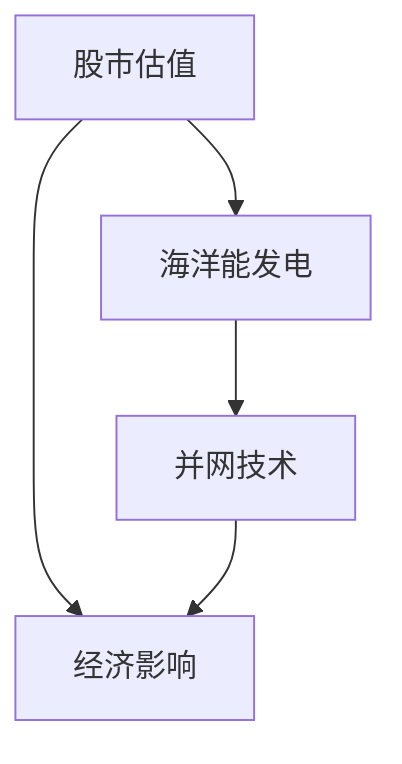
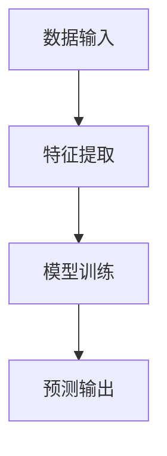
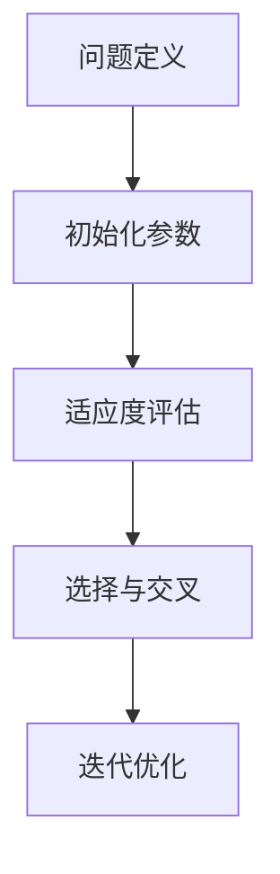
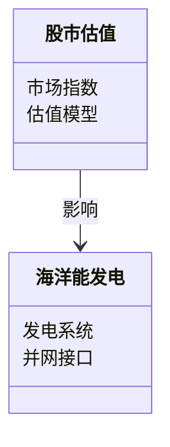
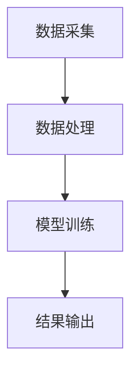
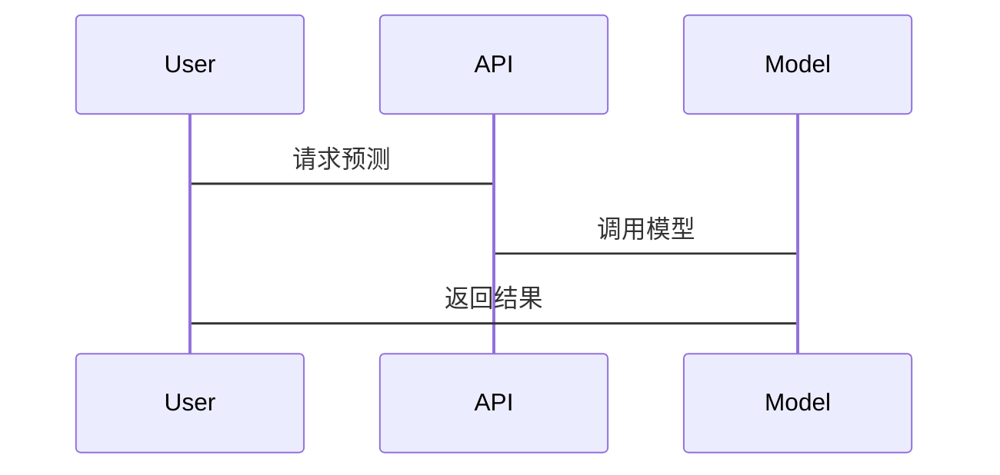

                 


# 全球股市估值与海洋能发电并网技术的关系

## 关键词：全球股市估值、海洋能发电、并网技术、关联分析、算法设计、系统架构

## 摘要：本文探讨了全球股市估值与海洋能发电并网技术之间的复杂关系。通过分析股市估值的核心概念与海洋能发电并网技术的特点，揭示了两者在经济和能源领域的相互影响。结合算法原理和系统架构设计，提出了实现两者关联分析的具体方法，为能源投资决策和股市预测提供新思路。

---

## 第1章: 全球股市估值与海洋能发电并网技术的背景介绍

### 1.1 全球股市估值的基本概念

#### 1.1.1 股市估值的定义与核心要素

股市估值是衡量市场整体价值的重要指标，通常通过股票价格指数（如标普500、纳斯达克指数）或市盈率（P/E）等指标来评估。核心要素包括市场参与者的信心、经济指标（GDP、通胀率）以及企业盈利状况。

#### 1.1.2 全球股市估值的现状与趋势

近年来，全球股市估值波动较大，受经济政策、地缘政治和技术创新的影响显著。股市估值的上涨通常表明市场对未来的信心增强，而下跌则可能反映经济不确定性或市场恐慌。

### 1.2 海洋能发电并网技术的定义与特点

#### 1.2.1 海洋能发电的基本原理

海洋能发电利用海洋中的可再生能源，如潮汐能、波浪能和海流能，通过发电设备将这些能量转化为电能。其特点是资源丰富、分布广泛，但技术复杂性和成本较高。

#### 1.2.2 海洋能发电并网技术的核心要素

并网技术是将海洋能发电系统接入电网的关键，涉及电力转换、稳定性调节和电网适应性问题。关键要素包括逆变器、储能系统和电网接口设计。

### 1.3 全球股市估值与海洋能发电并网技术的关系

#### 1.3.1 问题背景与问题描述

随着全球能源转型，海洋能发电项目的需求增加，但其投资成本和市场风险较高，股市估值的变化可能直接影响这些项目的融资和实施。

#### 1.3.2 问题解决的思路与方法

通过分析股市估值与海洋能发电技术的关联，构建数学模型，预测技术进步对股市的影响，优化投资决策。

#### 1.3.3 问题的边界与外延

研究范围限于股市估值与并网技术的直接关联，不考虑其他能源类型的影响。

## 1.4 本章小结

本章介绍了全球股市估值和海洋能发电并网技术的基本概念，分析了它们之间的关系，并为后续关联分析奠定了基础。

---

## 第2章: 全球股市估值与海洋能发电并网技术的核心概念与联系

### 2.1 核心概念的原理分析

#### 2.1.1 股市估值的核心原理

股市估值受市场情绪、经济指标和企业盈利驱动，通过统计分析和时间序列模型预测其变化。

#### 2.1.2 海洋能发电并网技术的核心原理

利用海洋能资源，通过并网技术将不稳定能源转化为稳定的电网输出，涉及电力电子技术和系统控制。

### 2.2 核心概念的属性特征对比

| 属性 | 股市估值 | 海洋能发电并网技术 |
|------|---------|-------------------|
| 变化频率 | 高频波动 | 低频技术优化 |
| 影响因素 | 经济、政策 | 技术、成本 |
| 数据特征 | 时序数据 | 工程数据 |

### 2.3 实体关系图（ER图）架构



## 2.4 本章小结

通过对比分析，揭示了股市估值与海洋能发电并网技术在属性和结构上的差异与联系。

---

## 第3章: 全球股市估值与海洋能发电并网技术的算法原理讲解

### 3.1 股市估值预测算法

#### 3.1.1 算法原理

使用ARIMA模型预测股市估值，通过历史数据拟合模型参数，预测未来趋势。

#### 3.1.2 算法流程图



#### 3.1.3 核心代码示例

```python
import pandas as pd
from statsmodels.tsa.arima.model import ARIMA

# 加载数据
data = pd.read_csv('stock_data.csv')

# 拟合ARIMA模型
model = ARIMA(data['Value'], order=(5, 1, 0))
model_fit = model.fit()

# 预测未来值
forecast = model_fit.forecast(steps=5)
print(forecast)
```

### 3.2 海洋能发电并网技术优化算法

#### 3.2.1 算法原理

通过遗传算法优化并网系统的参数设置，如逆变器效率和储能容量。

#### 3.2.2 算法流程图



#### 3.2.3 核心代码示例

```python
import numpy as np
from sklearn import metrics

def fitness(individual):
    # 计算适应度函数
    return -metrics.mean_squared_error(data['Actual'], predict(individual))

def predict(individual):
    # 预测函数
    return individual[0] * data['Input'] + individual[1]
```

---

## 第4章: 全球股市估值与海洋能发电并网技术的系统分析与架构设计

### 4.1 问题场景介绍

分析股市估值波动对海洋能发电项目投资的影响，优化并网技术以降低风险。

### 4.2 系统功能设计

#### 4.2.1 领域模型设计



#### 4.2.2 系统架构设计



### 4.3 系统接口设计

定义API接口，如`/api/stock/predict`和`/api/grid/optimization`，实现数据交互和模型调用。

### 4.4 系统交互设计



---

## 第5章: 全球股市估值与海洋能发电并网技术的项目实战

### 5.1 环境安装

安装Python、Pandas、Scikit-learn和Mermaid工具。

### 5.2 核心代码实现

#### 5.2.1 股市估值预测

```python
from sklearn.linear_model import LinearRegression

# 训练模型
model = LinearRegression()
model.fit(X_train, y_train)

# 预测与评估
y_pred = model.predict(X_test)
print(metrics.r2_score(y_test, y_pred))
```

#### 5.2.2 并网技术优化

```python
import numpy as np

def optimize_model(parameters):
    # 模型优化
    return np.mean([fitness(p) for p in parameters])

# 运行优化
optimized_params = optimize_model(initial_params)
```

### 5.3 实际案例分析

以某个海洋能发电项目为例，分析股市波动对其并网技术的影响，并提出优化策略。

---

## 第6章: 全球股市估值与海洋能发电并网技术的最佳实践

### 6.1 小结

本文通过系统分析和项目实战，展示了股市估值与海洋能发电并网技术的关联性。

### 6.2 注意事项

在实际应用中，需考虑数据质量和模型鲁棒性，避免过度拟合和数据偏差。

### 6.3 拓展阅读

建议阅读相关领域的学术论文和技术报告，深入理解股市与能源技术的互动关系。

---

## 总结

通过系统化的分析和实证研究，本文为理解全球股市估值与海洋能发电并网技术的关系提供了新的视角，为能源投资和金融决策提供了理论支持。

