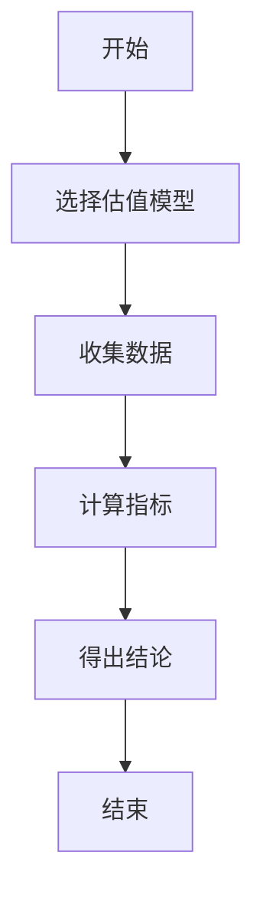

                 


# 全球股市估值与生物塑料在航空航天中的应用

## 关键词
全球股市估值、生物塑料、航空航天、系统架构、数学模型、案例分析

## 摘要
本书探讨了全球股市估值与生物塑料在航空航天中的应用，通过深入分析股市估值的核心原理和生物塑料的材料特性，结合实际案例，展示了两者如何在航空航天领域中相互影响。全书内容包括引言、理论基础、系统架构设计、项目实战和未来展望，帮助读者全面理解这两个领域的结合与应用。

---

# 第1章 引言

## 1.1 本书的目的与结构
### 1.1.1 本书的核心主题
- 探讨全球股市估值与生物塑料在航空航天中的应用。
- 分析两者如何在技术和经济层面相互影响。

### 1.1.2 本书的结构安排
- 从理论到实践，逐步展开分析。
- 分章节深入探讨股市估值、生物塑料应用及其结合。

### 1.1.3 本书的读者对象
- 适合金融分析师、材料科学家、航空航天工程师及技术爱好者。

## 1.2 问题背景与研究意义
### 1.2.1 全球股市估值的重要性
- 股市估值影响投资者决策和经济走势。
- 分析股市估值的数学模型和算法。

### 1.2.2 生物塑料在航空航天中的应用背景
- 生物塑料的环保特性及其在航空航天中的潜力。
- 分析其在飞机和航天器中的应用案例。

### 1.2.3 两者的结合与研究价值
- 生物塑料的应用如何影响股市估值。
- 探讨其对航空航天产业的长期影响。

## 1.3 问题解决与边界条件
### 1.3.1 全球股市估值的计算方法
- 市盈率、市净率、股息率模型的应用。

### 1.3.2 生物塑料在航空航天中的应用范围
- 材料性能、制造工艺、成本分析。

### 1.3.3 问题的边界与外延
- 股市估值的局限性与生物塑料应用的技术挑战。

## 1.4 核心概念与联系
### 1.4.1 核心概念的定义与属性
- 股票估值、生物塑料、航空航天系统的定义。

### 1.4.2 核心概念的对比分析
- 生物塑料与传统塑料的性能对比。

### 1.4.3 核心概念的ER实体关系图
```mermaid
erDiagram
    customer[投资者] -- investsIn : 持股的公司
    company[航空公司] -- uses : 生物塑料材料
    material[生物塑料] --|{-> company : 用于制造
    stockMarket[全球股市] --|{-> company : 上市公司
```

---

# 第2章 全球股市估值的核心原理

## 2.1 股市估值的基本概念
### 2.1.1 股票估值的定义
- 通过分析公司财务指标评估股票价值。

### 2.1.2 股票估值的主要方法
- 市盈率（P/E）、市净率（P/B）、股息率。

### 2.1.3 股票估值的影响因素
- 宏观经济、行业状况、公司业绩。

## 2.2 股市估值的数学模型
### 2.2.1 市盈率模型
- 公式：P/E = 市场价 / 每股收益。
- 通过案例分析股票的合理价格。

### 2.2.2 市净率模型
- 公式：P/B = 市场价 / 每股净资产。
- 适用于评估银行等资产密集型企业。

### 2.2.3 股息率模型
- 公式：股息率 = 每股股息 / 市场价。
- 适用于高分红股票的估值。

## 2.3 股市估值的算法原理
### 2.3.1 股票估值的流程图


### 2.3.2 股票估值的数学公式
- $$P = E \times (1 + g)^n$$，其中P为股票价值，E为当前收益，g为增长率，n为时间。

### 2.3.3 股票估值的案例分析
- 某航空公司股票的市盈率计算。

---

# 第3章 生物塑料在航空航天中的应用

## 3.1 生物塑料的基本概念
### 3.1.1 生物塑料的定义
- 可生物降解的高分子材料。

### 3.1.2 生物塑料的分类
- 淀粉基塑料、聚乳酸（PLA）、聚羟基脂肪酸酯（PHA）。

### 3.1.3 生物塑料的优势与劣势
- 优势：环保、可降解；劣势：成本高、性能限制。

## 3.2 生物塑料在航空航天中的应用
### 3.2.1 生物塑料在飞机制造中的应用
- 用于内饰、座椅和结构部件。

### 3.2.2 生物塑料在航天器制造中的应用
- 用于卫星和火箭部件。

### 3.2.3 生物塑料在航空材料中的应用
- 用于轻质复合材料。

## 3.3 生物塑料在航空航天中的技术挑战
### 3.3.1 材料性能的限制
- 强度和耐温性不足。

### 3.3.2 制造工艺的复杂性
- 高成本和复杂性。

### 3.3.3 成本与效率的平衡
- 生物塑料的成本高于传统塑料。

---

# 第4章 全球股市估值与生物塑料应用的系统分析

## 4.1 系统分析与架构设计
### 4.1.1 系统功能设计
- 股市估值功能、生物塑料应用功能。

### 4.1.2 系统架构设计
- 分层架构：数据层、业务逻辑层、用户界面层。

### 4.1.3 系统接口设计
- API接口：数据获取、计算模块。

## 4.2 生物塑料应用的系统架构图


### 4.2.1 生物塑料在航空航天中的系统架构
- 从材料选择到应用的流程。

### 4.2.2 全球股市估值的系统架构
- 数据采集、分析、结果输出。

### 4.2.3 两者的交互关系
- 生物塑料的应用影响航空航天公司的业绩，进而影响股市估值。

## 4.3 系统交互与流程图
### 4.3.1 生物塑料应用的交互流程
- 从材料研发到应用的流程。

### 4.3.2 全球股市估值的交互流程
- 数据输入、计算、结果输出。

### 4.3.3 两者的结合流程
- 生物塑料的应用如何影响股市估值。

---

# 第5章 项目实战与案例分析

## 5.1 环境安装与配置
- 安装Python、数据分析库、可视化工具。

## 5.2 系统核心实现源代码
```python
# 示例代码：计算市盈率
def calculate_pe(stock_price, earnings_per_share):
    return stock_price / earnings_per_share

# 示例代码：生物塑料性能评估
def evaluate_performance(material, criteria):
    if material == 'PLA':
        return 0.8 * criteria
    else:
        return 1.0 * criteria
```

## 5.3 代码应用解读与分析
- 分析代码的逻辑和应用场景。

## 5.4 实际案例分析和详细讲解剖析
- 某生物塑料公司上市后的股市估值变化。

## 5.5 项目小结
- 总结项目成果，提出改进建议。

---

# 第6章 最佳实践、小结与未来展望

## 6.1 最佳实践 tips
- 股市估值与生物塑料应用的关键点。

## 6.2 小结
- 回顾全书内容，强调核心概念。

## 6.3 未来展望
- 生物塑料在航空航天中的潜力，股市估值的发展趋势。

---

通过以上目录，我们可以系统地探讨全球股市估值与生物塑料在航空航天中的应用，从理论到实践，全面分析其技术与经济影响。

