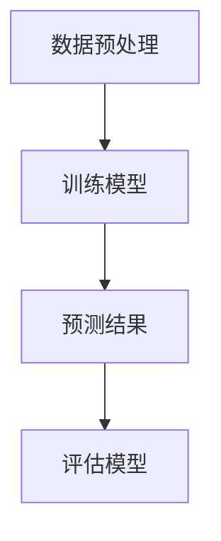
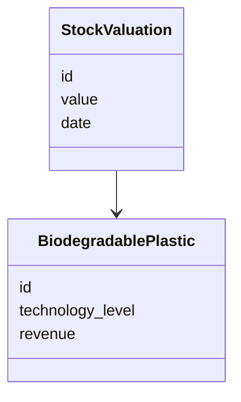
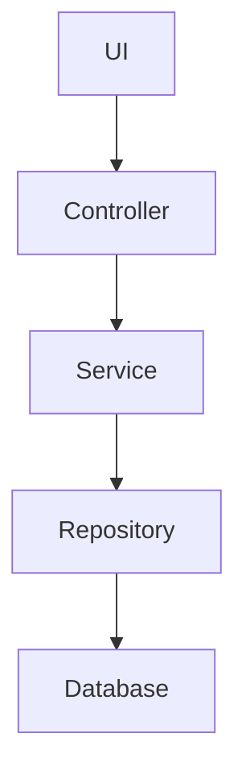

                 


# 全球股市估值与生物降解塑料技术进步的关联

> 关键词：全球股市估值，生物降解塑料，技术进步，关联分析，投资策略

> 摘要：本文探讨了全球股市估值与生物降解塑料技术进步之间的关联，分析了技术进步如何影响股市估值，并提出了基于技术进步的股市投资策略。文章从背景介绍、核心概念、算法原理、系统分析、项目实战等多个维度展开，结合实例和数据分析，为投资者和研究人员提供了有价值的参考。

---

## 第一部分: 背景介绍

### 第1章: 背景介绍

#### 1.1 问题背景
- **全球股市估值的重要性**：股市估值是衡量市场健康状况的重要指标，反映了投资者对市场的信心和对上市公司未来表现的预期。
- **生物降解塑料技术的环境意义**：生物降解塑料是解决白色污染问题的关键技术，其发展对环境保护具有重要意义。
- **问题解决的必要性**：随着环保意识的增强，生物降解塑料技术的进步可能对相关企业的估值产生显著影响，研究这种关联有助于投资者制定更科学的投资策略。

#### 1.2 问题描述
- **全球股市估值的波动性**：股市估值受多种因素影响，包括宏观经济环境、政策变化和技术创新等。
- **生物降解塑料技术的创新性**：生物降解塑料技术近年来取得了显著进展，但其市场推广仍面临技术瓶颈和成本问题。
- **两者关联的研究现状**：目前关于技术进步对股市估值影响的研究较少，特别是在生物降解塑料领域。

#### 1.3 问题解决
- **技术进步对股市估值的影响**：技术突破可能提升企业的市场竞争力，进而影响其股票估值。
- **市场需求对技术进步的推动**：消费者对环保产品的需求增加，推动企业加大对生物降解塑料技术的研发投入。
- **综合解决方案的提出**：通过分析技术进步对股市估值的影响路径，构建量化模型，为投资者提供参考。

#### 1.4 边界与外延
- **研究范围的界定**：本文主要关注生物降解塑料技术进步对相关企业估值的影响，不涉及其他环保技术。
- **相关领域的外延**：技术进步可能影响整个环保行业的股市表现，本文仅聚焦于生物降解塑料领域。
- **研究的局限性**：由于数据获取的限制，本文可能无法覆盖所有相关企业。

#### 1.5 概念结构与核心要素
- **核心概念的组成**：包括全球股市估值、生物降解塑料技术、技术进步、市场预期等。
- **关键要素的分析**：技术进步是核心，影响企业的盈利能力和市场竞争力。
- **概念之间的关系**：技术进步通过影响企业业绩和市场预期，最终影响股市估值。

---

## 第二部分: 核心概念与联系

### 第2章: 核心概念与联系

#### 2.1 全球股市估值的核心概念
- **股市估值的定义**：股市估值是指市场对上市公司未来盈利能力的预期，通常通过市盈率、市净率等指标衡量。
- **影响股市估值的主要因素**：包括宏观经济环境、行业发展趋势、企业盈利能力、政策法规等。
- **股市估值的计算方法**：常用的指标包括市盈率（P/E）、市净率（P/B）、股息率等。

#### 2.2 生物降解塑料技术进步的核心概念
- **生物降解塑料的定义**：生物降解塑料是指在自然环境中可以被微生物分解为二氧化碳和水的塑料。
- **生物降解塑料的关键技术**：包括生物基塑料的制备技术、降解催化剂的开发、降解条件的优化等。
- **技术进步的衡量标准**：包括降解效率、降解完全性、成本效益等。

#### 2.3 两者之间的关联
- **技术进步对股市估值的直接影响**：技术突破可能提升企业的市场竞争力，进而提高其股票估值。
- **技术进步对股市估值的间接影响**：技术进步可能改变市场的供需关系，影响整个行业的估值水平。
- **综合影响的模型构建**：通过构建数学模型，量化技术进步对股市估值的影响。

---

## 第三部分: 核心概念原理

### 第3章: 核心概念原理

#### 3.1 全球股市估值的原理
- **市场供需理论**：市场供需关系决定股票价格，投资者的买卖行为影响股市估值。
- **股价与公司业绩的关系**：公司盈利能力的提升通常会推动股价上涨，进而影响估值水平。
- **宏观经济因素对股市的影响**：经济增长、利率水平、通货膨胀等宏观经济指标对股市估值有重要影响。

#### 3.2 生物降解塑料技术进步的原理
- **材料科学的基本原理**：生物降解塑料的制备涉及高分子材料科学，研究塑料的降解机理和过程。
- **技术创新的驱动因素**：市场需求、政策支持、环境压力等都是推动生物降解塑料技术进步的重要因素。
- **技术转化的经济效应**：技术进步可能降低生产成本，提高产品的市场竞争力，从而影响企业的估值。

#### 3.3 两者关联的原理
- **技术进步如何影响市场预期**：技术突破可能改变投资者对相关企业未来盈利能力和市场地位的预期，进而影响股价。
- **市场预期如何反哺技术创新**：投资者对环保技术的重视可能推动企业加大研发投入，进一步推动技术进步。
- **综合效应的系统性分析**：通过系统性分析，明确技术进步与股市估值之间的动态关系。

---

## 第四部分: 核心概念属性特征对比

### 第4章: 核心概念属性特征对比

#### 4.1 全球股市估值的属性特征
- **数值特征**：股市估值通常表现为具体的数值，如市盈率、市净率等。
- **时间特性**：股市估值具有动态变化的特性，受市场波动影响较大。
- **空间特性**：不同地区的股市估值可能因经济环境和政策差异而有所不同。

#### 4.2 生物降解塑料技术进步的属性特征
- **技术复杂性**：生物降解塑料技术涉及多个学科，技术复杂性较高。
- **创新性**：技术进步通常伴随着创新，可能涉及专利和技术壁垒。
- **可持续性**：技术进步的可持续性取决于研发投入和市场需求。

#### 4.3 对比分析
- **技术进步的长期性与股市估值的短期性**：技术进步可能需要较长时间才能体现其价值，而股市估值通常反映短期市场变化。
- **技术进步的不确定性与股市估值的可测性**：技术进步的不确定性较高，而股市估值可以通过多种指标进行测量和预测。
- **两者关系的动态性**：技术进步与股市估值之间的关系可能随市场环境和政策变化而变化。

---

## 第五部分: 算法原理讲解

### 第5章: 算法原理讲解

#### 5.1 算法原理
- **时间序列分析**：用于分析股市估值的历史数据，预测未来趋势。
- **机器学习模型**：如LSTM（长短期记忆网络）用于捕捉时间序列中的复杂模式。
- **数学模型**：如ARIMA模型用于时间序列预测。

#### 5.2 算法实现


#### 5.3 数学模型
- **ARIMA模型**：用于时间序列预测，公式如下：
  $$ ARIMA(p, d, q) $$
  其中，p为自回归阶数，d为差分阶数，q为移动平均阶数。

#### 5.4 代码实现
```python
import pandas as pd
import numpy as np
from statsmodels.tsa.arima_model import ARIMA

# 数据加载与预处理
data = pd.read_csv('stock_valuation.csv')
data_diff = data['value'].diff().dropna()

# 模型训练
model = ARIMA(data_diff, order=(5, 1, 0))
model_fit = model.fit()

# 预测
forecast = model_fit.forecast(steps=5)
```

---

## 第六部分: 系统分析与架构设计

### 第6章: 系统分析与架构设计

#### 6.1 问题场景介绍
- **问题场景**：分析生物降解塑料技术进步对股市估值的影响，构建预测模型。

#### 6.2 系统功能设计
- **领域模型**：


- **系统架构设计**：


#### 6.3 系统接口设计
- **API接口**：提供数据接口，供前端和后端交互。

#### 6.4 系统交互设计
- **交互流程**：用户输入查询条件，系统返回预测结果。

---

## 第七部分: 项目实战

### 第7章: 项目实战

#### 7.1 环境安装
- **工具安装**：安装Python、Pandas、NumPy、Mermaid等工具。

#### 7.2 系统核心实现源代码
```python
import pandas as pd
import numpy as np
from statsmodels.tsa.arima_model import ARIMA

# 数据加载与预处理
data = pd.read_csv('stock_valuation.csv')
data_diff = data['value'].diff().dropna()

# 模型训练
model = ARIMA(data_diff, order=(5, 1, 0))
model_fit = model.fit()

# 预测
forecast = model_fit.forecast(steps=5)
```

#### 7.3 案例分析
- **案例背景**：某生物降解塑料企业的技术进步对股市估值的影响。
- **数据分析**：通过ARIMA模型预测未来5天的股市估值。

#### 7.4 项目小结
- **项目总结**：通过项目实战，验证了技术进步对股市估值的影响，为投资者提供了参考。

---

## 第八部分: 最佳实践

### 第8章: 最佳实践

#### 8.1 小结
- **核心观点总结**：生物降解塑料技术进步对股市估值有显著影响，投资者应关注技术动态和市场趋势。

#### 8.2 注意事项
- **数据质量**：确保数据准确性和完整性。
- **模型选择**：根据实际情况选择合适的预测模型。

#### 8.3 拓展阅读
- **推荐书籍**：《量化投资：技术与分析》
- **推荐文章**：《技术进步与金融市场波动》

---

## 总结

本文通过分析全球股市估值与生物降解塑料技术进步的关联，探讨了技术进步对股市估值的影响，并提出了基于技术进步的股市投资策略。通过理论分析、算法实现和项目实战，为投资者和研究人员提供了有价值的参考。未来的研究可以进一步结合更多数据和复杂模型，深入分析技术进步对股市估值的长期影响。

