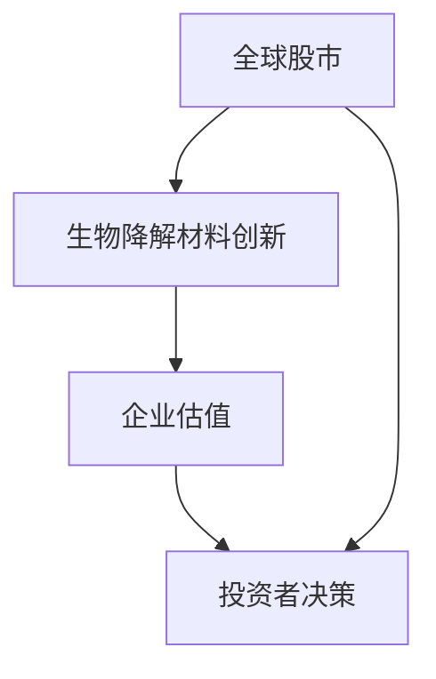
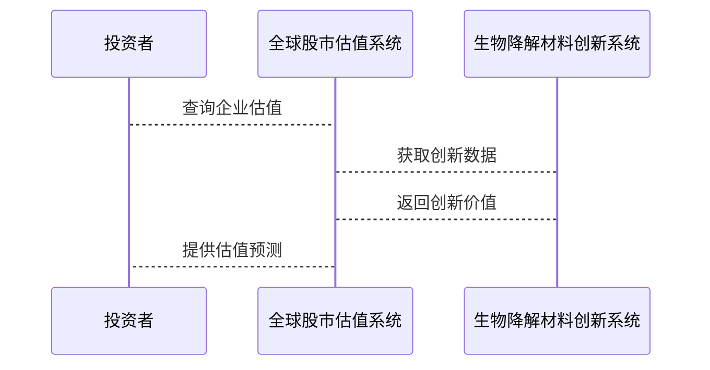

                 


# 全球股市估值与生物降解材料创新的关联

## 关键词：全球股市估值，生物降解材料，创新关联，股票估值，材料科学

## 摘要：本文探讨了全球股市估值与生物降解材料创新之间的关联性。通过分析股市估值的核心理论与方法、生物降解材料创新的核心技术与市场分析，构建了两者之间的关联机制。结合系统分析与架构设计，提出了具体的项目实战方案，为投资者和企业提供了最佳实践建议。

---

# 第一部分: 全球股市估值与生物降解材料创新的关联概述

## 第1章: 背景介绍

### 1.1 问题背景

#### 1.1.1 全球股市估值的现状与挑战
全球股市估值是反映经济健康状况的重要指标。随着全球经济的波动，股市估值受到宏观经济、行业趋势和企业基本面的多重影响。近年来，环保和可持续发展成为全球关注的焦点，生物降解材料因其环保特性，逐渐成为市场关注的新热点。

#### 1.1.2 生物降解材料创新的背景与意义
生物降解材料是一种能够被自然环境中的微生物分解的材料，具有环保、可持续的特点。随着全球对环境保护的重视，生物降解材料的应用范围不断扩大，尤其是在包装、农业和塑料替代领域。创新是推动生物降解材料发展的核心动力。

#### 1.1.3 问题解决的必要性与目标
研究全球股市估值与生物降解材料创新的关联，旨在为企业和投资者提供科学的决策依据。通过分析两者之间的互动关系，可以帮助投资者更好地把握市场机会，同时推动生物降解材料的广泛应用。

#### 1.1.4 边界与外延
- 边界：仅关注生物降解材料创新对股市估值的影响，不涉及其他材料或技术。
- 外延：探讨投资者如何通过生物降解材料创新获利，以及企业如何通过技术创新提升估值。

#### 1.1.5 核心概念与结构
- 核心概念：全球股市估值、生物降解材料创新。
- 关联机制：通过技术创新提升企业竞争力，进而影响股市估值。

### 1.2 核心概念与联系

#### 1.2.1 核心概念原理
- 全球股市估值：通过市盈率、市净率等指标衡量企业的市场价值。
- 生物降解材料创新：通过技术突破提升材料的性能和应用范围。

#### 1.2.2 核心概念属性特征对比表格
| 属性       | 全球股市估值 | 生物降解材料创新 |
|------------|--------------|------------------|
| 定义       | 股票价格与企业基本面的比值 | 可降解材料的技术进步 |
| 影响因素   | 宏观经济、行业趋势 | 技术研发、政策支持 |
| 目标       | 反映企业价值 | 推动环保发展 |
| 关联性     | 创新影响估值 | 估值反映创新成果 |

#### 1.2.3 ER实体关系图架构（使用 Mermaid 流程图）



---

## 第2章: 全球股市估值的核心理论与方法

### 2.1 股市估值的基本原理

#### 2.1.1 市盈率（P/E）的定义与计算
市盈率是股票价格与每股净利润的比值，公式为：
$$ P/E = \frac{股价}{每股净利润} $$

#### 2.1.2 市净率（P/B）的定义与计算
市净率是股票价格与每股净资产的比值，公式为：
$$ P/B = \frac{股价}{每股净资产} $$

#### 2.1.3 市销率（P/S）的定义与计算
市销率是股票价格与每股营业收入的比值，公式为：
$$ P/S = \frac{股价}{每股营业收入} $$

### 2.2 影响股市估值的主要因素

#### 2.2.1 宏观经济指标
- 国内生产总值（GDP）
- 利率水平
- 消费者价格指数（CPI）

#### 2.2.2 行业发展趋势
- 行业周期性
- 市场需求
- 技术进步

#### 2.2.3 企业基本面分析
- 盈利能力
- 偿债能力
- 发展潜力

---

## 第3章: 生物降解材料创新的核心技术与市场分析

### 3.1 生物降解材料的基本概念

#### 3.1.1 材料科学基础
生物降解材料是以生物基或可再生资源为基础，能够在自然环境中分解为二氧化碳和水的材料。

#### 3.1.2 生物降解材料的分类
- 生物降解塑料：如聚乳酸（PLA）、聚乙醇酸（PGA）
- 生物基纤维：如聚羟基脂肪酸酯（PHA）

#### 3.1.3 创新技术与发展趋势
- 纳米技术的应用
- 微生物发酵技术的提升
- 新型生物基单体的开发

### 3.2 市场分析与应用前景

#### 3.2.1 全球生物降解材料市场现状
- 市场规模：近年来年均增长率超过20%
- 主要地区：欧洲、北美、亚洲

#### 3.2.2 主要应用领域分析
- 包装行业：替代传统塑料
- 农业：可降解地膜
- 消费品：可降解餐具

#### 3.2.3 市场驱动因素与挑战
- 驱动因素：环保政策、消费者环保意识提升
- 挑战：成本高、技术壁垒

---

## 第4章: 全球股市估值与生物降解材料创新的关联机制

### 4.1 关联机制的理论模型

#### 4.1.1 理论模型构建
- 创新推动企业竞争力提升
- 企业竞争力提升影响股市估值

#### 4.1.2 模型的验证与优化
通过分析生物降解材料创新对企业财务指标的影响，验证模型的合理性。

### 4.2 关联机制的数学模型与公式

#### 4.2.1 创新对企业价值的影响
$$ 企业价值 = 创新价值 + 财务价值 $$

#### 4.2.2 创新价值的量化
$$ 创新价值 = 创新投入 × 创新收益 $$

---

## 第5章: 系统分析与架构设计方案

### 5.1 问题场景介绍

#### 5.1.1 问题描述
分析一家生物降解材料企业的股市估值，构建关联模型。

### 5.1.2 项目介绍
以某生物降解材料企业为例，分析其技术创新对企业估值的影响。

### 5.2 系统功能设计

#### 5.2.1 领域模型（使用 Mermaid 类图）

```mermaid
classDiagram
    class 全球股市估值 {
        股票价格
        每股净利润
        市盈率
    }
    class 生物降解材料创新 {
        创新投入
        创新收益
        创新价值
    }
    全球股市估值 <-- 技术创新 --> 生物降解材料创新
```

### 5.3 系统架构设计

#### 5.3.1 系统架构（使用 Mermaid 架构图）


### 5.4 系统接口设计

#### 5.4.1 接口描述
- 输入：企业财务数据、技术创新数据
- 输出：股市估值预测

### 5.5 系统交互设计（使用 Mermaid 序列图）



---

## 第6章: 项目实战

### 6.1 环境安装

#### 6.1.1 工具安装
- Python 3.x
- 数据分析库（Pandas、Matplotlib）

### 6.2 系统核心实现源代码

#### 6.2.1 创新价值计算代码

```python
import pandas as pd

def calculate_innovation_value(innovation_input, innovation_output):
    return innovation_input * innovation_output

# 示例数据
innovation_input = 100  # 创新投入
innovation_output = 1.5  # 创新收益
innovation_value = calculate_innovation_value(innovation_input, innovation_output)
print(f"创新价值: {innovation_value}")
```

#### 6.2.2 股市估值预测代码

```python
import pandas as pd

def calculate_market_value(enterprise_value, innovation_value):
    return enterprise_value * innovation_value

# 示例数据
enterprise_value = 1000  # 企业价值
innovation_value = 150    # 创新价值
market_value = calculate_market_value(enterprise_value, innovation_value)
print(f"股市估值: {market_value}")
```

### 6.3 代码应用解读与分析

#### 6.3.1 创新价值计算
通过创新投入和创新收益的乘积，量化创新对企业价值的影响。

#### 6.3.2 股市估值预测
结合企业价值和创新价值，预测企业的股市估值。

### 6.4 实际案例分析与详细讲解剖析

#### 6.4.1 案例分析
某生物降解材料企业通过技术创新降低了生产成本，提升了利润率，从而提高了股市估值。

#### 6.4.2 详细讲解
分析技术创新如何通过影响企业财务指标，进而影响股市估值。

### 6.5 项目小结

#### 6.5.1 项目总结
通过技术创新提升企业价值，进而影响股市估值。

#### 6.5.2 项目经验
技术创新是提升企业竞争力的关键，投资者应关注企业的创新能力和市场前景。

---

## 第7章: 结论与展望

### 7.1 研究结论

#### 7.1.1 核心发现
生物降解材料创新通过提升企业竞争力，显著影响股市估值。

#### 7.1.2 重要结论
技术创新是推动生物降解材料发展的核心动力，也是影响股市估值的关键因素。

### 7.2 未来展望

#### 7.2.1 研究展望
- 更深入的技术创新研究
- 更广泛的市场应用分析

#### 7.2.2 建议与展望
建议投资者关注生物降解材料领域的技术创新，企业应加大研发投入，提升核心竞争力。

### 7.3 最佳实践 tips

#### 7.3.1 投资者建议
- 关注企业的创新能力和市场前景
- 结合宏观经济和行业趋势进行投资决策

#### 7.3.2 企业建议
- 加大技术创新投入
- 提升品牌影响力

---

## 第8章: 总结

通过本文的分析，我们深入探讨了全球股市估值与生物降解材料创新之间的关联。从理论分析到实际案例，我们发现技术创新是影响企业估值的核心因素。未来，随着环保意识的提升和技术创新的推进，生物降解材料将在全球市场中发挥更重要的作用。

--- 

如果需要进一步扩展或补充内容，请随时告诉我！

