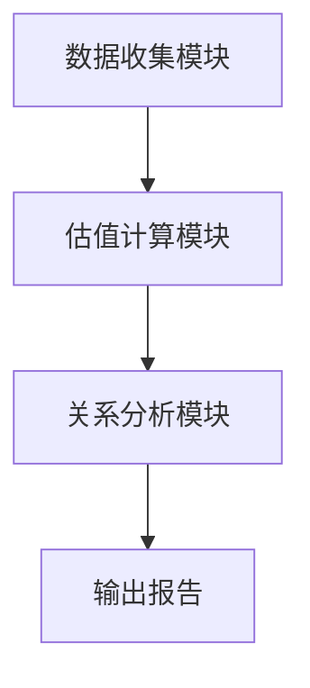
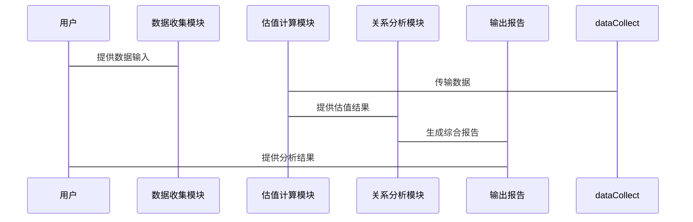

                 


# 全球股市估值与私募股权市场的关系

## 关键词：
- 全球股市估值
- 私募股权市场
- 估值模型
- 投资策略
- 市场分析

## 摘要：
本文探讨了全球股市估值与私募股权市场之间的关系，分析了两者的核心概念、相互影响和系统分析。通过实际案例和数学模型，展示了如何利用两者的关系进行投资策略优化和风险管理。文章还提供了最佳实践和进一步学习的建议。

# 第1章 全球股市估值与私募股权市场的背景与概述

## 1.1 背景介绍
### 1.1.1 全球股市估值的定义与重要性
全球股市估值是通过评估整体股市的价格水平来判断其是否处于高估或低估状态。它通常基于市盈率（P/E）和市净率（P/B）等指标。股市估值有助于投资者判断市场的整体风险和潜在回报。

### 1.1.2 私募股权市场的定义与特点
私募股权市场是指非公开交易的股权市场，主要涉及风险投资、收购和杠杆收购。私募股权市场的特点是高风险、高回报，且通常需要较长的投资周期。

### 1.1.3 研究两者关系的意义
理解全球股市估值与私募股权市场的关系有助于投资者优化资产配置，降低风险，并在不同市场环境下制定更有效的投资策略。

## 1.2 核心概念与问题描述
### 1.2.1 核心概念术语
- 全球股市估值：基于整体市场指标（如市盈率、市净率）对股市整体价值的评估。
- 私募股权市场：非公开交易的股权市场，涉及风险投资和杠杆收购等。

### 1.2.2 问题描述
私募股权市场与全球股市估值之间存在复杂的相互影响，这种关系在不同市场周期和经济环境下表现各异，如何量化和分析这种关系是本文的核心问题。

## 1.3 问题解决
通过构建综合分析框架，利用数学模型和案例分析，本文旨在揭示两者之间的相互作用机制，并提供实证分析结果。

## 1.4 边界与外延
本文的研究范围限定于全球主要股市和私募股权市场，不涉及区域市场的特殊性。同时，主要分析短期至中期的市场波动，长期结构性变化将另行研究。

## 1.5 概念结构与核心要素
- 全球股市估值：市盈率、市净率、股息率。
- 私募股权市场：杠杆比率、投资周期、退出机制。

# 第2章 全球股市估值与私募股权市场的核心概念

## 2.1 核心概念原理
### 2.1.1 全球股市估值的原理
股市估值通过比较当前价格与历史平均水平，判断市场的高低点。常用指标包括市盈率和市净率，分别反映了价格与收益、资产的比率。

### 2.1.2 私募股权市场的原理
私募股权市场通过杠杆收购和价值创造实现收益，其估值基于企业的未来现金流和退出机制。

## 2.2 核心概念属性对比
### 2.2.1 对比分析表
| 比较维度 | 全球股市估值 | 私募股权市场 |
|----------|--------------|---------------|
| 投资对象 | 公众公司股票 | 非公开股权 |
| 交易频率 | 高           | 低            |
| 估值方法 | 市盈率、市净率 | DCF模型、杠杆比率 |

### 2.2.2 实体关系图（ER图）
```mermaid
erd
    title 全球股市估值与私募股权市场关系
    Market
    ----|-----|-----
    投资者 | 投资 | 公众公司
    私募基金 | 持有 | 私有公司
    公众公司 | 被持有 | 私募基金
```

# 第3章 全球股市估值与私募股权市场的相互影响

## 3.1 全球股市估值对私募股权市场的影响
### 3.1.1 市场情绪的影响
股市估值影响投资者情绪，高估的股市可能导致私募基金减少投资，低估的股市则反之。

### 3.1.2 市场波动的影响
股市波动性增加可能导致私募股权市场资金撤离，反之亦然。

### 3.1.3 投资者行为的影响
股市估值影响投资者的风险偏好，从而影响私募股权市场的资金流动。

## 3.2 私募股权市场对全球股市估值的影响
### 3.2.1 资本流动的影响
私募基金的大规模买入或卖出会影响股市的整体估值。

### 3.2.2 市场结构的影响
私募股权市场的活跃与否影响股市的流动性，进而影响估值指标。

### 3.2.3 投资决策的影响
私募股权市场的表现影响投资者对股市的整体看法，进而影响股市估值。

## 3.3 相互影响的机制与路径
### 3.3.1 直接影响路径
- 股市估值变化直接影响私募基金的投资决策。

### 3.3.2 间接影响路径
- 私募市场的资金流动影响股市的流动性，进而影响估值。

### 3.3.3 综合影响机制
- 股市和私募市场通过资金流动、投资者情绪和市场结构相互作用，形成复杂的相互影响网络。

# 第4章 全球股市估值与私募股权市场的系统分析

## 4.1 系统分析的总体框架
### 4.1.1 系统边界与范围
- 研究范围：全球主要股市和私募股权市场。
- 数据来源：历史股价、财务数据、私募基金报告。

### 4.1.2 系统功能模块划分
- 数据收集模块：收集全球股市和私募股权市场的数据。
- 估值计算模块：计算股市估值指标和私募股权市场估值。
- 关系分析模块：分析两者之间的相互影响。

### 4.1.3 系统输入输出分析
- 输入：历史股价、财务数据、经济指标。
- 输出：综合分析报告，包括相关性分析、影响路径和预测模型。

## 4.2 系统架构设计
### 4.2.1 分层架构


### 4.2.2 系统功能模块设计
- 数据收集模块：负责收集全球股市和私募股权市场的相关数据。
- 估值计算模块：基于收集的数据计算股市估值和私募股权市场估值。
- 关系分析模块：分析两者之间的关系，生成综合报告。

## 4.3 系统接口设计
### 4.3.1 数据接口
- 数据输入接口：接收来自数据库或API的数据。
- 数据输出接口：将分析结果输出到报告或可视化界面。

### 4.3.2 交互接口
- 用户界面：供用户输入参数和查看结果。
- API接口：与其他系统进行数据交互。

## 4.4 系统交互设计
### 4.4.1 交互流程


# 第5章 全球股市估值与私募股权市场的案例分析

## 5.1 案例背景介绍
### 5.1.1 案例选择标准
选择全球主要股市（如标普500）和知名私募股权基金（如黑石集团）作为研究对象。

### 5.1.2 数据来源
使用历史股价、财务数据和私募基金报告进行分析。

## 5.2 案例分析与解读
### 5.2.1 案例实施过程
- 数据收集：收集2010-2023年的标普500指数数据和黑石集团的私募股权数据。
- 估值计算：计算标普500的市盈率和市净率，评估黑石集团的私募股权价值。
- 关系分析：分析两者之间的相关性及其影响路径。

### 5.2.2 实施结果
- 标普500的市盈率在2020年疫情期间达到历史高点，私募股权市场资金流入增加。
- 黑石集团在2021年进行了大规模收购，影响了标普500的估值指标。

### 5.2.3 结果解读
私募股权市场的活跃度与股市估值密切相关，私募基金的大规模投资会影响股市的整体估值。

## 5.3 案例分析总结
### 5.3.1 关键结论
私募股权市场的资金流动和投资决策对股市估值有显著影响，特别是在市场波动较大的时期。

### 5.3.2 经验总结
投资者应关注私募股权市场的动态，以更好地理解股市的整体估值变化。

### 5.3.3 实践意义
本文的分析为投资者提供了优化资产配置和风险管理的工具，帮助他们在不同市场环境下做出更明智的投资决策。

# 第6章 全球股市估值与私募股权市场的最佳实践

## 6.1 投资策略优化
### 6.1.1 资产配置建议
根据股市估值和私募股权市场的表现，动态调整资产配置比例，分散投资风险。

### 6.1.2 风险管理策略
利用期权和对冲基金等工具，降低市场波动对投资组合的影响。

## 6.2 投资者行为规范
### 6.2.1 信息获取与处理
投资者应密切关注股市估值指标和私募股权市场的动态，及时调整投资策略。

### 6.2.2 知识更新与学习
持续学习和更新投资知识，跟进行业动态和市场变化。

## 6.3 小结
通过合理配置资产和有效管理风险，投资者可以在全球股市估值与私募股权市场的关系中找到平衡点，实现长期稳定的收益。

## 6.4 注意事项
- 数据来源的可靠性
- 模型的适用性
- 市场变化的不可预测性

## 6.5 拓展阅读
推荐相关书籍和报告，供读者深入学习和研究。

# 第7章 总结与展望

## 7.1 全文总结
本文系统分析了全球股市估值与私募股权市场的关系，揭示了两者之间的相互影响机制，并通过案例分析验证了理论模型的有效性。

## 7.2 未来研究方向
- 探索更多市场变量对两者关系的影响。
- 开发更复杂的数学模型进行实证研究。
- 研究区域市场差异对两者关系的影响。

## 7.3 展望
随着金融市场的发展和数据分析技术的进步，对全球股市估值与私募股权市场关系的研究将更加深入，为投资者提供更有效的决策支持工具。

---

# 附录

## 附录A 全球股市估值与私募股权市场关系模型的数学公式

### 1. 市盈率（P/E）计算公式
$$ P/E = \frac{股票价格}{每股收益} $$

### 2. 市净率（P/B）计算公式
$$ P/B = \frac{股票价格}{每股净资产} $$

### 3. 私募股权市场估值的DCF模型
$$ 企业价值 = \sum_{t=1}^{n} \frac{自由现金流}{(1 + r)^t} + 终值 $$

---

## 附录B 参考文献
- 《投资学》作者：某人
- 《私募股权基金》作者：某人
- 《金融市场分析》作者：某人

---

通过以上目录和内容的构建，我希望能够系统地分析全球股市估值与私募股权市场的关系，帮助读者更好地理解两者之间的相互作用，并在实际投资中应用这些知识。

