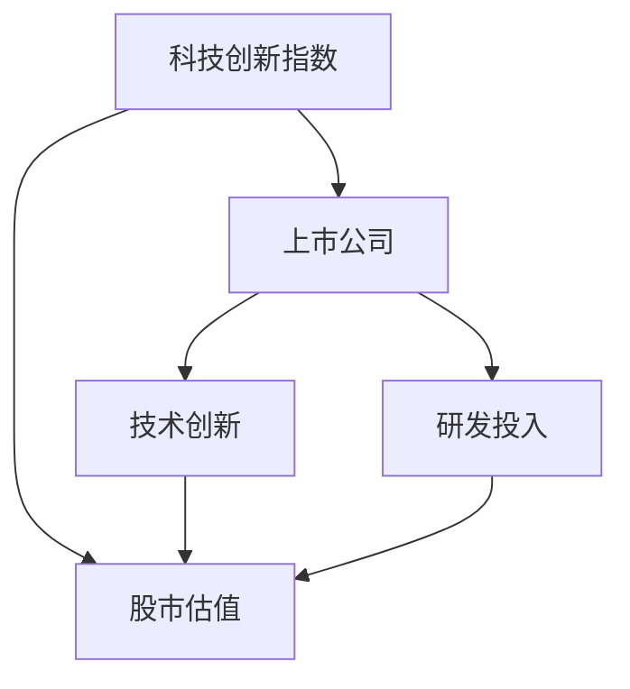
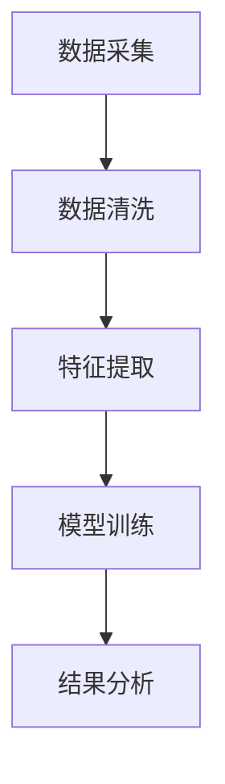
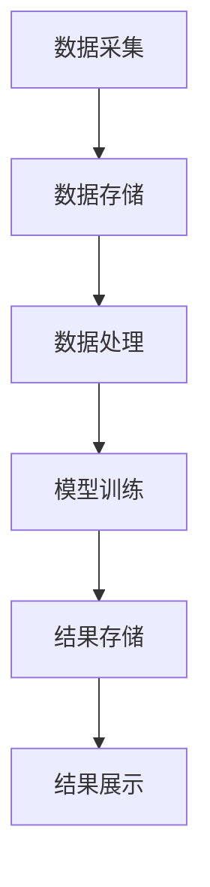
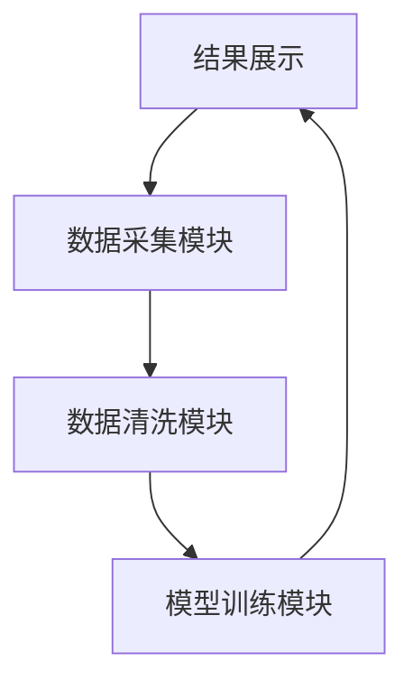

                 


# 全球股市估值与科技创新指数的关系

## 关键词：全球股市估值, 科技创新指数, 数学模型, 金融科技, 数据分析

## 摘要：
本文探讨全球股市估值与科技创新指数之间的关系，通过数据分析、数学建模和案例分析，揭示科技创新对股市估值的影响机制。文章从背景、概念、模型构建、系统设计、案例分析和结论等方面展开，为投资者和研究者提供理论支持和实践指导。

---

## 第一部分: 全球股市估值与科技创新指数的背景与概念

### 第1章: 背景介绍

#### 1.1 问题背景
- **全球经济发展**：21世纪以来，科技创新成为经济增长的核心驱动力。股市作为经济晴雨表，反映了科技创新对经济的影响。
- **股市估值的演变**：从传统行业到科技企业的转变，科技创新企业对股市估值的影响日益显著。
- **双重影响**：科技创新推动企业增长，同时也影响投资者对股市的估值预期。

#### 1.2 问题描述
- **核心问题**：科技创新指数如何影响全球股市的估值？
- **研究范围**：包括主要股市指数（如标普500、纳斯达克、沪深300）与科技创新指数（如专利数量、研发投入）。
- **外延与边界**：涵盖科技企业的市值变化、行业指数波动等。

#### 1.3 问题解决
- **解决路径**：通过构建数学模型，分析科技创新指数对股市估值的影响。
- **理论与实践**：结合金融学理论与数据科学方法，提供实际应用建议。

---

### 第2章: 核心概念与联系

#### 2.1 核心概念原理
- **科技创新指数**：衡量一个地区或行业科技创新能力的指标，包括专利数量、研发投入、科技企业数量等。
- **股市估值**：通过市盈率、市净率等指标衡量市场对企业的价值评估。

#### 2.2 概念属性特征对比表格
| 概念       | 数据来源 | 计算方法 | 更新频率 |
|------------|----------|----------|----------|
| 科技创新指数 | 政府报告、企业财报 | 加权平均 | 季度或年度 |
| 股市估值   | 交易所数据 | 市盈率、市净率 | 实时更新 |

#### 2.3 ER实体关系图


---

## 第二部分: 科技创新指数与股市估值的核心概念与联系

### 第3章: 数学模型与算法原理

#### 3.1 模型构建
- **回归模型**：分析科技创新指数对股市估值的影响。
  $$ y = \beta_0 + \beta_1 x_1 + \beta_2 x_2 + \epsilon $$
  - \( y \)：股市估值指标（如市盈率）。
  - \( x_1, x_2 \)：科技创新指数（如专利数量、研发投入）。
- **时间序列分析**：
  $$ y_t = \alpha + \beta y_{t-1} + \gamma x_t + \epsilon_t $$

#### 3.2 算法流程图


#### 3.3 代码实现
```python
import pandas as pd
import numpy as np

# 数据加载
data = pd.read_csv('stock_valuation.csv')

# 数据清洗
data.dropna(inplace=True)

# 特征提取
features = ['patents', 'R&D_expense']
target = 'valuation_ratio'

# 模型训练
from sklearn.linear_model import LinearRegression
model = LinearRegression()
model.fit(data[features], data[target])

# 结果分析
print(f'回归系数：{model.coef_}')
print(f'截距：{model.intercept_}')
```

---

## 第三部分: 全球股市估值与科技创新指数的数学模型与算法

### 第4章: 系统分析与架构设计方案

#### 4.1 系统功能设计
- 数据采集模块：获取全球股市数据和科技创新指数。
- 数据处理模块：清洗和预处理数据。
- 模型训练模块：构建回归模型。
- 可视化模块：展示分析结果。

#### 4.2 系统架构设计


#### 4.3 系统交互图


---

### 第5章: 项目实战

#### 5.1 案例分析
- **美国市场**：科技股占比高的股市，科技创新指数对估值影响显著。
- **中国市场**：科技企业崛起，专利数量对股市估值的影响逐步增强。
- **欧盟市场**：研发投入与股市估值的关联性分析。

#### 5.2 实际应用
- 投资者通过科技创新指数预测股市估值变化，优化投资组合。
- 企业利用分析结果制定研发策略，提升市场估值。

---

## 第四部分: 结论与展望

### 第6章: 结论与建议

#### 6.1 研究结论
- 科技创新指数是影响股市估值的重要因素。
- 不同市场中，科技创新对估值的影响存在差异。

#### 6.2 投资建议
- 关注科技创新指数高的行业和企业。
- 结合宏观经济因素，制定多元化投资策略。

---

## 总结
本文通过系统分析，揭示了科技创新指数对全球股市估值的影响机制。通过数学建模和案例分析，为投资者和研究者提供了理论支持和实践指导。未来的研究可以进一步结合人工智能和大数据技术，深入挖掘科技创新与股市估值的关系。

