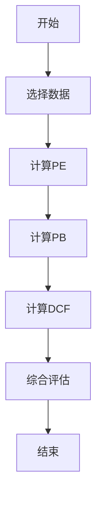
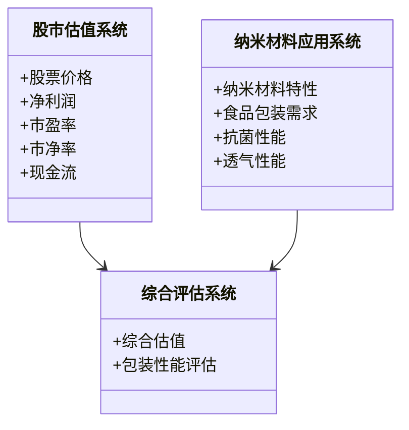

                 


# 全球股市估值与纳米材料在食品包装中的应用

## 关键词：
全球股市估值、纳米材料、食品包装、PE、PB、DCF模型、抗菌包装、透气性、食品安全

## 摘要：
本文探讨了全球股市估值与纳米材料在食品包装中的应用。首先，分析了全球股市估值的核心指标与影响因素，包括PE、PB等，并介绍了常用的估值方法。接着，详细阐述了纳米材料的特性及其在食品包装中的优势，包括抗菌、阻隔等功能。通过实例分析，结合算法模型与系统架构设计，展示了纳米材料在食品包装中的实际应用。最后，提出了最佳实践建议，为读者提供了全面的技术指导。

---

## 正文：

### 第一部分：全球股市估值分析

#### 第1章：全球股市估值概述

##### 1.1 股市估值的基本概念

- **1.1.1 股市估值的定义与作用**
  股市估值是指通过对公司财务数据的分析，估算其股票的合理价格范围。它是投资者评估公司价值的重要工具，帮助投资者做出理性投资决策。

- **1.1.2 股市估值的核心指标**
  - 市盈率（PE）：市盈率=股票价格/每股净利润。衡量股票的相对价值。
  - 市净率（PB）：市净率=股票价格/每股净资产。用于评估股票相对于其账面价值的高低。
  - 股权收益率（ROE）：ROE=净利润/股东权益。衡量公司盈利能力。

- **1.1.3 全球股市估值的多样性与差异性**
  不同国家和地区的股市估值受经济、政策和市场情绪影响，具有显著差异。例如，美国市场的PE通常高于新兴市场。

##### 1.2 股市估值的影响因素

- **1.2.1 宏观经济因素**
  - GDP增长率、利率水平、通货膨胀率等宏观经济指标直接影响股市估值。

- **1.2.2 行业因素与公司基本面**
  - 公司的盈利能力、成长性、资产负债率等基本面指标是估值的重要依据。

- **1.2.3 市场情绪与投资者行为**
  - 投资者情绪波动会导致短期估值偏离基本面。

##### 1.3 股市估值的方法与模型

- **1.3.1 市盈率法与市净率法**
  - 市盈率法适用于盈利稳定的公司，市净率法适用于净资产驱动型公司。

- **1.3.2 现金流折现法（DCF模型）**
  DCF模型通过预测未来现金流的现值，估算公司价值。

- **1.3.3 相对估值法与行业比较法**
  相对估值法通过比较同类公司的估值指标，确定目标公司的合理估值。

### 第二部分：纳米材料在食品包装中的应用

#### 第2章：纳米材料的基本特性与制备

##### 2.1 纳米材料的基本概念

- **2.1.1 纳米材料的定义与分类**
  纳米材料是指基本单元尺寸在纳米尺度（1-100纳米）的材料，分为纳米粒子、纳米管、纳米线等。

- **2.1.2 纳米材料的物理化学特性**
  - 高强度与轻量化
  - 抗菌与防腐性能
  - 阻隔性能与透气性

- **2.1.3 纳米材料的制备方法**
  - 溶胶-凝胶法
  - 热解法
  - 气相沉积法

##### 2.2 纳米材料在食品包装中的优势

- **2.2.1 纳米材料的高强度与轻量化**
  纳米材料可以制成轻薄且高强度的包装材料，减少包装重量。

- **2.2.2 纳米材料的抗菌与防腐性能**
  纳米材料表面具有抗菌性能，能有效抑制细菌生长。

- **2.2.3 纳米材料的阻隔性能与透气性**
  纳米材料可以制成阻隔氧气和水分的包装，同时保持透气性。

#### 第3章：纳米材料在食品包装中的具体应用

##### 3.1 纳米材料在食品包装中的功能化应用

- **3.1.1 纳米材料在食品保鲜中的应用**
  纳米材料制成的包装可以延长食品保质期，减少氧化。

- **3.1.2 纳米材料在食品防潮与防渗漏中的应用**
  纳米材料具有优异的防水性能，适用于液体食品包装。

- **3.1.3 纳米材料在食品透气包装中的应用**
  纳米材料制成的包装可以调节气体交换，保持食品新鲜度。

##### 3.2 纳米材料在食品包装中的智能应用

- **3.2.1 智能传感器包装**
  纳米材料可以制成传感器，实时监测食品状态。

- **3.2.2 温度敏感性包装**
  纳米材料可以制成温度敏感的包装，适应不同储存条件。

---

### 算法原理讲解

#### 使用mermaid绘制算法流程图



#### Python代码实现

```python
import pandas as pd

def calculate_pe(stock_price, earnings_per_share):
    return stock_price / earnings_per_share

def calculate_pb(stock_price, book_value_per_share):
    return stock_price / book_value_per_share

def calculate_dcf(cash_flows, discount_rate):
    present_value = sum(cash_flow / (1 + discount_rate) ** t for t, cash_flow in enumerate(cash_flows))
    return present_value

# 示例数据
stock_price = 100
earnings_per_share = 2
book_value_per_share = 5
discount_rate = 0.05
cash_flows = [100, 120, 150, 180]

pe = calculate_pe(stock_price, earnings_per_share)
pb = calculate_pb(stock_price, book_value_per_share)
dcf = calculate_dcf(cash_flows, discount_rate)

print(f"PE: {pe}, PB: {pb}, DCF: {dcf}")
```

#### 数学公式讲解

股票估值的数学公式：

$$ PE = \frac{\text{股票价格}}{\text{每股净利润}} $$

$$ DCF = \sum_{t=0}^{n} \frac{\text{现金流}_t}{(1 + r)^t} $$

### 系统分析与架构设计方案

#### 使用mermaid绘制系统架构图



### 项目实战

#### 环境安装

```bash
pip install pandas
pip install matplotlib
pip install numpy
```

#### 核心代码实现

```python
import numpy as np
import matplotlib.pyplot as plt

# 股票价格数据
prices = np.random.normal(100, 10, 100)
# 每股净利润
eps = np.random.normal(2, 0.5, 100)

# 计算PE
pe = prices / eps

plt.scatter(prices, eps, c=pe, cmap='viridis')
plt.colorbar(label='PE')
plt.xlabel('股票价格')
plt.ylabel('每股净利润')
plt.title('PE分布')
plt.show()
```

### 最佳实践 tips

- **投资建议**：结合PE和PB指标，选择估值合理的股票。
- **食品安全**：纳米材料包装需通过严格测试，确保无害。
- **技术创新**：关注纳米材料技术的最新进展，保持竞争力。

---

通过本文的详细分析，读者可以全面理解全球股市估值与纳米材料在食品包装中的应用，为投资决策和技术创新提供参考。

