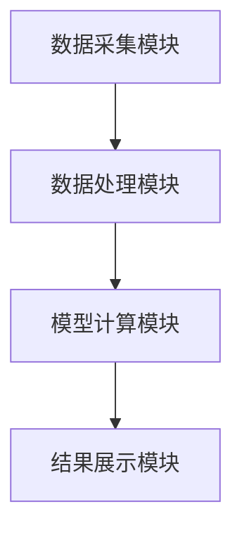

                 

# 全球股市估值与脑机接口在教育个性化中的应用

> 关键词：股市估值，脑机接口，教育个性化，人工智能，数据驱动

> 摘要：本文探讨了全球股市估值与脑机接口技术在教育个性化中的应用。通过分析股市估值的核心模型与影响因素，结合脑机接口技术的基本原理与算法实现，展示了这两者如何在教育领域中协同工作，实现个性化学习体验的提升。

---

## 第一章: 全球股市估值的核心模型与影响因素

### 1.1 股市估值的背景与重要性

股市估值是评估企业价值的重要手段，影响投资者的决策。传统方法包括市盈率、市净率等，但随着大数据和人工智能的发展，新的方法不断涌现。

### 1.2 股市估值的主要模型

#### 1.2.1 市盈率模型
$$市盈率 = \frac{股价}{每股收益}$$
该模型适用于盈利稳定的公司。

#### 1.2.2 现金流折现模型
$$DCF = \sum_{t=1}^{n} \frac{CF_t}{(1+r)^t} + \frac{TV}{(1+r)^n}$$
该模型适用于高成长性公司。

### 1.3 影响股市估值的因素

| 因素类别 | 具体因素 | 影响程度 |
|----------|----------|----------|
| 宏观经济 | 利率、GDP增速 | 高 |
| 行业因素 | 行业周期、政策 | 中 |
| 公司基本面 | 收益、利润 | 高 |
| 市场情绪 | 投资者情绪、新闻事件 | 中 |

---

## 第二章: 脑机接口技术的基本原理与教育应用

### 2.1 脑机接口的定义与分类

脑机接口（BCI）是一种通过采集和分析大脑信号，实现人与机器直接交互的技术。分为侵入式和非侵入式两种。

### 2.2 脑机接口的核心技术

#### 2.2.1 神经信号采集
使用EEG、fMRI等技术采集大脑信号。

#### 2.2.2 信号处理
通过滤波、特征提取等步骤处理信号。

#### 2.2.3 信号解码
使用机器学习模型将信号转化为指令。

### 2.3 脑机接口在教育中的应用

#### 2.3.1 自适应学习系统
根据学生注意力和情绪调整教学内容。

#### 2.3.2 注意力监测
识别学生的注意力变化，优化教学节奏。

---

## 第三章: 脑机接口的数学模型与算法

### 3.1 基于时间序列的信号处理

使用ARIMA模型处理EEG信号。

$$ARIMA(p, d, q) = \phi(P)X_t - \theta(Q)Z_t$$

### 3.2 机器学习与深度学习应用

#### 3.2.1 机器学习分类
使用SVM或随机森林分类器识别大脑信号。

#### 3.2.2 深度学习模型
采用RNN或LSTM处理时间序列数据。

---

## 第四章: 股市估值的系统架构设计

### 4.1 功能模块划分

- 数据采集模块：获取实时股市数据。
- 数据处理模块：清洗和预处理数据。
- 模型计算模块：应用估值模型计算股价。
- 结果展示模块：可视化估值结果。

### 4.2 系统架构图

---

## 第五章: 脑机接口在教育个性化中的应用

### 5.1 自适应学习系统设计

通过BCI技术实时监测学生注意力和情绪，动态调整教学内容。

### 5.2 注意力与情绪监测

使用EEG信号识别学生的注意力变化和情绪状态。

---

## 第六章: 两者的结合与未来展望

### 6.1 协同效应分析

脑机接口技术可以为股市估值提供更精准的心理因素数据，提升估值模型的准确性。

### 6.2 未来挑战

数据隐私、技术成本和用户体验是主要挑战。

---

## 总结

本文探讨了全球股市估值与脑机接口技术的结合应用，展示了如何利用AI技术提升教育个性化和股市分析的准确性。未来，随着技术进步，两者将有更广阔的应用前景。

