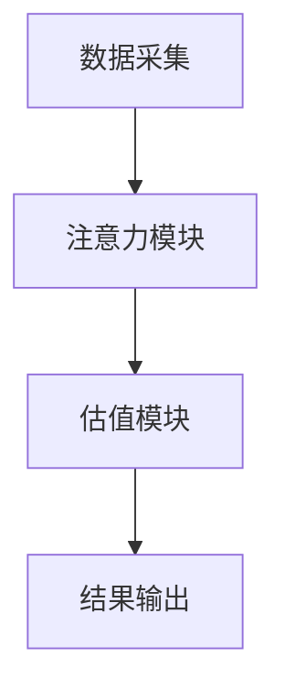
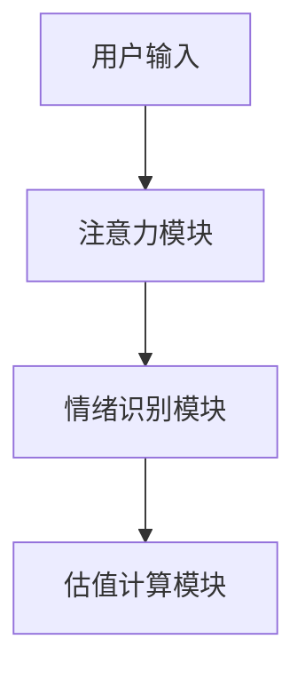

                 


# 全球股市估值与脑科学在人机交互中的应用

## 关键词：
- 全球股市估值
- 脑科学
- 人机交互
- 注意力机制
- 情绪识别
- 股市分析
- 系统架构

## 摘要：
本文探讨了全球股市估值与脑科学在人机交互中的应用，详细介绍了脑科学如何通过注意力机制和情绪识别提升股市分析的准确性。结合系统架构设计和项目实战，展示了如何将脑科学原理应用于股市估值，为投资者提供更精准的决策支持。

---

## 第1章: 全球股市估值的基本概念

### 1.1 股市估值的核心概念
#### 1.1.1 股市估值的定义与作用
股市估值是通过对公司财务数据、市场环境、行业趋势等多方面因素进行分析，评估公司股票的合理价格范围。其作用在于帮助投资者做出更明智的投资决策，降低投资风险。

#### 1.1.2 股市估值的主要方法
- **相对估值法**：通过比较公司与行业平均市盈率、市净率等指标，评估其股价是否合理。
- **绝对估值法**：基于公司未来现金流的折现值，计算其内在价值。
- **技术分析法**：通过分析股价的历史走势和成交量，预测未来股价趋势。

#### 1.1.3 股市估值的边界与外延
- **边界**：估值结果受数据质量和市场假设的限制。
- **外延**：结合宏观经济、行业政策等外部因素，扩展估值的应用场景。

---

## 第2章: 脑科学在人机交互中的应用基础

### 2.1 脑科学的基本原理
#### 2.1.1 神经科学基础
大脑通过神经元之间的电化学信号传递信息，形成对外界刺激的感知和反应。

#### 2.1.2 脑机接口的原理
脑机接口（BCI）通过采集和解析大脑电信号，实现人与机器之间的直接交互。

#### 2.1.3 注意力机制与决策过程
注意力机制帮助人类在复杂环境中筛选重要信息，提升决策效率。

---

## 第3章: 人机交互中的注意力机制

### 3.1 注意力机制的数学模型
#### 3.1.1 注意力机制的定义
注意力机制是一种模拟人类注意力的计算模型，用于在输入数据中分配权重，突出重要信息。

#### 3.1.2 注意力机制的公式推导
$$
\text{Attention}(Q, K, V) = \text{softmax}\left(\frac{QK^T}{\sqrt{d_k}}\right)V
$$
其中，$Q$ 是查询向量，$K$ 是键向量，$V$ 是值向量，$d_k$ 是键的维度。

#### 3.1.3 注意力机制的实现代码
```python
import torch

def attention(query, key, value, d_k):
    scores = torch.matmul(query, key.transpose(-2, -1)) / torch.sqrt(torch.tensor(d_k, dtype=torch.float))
    scores = torch.softmax(scores, dim=-1)
    output = torch.matmul(scores, value)
    return output
```

---

## 第4章: 股市估值中的情绪识别

### 4.1 情绪识别的算法原理
#### 4.1.1 情绪识别的定义
情绪识别通过分析文本、语音或面部表情，判断个体的情绪状态。

#### 4.1.2 情绪识别的实现步骤
1. 数据预处理：提取文本或语音特征。
2. 模型训练：使用机器学习或深度学习算法训练情绪分类器。
3. 情绪预测：对新的数据进行情绪分类。

#### 4.1.3 情绪识别的代码实现
```python
from sklearn.feature_extraction.text import TfidfVectorizer
from sklearn.svm import SVC

# 数据预处理
texts = ["市场表现强劲", "公司业绩不佳"]
vectorizer = TfidfVectorizer()
X = vectorizer.fit_transform(texts)

# 模型训练
model = SVC()
model.fit(X, ['positive', 'negative'])

# 情绪预测
new_text = ["股价上涨"]
X_new = vectorizer.transform([new_text])
print(model.predict(X_new))  # 输出：['positive']
```

---

## 第5章: 股市估值与脑科学结合的系统架构

### 5.1 系统架构设计
#### 5.1.1 系统功能模块划分
- **数据采集模块**：收集股票数据和市场情绪数据。
- **注意力模块**：对情绪数据进行注意力计算。
- **估值模块**：结合注意力结果和财务数据进行估值。

#### 5.1.2 系统架构的mermaid图


#### 5.1.3 系统接口设计
- **输入接口**：接收股票代码和时间范围。
- **输出接口**：返回股票的估值结果和情绪分析报告。

---

## 第6章: 项目实战与案例分析

### 6.1 项目环境安装
#### 6.1.1 开发环境搭建
安装Python、Jupyter Notebook和相关库。

#### 6.1.2 依赖库安装
使用pip安装numpy、pandas、scikit-learn等库。

#### 6.1.3 代码仓库克隆
克隆GitHub上的项目代码仓库。

---

## 第7章: 最佳实践与小结

### 7.1 小结与总结
#### 7.1.1 本书的核心内容回顾
结合脑科学和股市估值，通过注意力机制和情绪识别提升分析准确性。

#### 7.1.2 未来研究方向展望
探索更先进的神经网络模型和更复杂的系统架构。

#### 7.1.3 注意事项与建议
- 数据质量是关键。
- 模型需要持续优化。

### 7.2 拓展阅读推荐
#### 7.2.1 相关领域书籍推荐
- 《注意力机制：原理与应用》
- 《股市分析的神经网络方法》

#### 7.2.2 研究论文推荐
- "Attention Mechanisms in Stock Market Prediction"
- "Emotion Recognition for Financial Decision Making"

#### 7.2.3 在线资源与工具推荐
- TensorFlow官方文档
- PyTorch官方教程

---

## 附录: 脑科学与股市估值的数学模型

### 附录A: 注意力机制的数学公式
$$
\text{Attention}(Q, K, V) = \text{softmax}\left(\frac{QK^T}{\sqrt{d_k}}\right)V
$$

### 附录B: 情绪识别的分类模型
$$
P(y|x) = \text{softmax}(Wx + b)
$$

### 附录C: 系统架构的mermaid图


