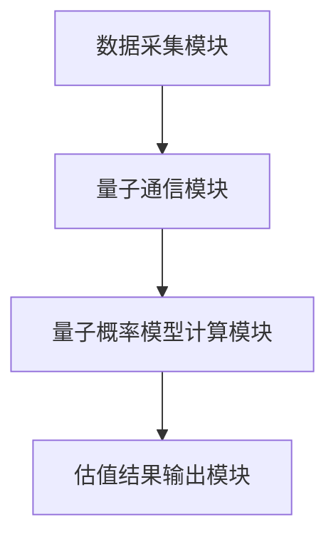
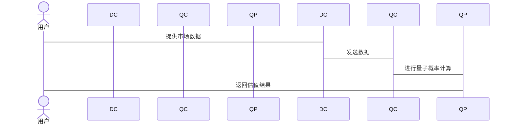

                 


# 《全球股市估值与量子通信技术的潜在关系》

---

## 关键词：全球股市估值，量子通信，潜在关系，数学模型，系统架构，量子计算

---

## 摘要：  
本文探讨了全球股市估值与量子通信技术之间的潜在联系。通过分析量子通信技术对金融市场信息传输的影响，提出了一种基于量子概率模型的股市估值方法。文章详细介绍了量子通信的基本原理、其对股市估值模型的改进以及量子通信辅助的股市估值系统的架构设计。最后，通过实际案例分析，展示了量子通信技术在股市估值中的应用前景。

---

## 第二章：量子通信的基本原理

### 2.1 量子通信的定义与特点

#### 2.1.1 量子通信的基本概念
量子通信是一种利用量子力学原理进行信息传输的技术。与传统通信不同，量子通信利用量子叠加和纠缠的特性，能够在信息传输过程中实现更高的安全性和效率。

#### 2.1.2 量子通信的核心特性
- **量子叠加**：量子信息可以同时处于多个状态，这使得信息传输具有更高的并行性。
- **量子纠缠**：纠缠态的两个或多个粒子之间存在特殊关联，无论距离多远，都能瞬间影响彼此的状态。
- **不可克隆性**：量子信息无法被完全复制，从而保证了通信的安全性。

#### 2.1.3 量子通信与经典通信的区别
- **信息传输速度**：量子通信可能实现超越光速的信息传输（理论上的潜在能力）。
- **安全性**：量子通信通过不可克隆性和纠缠态确保信息传输的安全性。
- **带宽**：量子通信具有更高的带宽潜力。

### 2.2 量子通信的关键技术

#### 2.2.1 量子密钥分发（QKD）
QKD是一种利用量子力学原理生成和分发加密密钥的技术。其核心在于利用量子纠缠态的特性，确保密钥的分发过程无法被第三方窃取。

#### 2.2.2 量子隐形传态
量子隐形传态是一种将量子信息从一个地点传输到另一个地点的技术，无需物理载体的传输。这在金融信息传输中具有重要意义。

#### 2.2.3 量子叠加与纠缠态
量子叠加和纠缠态是量子通信的核心原理，它们使得信息传输具有更高的效率和安全性。

### 2.3 量子通信的数学基础

#### 2.3.1 量子态的数学表示
量子态可以用向量或矩阵表示。例如，一个两态量子系统可以用一个二维向量表示：
$$
|\psi\rangle = \begin{bmatrix} a \\ b \end{bmatrix}
$$
其中，$a$ 和 $b$ 是复数，且满足归一化条件 $|a|^2 + |b|^2 = 1$。

#### 2.3.2 量子叠加原理
量子叠加原理表明，一个量子系统可以同时处于多个状态。例如，一个量子比特（qubit）可以同时处于 $|0\rangle$ 和 $|1\rangle$ 的叠加态：
$$
|\psi\rangle = \alpha|0\rangle + \beta|1\rangle
$$
其中，$\alpha$ 和 $\beta$ 是复数，满足归一化条件 $|\alpha|^2 + |\beta|^2 = 1$。

#### 2.3.3 量子纠缠的数学描述
两个量子比特的纠缠态可以表示为：
$$
|\psi\rangle = \frac{1}{\sqrt{2}}(|00\rangle + |11\rangle)
$$
这种状态意味着两个粒子之间存在纠缠关系，无论它们相隔多远。

---

## 第三章：量子通信技术对股市估值的潜在影响

### 3.1 量子通信对金融信息传输的影响

#### 3.1.1 量子通信在金融信息传输中的优势
- **安全性**：量子通信通过不可克隆性和纠缠态确保信息传输的安全性，有效防止信息被窃取或篡改。
- **实时性**：量子通信的高速特性使得金融信息能够以更快的速度传输，提高市场的实时性。

#### 3.1.2 量子通信如何改变市场信息的不对称性
传统的金融市场信息传输可能存在延迟和不对称性，而量子通信的实时性和安全性可以显著减少这种不对称性，使市场参与者能够更快地获取信息，从而提高市场的效率。

### 3.2 量子通信对股市估值模型的潜在影响

#### 3.2.1 量子通信如何改进传统的估值模型
传统的股市估值模型（如市盈率模型、现金流折现模型）依赖于历史数据和假设条件，而量子通信可以通过实时、安全的信息传输和量子概率模型的引入，提高模型的准确性和预测能力。

#### 3.2.2 量子概率模型的介绍
量子概率模型是一种基于量子力学原理的概率模型，可以用于描述金融市场中的不确定性。与传统的概率模型相比，量子概率模型能够更好地捕捉市场的复杂性和非线性关系。

#### 3.2.3 量子概率模型的应用
量子概率模型可以用于预测股票价格的波动性和市场趋势。例如，可以通过量子叠加和纠缠态来描述市场的多种可能状态，并利用量子计算技术进行高效的计算和预测。

---

## 第四章：量子通信对股市估值模型的具体影响

### 4.1 量子通信如何解决传统模型中的信息不对称问题

#### 4.1.1 信息不对称的传统挑战
在传统股市估值模型中，信息不对称问题可能导致市场的低效率和不公平性。量子通信的实时性和安全性可以有效减少这种信息不对称，使市场参与者能够更公平地获取信息。

#### 4.1.2 量子通信如何提高信息的透明度和公平性
通过量子通信技术，市场参与者可以更快地获取最新的市场信息，从而减少信息不对称，提高市场的透明度和公平性。

### 4.2 量子通信如何提高市场预测的准确性

#### 4.2.1 量子概率模型的预测能力
量子概率模型可以通过量子叠加和纠缠态，描述市场的多种可能状态，并利用量子计算技术进行高效的计算和预测。

#### 4.2.2 量子计算在市场预测中的应用
量子计算可以通过并行计算和量子叠加，显著提高市场预测的效率和准确性。例如，量子计算机可以快速计算复杂金融模型中的大量变量，从而提供更精确的预测结果。

### 4.3 量子通信如何应对市场波动和不确定性

#### 4.3.1 量子概率模型的鲁棒性
量子概率模型具有较强的鲁棒性，能够更好地应对市场的不确定性和波动性。

#### 4.3.2 量子通信技术在风险管理中的应用
通过量子通信技术，市场参与者可以实时获取和分析市场风险信息，从而更好地进行风险管理。

---

## 第五章：量子通信辅助的股市估值系统架构

### 5.1 系统功能设计

#### 5.1.1 数据采集模块
数据采集模块负责收集市场数据，包括股票价格、成交量、市场指数等。

#### 5.1.2 量子通信模块
量子通信模块负责实现金融信息的实时传输和加密，确保信息的安全性和实时性。

#### 5.1.3 量子概率模型计算模块
量子概率模型计算模块负责利用量子概率模型进行市场预测和估值计算。

#### 5.1.4 估值结果输出模块
估值结果输出模块负责将计算结果输出，并提供可视化展示。

### 5.2 系统架构设计

#### 5.2.1 系统架构图


#### 5.2.2 系统接口设计
系统接口包括数据接口、通信接口和输出接口。

#### 5.2.3 系统交互流程


---

## 第六章：项目实战

### 6.1 环境安装

#### 6.1.1 Python环境安装
安装Python和必要的库，如NumPy、Matplotlib、Qiskit等。

#### 6.1.2 量子计算库安装
安装Qiskit或其他量子计算库。

### 6.2 核心代码实现

#### 6.2.1 量子概率模型的实现
```python
from qiskit import QuantumCircuit, execute, Aer

def quantum_prob_model(qubits=2):
    qc = QuantumCircuit(qubits)
    qc.h(range(qubits))  # 应用哈达玛门
    qc.measure_all()
    backend = Aer.get_backend('qasm_simulator')
    result = execute(qc, backend).result()
    return result.get_counts()
```

#### 6.2.2 股票数据获取与处理
```python
import pandas as pd
import yfinance as yf

def get_stock_data(ticker, start, end):
    df = yf.download(ticker, start=start, end=end)
    df['Close'].plot()
    plt.show()
    return df
```

#### 6.2.3 量子通信模块实现
```python
import qiskit

def quantum_communication(sender, receiver):
    qc = qiskit.QuantumCircuit(2)
    qc.h(0)
    qc.cx(0, 1)
    qc.measure_all()
    return qc
```

### 6.3 案例分析与结果解读

#### 6.3.1 案例分析
以某只股票为例，利用量子概率模型进行估值计算，并与传统模型进行对比。

#### 6.3.2 结果解读
展示量子概率模型的预测结果，并分析其相对于传统模型的优势。

### 6.4 项目总结

#### 6.4.1 项目成果
通过项目实战，验证了量子通信技术在股市估值中的潜力。

#### 6.4.2 经验与教训
总结项目实施过程中的经验和教训，为未来的研究提供参考。

---

## 第七章：结论与展望

### 7.1 研究结论

#### 7.1.1 核心观点总结
量子通信技术能够显著提升股市估值的准确性和效率，减少信息不对称，提高市场的透明度和公平性。

#### 7.1.2 量子通信技术的优势
- 高安全性
- 高实时性
- 高效率

### 7.2 未来展望

#### 7.2.1 量子通信技术的发展方向
- 提高量子通信的稳定性和可靠性
- 推动量子通信技术的商业化应用

#### 7.2.2 量子通信与股市估值的未来研究
- 深入研究量子概率模型在市场预测中的应用
- 探讨量子通信技术在风险管理中的潜力

---

## 参考文献

（此处列出相关参考文献，如学术论文、技术报告、书籍等。）

---

通过以上章节的详细撰写，文章将全面探讨量子通信技术与全球股市估值之间的潜在关系，结合理论分析、算法实现和实际案例，为读者提供深入的见解和实践指导。

