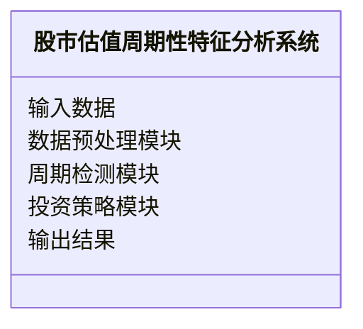

                 


# 《全球股市估值周期性特征探讨》

## 关键词：  
全球股市、估值周期、经济周期、市场情绪、时间序列分析、周期检测算法、投资策略  

## 摘要：  
本文探讨了全球股市估值的周期性特征，分析了其与经济周期、市场情绪等多方面因素的关系，结合技术方法如时间序列分析、周期检测算法等，深入剖析了股市估值周期的形成机制，并通过实际案例展示了如何利用这些周期性特征进行投资策略的优化。文章结构清晰，内容涵盖理论分析、算法实现、系统设计及实战应用，适合对股市分析和技术投资感兴趣的读者阅读。

---

## 第1章: 全球股市估值周期性特征的背景与基础

### 1.1 股市估值周期性概述  
#### 1.1.1 股市估值的基本概念  
股市估值是指通过对公司基本面、市场环境、行业趋势等因素进行分析，确定股票的合理价格区间。其核心在于发现市场的波动规律，为投资者提供决策依据。  

#### 1.1.2 周期性特征的定义  
周期性特征是指股市估值在一定时间段内呈现出的规律性波动模式。这些模式可能与经济周期、政策变化、市场情绪等多种因素相关。  

#### 1.1.3 周期性特征的背景  
股市作为复杂的金融市场，其波动性与周期性是研究的重点。通过对历史数据的分析，可以发现股市估值呈现出明显的周期性规律，这些规律为投资者提供了重要的参考依据。  

---

### 1.2 经济周期与股市估值的关系  
#### 1.2.1 经济周期的基本定义  
经济周期包括复苏、繁荣、衰退和萧条四个阶段，每个阶段对股市估值的影响不同。  

#### 1.2.2 经济周期对股市估值的影响  
在经济繁荣期，企业盈利上升，股市估值往往较高；而在衰退期，企业盈利下降，股市估值趋于低位。  

#### 1.2.3 市场情绪与周期性波动的互动  
市场情绪的变化会放大或减弱周期性波动。例如，在市场乐观时，周期性波动的上升趋势会被放大；而在市场恐慌时，波动会加剧下降趋势。  

---

### 1.3 股市估值周期性特征的边界与外延  
#### 1.3.1 周期性特征的边界  
周期性特征的边界包括时间范围、波动幅度和影响因素的范围。  

#### 1.3.2 周期性特征的外延  
周期性特征的外延包括不同市场的周期性差异、政策变化对周期性的影响等。  

---

## 第2章: 股市估值周期性特征的核心概念与联系

### 2.1 周期性特征的核心概念  
#### 2.1.1 股市估值周期的长短  
股市估值周期的长短取决于市场参与者的心理预期和市场环境的变化。  

#### 2.1.2 周期性特征的影响因素  
影响因素包括经济指标（GDP增速、利率水平等）、政策变化、市场情绪等。  

#### 2.1.3 周期性特征的数学模型  
周期性特征可以通过数学模型进行建模，例如ARIMA模型、傅里叶变换等。  

---

### 2.2 周期性特征与经济周期的关系  
#### 2.2.1 牛熊市周期的定义与特征  
牛熊市周期是股市波动的重要特征，牛市对应经济繁荣期，熊市对应经济衰退期。  

#### 2.2.2 经济周期与股市周期的对比  
经济周期和股市周期并非完全同步，但存在显著的相关性。  

#### 2.2.3 市场情绪与周期性波动的互动  
市场情绪的变化会影响周期性波动的幅度和持续时间。  

---

### 2.3 周期性特征与市场参与者的互动  
#### 2.3.1 投资者行为对周期性的影响  
投资者的行为会放大或减弱周期性波动。  

#### 2.3.2 市场参与者的心理预期与周期性特征  
市场参与者的心理预期是周期性特征的重要驱动因素。  

---

## 第3章: 股市估值周期性特征的算法原理

### 3.1 时间序列分析方法  
#### 3.1.1 时间序列分析的基本原理  
时间序列分析是一种通过历史数据预测未来趋势的方法，适用于分析股市估值的周期性特征。  

#### 3.1.2 常用的时间序列分析方法  
- ARIMA模型  
- 状态空间模型  
- 周期性分解方法  

---

### 3.2 周期检测算法  
#### 3.2.1 周期检测算法的基本原理  
周期检测算法通过分析数据的重复模式，识别周期性特征。  

#### 3.2.2 常用的周期检测算法  
- 傅里叶变换  
- 自相关函数分析  
- 基于聚类的周期检测  

---

## 第4章: 股市估值周期性特征的数学模型

### 4.1 ARIMA模型  
#### 4.1.1 ARIMA模型的基本公式  
$$ARIMA(p, d, q) = y_t = \phi_1 y_{t-1} + \dots + \phi_p y_{t-p} + \theta_1 \epsilon_{t-1} + \dots + \theta_q \epsilon_{t-q} + \epsilon_t$$  

#### 4.1.2 ARIMA模型的应用  
ARIMA模型适用于分析股市估值的线性周期性特征。  

---

### 4.2 傅里叶变换  
#### 4.2.1 傅里叶变换的基本公式  
$$X(k) = \sum_{n=0}^{N-1} x_n e^{-j2\pi kn/N}$$  

#### 4.2.2 傅里叶变换的应用  
傅里叶变换适用于识别数据中的周期性成分。  

---

## 第5章: 股市估值周期性特征的系统分析

### 5.1 问题场景介绍  
#### 5.1.1 问题背景  
如何利用周期性特征优化投资策略？  

#### 5.1.2 问题目标  
识别股市估值的周期性特征，构建投资策略。  

---

### 5.2 系统功能设计  
#### 5.2.1 领域模型（Mermaid 类图）  


---

### 5.3 系统架构设计  
#### 5.3.1 系统架构图（Mermaid 架构图）  


---

## 第6章: 股市估值周期性特征的项目实战

### 6.1 环境安装与数据准备  
#### 6.1.1 环境安装  
- 安装Python和相关库（numpy、pandas、matplotlib、statsmodels）  

#### 6.1.2 数据准备  
使用历史股价数据，例如标普500指数的历史数据。  

---

### 6.2 核心实现代码  
#### 6.2.1 数据预处理代码  
```python
import pandas as pd
import numpy as np

# 加载数据
data = pd.read_csv('stock_price.csv')

# 数据清洗
data = data.dropna()
data = data[~data.index.duplicated(keep='first')]
```

#### 6.2.2 周期检测代码  
```python
from statsmodels.tsa.arima.model import ARIMA

# 拟合ARIMA模型
model = ARIMA(data['Close'], order=(5, 1, 0))
model_fit = model.fit()

# 预测未来值
forecast = model_fit.forecast(steps=10)
```

---

### 6.3 代码应用解读与分析  
通过ARIMA模型，我们可以识别股市估值的周期性特征，并预测未来的股价走势。  

---

### 6.4 案例分析与结果解读  
以标普500指数为例，分析其周期性特征，并解读结果。  

---

## 第7章: 最佳实践与总结

### 7.1 小结  
股市估值的周期性特征是投资分析的重要工具，通过对周期性特征的识别，可以优化投资策略。  

### 7.2 注意事项  
- 数据质量对周期性分析结果的影响较大。  
- 周期性分析结果需结合市场环境进行判断。  

### 7.3 拓展阅读  
- 时间序列分析的经典书籍  
- 市场情绪分析的技术文献  

---

## 结语  
通过本文的分析，读者可以深入了解股市估值的周期性特征，并将其应用于实际投资中。未来的研究可以进一步结合机器学习等技术，提升周期性特征的识别精度。  

--- 

**感谢您的阅读！如果需要进一步探讨或有其他问题，请随时联系！**

