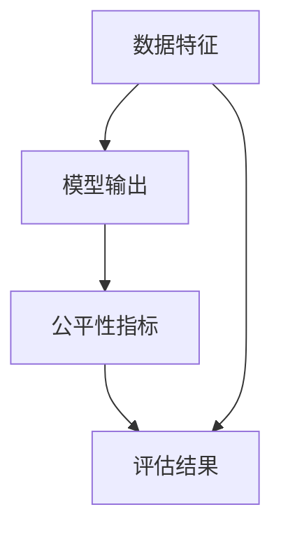
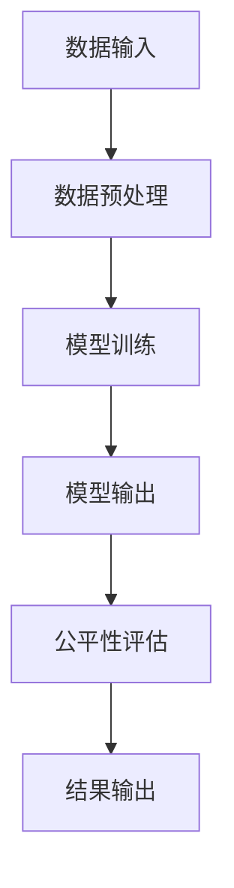
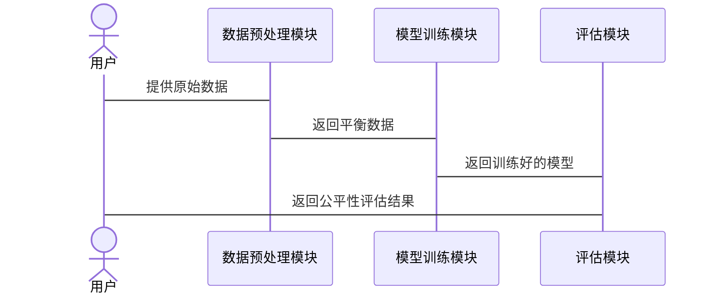

                 


# 公平性评估：确保AI Agent无歧视偏见

> 关键词：AI Agent，公平性评估，数据偏见，算法偏见，无歧视设计，公平性指标

> 摘要：本文详细探讨了在AI Agent开发中确保公平性的核心问题，从数据偏见的根源分析到算法设计的优化，系统地介绍了公平性评估的理论、方法和实践。通过具体的案例分析和代码实现，帮助读者理解如何构建一个无歧视偏见的AI系统。

---

## 第一部分: 公平性评估的背景与核心概念

### 第1章: 公平性评估的背景与问题背景

#### 1.1 公平性评估的核心概念

- **1.1.1 公平性评估的定义**
  公平性评估是指在AI系统中，通过分析数据和模型输出，识别和纠正因数据偏差或算法设计不当导致的不公平结果的过程。

- **1.1.2 AI Agent中的公平性问题**
  AI Agent在决策过程中可能会因为训练数据中的偏见或算法设计的不合理，导致对某些群体的不公平对待。

- **1.1.3 公平性评估的背景与重要性**
  随着AI技术的广泛应用，公平性评估已成为确保技术公正性的重要环节。它有助于减少社会不平等，提升用户体验和信任度。

#### 1.2 问题背景与问题描述

- **1.2.1 数据偏见的来源与影响**
  数据偏见可能来源于数据收集过程中的不均衡样本、历史偏见等，这些偏见会影响模型的预测结果。

- **1.2.2 AI Agent中的偏见表现形式**
  偏见可能在招聘、信贷评分、推荐系统等多个领域表现出来，导致某些群体的权益受损。

- **1.2.3 公平性评估的目标与范围**
  通过评估模型输出，识别和纠正偏见，确保AI系统的决策公平。

#### 1.3 公平性评估的边界与外延

- **1.3.1 公平性评估的适用场景**
  包括招聘、信贷评分、司法判决等领域。

- **1.3.2 公平性评估的局限性**
  无法完全消除所有偏见，且评估指标的选择会影响结果。

- **1.3.3 公平性评估与其他评估指标的关系**
  公平性评估与模型的准确性、效率等指标相辅相成。

#### 1.4 公平性评估的核心要素组成

- **1.4.1 数据特征的分析**
  识别数据中的敏感特征（如性别、种族）和非敏感特征。

- **1.4.2 模型输出的分析**
  检查模型输出是否对敏感特征存在偏见。

- **1.4.3 公平性指标的选择**
  选择合适的公平性指标（如统计独立性、平衡准确性）进行评估。

---

## 第二部分: 公平性评估的核心概念与联系

### 第2章: 公平性评估的核心概念原理

#### 2.1 偏见与公平性的定义

- **2.1.1 偏见的定义与特征**
  偏见是数据或模型输出中对某些群体的不公平对待，具有主观性和系统性。

- **2.1.2 公平性的定义与特征**
  公平性是模型输出对所有群体无歧视的特性，强调客观性和公平对待。

- **2.1.3 偏见与公平性的关系**
  偏见是公平性的对立面，公平性评估的核心在于识别和消除偏见。

#### 2.2 偏见与公平性的特征对比

| 特征       | 偏见                         | 公平性                       |
|------------|------------------------------|------------------------------|
| 定义       | 数据或模型输出中的不公平对待 | 模型输出对所有群体的公平对待 |
| 表现形式   | 针对特定群体的不公平结果     | 各群体结果无显著差异         |
| 影响因素   | 数据偏差、算法设计不合理     | 数据均衡、算法设计合理       |

#### 2.3 公平性评估的ER实体关系图



---

## 第三部分: 公平性评估的算法原理

### 第3章: 公平性评估的算法原理

#### 3.1 基于概率的公平性评估方法

- **算法原理概述**
  通过统计学方法，分析模型输出是否在统计上独立于敏感特征。

- **mermaid流程图**



- **Python代码实现**

```python
import pandas as pd
from sklearn.metrics import confusion_matrix

def fairness_check(y_true, y_pred, sensitive_feature):
    # 计算混淆矩阵
    cm = confusion_matrix(y_true, y_pred)
    # 计算敏感特征对预测结果的影响
    sensitiveImpact = {}
    for feature in set(sensitive_feature):
        sensitiveImpact[feature] = sum(cm[i][i] for i in range(len(cm))) / len(y_true)
    return sensitiveImpact
```

- **算法公式与详细讲解**
  公平性评估的数学模型：

$$
\text{公平性指标} = \frac{\sum_{i} (\text{true}_i \cdot \text{pred}_i)}{\sum_{i} \text{true}_i}
$$

---

## 第四部分: 公平性评估的系统分析与架构设计

### 第4章: 系统分析与架构设计

#### 4.1 问题场景介绍

- 公平性评估的场景包括招聘系统、信贷评分系统等。

#### 4.2 系统功能设计

- 数据预处理模块：清洗和平衡数据。
- 模型训练模块：训练公平性优化的模型。
- 评估模块：计算公平性指标。

#### 4.3 系统架构设计

- 数据源：提供原始数据。
- 模型训练服务：训练优化后的模型。
- 评估服务：计算公平性指标。
- 结果展示：可视化评估结果。

#### 4.4 系统接口设计

- 数据预处理接口：接收原始数据，返回平衡数据。
- 模型训练接口：接收训练数据，返回训练好的模型。
- 评估接口：接收模型和测试数据，返回公平性评估结果。

#### 4.5 系统交互流程



---

## 第五部分: 项目实战

### 第5章: 公平性评估的项目实战

#### 5.1 环境安装

- 安装必要的库：`pip install numpy scikit-learn`

#### 5.2 核心代码实现

```python
import numpy as np
from sklearn.metrics import accuracy_score

def calculate_fairness_score(y_true, y_pred, sensitive_feature):
    # 确保数据格式统一
    y_true = np.array(y_true)
    y_pred = np.array(y_pred)
    sensitive_feature = np.array(sensitive_feature)
    
    # 计算准确率
    accuracy = accuracy_score(y_true, y_pred)
    
    # 计算敏感特征对结果的影响
    fairness_score = {}
    for feature in np.unique(sensitive_feature):
        mask = (sensitive_feature == feature)
        fair_pred = y_pred[mask]
        fair_true = y_true[mask]
        fair_accuracy = accuracy_score(fair_true, fair_pred)
        fairness_score[feature] = fair_accuracy
    
    return fairness_score
```

#### 5.3 实际案例分析

- 案例：招聘系统中的公平性评估。
- 分析：识别模型是否对不同性别有差异的招聘决策。

#### 5.4 代码应用解读与分析

- 使用上述代码评估招聘系统的公平性，识别是否存在性别偏见。

---

## 第六部分: 最佳实践、小结、注意事项、拓展阅读

### 第6章: 最佳实践

- **6.1 关键点总结**
  选择合适的公平性指标，定期监控模型输出。

- **6.2 小结**
  公平性评估是构建可信AI系统的重要环节，需要从数据到模型的全生命周期关注。

- **6.3 注意事项**
  避免过度优化某一指标导致其他问题，保持数据和模型的透明度。

- **6.4 拓展阅读**
  推荐阅读相关书籍和论文，深入理解公平性评估的理论和方法。

---

# 结语

通过本文的详细讲解，读者可以系统地了解公平性评估的核心概念、算法原理和系统设计。希望这些内容能帮助开发者构建更加公正的AI系统。

