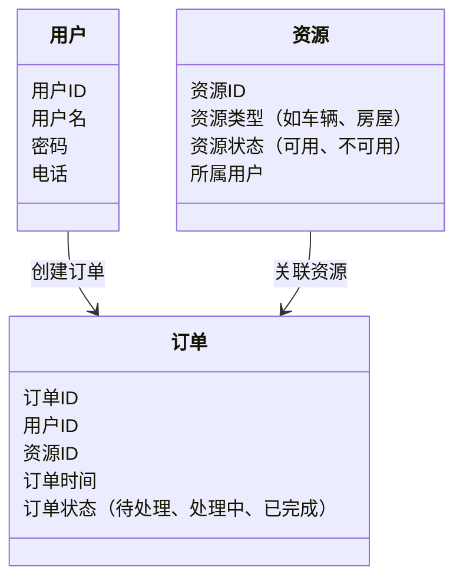

                 


# 共享经济模式对传统行业的影响与投资机会

## 关键词：共享经济，传统行业，投资机会，系统架构，项目实战

## 摘要

共享经济是一种通过数字化平台，将闲置资源进行共享的经济模式。它通过提高资源利用率，降低交易成本，为传统行业带来了颠覆性的变化。本文将从共享经济的背景出发，分析其对交通、住宿、办公等传统行业的影响，并探讨其中的投资机会。同时，我们将从系统架构和技术实现的角度，深入剖析共享经济平台的核心设计，并通过项目实战，展示如何构建一个高效的共享经济平台。

---

## 第一部分：共享经济的背景与基础

### 第1章：共享经济的定义与起源

#### 1.1 共享经济的定义与核心概念

共享经济是一种基于数字平台的经济模式，通过闲置资源的共享，实现资源的高效利用。其核心概念包括：

- **资源池化**：将分散的资源池化，通过平台进行统一调度。
- **使用权与所有权分离**：用户通过付费获得使用权，而非所有权。
- **去中心化**：通过平台实现供需双方的直接连接，降低中间成本。

#### 1.2 共享经济的模式与特点

共享经济的模式主要分为三种：

1. **P2P模式（点对点模式）**：用户之间直接共享资源，例如闲置房屋短租（Airbnb）。
2. **B2C模式（企业对消费者模式）**：企业通过平台向消费者提供共享服务，例如滴滴出行。
3. **B2B模式（企业对企业模式）**：企业之间共享资源，例如共享办公室。

其特点包括：

- **高效匹配**：通过平台实现资源的快速匹配。
- **灵活性高**：用户可以根据需求随时获取资源。
- **低成本**：通过共享降低交易成本。

#### 1.3 共享经济的优势与挑战

**优势**：

- **提高资源利用率**：通过共享，资源被充分利用，减少浪费。
- **降低交易成本**：去中介化降低了交易成本。
- **创新商业模式**：共享经济催生了新的商业模式。

**挑战**：

- **信任问题**：陌生人之间的共享需要建立信任机制。
- **法律风险**：共享经济可能涉及法律问题，例如税务问题、劳动法问题。
- **平台运营难度**：需要高效的技术支持和运营能力。

---

## 第二部分：共享经济对传统行业的影响

### 第2章：共享经济对交通出行的影响

#### 2.1 传统交通行业的现状

传统交通行业以出租车、公共交通为主，存在以下问题：

- **资源浪费**：出租车空驶率高。
- **服务单一**：难以满足个性化需求。
- **成本高**：用户打车成本高。

#### 2.2 共享经济对交通出行的颠覆

**影响**：

- **降低出行成本**：例如滴滴出行降低了打车费用。
- **提高资源利用率**：通过拼车、顺风车等方式，降低空驶率。
- **创新服务模式**：例如共享电动车、共享单车。

#### 2.3 共享经济对交通出行的挑战

- **信任问题**：乘客与司机之间的信任需要平台保障。
- **法律风险**：例如滴滴在中国面临的合规性问题。
- **用户体验**：如何保证服务质量，避免虚假订单、司机迟到等问题。

---

## 第三部分：共享经济的投资机会分析

### 第3章：共享经济的投资策略与成功案例

#### 3.1 投资共享经济的策略

**策略一：关注高潜力行业**

- 交通、住宿、办公等领域仍有较大潜力。

**策略二：关注技术创新**

- 投资具备技术创新能力的平台，例如利用AI优化资源匹配。

**策略三：关注区域市场**

- 二三线城市及新兴市场仍有较大发展空间。

#### 3.2 成功案例分析

**案例一：滴滴出行**

- **模式**：B2C模式，提供打车、拼车、顺风车等服务。
- **成功因素**：高效的匹配算法、大规模用户基础、本地化运营。

**案例二：Airbnb**

- **模式**：P2P模式，用户之间共享闲置房源。
- **成功因素**：建立了信任机制，提供了安全保障。

---

## 第四部分：共享经济的系统架构与技术实现

### 第4章：共享经济平台的系统架构设计

#### 4.1 领域模型设计

**领域模型**：共享经济平台涉及用户、资源、订单、支付等多个模块。

**领域模型图**：



#### 4.2 系统架构设计

**系统架构图**：

```mermaid
client
    <--HTTP-->
server
    <--RPC-->
database
```

---

## 第五部分：共享经济的项目实战

### 第5章：共享经济平台开发与案例分析

#### 5.1 平台开发环境安装

**Python开发环境**：

```bash
# 安装Python和pip
python --version
pip install --upgrade pip
```

**安装依赖库**：

```bash
pip install flask
pip install redis
pip install pymongo
```

#### 5.2 平台核心功能实现

**用户认证模块**：

```python
from flask import Flask, request, jsonify
from werkzeug.security import generate_password_hash, check_password_hash

app = Flask(__name__)
app.secret_key = 'your-secret-key'

@app.route('/register', methods=['POST'])
def register():
    data = request.json
    hashed_password = generate_password_hash(data['password'])
    # 将用户信息存入数据库
    return jsonify({'status': 'success'})

@app.route('/login', methods=['POST'])
def login():
    data = request.json
    user = get_user(data['username'])
    if user and check_password_hash(user.password, data['password']):
        return jsonify({'status': 'success', 'token': generate_token()})
    return jsonify({'status': 'error'})
```

---

## 第六部分：总结与展望

### 第6章：共享经济的未来发展趋势

**总结**：

共享经济通过技术手段优化资源配置，降低了交易成本，为传统行业带来了新的发展机遇。然而，其发展也面临信任、法律、用户体验等挑战。

**展望**：

随着技术的进步，共享经济将更加智能化、个性化。例如，利用AI技术优化资源匹配，利用区块链技术增强信任机制。未来，共享经济将渗透到更多领域，成为推动经济发展的新引擎。

---

通过以上分析，我们可以看到，共享经济不仅改变了传统行业的运作方式，还为投资者带来了丰厚的回报。然而，要想在共享经济中取得成功，需要深入了解行业特点，抓住技术机遇，同时规避法律和信任风险。

