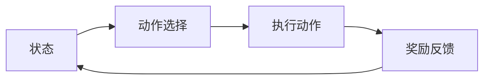

                 


# 农业AI Agent：优化种植决策与资源分配

**关键词：** 农业AI Agent, 种植决策, 资源分配, 强化学习, 系统架构, 项目实战

**摘要：** 本文系统地探讨了农业AI Agent在优化种植决策与资源分配中的应用。通过详细分析农业AI Agent的核心概念、算法原理和系统架构，结合实际案例和项目实战，展示了如何利用AI技术提升农业生产效率和资源利用率。文章内容涵盖了从理论基础到实际应用的各个方面，为农业从业者和开发者提供了深入的技术指导和实践参考。

---

## 第一部分: 农业AI Agent基础与背景

### 第1章: 农业AI Agent概述

#### 1.1 农业AI Agent的定义与核心概念
##### 1.1.1 农业AI Agent的定义
农业AI Agent是一种基于人工智能技术的智能体，能够通过数据采集、分析和决策优化，帮助农业从业者做出更科学的种植决策和资源分配。

##### 1.1.2 AI Agent的核心概念与特点
AI Agent具备感知环境、自主决策、学习优化和适应性四大特点。在农业场景中，AI Agent能够实时收集土壤、气候、作物生长等数据，结合历史数据和模型预测，提供最优的种植方案。

##### 1.1.3 农业种植中的问题背景与挑战
传统农业种植依赖经验，存在资源浪费、效率低下和抗风险能力弱等问题。AI Agent通过数据驱动的方法，能够有效解决这些问题，提升种植效率和资源利用率。

#### 1.2 农业AI Agent的应用场景
##### 1.2.1 种植决策优化
AI Agent可以根据土壤湿度、气候条件和作物需求，优化播种时间、种植密度和肥料使用量。

##### 1.2.2 资源分配与管理
AI Agent可以实时监控农田资源的使用情况，优化水资源、化肥和农药的分配，降低浪费。

##### 1.2.3 病虫害预测与防治
通过图像识别和数据挖掘，AI Agent能够提前预测病虫害的发生，制定防治方案，减少损失。

#### 1.3 农业AI Agent的边界与外延
##### 1.3.1 问题解决的边界
AI Agent的决策范围通常限于特定的种植场景，如单一作物的种植优化，而不涉及跨区域或全球性的农业问题。

##### 1.3.2 核心要素与组成结构
农业AI Agent的核心要素包括数据采集模块、决策算法模块、执行反馈模块和优化模型模块。

##### 1.3.3 与相关技术的关系
AI Agent与物联网（IoT）、大数据分析和云计算密切相关，能够充分利用这些技术的优势，提升农业生产的智能化水平。

---

## 第二部分: 农业AI Agent的核心概念与联系

### 第2章: 农业AI Agent的原理与机制

#### 2.1 农业AI Agent的原理
农业AI Agent通过数据采集、模型构建和决策优化，实现种植过程的智能化管理。其工作流程包括数据采集、特征提取、模型训练、决策优化和反馈调整。

#### 2.2 核心概念的属性特征对比
| 核心概念 | 属性特征 |
|----------|----------|
| 数据驱动 | 实时性、多样性、关联性 |
| 多目标优化 | 竞争性、权衡性、全局性 |
| 自适应学习 | 稳定性、连续性、准确性 |

#### 2.3 ER实体关系图架构
```mermaid
er
actor: 农业从业者
agent: 农业AI Agent
problem: 种植决策问题
solution: 优化方案
data: 农业数据
```

---

## 第三部分: 农业AI Agent的算法原理

### 第3章: 强化学习算法

#### 3.1 算法流程图


#### 3.2 Python代码实现
```python
import numpy as np

class强化学习算法:
    def __init__(self, 状态空间, 动作空间):
        self.状态空间 = 状态空间
        self.动作空间 = 动作空间
        self.奖励函数 = self.定义奖励函数()

    def 定义奖励函数(self):
        # 根据状态和动作返回奖励值
        pass

    def 执行动作(self, 状态):
        # 根据当前状态选择动作
        pass

# 示例：Q-Learning算法
class QLearning:
    def __init__(self, 状态空间, 动作空间, 学习率=0.1, 折扣因子=0.9):
        self.q_table = np.zeros((len(状态空间), len(动作空间)))
        self.学习率 = 学习率
        self.折扣因子 = 折扣因子

    def 选择动作(self, 状态):
        return np.argmax(self.q_table[状态])

    def 更新Q值(self, 当前状态, 动作, 奖励, 下一状态):
        self.q_table[当前状态, 动作] = self.q_table[当前状态, 动作] * self.折扣因子 + 奖励

# 示例代码
状态空间 = ['干旱', '湿润', '正常']
动作空间 = ['浇水', '不浇水']
算法 = QLearning(状态空间, 动作空间)
算法.执行动作(0)  # 假设状态0为干旱
```

#### 3.3 数学模型与公式
农业AI Agent的强化学习模型可以表示为：
$$ Q(s, a) = Q(s, a) * \gamma + r $$

其中：
- \( s \) 表示状态
- \( a \) 表示动作
- \( \gamma \) 表示折扣因子
- \( r \) 表示奖励值

---

## 第四部分: 农业AI Agent的系统分析与架构设计

### 第4章: 系统分析与架构设计

#### 4.1 问题场景介绍
农业AI Agent系统需要解决种植决策优化和资源分配问题，涵盖数据采集、分析、决策和执行反馈等环节。

#### 4.2 系统功能设计
系统功能包括数据采集模块、决策算法模块、执行模块和反馈模块。

#### 4.3 系统架构设计


#### 4.4 系统接口设计
系统接口包括数据接口（与IoT设备交互）、用户界面（供农业从业者使用）和API接口（与其他系统集成）。

#### 4.5 系统交互流程图
```mermaid
sequenceDiagram
参与者: 农业从业者
农业AI Agent->>参与者: 提供种植建议
参与者->>农业AI Agent: 提供环境数据
农业AI Agent->>决策模块: 进行决策优化
决策模块->>执行模块: 执行优化方案
执行模块->>农业AI Agent: 返回执行结果
```

---

## 第五部分: 农业AI Agent的项目实战

### 第5章: 项目实战

#### 5.1 环境安装与配置
```bash
pip install numpy pandas scikit-learn matplotlib
```

#### 5.2 系统核心代码实现
```python
import numpy as np
from sklearn import linear_model

class种植优化算法:
    def __init__(self):
        self.回归模型 = linear_model.LinearRegression()

    def 训练模型(self, 特征, 标签):
        self.回归模型.fit(特征, 标签)

    def 预测产量(self, 输入特征):
        return self.回归模型.predict(输入特征)
```

#### 5.3 案例分析与详细解读
以小麦种植为例，AI Agent可以根据土壤湿度、气温和光照强度，预测小麦的产量，并优化施肥和灌溉方案。

---

## 第六部分: 最佳实践、小结与拓展阅读

### 第6章: 最佳实践与小结

#### 6.1 小结
农业AI Agent通过数据驱动和智能算法，显著提升了种植决策的科学性和资源分配的效率，为现代农业的发展提供了强有力的技术支持。

#### 6.2 注意事项
在实际应用中，需注意数据的质量和模型的泛化能力，确保AI Agent的决策准确可靠。

#### 6.3 拓展阅读
推荐阅读《机器学习实战》和《农业物联网技术与应用》，深入了解AI在农业中的更多应用场景。

---

通过以上目录结构，我们可以看到《农业AI Agent：优化种植决策与资源分配》这本书内容丰富，涵盖了从理论到实践的各个方面，为读者提供了全面的技术指导。

