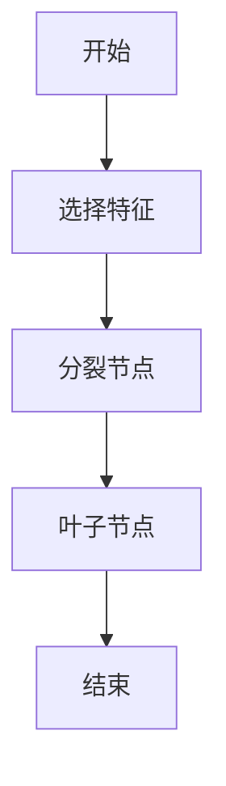
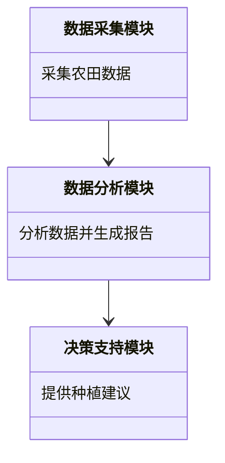

                 


# 农业AI Agent：智能种植与农场管理

## 关键词：
农业AI Agent，智能种植，农场管理，机器学习，物联网，决策支持系统

## 摘要：
农业AI Agent是一种利用人工智能技术辅助农业种植和农场管理的智能系统。通过整合物联网设备、机器学习算法和大数据分析，农业AI Agent能够实时监测农田环境、优化资源利用、预测作物生长情况，并提供精准的决策支持，从而提高农业生产效率和降低成本。本文将详细介绍农业AI Agent的核心概念、算法原理、系统架构以及实际应用案例，帮助读者全面理解这一技术在现代农业中的重要作用。

---

# 目录

1. 农业AI Agent的背景与现状  
   1.1 农业AI Agent的起源与发展  
   1.2 农业AI Agent的定义与特点  
   1.3 农业AI Agent的应用场景  
   1.4 农业AI Agent的未来发展  

2. 农业AI Agent的核心概念与原理  
   2.1 农业种植中的关键问题  
   2.2 农业AI Agent的核心原理  
   2.3 农业AI Agent的算法原理  
   2.4 农业AI Agent的数学模型  

3. 农业AI Agent的系统架构设计  
   3.1 系统功能设计  
   3.2 系统架构图  
   3.3 系统接口设计  

4. 农业AI Agent的项目实战  
   4.1 环境安装与数据采集  
   4.2 核心代码实现  
   4.3 实际案例分析  

5. 农业AI Agent的总结与展望  
   5.1 本章小结  
   5.2 未来发展方向  

---

# 第1章 农业AI Agent的背景与现状

## 1.1 农业AI Agent的起源与发展

农业AI Agent的概念起源于20世纪末的人工智能研究，随着物联网技术的发展，农业AI Agent逐渐从理论走向实践。近年来，随着深度学习和自然语言处理技术的进步，农业AI Agent的应用范围不断扩大，从简单的数据收集扩展到智能决策支持。

## 1.2 农业AI Agent的定义与特点

农业AI Agent是一种基于人工智能技术的智能系统，能够通过传感器、摄像头等设备实时采集农田数据，并利用机器学习算法进行分析，提供种植建议和资源优化配置。其特点包括实时性、动态性和智能化。

## 1.3 农业AI Agent的应用场景

农业AI Agent广泛应用于精准种植、资源优化配置和数据智能分析等领域。例如，通过AI Agent可以实现精准灌溉、病虫害预测和市场趋势分析。

## 1.4 农业AI Agent的未来发展

随着技术的进步，农业AI Agent将更加智能化和普及化。未来发展方向包括算法优化、数据隐私保护和跨平台整合。

---

# 第2章 农业AI Agent的核心概念与原理

## 2.1 农业种植中的关键问题

传统农业种植面临资源浪费、效率低下和预测不准等问题。AI Agent可以通过数据驱动的方式解决这些问题。

## 2.2 农业AI Agent的核心原理

农业AI Agent通过数据采集、分析和决策支持实现智能化管理。其核心原理包括数据处理、特征提取和模型训练。

## 2.3 农业AI Agent的算法原理

常用的算法包括决策树和随机森林。通过mermaid图展示算法流程：



## 2.4 农业AI Agent的数学模型

决策树的数学模型为：

$$ \text{决策树的结构} = \sum_{i=1}^{n} \text{特征}_i \times \text{权重}_i $$

---

# 第3章 农业AI Agent的系统架构设计

## 3.1 系统功能设计

农业AI Agent系统包括数据采集、分析、决策支持等功能。通过类图展示各模块关系：



## 3.2 系统架构图

系统架构包括前端、后端和数据库：

```mermaid
archi
    actor Farmer
    actor System
    actor Database
    actor Output
    Farmer --> System: 提供输入
    System --> Database: 存储数据
    Database --> System: 提供反馈
    System --> Output: 生成输出
```

## 3.3 系统接口设计

系统接口包括数据采集接口和决策输出接口：

```mermaid
sequence
    Farmer -> System: 发送数据请求
    System -> Database: 查询数据
    Database --> System: 返回数据
    System -> Output: 生成决策
    Output --> Farmer: 提供建议
```

---

# 第4章 农业AI Agent的项目实战

## 4.1 环境安装与数据采集

安装Python和传感器设备，开始数据采集。

## 4.2 核心代码实现

展示数据处理和决策支持的代码：

```python
# 数据处理模块
def process_data(data):
    # 数据预处理
    return processed_data

# 决策支持模块
def generate_recommendation(processed_data):
    # 使用机器学习模型生成建议
    return recommendation
```

## 4.3 实际案例分析

以葡萄种植场为例，分析AI Agent如何优化种植过程，降低成本。

---

# 第5章 农业AI Agent的总结与展望

## 5.1 本章小结

农业AI Agent通过智能化管理，显著提升了农业生产效率。

## 5.2 未来发展方向

未来将更加注重算法优化和数据隐私保护，推动农业智能化。

---

通过以上章节的详细讲解，我们全面了解了农业AI Agent的核心概念、算法原理和实际应用。希望本文能为农业智能化提供有价值的参考。

