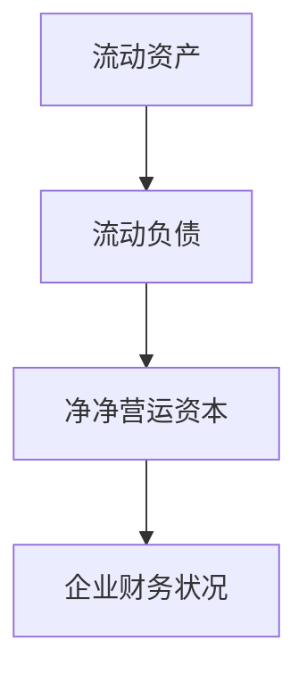
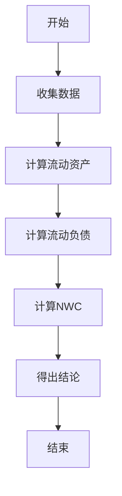

                 


# 净净营运资本比率在股票筛选中的应用

> 关键词：净净营运资本比率，股票筛选，财务指标，流动性分析，投资策略

> 摘要：本文深入探讨了净净营运资本比率（Net Working Capital，NWC）在股票筛选中的应用，通过详细分析其计算方法、核心概念、系统架构及实际案例，展示了如何利用NWC评估企业的财务健康状况，指导投资决策。文章内容涵盖理论与实践，帮助投资者有效筛选出具备良好流动性和偿债能力的优质股票。

---

## 第一部分：净净营运资本比率概述

### 第1章：净净营运资本比率的定义与意义

#### 1.1 净净营运资本比率的定义

**净净营运资本比率（Net Working Capital，NWC）**是衡量企业短期偿债能力和流动性的重要财务指标，计算公式为：

$$\text{NWC} = \text{流动资产} - \text{流动负债}$$

其中，流动资产包括现金、应收账款、存货等，流动负债包括应付账款、短期借款等。

**意义**：NWC反映了企业在不依赖外部融资的情况下，偿还短期债务的能力。正值表明企业有足够的流动资产覆盖流动负债，负值则表示企业可能面临短期偿债压力。

#### 1.2 净净营运资本比率与企业财务健康的关系

- **短期偿债能力**：NWC为正意味着企业具备偿还短期债务的能力，有助于降低流动性风险。
- **流动性与营运能力**：合理的NWC值表明企业在维持日常运营和偿债之间取得了平衡，有助于提升整体财务健康状况。
- **企业价值影响**：较高的NWC可能意味着企业有更多的流动资产，但过高的NWC可能暗示资产利用效率低下，而过低的NWC可能增加财务风险。

### 第2章：净净营运资本比率在股票筛选中的应用背景

#### 2.1 股票筛选的基本概念

股票筛选是投资者根据特定标准，从众多股票中挑选出具有投资价值的过程。常用的方法包括基本面分析、技术分析等，而财务指标是基本面分析的核心工具之一。

#### 2.2 净净营运资本比率的独特优势

与其他财务指标相比，NWC的优势在于其能够直接反映企业的短期偿债能力和流动性状况。例如，与速动比率相比，NWC不仅考虑了流动资产，还减去了流动负债，更能准确评估企业的净流动资产情况。

---

## 第二部分：净净营运资本比率的核心概念与联系

### 第3章：净净营运资本比率的原理与计算

#### 3.1 净净营运资本比率的计算公式

- **流动资产**：包括现金、应收账款、存货等，计算公式为：
$$\text{流动资产} = \text{现金} + \text{应收账款} + \text{存货}$$

- **流动负债**：包括应付账款、短期借款等，计算公式为：
$$\text{流动负债} = \text{应付账款} + \text{短期借款}$$

- **净净营运资本比率**：
$$\text{NWC} = \text{流动资产} - \text{流动负债}$$

#### 3.2 净净营运资本比率的属性特征对比

以下表格展示了NWC与其他相关财务指标的对比：

| 指标       | 流动性 | 周转性 | 风险性 |
|------------|--------|--------|--------|
| NWC        | 高     | 高     | 中     |
| 速动比率    | 高     | 中     | 低     |
| 资产负债率  | 中     | 中     | 高     |

### 第4章：净净营运资本比率的实体关系分析

#### 4.1 实体关系图



---

## 第三部分：净净营运资本比率的系统分析与架构设计

### 第5章：算法原理

#### 5.1 算法流程图



#### 5.2 核心代码实现

```python
def calculate_nwc(current_assets, current_liabilities):
    return current_assets - current_liabilities

# 示例数据
current_assets = 500000  # 流动资产（单位：元）
current_liabilities = 300000  # 流动负债（单位：元）

nwc = calculate_nwc(current_assets, current_liabilities)
print(f"净净营运资本：{nwc} 元")
```

---

## 第四部分：项目实战

### 第6章：项目实战

#### 6.1 环境安装

- **工具**：Python、Pandas、Matplotlib
- **数据来源**：股票财务数据（如Yahoo Finance）

#### 6.2 核心代码实现

```python
import pandas as pd
import requests

def get_stock_data(ticker):
    url = f"https://query1.finance.yahoo.com/...{ticker}"
    response = requests.get(url)
    data = response.json()
    return data

def calculate_nwc(data):
    current_assets = data['current_assets']
    current_liabilities = data['current_liabilities']
    return current_assets - current_liabilities

# 示例分析
ticker = "AAPL"
data = get_stock_data(ticker)
nwc = calculate_nwc(data)
print(f"{ticker} 的净净营运资本：{nwc}亿美元")
```

#### 6.3 实际案例分析

以苹果公司为例，假设其流动资产为800亿美元，流动负债为400亿美元，则NWC为400亿美元，表明公司具备较强的短期偿债能力。

---

## 第五部分：最佳实践

### 第7章：总结与展望

#### 7.1 小结

本文详细探讨了净净营运资本比率在股票筛选中的应用，通过理论分析和实际案例，展示了其在评估企业财务健康状况中的重要性。

#### 7.2 注意事项

- 数据准确性：确保使用可靠的数据源。
- 结合其他指标：单独使用NWC可能不够全面，建议结合其他财务指标进行综合分析。
- 行业差异：不同行业的NWC标准可能不同，需根据行业特点调整筛选标准。

#### 7.3 拓展阅读

建议进一步研究其他财务指标如ROE、ROA等，以及如何将它们与NWC结合使用，以提升股票筛选的准确性。

---

通过以上结构，读者可以系统地了解净净营运资本比率的计算方法、应用价值及实际操作步骤，从而在股票筛选中做出更明智的投资决策。

