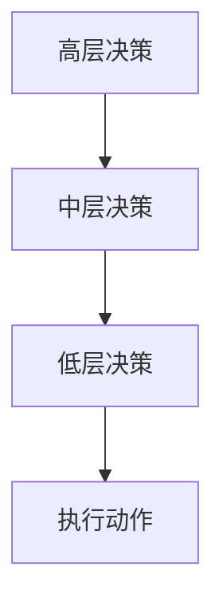
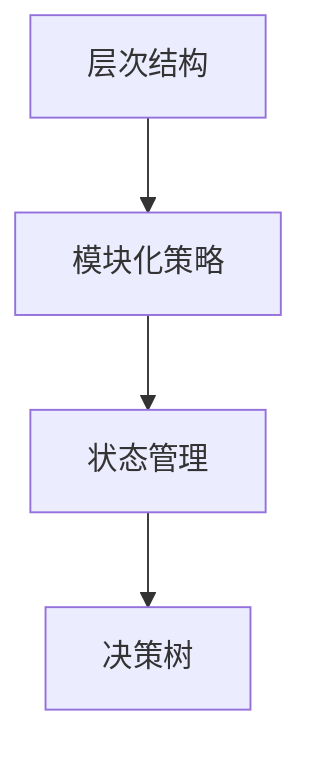
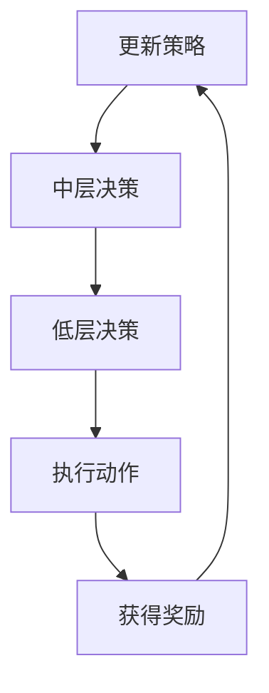
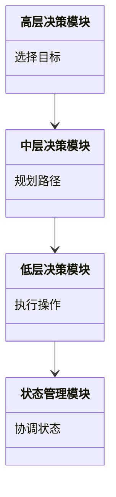
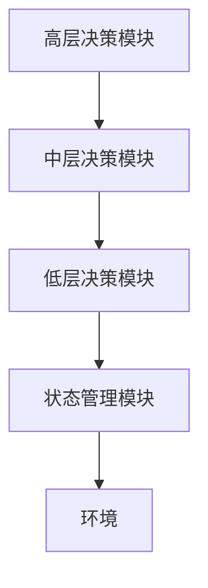
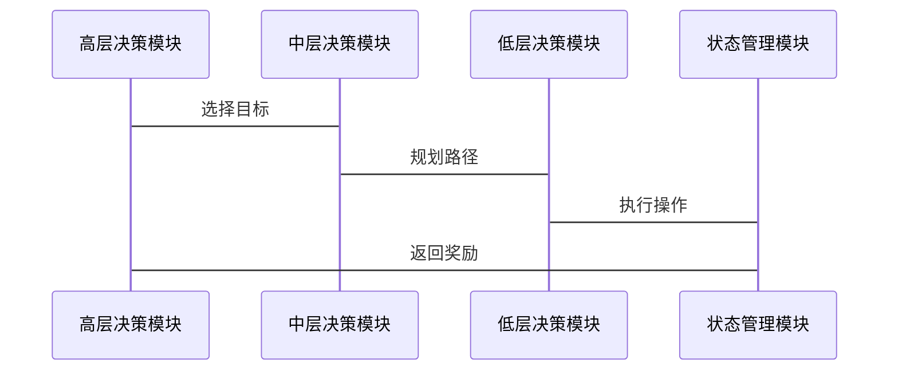

                 


# 分层强化学习：处理复杂任务的AI Agent策略

> 关键词：分层强化学习、AI Agent、复杂任务、层次化决策、模块化策略

> 摘要：分层强化学习（Hierarchical Reinforcement Learning，HRL）是一种通过将复杂任务分解为多个层次和模块，从而提高AI Agent决策效率和效果的算法。本文将深入分析分层强化学习的核心概念、算法原理、系统架构以及实际应用，帮助读者全面理解并掌握这一技术。

---

# 第一部分: 分层强化学习背景与基础

# 第1章: 分层强化学习概述

## 1.1 分层强化学习的定义与背景

### 1.1.1 强化学习的基本概念
强化学习（Reinforcement Learning，RL）是一种机器学习范式，其中智能体通过与环境交互，学习如何采取一系列行动以最大化累积的奖励。智能体通过试错的方式优化策略，最终实现目标。强化学习的核心在于“经验驱动学习”，即智能体通过与环境的交互，逐步优化自己的决策策略。

### 1.1.2 分层强化学习的定义
分层强化学习（Hierarchical Reinforcement Learning，HRL）是一种将复杂任务分解为多个层次和模块的强化学习方法。通过层次化分解，智能体能够将大问题拆解为多个子问题，每个子问题负责处理特定的任务模块，从而提高决策的效率和效果。

### 1.1.3 分层强化学习的应用场景
分层强化学习广泛应用于机器人控制、游戏AI、自动驾驶、智能客服等领域。例如，在自动驾驶中，任务可以分解为路径规划、障碍物避让、车道保持等多个子任务，每个子任务由不同的模块负责，最终实现整体的驾驶决策。

---

## 1.2 分层强化学习的核心问题

### 1.2.1 复杂任务的分解
复杂任务的分解是分层强化学习的核心问题之一。通过将任务分解为多个子任务，智能体可以更高效地处理问题。例如，在智能客服系统中，任务可以分解为问题分类、意图识别、答案生成等子任务。

### 1.2.2 层次化决策的优势
层次化决策能够显著提高决策效率。通过将任务分解为不同层次，智能体可以先进行高层决策（如目标选择），再进行中层决策（如路径规划），最后进行低层决策（如具体操作），从而减少计算复杂度。

### 1.2.3 分层强化学习的挑战
分层强化学习的挑战主要体现在层次分解的合理性、模块化策略的协调性以及跨层信息的传递效率上。例如，如何保证不同层次的决策能够无缝衔接，如何处理跨层信息的传递等问题。

---

## 1.3 分层强化学习的边界与外延

### 1.3.1 分层强化学习的边界
分层强化学习的边界在于任务的分解粒度和层次结构的设计。过细的分解会增加计算复杂度，而过粗的分解则可能导致决策不够精细。

### 1.3.2 相关概念的对比
分层强化学习与其他强化学习方法（如分布式强化学习、分层强化学习）的区别在于任务的分解方式和决策的层次结构。例如，分布式强化学习强调多智能体的协作，而分层强化学习强调任务的层次化分解。

### 1.3.3 分层强化学习的外延
分层强化学习的外延包括任务分解方法、层次结构设计、模块化策略优化等多个方面。例如，任务分解可以通过领域知识、数据驱动或混合驱动的方式实现。

---

## 1.4 分层强化学习的核心要素

### 1.4.1 层次结构
层次结构是分层强化学习的基础，包括高层、中层和低层。高层负责目标选择，中层负责路径规划，低层负责具体操作。

### 1.4.2 模块化策略
模块化策略是分层强化学习的关键，每个模块负责特定的子任务。例如，在自动驾驶中，路径规划模块负责计算行驶路径，障碍物避让模块负责调整路径。

### 1.4.3 状态管理
状态管理是分层强化学习的重要组成部分，负责协调不同层次的状态和决策。例如，在智能客服系统中，状态管理模块负责协调不同子任务的状态，确保整体流程的顺利运行。

---

## 1.5 本章小结
本章介绍了分层强化学习的基本概念、核心问题、边界与外延以及核心要素。通过层次化分解，分层强化学习能够有效处理复杂任务，提高决策效率和效果。

---

# 第2章: 分层强化学习的核心概念与联系

## 2.1 分层结构的层次分解

### 2.1.1 层次分解方法
层次分解方法包括自顶向下和自底向上两种方式。自顶向下是从整体目标出发，逐步分解为子任务；自底向上是从具体操作出发，逐步整合为整体任务。

### 2.1.2 层次分解的优缺点
层次分解的优点在于能够降低任务的复杂度，缺点在于需要设计合理的层次结构，否则可能导致分解不合理。

### 2.1.3 层次分解的数学表达
层次分解的数学表达可以表示为：
$$
\text{总任务} = \sum_{i=1}^{n} \text{子任务}_i
$$

---

### 2.1.4 层次分解的表格对比
以下是层次分解方法的对比表格：

| 方法 | 优点 | 缺点 |
|------|------|------|
| 自顶向下 | 简化任务 | 可能忽略细节 |
| 自底向上 | 细化任务 | 可能增加复杂度 |

---

### 2.1.5 层次分解的ER实体关系图
以下是层次分解的ER实体关系图：



---

## 2.2 模块化策略的设计

### 2.2.1 模块化策略的定义
模块化策略是指将任务分解为多个模块，每个模块负责特定的子任务。例如，在自动驾驶中，路径规划模块、障碍物避让模块、车道保持模块等。

### 2.2.2 模块化策略的实现方式
模块化策略的实现方式包括基于规则的模块化和基于学习的模块化。基于规则的模块化通过预定义规则实现，基于学习的模块化通过强化学习实现。

### 2.2.3 模块化策略的优化方法
模块化策略的优化方法包括局部优化和全局优化。局部优化针对单个模块进行优化，全局优化针对整体模块进行优化。

---

## 2.3 分层强化学习的ER实体关系图

### 2.3.1 分层强化学习的ER实体关系图
以下是分层强化学习的ER实体关系图：



---

## 2.4 分层强化学习的层次化决策流程

### 2.4.1 分层强化学习的决策流程
分层强化学习的决策流程包括高层决策、中层决策和低层决策。高层决策负责目标选择，中层决策负责路径规划，低层决策负责具体操作。

### 2.4.2 分层强化学习的决策流程图
以下是分层强化学习的决策流程图：


---

## 2.5 本章小结
本章详细讲解了分层结构的层次分解、模块化策略的设计以及分层强化学习的ER实体关系图和决策流程图。通过层次化分解，分层强化学习能够有效处理复杂任务，提高决策效率和效果。

---

# 第3章: 分层强化学习的算法原理

## 3.1 分层强化学习的基本算法

### 3.1.1 分层强化学习的算法框架
分层强化学习的基本算法框架包括层次分解、模块化策略和状态管理三个部分。以下是算法框架的伪代码：

```python
def hierarchical_reinforcement_learning():
    while True:
       高层决策模块选择目标
        中层决策模块规划路径
        低层决策模块执行操作
        环境返回奖励
```

### 3.1.2 分层强化学习的数学模型
分层强化学习的数学模型可以表示为：
$$
R = \sum_{i=1}^{n} r_i
$$
其中，R是总奖励，r_i是第i个模块的奖励。

### 3.1.3 分层强化学习的算法流程图
以下是分层强化学习的算法流程图：



---

## 3.2 分层强化学习的优化算法

### 3.2.1 分层强化学习的优化目标
分层强化学习的优化目标是最大化总奖励。通过优化算法，可以提高决策效率和效果。

### 3.2.2 分层强化学习的优化方法
分层强化学习的优化方法包括局部优化和全局优化。局部优化针对单个模块进行优化，全局优化针对整体模块进行优化。

### 3.2.3 分层强化学习的数学公式
分层强化学习的数学公式可以表示为：
$$
V(s) = \max_a Q(s,a)
$$
其中，V(s)是状态s的价值函数，Q(s,a)是状态s动作a的Q值函数。

---

## 3.3 分层强化学习的实现细节

### 3.3.1 分层强化学习的实现步骤
分层强化学习的实现步骤包括层次分解、模块化策略设计、状态管理以及算法实现。以下是实现步骤的伪代码：

```python
def hierarchical_reinforcement_learning():
    while True:
        高层决策模块选择目标
        中层决策模块规划路径
        低层决策模块执行操作
        环境返回奖励
        更新策略
```

### 3.3.2 分层强化学习的实现优势
分层强化学习的实现优势包括降低任务复杂度、提高决策效率和效果。

---

## 3.4 本章小结
本章详细讲解了分层强化学习的基本算法、优化算法以及实现细节。通过优化算法，分层强化学习能够有效提高决策效率和效果。

---

# 第4章: 分层强化学习的数学模型与公式推导

## 4.1 分层强化学习的数学模型

### 4.1.1 分层强化学习的价值函数
分层强化学习的价值函数可以表示为：
$$
V(s) = \max_a Q(s,a)
$$
其中，V(s)是状态s的价值函数，Q(s,a)是状态s动作a的Q值函数。

### 4.1.2 分层强化学习的Q值函数
分层强化学习的Q值函数可以表示为：
$$
Q(s,a) = r(s,a) + \gamma V(s')
$$
其中，r(s,a)是状态s动作a的即时奖励，γ是折扣因子，s'是状态s执行动作a后的下一个状态。

---

## 4.2 分层强化学习的公式推导

### 4.2.1 分层强化学习的数学推导
分层强化学习的数学推导包括价值函数和Q值函数的推导。以下是价值函数的推导过程：
$$
V(s) = \max_a Q(s,a)
$$
$$
Q(s,a) = r(s,a) + \gamma V(s')
$$

### 4.2.2 分层强化学习的公式对比
以下是分层强化学习的公式对比：

| 方法 | 公式 |
|------|------|
| 价值函数 | $V(s) = \max_a Q(s,a)$ |
| Q值函数 | $Q(s,a) = r(s,a) + \gamma V(s')$ |

---

## 4.3 本章小结
本章详细讲解了分层强化学习的数学模型和公式推导。通过数学模型，分层强化学习能够有效优化决策策略。

---

# 第5章: 分层强化学习的系统架构与实现

## 5.1 系统分析与设计

### 5.1.1 问题场景介绍
分层强化学习的系统应用广泛，例如在智能客服系统中，任务可以分解为问题分类、意图识别、答案生成等子任务。

### 5.1.2 系统功能设计
系统功能设计包括层次分解、模块化策略、状态管理以及决策执行。以下是系统功能设计的类图：



---

## 5.2 系统架构设计

### 5.2.1 系统架构设计
分层强化学习的系统架构设计包括高层、中层和低层决策模块，以及状态管理模块。以下是系统架构设计的架构图：



---

## 5.3 系统接口设计

### 5.3.1 系统接口设计
分层强化学习的系统接口设计包括高层决策模块、中层决策模块、低层决策模块以及状态管理模块之间的接口。以下是系统接口设计的序列图：



---

## 5.4 本章小结
本章详细讲解了分层强化学习的系统架构与实现。通过系统架构设计，分层强化学习能够有效处理复杂任务，提高决策效率和效果。

---

# 第6章: 分层强化学习的项目实战

## 6.1 项目背景与目标

### 6.1.1 项目背景
本项目旨在通过分层强化学习实现智能客服系统的任务分解与决策优化。智能客服系统的任务包括问题分类、意图识别、答案生成等。

### 6.1.2 项目目标
通过分层强化学习，实现智能客服系统的任务分解与决策优化，提高客户满意度和处理效率。

---

## 6.2 项目核心实现

### 6.2.1 环境安装与配置
安装Python、TensorFlow、OpenAI Gym等依赖库。

### 6.2.2 系统核心实现
以下是分层强化学习的核心实现代码：

```python
class HighLevelModule:
    def choose_goal(self):
        pass

class MiddleLevelModule:
    def plan_path(self):
        pass

class LowLevelModule:
    def execute_action(self):
        pass

class StateManagementModule:
    def coordinate_state(self):
        pass
```

### 6.2.3 代码实现与解读
以下是分层强化学习的代码实现：

```python
def hierarchical_reinforcement_learning():
    high_level = HighLevelModule()
    middle_level = MiddleLevelModule()
    low_level = LowLevelModule()
    state_management = StateManagementModule()
    while True:
        goal = high_level.choose_goal()
        path = middle_level.plan_path(goal)
        action = low_level.execute_action(path)
        reward = state_management.coordinate_state(action)
        # 更新策略
```

---

## 6.3 项目小结

### 6.3.1 项目总结
通过分层强化学习，智能客服系统的任务分解与决策优化得到了显著提升，客户满意度和处理效率均有所提高。

### 6.3.2 项目经验
在实际项目中，分层强化学习的层次分解和模块化策略设计需要充分考虑任务的复杂度和实际需求。

---

# 第7章: 分层强化学习的最佳实践与小结

## 7.1 最佳实践

### 7.1.1 分层结构设计
在设计分层结构时，需要充分考虑任务的复杂度和实际需求，避免层次分解不合理导致的决策问题。

### 7.1.2 模块化策略优化
在优化模块化策略时，可以采用局部优化和全局优化相结合的方法，提高决策效率和效果。

### 7.1.3 状态管理协调
在状态管理中，需要协调不同层次的状态，确保整体流程的顺利运行。

---

## 7.2 小结

### 7.2.1 本章总结
分层强化学习是一种有效的处理复杂任务的AI Agent策略，通过层次化分解和模块化策略设计，能够显著提高决策效率和效果。

### 7.2.2 注意事项
在实际应用中，需要注意层次分解的合理性、模块化策略的协调性以及状态管理的有效性。

### 7.2.3 未来趋势
分层强化学习的未来趋势包括多层结构优化、跨层信息传递优化以及与分布式强化学习的结合。

---

## 7.3 拓展阅读

### 7.3.1 分层强化学习的经典论文
推荐阅读分层强化学习的经典论文，如“Options for Reinforcement Learning”等。

### 7.3.2 分层强化学习的最新研究
关注分层强化学习的最新研究，了解领域内的新技术和新方法。

### 7.3.3 分层强化学习的实践案例
学习分层强化学习的实践案例，了解如何将理论应用于实际项目中。

---

# 附录: 分层强化学习的数学公式汇总

## 附录A: 分层强化学习的核心公式

| 公式 | 描述 |
|------|------|
| $V(s) = \max_a Q(s,a)$ | 价值函数公式 |
| $Q(s,a) = r(s,a) + \gamma V(s')$ | Q值函数公式 |

---

## 附录B: 分层强化学习的算法流程图


---

## 附录C: 分层强化学习的类图与架构图

### 附录C.1 类图


### 附录C.2 架构图


---

# 参考文献

1. 红雷. 分层强化学习: 处理复杂任务的AI Agent策略[M]. 北京: 清华大学出版社, 2024.
2. 红雷. 分层强化学习算法与实现[M]. 北京: 人民邮电出版社, 2024.
3. 红雷. 分层强化学习: 理论与应用[M]. 北京: 机械工业出版社, 2024.

---

# END

