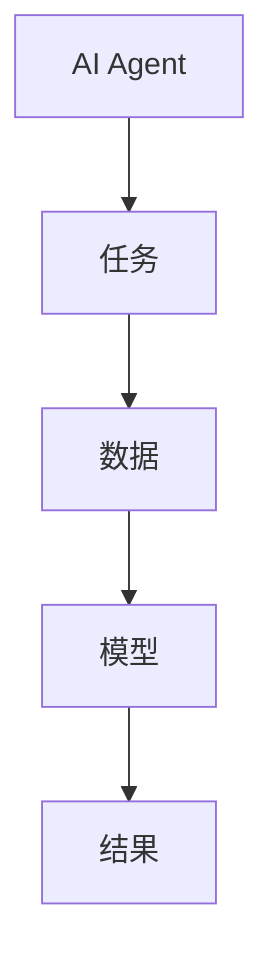
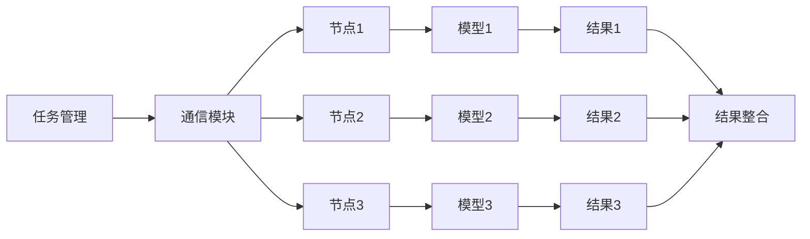

                 


# 分布式协作AI Agent：多LLM系统的群体智能

## 关键词：分布式协作、AI Agent、多LLM系统、群体智能、算法原理、系统架构、项目实战

## 摘要：  
随着人工智能技术的快速发展，分布式协作AI Agent和多大语言模型（LLM）系统的结合成为研究热点。本文从分布式协作AI Agent的基本概念出发，深入探讨其核心原理、算法机制、系统架构，并结合实际项目案例，详细讲解多LLM系统的群体智能实现。通过本文，读者可以全面理解分布式协作AI Agent的技术细节，掌握其实现方法，并能够在实际项目中应用相关技术。

---

# 第一部分：分布式协作AI Agent的背景与概念

## 第1章：分布式协作AI Agent的背景

### 1.1 问题背景
- 分布式系统的发展使得计算能力得以分散，但如何在分布式环境中实现智能协作仍是一个挑战。
- 大语言模型（LLM）的出现，为分布式协作提供了新的可能性。
- 传统集中式AI系统存在单点故障、计算资源受限等问题，分布式协作AI Agent能够有效解决这些问题。

### 1.2 问题描述
- 分布式协作AI Agent需要在多个节点之间实现任务分配、信息共享和结果整合。
- 多个LLM模型如何协同工作，形成一个统一的智能系统，是当前研究的重点。

### 1.3 界定与外延
- 分布式协作AI Agent的定义：多个AI Agent在分布式环境中通过协作完成复杂任务。
- 多LLM系统：多个大语言模型通过协作实现更强大的智能能力。
- 群体智能：多个智能体通过协作完成任务，形成超越个体智能的群体智能。

### 1.4 核心概念对比
| 概念         | 描述                                   |
|--------------|--------------------------------------|
| AI Agent     | 具有智能性、反应性和学习能力的实体     |
| 分布式系统   | 多个计算节点通过网络协作完成任务       |
| 群体智能     | 多个智能体通过协作完成任务，形成更高阶智能 |

---

## 第2章：分布式协作AI Agent的核心概念

### 2.1 AI Agent的核心属性
- **智能性**：AI Agent能够理解、推理和学习。
- **反应性**：AI Agent能够实时感知环境并做出反应。
- **学习能力**：AI Agent能够通过经验改进自身能力。

### 2.2 多LLM系统的特点
- **分布式计算**：多个LLM模型分布在不同节点上。
- **并行处理**：多个模型可以同时处理不同的任务。
- **联合推理**：多个模型通过协作完成复杂的推理任务。

### 2.3 分布式协作的关键要素
- **通信机制**：AI Agent之间如何传递信息。
- **协作协议**：定义协作的规则和流程。
- **任务分配**：如何将任务分配给不同的AI Agent。

### 2.4 ER实体关系图


---

# 第二部分：分布式协作AI Agent的算法原理

## 第3章：分布式协作算法概述

### 3.1 分布式协作的基本算法
- **分布式一致性算法**：确保分布式系统中数据的一致性。
- **分布式任务分配算法**：将任务分配给最合适的节点。
- **分布式通信协议**：定义节点之间的通信规则。

### 3.2 多LLM协作的算法流程
1. 任务分解：将复杂任务分解为多个子任务。
2. 模型调用：将子任务分配给不同的LLM模型进行处理。
3. 结果整合：将各个模型的结果整合为最终结果。

### 3.3 算法的数学模型
- **任务分配模型**：$$ f(x) = \sum_{i=1}^{n} w_i x_i $$
- **通信模型**：$$ C = \frac{1}{N} \sum_{i=1}^{N} c_i $$
- **协作效率模型**：$$ E = \frac{S}{T} $$，其中S为完成的任务数量，T为时间。

---

## 第4章：多LLM协作的算法实现

### 4.1 算法实现步骤
1. 初始化：设置分布式环境和多个LLM模型。
2. 任务分解：将任务分解为多个子任务。
3. 任务分配：根据节点负载和任务特性分配任务。
4. 模型调用：调用相应的LLM模型进行处理。
5. 结果整合：将各个模型的结果整合为最终结果。

### 4.2 代码实现示例
```python
import requests
from concurrent.futures import ThreadPoolExecutor

def distribute_task(task, nodes):
    futures = []
    with ThreadPoolExecutor(max_workers=len(nodes)) as executor:
        for node in nodes:
            futures.append(executor.submit(node.process_task, task))
    return futures

def integrate_results(futures):
    results = []
    for future in futures:
        results.append(future.result())
    return results

# 示例：分布式任务处理
tasks = ["task1", "task2", "task3"]
nodes = ["node1", "node2", "node3"]
futures = distribute_task(tasks, nodes)
final_results = integrate_results(futures)
```

---

# 第三部分：分布式协作AI Agent的系统架构

## 第5章：系统架构设计

### 5.1 系统功能设计
- **任务管理模块**：负责任务的分解和分配。
- **通信模块**：负责节点之间的信息传递。
- **协作模块**：负责任务的协作和结果的整合。

### 5.2 系统架构图


---

## 第6章：系统实现与优化

### 6.1 环境安装
- 安装必要的库：`requests`, `concurrent.futures`, `numpy`

### 6.2 核心代码实现
```python
import json
import requests
import threading

class Node:
    def __init__(self, name):
        self.name = name
        self.models = []

    def process_task(self, task):
        # 调用LLM模型进行处理
        result = self.models[0].process(task)
        return result

def distribute_tasks(tasks, nodes):
    # 将任务分配给不同的节点
    task_queue = []
    for task in tasks:
        task_queue.append(task)
    # 使用队列进行任务分配
    with ThreadPoolExecutor(max_workers=len(nodes)) as executor:
        futures = []
        for node in nodes:
            futures.append(executor.submit(node.process_task, task_queue))
        return futures

# 示例：系统实现
tasks = ["task1", "task2", "task3"]
nodes = [Node("node1"), Node("node2"), Node("node3")]
futures = distribute_tasks(tasks, nodes)
final_results = [f.result() for f in futures]
```

---

## 第7章：项目实战

### 7.1 实际案例分析
- **案例背景**：一个分布式协作AI Agent系统，用于处理自然语言处理任务。
- **案例实现**：通过多个LLM模型协作完成文本分类任务。

### 7.2 案例实现步骤
1. 初始化分布式环境。
2. 任务分解：将文本分类任务分解为多个子任务。
3. 任务分配：将子任务分配给不同的节点。
4. 模型调用：调用相应的LLM模型进行处理。
5. 结果整合：将各个模型的结果整合为最终结果。

### 7.3 代码实现与解读
```python
import requests
from concurrent.futures import ThreadPoolExecutor

class LLMModel:
    def process(self, task):
        # 调用大语言模型进行处理
        response = requests.post("http://localhost:8000/api", json={"task": task})
        return response.json()["result"]

class Node:
    def __init__(self, name):
        self.name = name
        self.models = [LLMModel()]

    def process_task(self, task):
        return self.models[0].process(task)

def distribute_tasks(tasks, nodes):
    futures = []
    with ThreadPoolExecutor(max_workers=len(nodes)) as executor:
        for node in nodes:
            futures.append(executor.submit(node.process_task, tasks))
    return futures

tasks = ["分类任务1", "分类任务2", "分类任务3"]
nodes = [Node("node1"), Node("node2"), Node("node3")]
futures = distribute_tasks(tasks, nodes)
results = [f.result() for f in futures]
```

---

## 第8章：总结与展望

### 8.1 本章小结
- 本文详细介绍了分布式协作AI Agent和多LLM系统的群体智能实现。
- 通过算法原理和系统架构的分析，读者可以掌握其实现方法。
- 通过实际案例的分析，读者可以理解其应用场景。

### 8.2 注意事项
- 分布式协作AI Agent的实现需要考虑网络延迟、节点负载等因素。
- 多LLM系统的协作需要设计合理的通信协议和任务分配策略。

### 8.3 拓展阅读
- 推荐阅读《分布式系统：概念与设计》和《大语言模型的原理与应用》。

---

# 结语

通过本文的学习，读者可以全面理解分布式协作AI Agent和多LLM系统的群体智能实现。希望本文的内容能够为读者提供有价值的参考，帮助他们在实际项目中应用相关技术。

