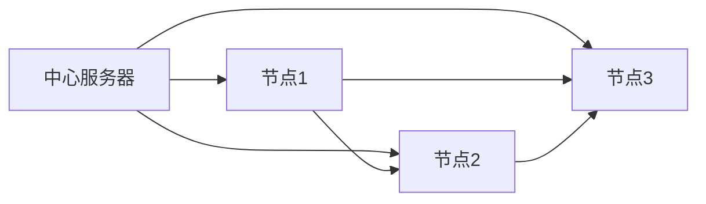
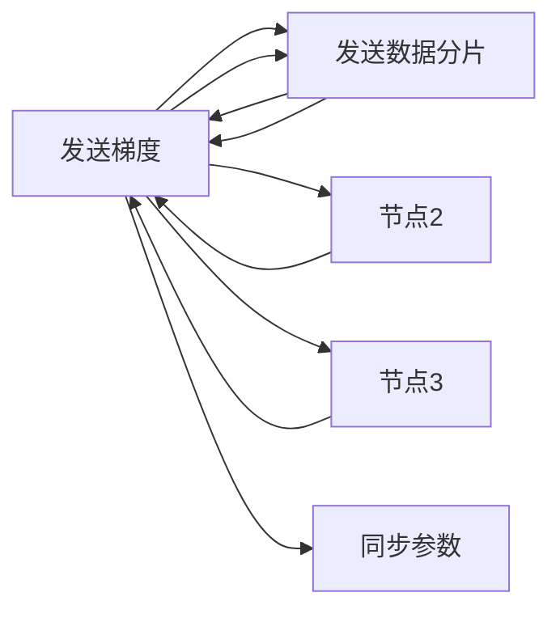

                 


# 分布式训练：加速大规模AI Agent的开发

## 关键词
分布式训练, AI Agent, 并行计算, 同步训练, 异步训练, 模型并行, 数据并行

## 摘要
本文深入探讨了分布式训练在加速大规模AI Agent开发中的关键作用。通过系统介绍分布式训练的核心概念、算法原理、系统架构设计、项目实战以及高级优化技巧，结合数学模型和实际案例分析，全面解析如何高效利用分布式训练技术提升AI模型的训练效率和性能。文章旨在为AI开发者和研究人员提供一份详尽的指导，帮助他们在实际项目中有效实施分布式训练策略。

---

## 第一部分：分布式训练基础

### 第1章：分布式训练概述

#### 1.1 分布式训练的背景与必要性

- 1.1.1 传统单机训练的局限性
  - 单机训练在处理大规模数据时效率低下，难以满足现代AI应用的需求。
  - 无法充分利用多台计算资源，导致资源浪费。

- 1.1.2 大规模数据处理的需求
  - AI模型的训练数据量呈指数级增长，单机训练难以处理。
  - 需要分布式训练来并行处理数据，提升训练速度。

- 1.1.3 分布式训练在AI开发中的重要性
  - 分布式训练是加速大规模AI模型开发的核心技术。
  - 通过并行计算，显著缩短训练时间，降低开发成本。

#### 1.2 分布式训练的核心概念

- 1.2.1 并行计算的基本原理
  - 并行计算通过分解任务，利用多台计算设备协同完成任务。
  - 分布式训练中的并行计算可以分为数据并行和模型并行。

- 1.2.2 分布式训练的三种模式
  - **数据并行**：将数据集分片，每个节点处理一部分数据。
  - **模型并行**：将模型参数分片，每个节点处理一部分参数。
  - **混合并行**：结合数据并行和模型并行的优势。

- 1.2.3 同步与异步训练的区别
  - **同步训练**：所有节点同时更新模型参数，保证一致性。
  - **异步训练**：节点可以异步更新参数，减少通信开销，但可能导致不一致性。

#### 1.3 分布式训练的实现基础

- 1.3.1 网络通信机制
  - 使用通信框架（如 MPI、Gloo、NCCL）实现节点间的参数同步。
  - 网络通信的效率直接影响分布式训练的性能。

- 1.3.2 分布式锁与同步机制
  - 使用锁机制保证多个节点对共享资源的互斥访问。
  - 分布式锁的实现需要考虑网络延迟和容错机制。

- 1.3.3 集群管理与资源分配
  - 集群管理框架（如 Kubernetes）用于动态分配计算资源。
  - 资源分配策略影响训练效率和成本。

### 第2章：分布式训练的核心概念与联系

#### 2.1 核心概念原理

- 2.1.1 并行计算的原理与分类
  - 并行计算通过分解任务，利用多核或多处理器同时处理。
  - 分类：数据并行、模型并行、混合并行。

- 2.1.2 同步与异步训练的优缺点对比
  - 同步训练：一致性高，但通信开销大。
  - 异步训练：通信开销小，但可能引入不一致性。

#### 2.2 核心概念属性特征对比表格

| 比较维度 | 同步训练 | 异步训练 |
|----------|----------|----------|
| 延迟     | 较高     | 较低     |
| 资源利用率 | 高       | 较低     |
| 一致性   | 高       | 较低     |

#### 2.3 ER实体关系图架构的Mermaid流程图


---

## 第二部分：分布式训练的算法原理

### 第3章：同步训练算法原理

#### 3.1 同步训练的核心算法

- 3.1.1 同步训练的流程
  1. 将数据集分片，分配给多个节点。
  2. 每个节点在本地计算梯度。
  3. 所有节点将梯度汇总，更新全局模型参数。
  4. 重复步骤，直到训练完成。

- 3.1.2 同步训练的数学模型

$$
\theta_{t+1} = \theta_t - \eta \cdot \frac{1}{n} \sum_{i=1}^{n} \nabla L_i
$$

其中：
- $\theta_t$ 表示第 $t$ 轮的模型参数。
- $\eta$ 表示学习率。
- $n$ 表示节点数量。
- $\nabla L_i$ 表示第 $i$ 个节点计算的梯度。

#### 3.2 同步训练的Mermaid流程图


#### 3.3 同步训练的Python代码示例

```python
import torch
import torch.distributed as dist

# 初始化分布式环境
torch.distributed.init_process_group("gloo", rank=0, world_size=2)

# 分数据分片
data = ...  # 数据集
data_rank = data.rank()

# 训练过程
for epoch in range(num_epochs):
    for batch in data_rank.batches():
        outputs = model(batch)
        loss = criterion(outputs, labels)
        loss.backward()
        # 同步更新参数
        with torch.no_grad():
            if dist.rank() == 0:
                # 节点0汇总梯度
                total_grad = sum(p.grad for p in model.parameters())
                # 更新全局参数
                for p in model.parameters():
                    p.grad = total_grad / dist.world_size()
        optimizer.step()
        dist.barrier()
```

---

### 第4章：异步训练算法原理

#### 4.1 异步训练的核心算法

- 4.1.1 异步训练的流程
  1. 数据分片，分配给多个节点。
  2. 每个节点异步计算梯度并更新本地参数。
  3. 定期同步各节点的参数，保证一致性。

- 4.1.2 异步训练的数学模型

$$
\theta_{t+1} = \theta_t - \eta \cdot \nabla L_i
$$

其中：
- $\theta_t$ 表示第 $t$ 轮的模型参数。
- $\eta$ 表示学习率。
- $\nabla L_i$ 表示第 $i$ 个节点计算的梯度。

#### 4.2 异步训练的Mermaid流程图


#### 4.3 异步训练的Python代码示例

```python
import torch
import torch.distributed as dist

# 初始化分布式环境
torch.distributed.init_process_group("gloo", rank=0, world_size=2)

# 分数据分片
data = ...  # 数据集
data_rank = data.rank()

# 异步训练过程
for epoch in range(num_epochs):
    for batch in data_rank.batches():
        outputs = model(batch)
        loss = criterion(outputs, labels)
        loss.backward()
        # 异步更新参数
        optimizer.step()
        dist.barrier()
```

---

## 第三部分：分布式训练的系统架构设计

### 第5章：分布式训练的系统架构

#### 5.1 系统架构设计

- **中心化架构**：所有节点通过中心服务器同步参数，适合小规模集群。
- **去中心化架构**：节点之间直接通信，适合大规模分布式环境。

#### 5.2 系统功能设计

- **数据分片**：将数据集分片，分配给各个节点。
- **模型同步**：定期同步各个节点的模型参数，保持一致性。
- **通信机制**：节点之间通过网络通信同步梯度或参数。

#### 5.3 系统架构图的Mermaid图



#### 5.4 系统接口设计

- **数据分片接口**：`split_data(data, num_nodes)`。
- **参数同步接口**：`synchronize_parameters(model, world_size)`。

#### 5.5 系统交互流程图的Mermaid图



---

## 第四部分：分布式训练的项目实战

### 第6章：分布式训练的项目实战

#### 6.1 项目背景与目标

- **项目背景**：训练一个大规模的图像分类模型。
- **项目目标**：利用分布式训练技术，加速模型训练过程。

#### 6.2 项目环境搭建

- **硬件环境**：多台GPU服务器，网络互联。
- **软件环境**：安装PyTorch、Distributed模块。

#### 6.3 分布式训练代码实现

```python
import torch
import torch.distributed as dist

# 初始化分布式环境
torch.distributed.init_process_group("gloo", rank=0, world_size=2)

# 数据分片
data = torch.randn(100, 10)
data_rank = data.rank()

# 模型定义
model = torch.nn.Linear(10, 5)
optimizer = torch.optim.SGD(model.parameters(), lr=0.01)

# 训练过程
for epoch in range(10):
    for batch in data_rank.batches():
        outputs = model(batch)
        loss = torch.nn.MSELoss()(outputs, batch)
        loss.backward()
        # 同步更新参数
        with torch.no_grad():
            if dist.rank() == 0:
                # 节点0汇总梯度
                total_grad = sum(p.grad for p in model.parameters())
                # 更新全局参数
                for p in model.parameters():
                    p.grad = total_grad / dist.world_size()
        optimizer.step()
        dist.barrier()
```

#### 6.4 项目小结

- 通过分布式训练，训练时间显著缩短。
- 分布式训练能够有效利用多台GPU的计算能力。
- 需要注意网络通信的延迟和带宽问题。

---

## 第五部分：分布式训练的高级主题与优化技巧

### 第7章：模型压缩与量化

#### 7.1 模型压缩技术

- **剪枝**：去除模型中冗余的参数。
- **知识蒸馏**：将大模型的知识迁移到小模型。

#### 7.2 模型量化技术

- **量化**：将模型参数从浮点数转换为低位整数，减少存储和计算开销。

#### 7.3 模型压缩与量化对分布式训练的影响

- 模型压缩和量化可以减少通信数据量，提升通信效率。

---

### 第8章：分布式训练与云计算、边缘计算的结合

#### 8.1 云计算中的分布式训练

- **云服务器集群**：利用云计算资源，构建分布式训练集群。
- **弹性伸缩**：根据训练任务动态调整计算资源。

#### 8.2 边缘计算中的分布式训练

- **边缘设备**：在边缘设备上进行数据预处理和特征提取。
- **模型部署**：将训练好的模型部署到边缘设备上，进行实时推理。

---

## 第六部分：分布式训练的最佳实践与未来展望

### 第9章：最佳实践

#### 9.1 分布式训练的注意事项

- **网络带宽**：确保节点之间的网络带宽充足，减少通信延迟。
- **资源分配**：合理分配计算资源，避免资源争抢。
- **模型选择**：根据任务需求选择合适的模型和训练策略。

#### 9.2 分布式训练的优化技巧

- **参数服务器模式**：使用参数服务器优化同步过程。
- **混合精度训练**：使用混合精度训练提升训练速度。

### 第10章：未来展望

#### 10.1 分布式训练的发展趋势

- **异构计算**：结合CPU、GPU等多种计算设备，提升计算效率。
- **智能调度算法**：开发智能任务调度算法，优化资源利用率。

#### 10.2 分布式训练与AI Agent的结合

- **实时协作**：分布式训练技术可以用于AI Agent的实时协作与决策。
- **多模态训练**：结合多种数据模态，提升AI Agent的感知和理解能力。

---

## 总结

通过本文的系统介绍，读者可以全面了解分布式训练的核心概念、算法原理、系统架构设计和实际应用案例。分布式训练技术在加速大规模AI Agent开发中的作用不可忽视，未来随着技术的不断发展，分布式训练将与AI Agent的结合更加紧密，推动人工智能技术的进一步发展。

