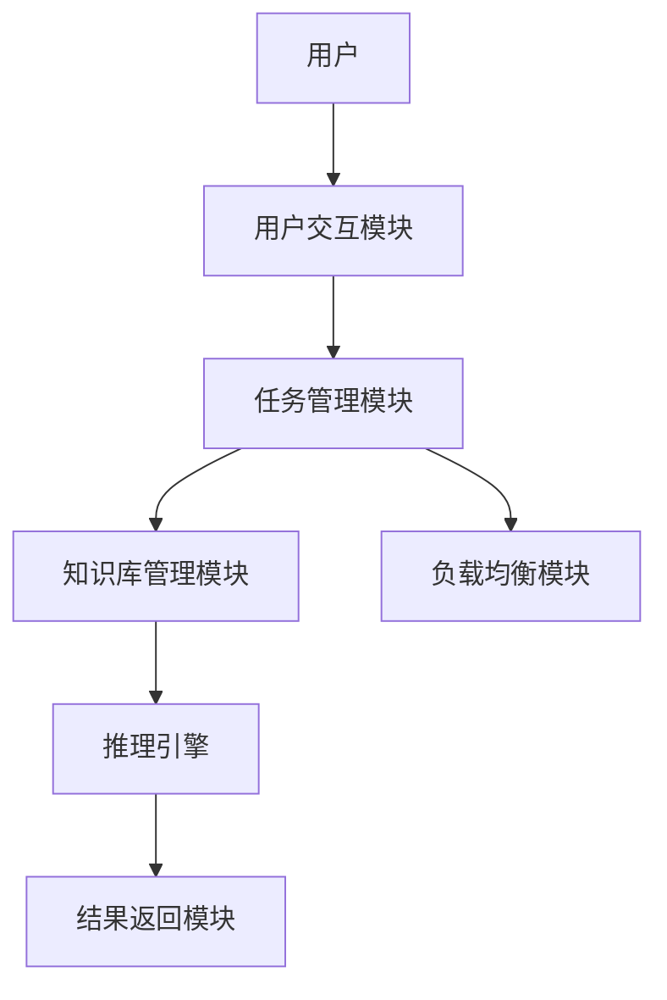
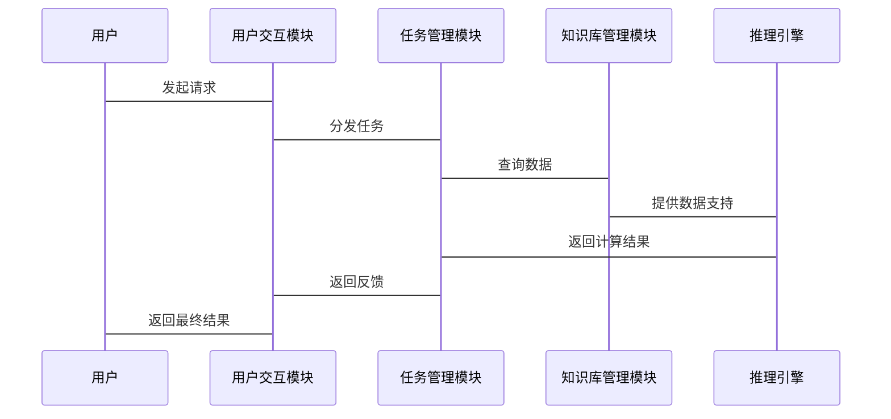

                 


---

# 第四章: 分布式部署的实现与优化

## 第4章: 分布式部署的实现与优化

### 4.1 分布式部署的实现流程

#### 4.1.1 部署前的准备工作
##### 4.1.1.1 环境搭建
- 安装必要的依赖工具，如Docker、Kubernetes等。
- 确保网络环境的稳定性和安全性。

##### 4.1.1.2 服务划分与容器化
- 将AI Agent系统划分为多个微服务模块。
- 使用Docker容器化每个服务，并构建镜像。

##### 4.1.1.3 服务发现与注册
- 使用Consul或Etcd等工具实现服务发现与注册。
- 配置服务间的自动发现机制。

#### 4.1.2 部署实施
##### 4.1.2.1 容器编排
- 使用Kubernetes或Docker Swarm进行容器编排。
- 配置Pod、Service和Deployment资源。

##### 4.1.2.2 负载均衡
- 配置反向代理（如Nginx）实现负载均衡。
- 调整权重和策略以优化流量分配。

##### 4.1.2.3 通信机制
- 使用gRPC或HTTP/2优化服务间通信。
- 实现消息队列（如RabbitMQ、Kafka）处理异步调用。

#### 4.1.3 启动与验证
- 启动所有服务并检查状态。
- 执行压力测试验证系统的可用性。

### 4.2 高可用性优化策略

#### 4.2.1 服务冗余
##### 4.2.1.1 多副本部署
- 为关键服务部署多个副本，确保故障切换。

##### 4.2.1.2 健康检查
- 配置自动健康检查机制，快速发现故障节点。
- 使用Liveness和Readiness探针确保服务状态。

#### 4.2.2 负载均衡优化
##### 4.2.2.1 动态权重分配
- 根据实时负载调整服务权重。
- 使用自适应算法优化流量分配。

##### 4.2.2.2 蓝绿部署
- 使用蓝绿部署策略实现无中断发布。
- 配置回滚机制应对发布失败。

#### 4.2.3 容错与恢复机制
##### 4.2.3.1 故障隔离
- 实现熔断机制，防止故障扩散。
- 配置限流策略，避免系统过载。

##### 4.2.3.2 故障恢复
- 自动触发恢复流程，如重启服务或拉起备用节点。
- 使用容灾方案确保数据的高可用性。

### 4.3 分布式部署中的监控与维护

#### 4.3.1 监控体系
##### 4.3.1.1 日志监控
- 集中收集和分析日志，快速定位问题。
- 使用ELK（Elasticsearch、Logstash、Kibana）实现日志管理。

##### 4.3.1.2 性能监控
- 使用Prometheus监控系统性能指标。
- 配置警报规则，及时发现异常。

#### 4.3.2 自动化运维
##### 4.3.2.1 CI/CD流程
- 实现自动化构建、测试和部署。
- 使用Jenkins或GitHub Actions管理CI/CD流程。

##### 4.3.2.2 滚动更新
- 使用滚动更新策略逐步替换旧版本服务。
- 配置版本回滚机制应对更新失败。

### 4.4 本章小结

---

# 第五章: 系统架构设计与实现

## 第5章: 系统架构设计与实现

### 5.1 系统功能设计

#### 5.1.1 功能模块划分
##### 5.1.1.1 用户交互模块
- 提供图形化界面或API接口供用户操作AI Agent。
- 支持多用户同时访问，确保系统性能。

##### 5.1.1.2 任务管理模块
- 负责任务的分派、跟踪和完成。
- 支持任务优先级管理，确保任务执行顺序合理。

##### 5.1.1.3 知识库管理模块
- 维护AI Agent的知识库，支持实时更新。
- 提供知识抽取、推理和生成功能。

##### 5.1.1.4 负载均衡模块
- 动态调整服务负载，确保系统高效运行。
- 支持多种负载均衡策略，如轮询、随机、加权。

#### 5.1.2 功能模块之间的交互关系
- 使用RESTful API或消息队列实现模块间的通信。
- 通过服务发现机制实现模块间的动态调用。

### 5.2 系统架构设计

#### 5.2.1 系统架构图


#### 5.2.2 数据流设计
- 用户请求通过用户交互模块进入系统。
- 用户交互模块将请求分发到任务管理模块。
- 任务管理模块调用知识库管理模块进行数据查询。
- 知识库管理模块调用推理引擎进行计算。
- 计算结果返回给结果返回模块，最终反馈给用户。

### 5.3 接口设计

#### 5.3.1 API接口定义
```markdown
### API接口定义
- GET /api/v1/task/status
  - 查询任务状态
- POST /api/v1/task/create
  - 创建新任务
- PUT /api/v1/task/update
  - 更新任务状态
```

#### 5.3.2 API接口实现
- 使用Spring Boot框架实现RESTful API。
- 配置API文档生成工具（如Swagger）便于开发者使用。

### 5.4 交互流程设计

#### 5.4.1 交互流程图


### 5.5 本章小结

---

# 第六章: 项目实战

## 第6章: 项目实战

### 6.1 项目背景与介绍

#### 6.1.1 项目背景
- 某企业需要构建一个高可用的AI Agent系统，用于内部流程自动化。
- 系统要求支持分布式部署，具备高可用性。

#### 6.1.2 项目目标
- 实现AI Agent系统的核心功能，包括任务分发、知识库管理、推理计算等。
- 确保系统在分布式环境下的可用性和扩展性。

### 6.2 环境搭建

#### 6.2.1 系统环境
- 操作系统：Linux Ubuntu 20.04
- JDK版本：1.8
- Python版本：3.8

#### 6.2.2 工具安装
- 安装Docker和Kubernetes相关组件。
- 安装Nginx作为反向代理服务器。
- 安装Prometheus和Grafana进行监控。

### 6.3 核心代码实现

#### 6.3.1 用户交互模块
```python
# 用户交互模块代码示例
from flask import Flask, request, jsonify

app = Flask(__name__)

@app.route('/api/v1/task/create', methods=['POST'])
def create_task():
    data = request.json
    # 处理任务创建逻辑
    return jsonify({'status': 'success', 'message': 'Task created successfully'})

if __name__ == '__main__':
    app.run(debug=True, port=5000)
```

#### 6.3.2 任务管理模块
```python
# 任务管理模块代码示例
import requests
from concurrent.futures import ThreadPoolExecutor

executor = ThreadPoolExecutor(max_workers=5)

def process_task(task_id):
    # 处理任务逻辑
    pass

@app.route('/api/v1/task/update', methods=['PUT'])
def update_task():
    task_id = request.json.get('task_id')
    future = executor.submit(process_task, task_id)
    return jsonify({'status': 'success', 'message': 'Task updated successfully'})
```

#### 6.3.3 知识库管理模块
```python
# 知识库管理模块代码示例
import elasticsearch

es = elasticsearch.Elasticsearch(hosts=[{'host': 'localhost', 'port': 9200}])

def search_knowledge(query):
    body = {
        "query": {
            "multi_match": {
                "query": query,
                "fields": ["title", "content"]
            }
        }
    }
    return es.search(index="knowledge_base", body=body)
```

### 6.4 案例分析与实现解读

#### 6.4.1 案例分析
- 某企业的AI Agent系统上线后，通过负载均衡实现了服务的高效分发。
- 使用Kubernetes进行容器编排，确保系统的高可用性。
- 通过监控工具实时监控系统性能，及时发现并解决问题。

#### 6.4.2 实现解读
- 用户交互模块实现了与用户的接口，接收请求并分发任务。
- 任务管理模块负责任务的创建、更新和查询，确保任务流程的顺利进行。
- 知识库管理模块利用Elasticsearch实现高效的全文检索，支持AI Agent的知识获取和处理。

### 6.5 本章小结

---

# 第七章: 总结与展望

## 第7章: 总结与展望

### 7.1 总结

#### 7.1.1 核心内容回顾
- 本文详细讲解了分布式部署与高可用AI Agent系统的构建过程。
- 介绍了分布式系统的基本概念、AI Agent系统的独特属性，以及高可用性的实现方法。
- 通过实际案例展示了如何在分布式环境中部署AI Agent系统，并确保其稳定性和高效性。

#### 7.1.2 突出优势
- 系统设计遵循高可用性原则，确保了在故障情况下的快速恢复。
- 通过负载均衡和冗余设计，提高了系统的资源利用率和性能。
- 实现了模块化设计，便于系统的扩展和维护。

### 7.2 展望

#### 7.2.1 系统优化方向
- 进一步优化容错机制，提高系统的抗故障能力。
- 引入自适应算法，实现动态负载均衡和资源分配。
- 增强系统的可扩展性，支持更大规模的部署需求。

#### 7.2.2 技术发展趋势
- 随着AI技术的不断进步，AI Agent系统将具备更强的智能性和自主性。
- 分布式系统的安全性需求将更加突出，需要引入更先进的安全防护措施。
- 高可用性技术将更加成熟，实现更高效的资源利用和系统性能。

### 7.3 最佳实践Tips
- 在设计分布式系统时，始终将高可用性作为核心目标。
- 选择合适的工具和技术栈，确保系统的可扩展性和可维护性。
- 定期进行系统监控和维护，及时发现和解决问题。

### 7.4 本章小结

---

# 关键词

- 分布式部署
- 高可用性
- AI Agent
- 容错机制
- 负载均衡

---

# 摘要

本文详细探讨了如何在分布式环境中构建高可用的AI Agent系统。通过分析分布式系统的特性、AI Agent的核心原理以及高可用性设计的原则，本文提供了从理论到实践的全面指导。重点介绍了分布式部署的实现流程、优化策略、系统架构设计以及实际项目中的应用。通过案例分析，本文展示了如何在实际场景中应用这些技术，确保系统的高效性和稳定性。最后，本文总结了当前的技术成果，并展望了未来的发展方向，为读者提供了宝贵的参考和启示。

