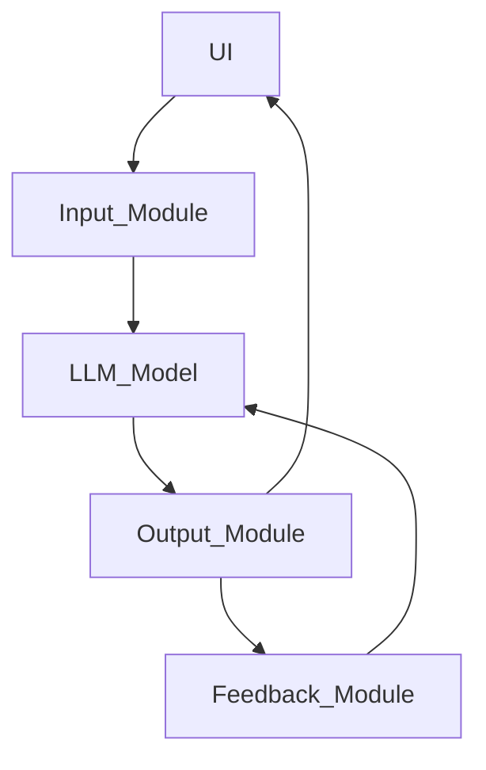

                 


# 创意写作AI Agent：LLM驱动的文学创作辅助系统

> 关键词：创意写作，AI Agent，大语言模型，LLM，文学创作，文本生成

> 摘要：本文探讨了如何利用大语言模型（LLM）构建一个智能的文学创作辅助系统，详细分析了创意写作AI Agent的背景、核心概念、算法原理、系统架构以及实际应用案例。通过本文，读者可以全面了解LLM在文学创作中的潜力，并掌握如何设计和实现一个高效的创意写作辅助系统。

---

## 第一部分: 创意写作AI Agent的背景与核心概念

### 第1章: 创意写作与AI Agent的结合

#### 1.1 创意写作的背景与挑战

创意写作是一种通过创造性的思维和技巧来生成文学作品的过程。然而，许多人在创作过程中会遇到以下挑战：

- **灵感枯竭**：创作者有时会因为缺乏灵感而停滞不前。
- **技术限制**：创作过程中需要不断调整语言、结构和风格，这对技术能力提出了较高要求。
- **时间效率**：创作是一项耗时的活动，尤其是在需要多次修改和优化的情况下。

AI Agent（智能代理）作为一种能够理解和执行任务的智能系统，可以辅助人类完成复杂的任务。将其应用于创意写作，可以帮助创作者克服上述挑战，提高创作效率和质量。

#### 1.2 AI Agent的基本概念

AI Agent是一种智能系统，能够感知环境、理解用户需求并执行相应操作以实现目标。在创意写作中，AI Agent可以作为辅助工具，帮助创作者生成文本、提供建议、优化语言等。

**核心功能**：
- **文本生成**：根据用户提供的主题或关键词，生成相关文本。
- **风格匹配**：根据用户指定的风格（如小说、诗歌、散文）生成符合要求的文本。
- **灵感激发**：通过分析用户输入的内容，提供创意建议或灵感。

### 第2章: 大语言模型（LLM）驱动的创意写作

#### 2.1 大语言模型的基本原理

大语言模型（LLM）是一种基于深度学习的自然语言处理模型，通常采用Transformer架构。其核心思想是通过自注意力机制捕捉文本中的长距离依赖关系，从而生成高质量的文本。

**Transformer模型结构**：
- **编码器**：将输入文本转换为高维向量表示。
- **解码器**：根据编码器输出生成目标文本。

#### 2.2 创意写作AI Agent的系统架构

创意写作AI Agent的系统架构包括以下几个模块：
- **用户输入模块**：接收用户的输入，如主题、风格等。
- **文本生成模块**：基于用户的输入生成文本。
- **反馈优化模块**：根据用户的反馈优化生成的文本。

---

## 第二部分: 创意写作AI Agent的核心算法原理

### 第3章: 大语言模型的训练与推理

#### 3.1 Transformer模型的结构与原理

Transformer模型由编码器和解码器组成。编码器将输入文本转换为上下文向量，解码器根据这些向量生成目标文本。

**自注意力机制**：
- 每个位置的输入会根据与其他位置的关系分配不同的权重。
- 通过计算权重矩阵，生成位置的表示。

**公式表示**：
- 查询（Q）：$Q = W_q X$
- 键（K）：$K = W_k X$
- 值（V）：$V = W_v X$
- 注意力权重：$A = \text{softmax}(\frac{QK^T}{\sqrt{d_k}})$
- 输出：$O = A V$

### 第4章: 创意写作AI Agent的算法实现

#### 4.1 基于LLM的文本生成算法

生成式AI的核心算法是基于解码器的生成过程。模型会逐步生成每个词，每个步骤都会根据当前的上下文调整生成概率。

**解码过程**：
- 初始化：生成一个随机的初始词。
- 循环：根据当前生成的词，预测下一个词的概率分布。
- 采样：从概率分布中采样下一个词。
- 终止条件：当生成特定的终止词（如“结束”）时，停止生成。

---

## 第三部分: 创意写作AI Agent的系统分析与架构设计

### 第5章: 系统功能设计与架构

#### 5.1 领域模型设计

**领域模型**：
- **用户输入**：用户提供的主题、风格、关键词等。
- **文本生成模块**：根据输入生成文本。
- **反馈优化模块**：根据用户反馈优化生成的文本。

#### 5.2 系统架构设计

**系统架构图**：



---

## 第四部分: 项目实战

### 第6章: 创意写作AI Agent的实现与案例分析

#### 6.1 环境安装

安装必要的库：
- `transformers`
- `torch`
- `numpy`

#### 6.2 核心代码实现

```python
from transformers import AutoModelForCausalLM, AutoTokenizer

model_name = "gpt2"
tokenizer = AutoTokenizer.from_pretrained(model_name)
model = AutoModelForCausalLM.from_pretrained(model_name)

def generate_text(prompt, max_length=50):
    inputs = tokenizer.encode(prompt, return_tensors="pt")
    outputs = model.generate(inputs, max_length=max_length, do_sample=True)
    return tokenizer.decode(outputs[0], skip_special_tokens=True)

# 示例：生成小说开头
prompt = "在一个寒冷的冬夜，..."
result = generate_text(prompt)
print(result)
```

#### 6.3 案例分析

通过上述代码，我们可以生成小说的开头。用户可以根据需要调整模型参数，如`temperature`和`top_k`，以控制生成文本的多样性和创造性。

---

## 第五部分: 最佳实践与总结

### 第7章: 创意写作AI Agent的最佳实践

#### 7.1 小结

通过本文的介绍，我们了解了创意写作AI Agent的背景、核心概念、算法原理和系统架构。利用大语言模型，我们可以构建一个高效的文学创作辅助系统，帮助创作者提高效率和质量。

#### 7.2 使用建议

- **数据隐私**：确保用户数据的安全性。
- **模型选择**：根据需求选择合适的模型。
- **反馈优化**：及时调整模型参数以获得最佳效果。

#### 7.3 注意事项

- **计算资源**：训练和推理需要大量计算资源。
- **模型更新**：定期更新模型以保持最佳性能。

#### 7.4 拓展阅读

- 推荐书籍：《Deep Learning》
- 推荐博客：Hugging Face Transformers

---

通过本文的详细讲解，读者可以深入了解创意写作AI Agent的实现过程，并能够实际操作，构建自己的文学创作辅助系统。

