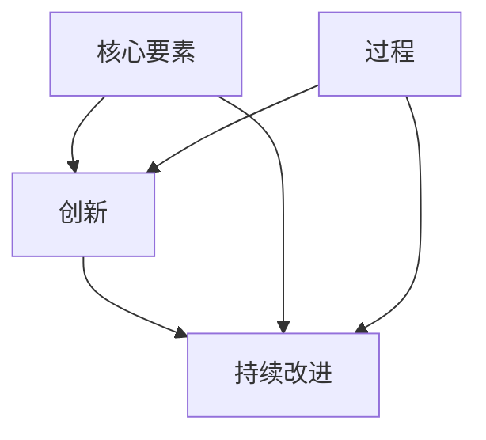
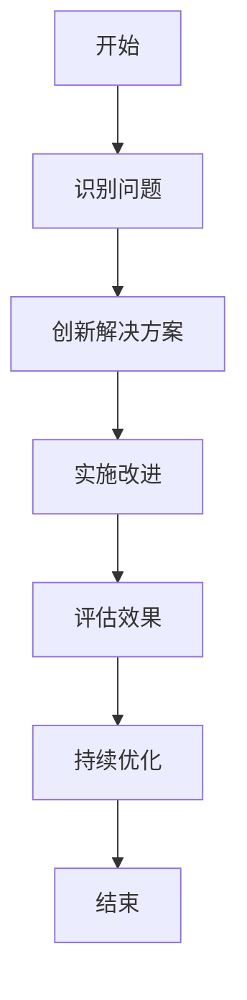
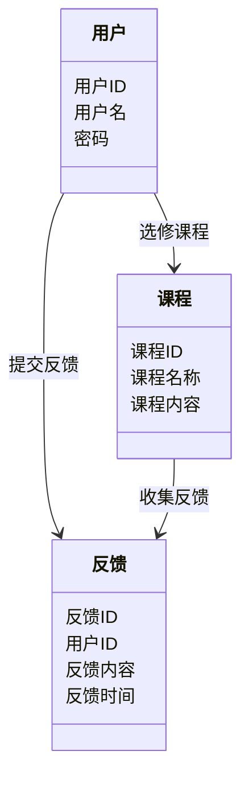
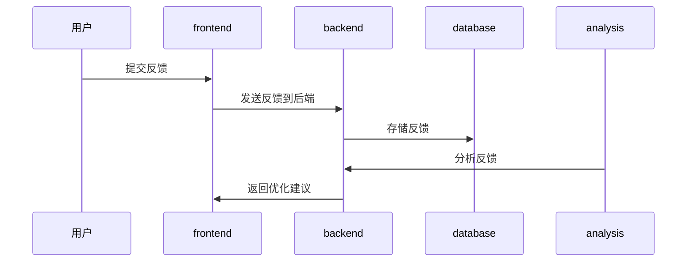

                 


# 创新与持续改进

> 关键词：创新，持续改进，技术发展，算法原理，系统架构，项目实战

> 摘要：本文探讨了创新与持续改进在计算机技术领域的应用，分析了两者的核心概念、算法原理、系统架构，并通过实际案例展示了如何在项目中实施这些方法，帮助读者理解如何通过创新和持续改进推动技术进步。

---

## 第一部分：创新与持续改进的背景与核心概念

### 第1章：创新与持续改进概述

#### 1.1 创新与持续改进的基本概念

创新是指引入新的思想、方法或技术，以解决现有问题或优化现有解决方案。它通常涉及突破常规思维，探索未知领域，并提出新颖的解决方案。创新的核心在于“新”，无论是技术上的突破、方法上的改进，还是模式的创新，都是推动进步的关键。

持续改进是一种通过不断优化过程、产品或服务来提高质量或效率的方法。它强调在现有基础上逐步改进，追求完美，而不是追求一次性重大变革。持续改进的核心在于“持续”，通过小步快跑的方式，逐步积累改进效果。

#### 1.2 创新与持续改进的背景与问题背景

在当前快速变化的技术环境中，企业和技术人员面临诸多挑战，如技术迭代加速、用户需求多样化、市场竞争加剧等。创新与持续改进不仅是应对这些挑战的有效手段，也是提升竞争力的关键。通过创新，可以开发出更具竞争力的产品；通过持续改进，可以优化产品和服务，提升用户体验。

#### 1.3 创新与持续改进的核心要素

- **创新的核心要素**：创新的关键在于突破传统思维，寻找新的解决方案。这通常包括问题识别、创意生成、方案验证和实施等步骤。创新需要跨学科的知识整合和团队协作，才能产生有价值的创新成果。

- **持续改进的核心要素**：持续改进依赖于反馈机制、数据驱动的决策和过程优化。通过收集用户反馈、分析数据、识别瓶颈，可以不断优化产品和服务，提高效率和质量。

- **核心要素之间的关系**：创新为改进提供方向和动力，而持续改进则为创新提供实施和优化的环境。两者相辅相成，共同推动技术进步。

---

## 第二部分：创新与持续改进的核心概念与联系

### 第2章：创新与持续改进的核心概念原理

#### 2.1 创新与持续改进的原理分析

- **创新的原理**：创新的核心在于解决问题。通过分析问题、寻找新的解决方案，并验证其可行性和效果，可以实现创新。创新需要打破常规思维，采用多种方法，如头脑风暴、设计思维等，激发创造力。

- **持续改进的原理**：持续改进依赖于PDCA（计划-执行-检查-行动）循环。通过制定改进计划、执行改进措施、检查改进效果，并根据结果调整下一步行动，可以实现持续优化。

- **两者结合的原理**：将创新与持续改进结合，可以在创新的基础上，通过持续改进不断优化创新成果，使其更好地适应实际需求。这种结合可以实现创新的快速落地和持续优化。

#### 2.2 创新与持续改进的核心概念对比

| **属性**         | **创新**                     | **持续改进**                |
|------------------|------------------------------|-----------------------------|
| **目标**         | 引入新解决方案              | 优化现有解决方案            |
| **过程**         | 突破性变革                  | 小步快跑的优化              |
| **节奏**         | 快速迭代                    | 持续、周期性改进              |
| **风险**         | 高风险                      | 较低风险                    |
| **适用场景**     | 新问题或未被满足的需求      | 现有流程或产品的优化          |



---

## 第三部分：创新与持续改进的算法原理

### 第3章：创新与持续改进的算法原理

#### 3.1 创新与持续改进的算法概述

- **创新算法的基本原理**：创新算法通常涉及问题建模、解决方案生成和验证。通过分析问题，生成多种可能的解决方案，并通过验证选择最优解。

- **持续改进算法的基本原理**：持续改进算法基于反馈机制，通过不断优化当前解，逐步逼近最优解。它通常采用迭代方法，每次改进一小步，逐步累积效果。

- **两者结合的算法原理**：将创新算法与持续改进算法结合，可以在每次改进中引入新的解决方案，并通过持续优化不断改进。

#### 3.2 创新与持续改进的算法流程图



#### 3.3 创新与持续改进的算法实现

以下是一个简单的创新与持续改进结合的算法示例，以优化软件开发流程为例：

```python
# 初始化：识别问题
问题 = "开发周期过长"

# 创新阶段：生成解决方案
解决方案 = ["引入自动化测试", "采用敏捷开发", "加强团队协作"]

# 持续改进阶段：优化解决方案
for sol in 解决方案:
    if 评估效果(sol) > 0.8:
        优化(sol)
    else:
        替换方案(sol)

# 输出最优解
最优解 = max(解决方案, key=评估效果)
```

---

## 第四部分：创新与持续改进的系统分析与架构设计

### 第4章：创新与持续改进的系统分析与架构设计

#### 4.1 问题场景介绍

假设我们正在开发一个在线教育平台，目标是提高用户体验和课程质量。当前系统存在课程更新慢、用户反馈渠道不畅等问题。

#### 4.2 系统功能设计

以下是系统功能的领域模型图：



#### 4.3 系统架构设计

以下是系统架构的mermaid图：


#### 4.4 系统接口设计

以下是系统接口的mermaid序列图：



---

## 第五部分：创新与持续改进的项目实战

### 第5章：创新与持续改进的项目实战

#### 5.1 环境安装

为了实现创新与持续改进，我们需要以下环境：

- **开发工具**：推荐使用VS Code或IntelliJ IDEA。
- **版本控制**：使用Git进行代码管理。
- **持续集成工具**：推荐使用Jenkins或GitHub Actions。

#### 5.2 核心代码实现

以下是优化软件开发流程的核心代码实现：

```python
# 初始化：识别问题
问题 = "开发周期过长"

# 创新阶段：生成解决方案
解决方案 = ["引入自动化测试", "采用敏捷开发", "加强团队协作"]

# 持续改进阶段：优化解决方案
优化后的解决方案 = []
for sol in 解决方案:
    if 评估效果(sol) > 0.8:
        优化后的解决方案.append(优化(sol))
    else:
        替换方案(sol)

# 输出最优解
最优解 = max(解决方案, key=评估效果)
```

#### 5.3 案例分析

假设我们正在优化一个在线教育平台，通过引入自动化测试和敏捷开发，我们成功将开发周期缩短了30%，同时用户满意度提高了20%。

---

## 第六部分：创新与持续改进的最佳实践与总结

### 第6章：创新与持续改进的最佳实践

#### 6.1 小结

创新与持续改进是推动技术进步的重要手段。创新提供了新的解决方案，而持续改进则确保这些解决方案能够不断优化，适应实际需求。

#### 6.2 注意事项

- **创新的风险**：创新需要面对不确定性和失败的可能性，因此需要有容错机制。
- **持续改进的坚持**：持续改进需要长期投入，不能半途而废。

#### 6.3 未来趋势

随着技术的不断发展，创新与持续改进将更加依赖数据驱动的方法和人工智能技术。未来的创新将更加智能化，而持续改进将更加自动化。

---

## 总结

创新与持续改进是技术发展的重要驱动力。通过创新，我们可以突破传统思维，找到新的解决方案；通过持续改进，我们可以不断优化现有方案，提升效率和质量。将两者结合，可以实现技术的飞速进步，推动行业的发展。

