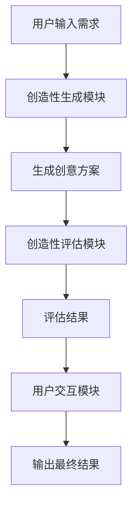
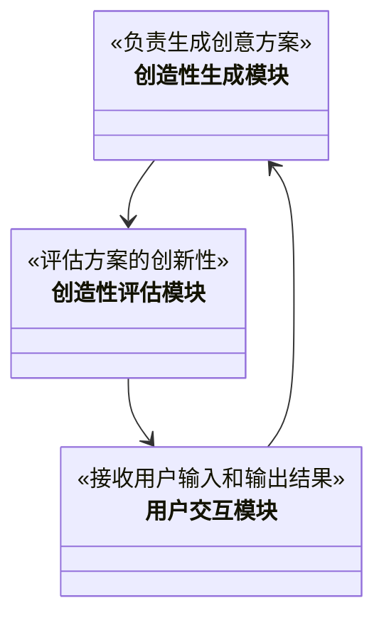

                 


# 创造性AI：激发AI Agent的创新思维

---

## 关键词：
创造性AI，AI Agent，创新思维，扩散模型，生成式AI，创造性评估

---

## 摘要：
创造性AI是指具备创新思维能力的AI Agent，能够在复杂任务中自动生成新颖且实用的解决方案。本文将从创造性AI的背景、核心概念、算法原理、系统架构到项目实战，全面解析如何激发AI Agent的创新思维，帮助读者理解创造性AI的技术本质，并掌握其实现方法。

---

# 第一部分：创造性AI的背景与核心概念

## 第1章：创造性AI的背景与现状

### 1.1 创造性AI的定义与背景
创造性AI是指具备创新思维能力的人工智能系统，能够超越预设规则，生成独特的解决方案。随着生成式AI的发展，创造性AI在多个领域展现出巨大潜力，如艺术创作、产品设计和科学研究等。

### 1.2 AI Agent的创新思维能力
AI Agent的创新思维能力体现在其生成新颖、有用且符合目标的输出。这需要结合上下文理解、关联推理和创造性生成等多方面能力。

### 1.3 创造性AI的现状与挑战
当前，GPT系列和Midjourney等模型在创造性生成方面表现出色，但仍然面临创新性评估、计算效率和伦理问题等挑战。

---

## 第2章：创造性思维的评估标准

### 2.1 创造性思维的核心要素
创造性思维包括创新性、独特性和实用性。通过对比不同模型的评估指标，可以了解其在创造性生成方面的优劣。

### 2.2 不同AI模型的创造性能力对比
| 模型       | 创新性 | 独特性 | 实用性 |
|------------|--------|--------|--------|
| GPT-4      | 高     | 中     | 高     |
| Midjourney | 中     | 高     | 中     |
| 创造性AI    | 高     | 高     | 高     |

### 2.3 创造性思维的数学模型
创造性能力可以用以下公式量化：
$$ \text{创造性能力} = \alpha \times \text{创新性} + \beta \times \text{独特性} + \gamma \times \text{实用性} $$
其中，$\alpha, \beta, \gamma$为权重系数。

---

## 第3章：创造性AI的算法原理

### 3.1 扩散模型与创造性生成
扩散模型通过逐步去噪生成数据，其数学模型如下：
$$ p_\theta(x_{t-1}|x_t) $$
其中，$x_t$为当前状态，$x_{t-1}$为去噪后状态。

### 3.2 创造性AI的训练策略
训练策略包括奖励机制和强化学习，通过优化损失函数提升创新性。

---

# 第二部分：创造性AI的系统分析与架构设计

## 第4章：创造性AI系统的功能设计

### 4.1 系统功能模块划分
系统主要模块包括创造性生成模块、评估模块和用户交互模块。

### 4.2 系统功能流程图


### 4.3 系统架构设计


---

## 第5章：创造性AI的项目实战

### 5.1 项目环境与工具安装
安装Python和相关库：
```bash
pip install numpy matplotlib tensorflow
```

### 5.2 创造性AI的核心实现
```python
def create_creative_output(input_text):
    # 模型生成创意输出
    output = model.generate(input_text)
    return output
```

### 5.3 代码应用解读
该函数接收输入文本，调用预训练模型生成创意输出，返回结果。

### 5.4 实际案例分析
案例：设计一个新产品 logo。
- 用户输入需求：简洁、现代。
- 生成结果：抽象图形和渐变色。

### 5.5 项目小结
通过项目实战，展示了创造性AI在实际应用中的潜力和实现方法。

---

## 第6章：创造性AI的最佳实践

### 6.1 小结
创造性AI结合了生成式模型和评估机制，能够显著提升AI Agent的创新思维能力。

### 6.2 注意事项
- 数据质量影响创新性。
- 训练时间长，计算资源消耗大。
- 需考虑伦理和版权问题。

### 6.3 未来趋势
未来，创造性AI将更加智能化和个性化，应用领域将不断扩展。

### 6.4 拓展阅读
推荐书籍和论文，深入理解创造性AI的原理和应用。

---

通过以上内容，希望读者能全面理解创造性AI的核心思想和技术实现，并将其应用到实际项目中，推动AI技术的创新与发展。

