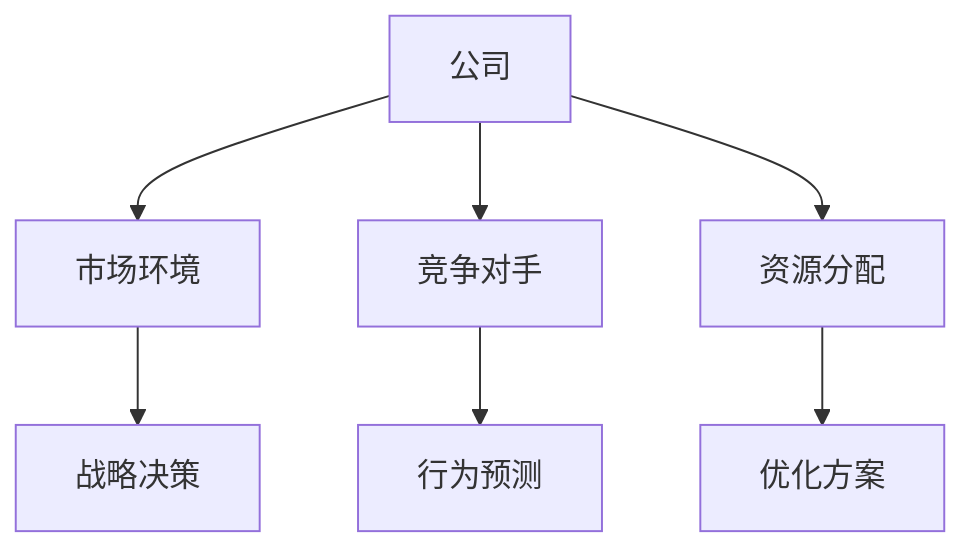
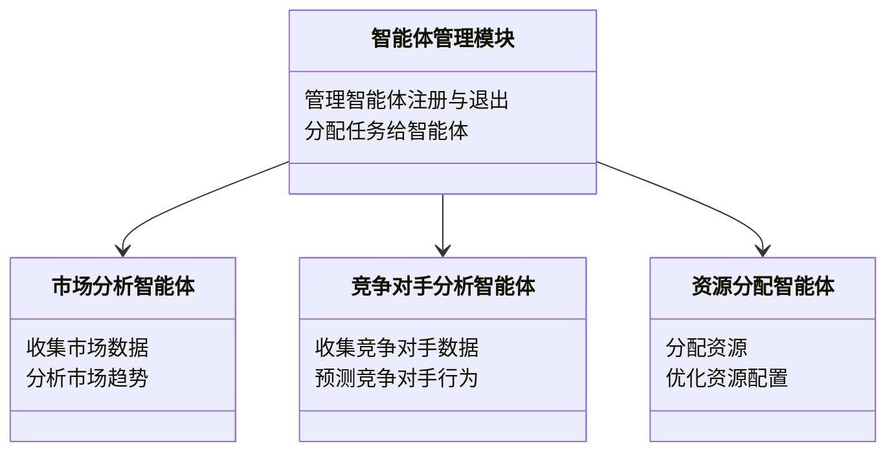
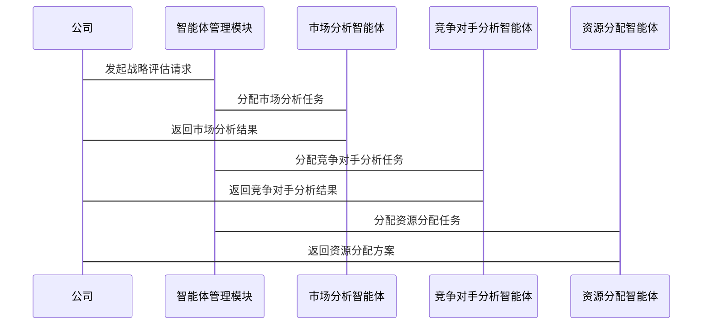

                 


# 利用多智能体AI优化公司扩张战略评估

## 关键词：多智能体AI，公司扩张，战略评估，分布式计算，强化学习，市场分析，资源分配

## 摘要

随着全球市场的竞争日益激烈，公司扩张战略的制定和评估变得越来越复杂。传统的战略评估方法往往依赖于单点决策和静态分析，难以应对动态变化的市场环境。多智能体AI（Multi-Agent AI）作为一种新兴的技术，通过多个智能体的协作和分布式计算，能够更高效地处理复杂问题。本文将详细探讨如何利用多智能体AI优化公司扩张战略评估，从背景介绍、核心概念、算法原理到系统设计和项目实战，全面解析其应用价值和实现方法。

---

# 第一部分: 多智能体AI与公司扩张战略概述

## 第1章: 多智能体AI的定义与优势

### 1.1 多智能体AI的定义

#### 1.1.1 多智能体系统的概念
多智能体系统（Multi-Agent System, MAS）是由多个智能体（Agent）组成的分布式系统，每个智能体都是一个能够感知环境、自主决策的实体。多智能体系统的核心在于智能体之间的协作与通信，通过分布式计算实现复杂任务的分解与优化。

#### 1.1.2 多智能体AI的特点
- **分布式计算**：智能体独立运行，通过通信实现协作。
- **自主性**：每个智能体都有自己的目标和决策机制。
- **反应性**：能够实时感知环境变化并做出响应。
- **协作性**：通过通信协议实现任务分配和协同工作。

#### 1.1.3 多智能体AI与传统AI的区别
| 特性         | 多智能体AI               | 传统AI                 |
|--------------|--------------------------|------------------------|
| 决策中心化    | 去中心化，多个智能体协作 | 单一中心化决策          |
| 通信方式     | 智能体之间通信           | 无通信                 |
| 适应性       | 高，能快速响应变化       | 较低，依赖预设规则       |

### 1.2 多智能体AI的优势

#### 1.2.1 分布式计算的优势
- **任务分解**：复杂问题通过多智能体协作分解为简单任务。
- **并行计算**：多个智能体同时处理不同子任务，提高效率。
- **容错性**：单个智能体故障不影响整体系统运行。

#### 1.2.2 多智能体协作的效果
- **全局优化**：通过智能体协作实现整体目标的最优解。
- **动态适应**：系统能够根据环境变化自动调整策略。
- **灵活决策**：多个智能体提供多样化的决策方案，提高应对复杂场景的能力。

#### 1.2.3 多智能体系统的灵活性与适应性
- **模块化设计**：智能体可以独立开发和维护，便于扩展。
- **可扩展性**：系统可以根据需求增加或减少智能体数量。
- **自适应性**：智能体能够根据环境反馈动态调整行为。

## 第2章: 公司扩张战略评估的背景与挑战

### 2.1 公司扩张战略的定义

#### 2.1.1 扩张战略的内涵
公司扩张战略是指企业在现有业务基础上，通过市场扩展、产品创新、资本运作等方式实现业务增长的策略。其核心目标是提升市场占有率、优化资源配置、降低经营风险。

#### 2.1.2 扩张战略的目标与范围
- **目标**：实现业务增长、提升竞争力、扩大市场份额。
- **范围**：涵盖市场分析、竞争对手研究、资源分配等多个方面。

### 2.2 公司扩张战略评估的挑战

#### 2.2.1 信息不对称的问题
- **市场信息不全**：难以全面获取目标市场的详细数据。
- **竞争对手动态**：难以准确预测竞争对手的策略变化。

#### 2.2.2 竞争环境的复杂性
- **多变的市场环境**：经济波动、政策变化、技术革新等因素影响市场。
- **复杂的利益关系**：涉及多方利益，如供应商、合作伙伴、客户等。

#### 2.2.3 战略评估的动态性
- **动态变化**：市场环境和竞争态势不断变化，需要实时调整评估策略。
- **评估周期**：传统战略评估周期较长，难以应对快速变化的市场。

## 第3章: 多智能体AI在公司扩张战略中的应用前景

### 3.1 多智能体AI在战略评估中的潜在价值

#### 3.1.1 提高战略评估的准确性
通过多智能体系统实时收集和分析数据，能够更全面地评估市场环境和竞争对手行为，从而提高战略评估的准确性。

#### 3.1.2 增强战略决策的实时性
多智能体系统能够实时感知环境变化，并快速调整决策策略，提升战略决策的实时性和响应速度。

#### 3.1.3 提升战略执行的灵活性
多智能体系统通过去中心化的决策机制，能够快速适应环境变化，灵活调整战略执行方案，提高战略执行的灵活性。

### 3.2 多智能体AI在公司扩张中的具体应用

#### 3.2.1 市场分析与预测
- **市场数据收集**：智能体通过数据爬取、API调用等方式实时获取市场数据。
- **市场趋势预测**：通过强化学习算法预测市场趋势，为战略决策提供支持。

#### 3.2.2 竞争对手行为预测
- **竞争对手分析**：智能体通过分析竞争对手的历史行为和市场数据，预测其未来可能的策略。
- **竞争策略优化**：根据预测结果，优化自身战略，制定更有针对性的竞争策略。

#### 3.2.3 资源分配与优化
- **资源分配模型**：通过多智能体协作，优化资源配置，提高资源利用效率。
- **成本控制**：通过智能体之间的协作，降低扩张过程中的成本支出。

---

# 第二部分: 多智能体AI的核心概念与原理

## 第4章: 多智能体AI的核心概念与联系

### 4.1 多智能体系统的组成要素

#### 4.1.1 实体与角色
- **实体**：系统的组成部分，包括公司、市场环境、竞争对手、资源等。
- **角色**：每个实体在系统中扮演的角色，如市场分析智能体、资源分配智能体等。

#### 4.1.2 通信协议
- **通信方式**：智能体之间通过消息传递、共享数据库等方式进行通信。
- **通信内容**：包括数据交换、任务分配、决策反馈等。

#### 4.1.3 协作机制
- **任务分配**：智能体根据自身能力和当前状态，接受或拒绝任务。
- **协作策略**：智能体之间通过协商和协作，共同完成复杂任务。

### 4.2 多智能体系统的属性特征对比

| 特性         | 单智能体系统            | 多智能体系统            |
|--------------|-------------------------|-------------------------|
| 决策中心化    | 高                     | 低                     |
| 通信方式     | 无                     | 有                     |
| 适应性       | 较低                   | 较高                   |
| 协作能力     | 无                     | 强                     |

### 4.3 多智能体系统的ER实体关系图



## 第5章: 多智能体AI的算法原理与数学模型

### 5.1 多智能体AI的算法原理

#### 5.1.1 分布式计算的原理
- **任务分解**：将复杂任务分解为多个子任务，分配给不同的智能体。
- **并行计算**：多个智能体同时处理子任务，提高计算效率。
- **结果汇总**：智能体将子任务结果汇总，形成最终的决策方案。

#### 5.1.2 强化学习在多智能体系统中的应用
- **强化学习机制**：智能体通过与环境的交互，学习最优策略。
- **多智能体协作**：多个智能体通过强化学习，实现协作与优化。

#### 5.1.3 跨智能体协作的数学模型
- **收益函数**：衡量协作效果的函数。
- **损失函数**：衡量协作成本的函数。
- **优化目标**：最大化收益函数，最小化损失函数。

### 5.2 多智能体AI的数学模型

#### 5.2.1 收益函数的优化模型
$$ \text{收益} = \sum_{i=1}^{n} v_i $$
其中，\( v_i \) 表示第 \( i \) 个智能体的贡献值。

#### 5.2.2 损失函数的最小化模型
$$ \text{损失} = \sum_{i=1}^{n} c_i $$
其中，\( c_i \) 表示第 \( i \) 个智能体的协作成本。

#### 5.2.3 优化目标
$$ \max \sum_{i=1}^{n} v_i - \sum_{i=1}^{n} c_i $$

---

# 第三部分: 系统分析与架构设计

## 第6章: 系统分析与架构设计方案

### 6.1 项目背景介绍
本项目旨在利用多智能体AI技术，优化公司扩张战略评估过程。通过多个智能体协作，实现市场分析、竞争对手预测、资源分配等任务的自动化和智能化。

### 6.2 系统功能设计

#### 6.2.1 领域模型设计


#### 6.2.2 系统架构设计


### 6.3 系统接口设计

#### 6.3.1 系统接口
- **市场数据接口**：提供市场数据的获取和分析功能。
- **竞争对手数据接口**：提供竞争对手数据的获取和分析功能。
- **资源分配接口**：提供资源分配和优化功能。

#### 6.3.2 系统交互流程


---

# 第四部分: 项目实战

## 第7章: 项目实战

### 7.1 环境安装与配置

#### 7.1.1 安装Python
```bash
# 安装Python 3.8+
python --version
```

#### 7.1.2 安装依赖库
```bash
pip install numpy matplotlib scikit-learn
```

### 7.2 核心代码实现

#### 7.2.1 智能体管理模块
```python
class AgentManager:
    def __init__(self):
        self.agents = []
    
    def register_agent(self, agent):
        self.agents.append(agent)
    
    def assign_task(self, task, agent):
        agent.receive_task(task)
```

#### 7.2.2 市场分析智能体
```python
class MarketAnalysisAgent:
    def __init__(self):
        self.data = []
    
    def receive_task(self, task):
        # 分析市场数据
        pass
    
    def collect_data(self):
        # 收集市场数据
        pass
```

### 7.3 应用解读与分析
- **市场分析模块**：通过智能体收集和分析市场数据，预测市场趋势，为战略决策提供支持。
- **竞争对手分析模块**：通过智能体收集和分析竞争对手数据，预测竞争对手行为，制定针对性的竞争策略。
- **资源分配模块**：通过智能体优化资源配置，降低扩张成本，提高资源利用效率。

### 7.4 实际案例分析
- **案例背景**：某公司计划进入新市场，需要评估市场潜力和竞争对手情况。
- **案例分析**：通过多智能体系统，智能体分别负责市场数据收集、竞争对手分析和资源分配，最终形成最优扩张方案。

### 7.5 项目小结
通过多智能体AI技术，公司能够更高效、更准确地评估扩张战略，提升市场竞争力。

---

# 第五部分: 最佳实践与总结

## 第8章: 最佳实践

### 8.1 小结
多智能体AI通过分布式计算和协作机制，能够有效优化公司扩张战略评估过程，提升战略决策的准确性和实时性。

### 8.2 注意事项
- **数据质量**：确保数据来源可靠，数据质量高。
- **智能体协作**：智能体之间的通信和协作需要设计合理的协议和机制。
- **系统维护**：定期更新和维护智能体系统，确保其高效运行。

### 8.3 拓展阅读
- 推荐书籍：《Multi-Agent Systems: Algorithmic, Complexity, and Synthesis》
- 推荐论文：《A Survey of Multi-Agent Reinforcement Learning》

---

# 结语

通过本文的详细讲解，我们可以看到，多智能体AI在公司扩张战略评估中的应用前景广阔。从核心概念到系统设计，再到项目实战，多智能体AI能够显著提升战略评估的效率和准确性。未来，随着技术的不断发展，多智能体AI将在公司扩张战略中发挥更加重要的作用。

