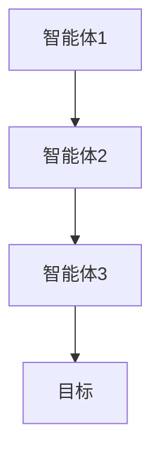
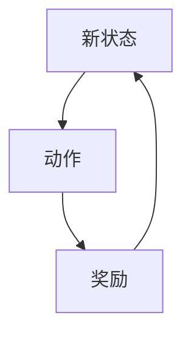
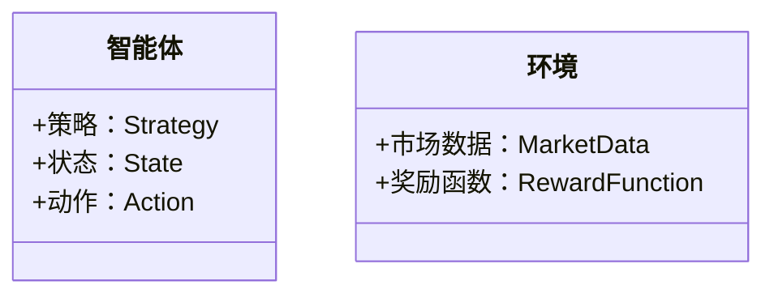
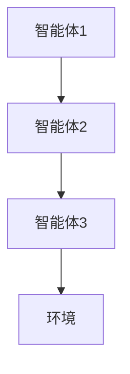

                 


# 利用多智能体AI优化巴菲特的"雪球效应"投资策略

## 关键词
多智能体AI，雪球效应，投资策略，复利效应，优化算法

## 摘要
本文探讨如何利用多智能体人工智能优化巴菲特的雪球效应投资策略。通过分析多智能体AI的核心原理、算法及其在投资领域的应用，本文提出了一种基于多智能体协同的优化方法，旨在提升投资策略的效率和准确性。通过系统架构设计和项目实战，本文展示了如何将多智能体AI应用于雪球效应投资策略，为投资领域提供了新的思路和解决方案。

---

# 第一部分: 利用多智能体AI优化巴菲特的雪球效应投资策略背景与基础

## 第1章: 巴菲特的雪球效应投资策略

### 1.1 雪球效应的定义与特点

#### 1.1.1 雪球效应的定义
雪球效应是指通过复利效应，让投资不断增长，就像雪球在滚动过程中不断聚集雪块一样。其核心在于利用时间的复利效应，使投资以指数速度增长。

$$
\text{复利公式}：A = P \times (1 + r)^t
$$

其中，$A$ 是最终金额，$P$ 是本金，$r$ 是年化收益率，$t$ 是时间（年）。

#### 1.1.2 雪球效应的核心特点
- **复利效应**：收益滚存，利滚利。
- **时间依赖性**：时间越长，效果越显著。
- **风险管理**：雪球效应需要稳健的投资策略，避免本金亏损。

#### 1.1.3 雪球效应与复利效应的关系
雪球效应是复利效应的一种具体应用，通过不断积累收益，实现财富的指数增长。

### 1.2 多智能体AI的介绍

#### 1.2.1 多智能体AI的定义
多智能体AI是指由多个独立但协作的智能体组成的系统，每个智能体都有自己的目标和决策机制，通过协同完成复杂任务。

#### 1.2.2 多智能体AI与传统AI的区别
| 特性 | 多智能体AI | 传统AI |
|------|------------|--------|
| 决策主体 | 多个智能体 | 单一模型 |
| 协作性 | 高 | 低 |
| 应用场景 | 复杂环境 | 简单任务 |

#### 1.2.3 多智能体AI在投资中的应用前景
多智能体AI可以模拟市场中的多方角色，分析市场动态，优化投资组合，提高决策效率。

---

## 第2章: 多智能体AI的概述

### 2.1 多智能体AI的核心概念

#### 2.1.1 多智能体系统的原理
多智能体系统由多个智能体组成，每个智能体负责特定任务，通过通信协作完成整体目标。



#### 2.1.2 多智能体AI的协作机制
智能体之间通过共享信息和协调行动，共同完成复杂任务。

#### 2.1.3 多智能体AI的通信协议
智能体之间通过消息传递进行通信，消息格式包括任务请求、状态更新等。

### 2.2 多智能体AI与雪球效应的结合

#### 2.2.1 多智能体AI在投资决策中的角色
智能体可以分别负责市场分析、风险评估、策略优化等任务。

#### 2.2.2 多智能体AI对雪球效应的优化
通过多个智能体协同工作，优化投资组合，提高收益预测的准确性。

---

# 第二部分: 多智能体AI的核心原理与算法

## 第3章: 多智能体AI的算法原理

### 3.1 强化学习算法

#### 3.1.1 强化学习的定义
强化学习是一种通过试错学习，智能体通过与环境互动，获得最大奖励的方法。



#### 3.1.2 多智能体强化学习
多个智能体协同学习，共享奖励，优化整体策略。

#### 3.1.3 强化学习在投资中的应用
智能体通过历史数据训练，预测市场走势，制定交易策略。

### 3.2 分布式计算与协作

#### 3.2.1 分布式计算的定义
分布式计算是指任务分解到多个计算节点，协同完成任务。

#### 3.2.2 分布式计算在多智能体AI中的应用
智能体分布在不同节点，协同处理大数据和复杂任务。

---

## 第4章: 投资策略优化的数学模型

### 4.1 收益预测模型

#### 4.1.1 线性回归模型
$$
y = \beta_0 + \beta_1 x + \epsilon
$$

其中，$y$ 是预测收益，$x$ 是自变量，$\epsilon$ 是误差项。

#### 4.1.2 神经网络模型
使用深度学习模型，如LSTM，预测时间序列数据。

### 4.2 风险评估模型

#### 4.2.1 风险价值模型（VaR）
$$
\text{VaR} = \mu + z \times \sigma
$$

其中，$\mu$ 是均值，$z$ 是标准正态分布的分位数，$\sigma$ 是标准差。

---

# 第三部分: 系统分析与架构设计方案

## 第5章: 系统架构设计

### 5.1 系统功能设计

#### 5.1.1 领域模型


#### 5.1.2 系统架构


---

# 第四部分: 项目实战

## 第6章: 项目实战

### 6.1 环境安装
安装Python和相关库，如numpy、pandas、tensorflow。

### 6.2 核心代码实现

#### 6.2.1 数据预处理
```python
import pandas as pd

data = pd.read_csv('market_data.csv')
# 数据清洗
data.dropna(inplace=True)
```

#### 6.2.2 模型训练
```python
import tensorflow as tf

model = tf.keras.Sequential([
    tf.keras.layers.Dense(64, activation='relu'),
    tf.keras.layers.Dense(1, activation='linear')
])
model.compile(optimizer='adam', loss='mse')
model.fit(X_train, y_train, epochs=100)
```

---

## 第五部分: 优化与挑战

## 第7章: 优化与挑战

### 7.1 数据质量与模型泛化能力
确保数据的准确性和完整性，避免模型过拟合。

### 7.2 计算资源与效率
优化算法复杂度，提高计算效率。

---

## 第8章: 结论与展望

本文探讨了多智能体AI在优化巴菲特雪球效应投资策略中的应用，提出了基于强化学习和分布式计算的方法，展示了系统的实现和优化方向。

## 第9章: 注意事项

在实际应用中，需注意数据偏差、计算资源限制等问题，确保系统稳定运行。

---

通过以上步骤，我们详细讲解了如何利用多智能体AI优化巴菲特的雪球效应投资策略，从理论到实践，为投资领域提供了新的解决方案。

