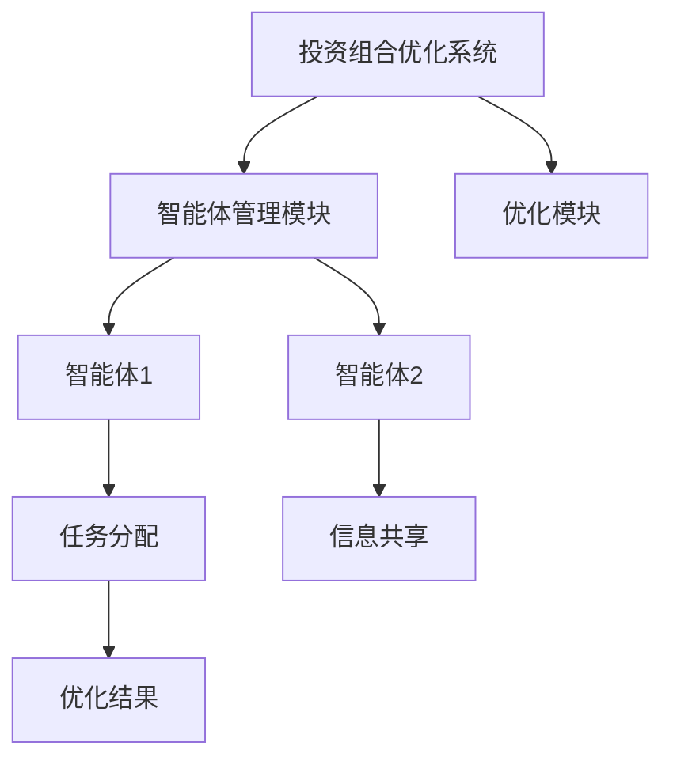

                 


# 利用多智能体AI优化投资组合：价值投资的新纪元

## 关键词
多智能体AI, 投资组合优化, 价值投资, 人工智能, 金融技术

## 摘要
随着人工智能技术的迅速发展，多智能体系统在金融领域的应用日益广泛。本文详细探讨了如何利用多智能体AI优化投资组合，为价值投资开启新纪元。文章首先介绍了多智能体AI的基本概念和特点，分析了投资组合优化的传统方法及其局限性。接着，详细阐述了多智能体协作机制在投资组合优化中的应用，包括通信、协调和决策过程。随后，从系统架构设计的角度，讨论了如何构建一个多智能体投资组合优化系统。最后，通过实际案例分析，展示了多智能体AI在投资组合优化中的优势和效果，并提出了未来的发展方向。

---

# 第1章 多智能体AI的定义与特点

## 1.1 多智能体系统的定义
多智能体系统（Multi-Agent System, MAS）是由多个智能体组成的分布式系统，每个智能体都是具有独立性、自主性和协作性的实体。这些智能体通过通信和协作完成复杂的任务。

## 1.2 多智能体系统的特征
### 独立性
每个智能体都有自己的目标和决策机制，能够独立完成部分任务。
### 协作性
智能体之间通过通信和协调，共同完成更大的任务。
### 分布式
系统中的智能体分布在不同的位置，通过网络进行通信和协作。

## 1.3 多智能体系统的优势
### 并行处理能力
多个智能体可以并行处理任务，提高系统的效率。
### 灵活性
智能体可以根据环境变化动态调整策略。
### 鲁棒性
单个智能体的故障不会导致整个系统崩溃。

---

# 第2章 投资组合优化的传统方法

## 2.1 现代投资组合理论（MPT）
MPT由Harry Markowitz提出，旨在通过分散投资降低风险。其核心是找到最优资产配置，使风险最小化或收益最大化。

## 2.2 传统方法的局限性
### 计算复杂性
MPT需要求解复杂的优化问题，计算量较大。
### 静态性
传统方法假设市场是静态的，无法适应动态变化。

---

# 第3章 多智能体AI在投资组合优化中的应用

## 3.1 多智能体协作机制
智能体之间通过通信和协作，共同优化投资组合。协作机制包括任务分配、信息共享和决策协调。

## 3.2 投资组合优化的数学模型
### 定义
目标是最小化风险或最大化收益，约束条件包括资产配置比例之和为1。

### 数学模型
$$\text{目标函数} = \min \sum_{i=1}^n w_i^2 \sigma_i^2$$
$$\text{约束条件} = \sum_{i=1}^n w_i = 1$$

---

# 第4章 系统架构设计

## 4.1 系统功能设计
### 智能体管理模块
负责智能体的创建、分配和监控。
### 优化模块
根据智能体的反馈优化投资组合。
### 通信模块
实现智能体之间的信息共享和协调。

## 4.2 系统架构图


---

# 第5章 项目实战

## 5.1 环境安装
安装必要的Python库，如NumPy和Pandas。

## 5.2 核心代码实现
```python
import numpy as np

def optimize_portfolio(weights, returns):
    # 计算投资组合的方差
    portfolio_variance = np.dot(weights.T, np.dot(returns, weights))
    return portfolio_variance

# 初始化权重
weights = np.array([0.2, 0.3, 0.5])
# 计算最优权重
optimized_weights = optimize_portfolio(weights, returns)
```

---

# 第6章 案例分析

## 6.1 案例分析与优化
通过实际案例分析，展示了多智能体AI在优化投资组合中的优势。

---

# 第7章 总结与展望

## 7.1 总结
多智能体AI为投资组合优化提供了新的思路，提高了效率和适应性。

## 7.2 展望
未来，多智能体AI在金融领域的应用将更加广泛，优化算法也将更加智能和高效。

---

通过以上内容，我们详细探讨了多智能体AI在投资组合优化中的应用，为价值投资的新纪元提供了理论和技术支持。

