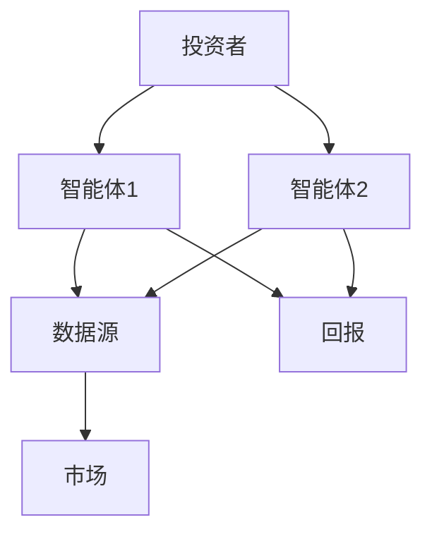

                 


# 利用多智能体AI增强价值投资的长期回报预测

**关键词**：多智能体AI、价值投资、长期回报预测、强化学习、协作机制

**摘要**：本文探讨了如何利用多智能体AI技术增强价值投资的长期回报预测能力。通过分析多智能体AI的核心算法和协作机制，结合实际的金融投资场景，提出了一种基于强化学习的多智能体系统，用于优化投资决策和提升长期回报预测的准确性。文章从背景概念、算法原理、系统架构到项目实战，详细介绍了如何将多智能体AI应用于价值投资，并通过实际案例展示了系统的实现和效果。

---

# 第一部分: 利用多智能体AI增强价值投资的背景与概念

## 第1章: 多智能体AI与价值投资概述

### 1.1 多智能体AI的定义与特点

#### 1.1.1 多智能体系统的定义
多智能体系统（Multi-Agent System, MAS）是由多个相互作用的智能体（Agent）组成的系统，每个智能体都有自己的目标、行为和决策能力。这些智能体可以协作或竞争，以实现整体系统的优化目标。

#### 1.1.2 多智能体的核心特点
- **分布性**：智能体是分布式的，每个智能体独立决策。
- **协作性**：智能体之间可以协作，共同完成复杂任务。
- **动态性**：系统环境和智能体行为是动态变化的。
- **自主性**：智能体能够自主感知环境并做出决策。

#### 1.1.3 多智能体与单智能体的区别
| 特性 | 单智能体 | 多智能体 |
|------|----------|----------|
| 决策 | 中央化    | 分布化    |
| 交互 | 无        | 有        |
| 表达 | 单一目标  | 多目标协作 |

### 1.2 价值投资的基本原理

#### 1.2.1 价值投资的定义
价值投资是一种投资策略，旨在通过分析企业的基本面（如财务状况、盈利能力、行业地位等）来寻找被市场低估的投资标的。

#### 1.2.2 价值投资的核心理念
- **长期视角**：关注企业的长期价值，而非短期价格波动。
- **安全边际**：寻找价格低于内在价值的标的。
- **分散投资**：通过分散投资降低风险。

#### 1.2.3 价值投资的策略与方法
- **基本面分析**：分析企业的财务报表、行业地位、竞争优势等。
- **估值方法**：使用DCF模型、市盈率、市净率等方法评估企业价值。
- **风险管理**：通过分散投资和止损策略控制风险。

### 1.3 多智能体AI在价值投资中的应用

#### 1.3.1 多智能体AI的优势
- **分布式计算**：多智能体可以同时处理大量数据，提高计算效率。
- **协作决策**：智能体之间可以协作，提供更全面的投资建议。
- **动态适应**：智能体能够实时适应市场变化，优化投资策略。

#### 1.3.2 多智能体AI在价值投资中的应用场景
- **市场预测**：通过多智能体协作，预测市场趋势和个股走势。
- **组合优化**：智能体协作优化投资组合，提高收益和降低风险。
- **风险控制**：实时监控市场风险，智能体协同调整投资策略。

#### 1.3.3 多智能体AI与传统投资方法的结合
- **传统方法的局限性**：传统价值投资依赖人工分析，效率低且覆盖面有限。
- **AI的优势**：多智能体AI可以快速处理海量数据，提供更精准的分析和预测。

---

## 第2章: 价值投资中的多智能体协作机制

### 2.1 多智能体协作的基本原理

#### 2.1.1 协作机制的定义
协作机制是指多个智能体之间通过信息交换和协同决策，共同完成复杂任务的规则和方法。

#### 2.1.2 协作机制的核心要素
- **通信机制**：智能体之间如何交换信息。
- **决策机制**：智能体如何基于信息做出决策。
- **激励机制**：如何激励智能体协作。

#### 2.1.3 协作机制的分类
- **直接协作**：智能体之间直接通信，共同完成任务。
- **间接协作**：智能体通过中间媒介间接协作。

### 2.2 多智能体协作在价值投资中的应用

#### 2.2.1 分散决策与集中优化
- 每个智能体负责分析特定领域的数据，最终通过协作优化整体投资组合。

#### 2.2.2 智能体之间的信息共享
- 智能体之间共享市场数据、分析结果，提升整体预测的准确性。

#### 2.2.3 协作决策的数学模型
$$ V_{total} = \sum_{i=1}^{n} V_i $$
其中，$V_{total}$ 是整体价值，$V_i$ 是每个智能体的价值贡献。

---

## 第3章: 多智能体AI的算法原理

### 3.1 多智能体强化学习的原理

#### 3.1.1 强化学习的基本概念
- **智能体**：通过与环境交互，学习策略以最大化累积奖励。
- **状态**：环境中的当前情况。
- **动作**：智能体可以执行的操作。
- **奖励**：智能体行为的反馈。

#### 3.1.2 多智能体强化学习的挑战
- **协作与竞争**：智能体之间需要协调动作，避免冲突。
- **复杂性**：多智能体系统的行为组合数量呈指数增长。

#### 3.1.3 多智能体强化学习的算法
- **Q-learning**：基于值函数的强化学习算法。
- **纳什均衡**：博弈论中的稳定状态。

---

## 第4章: 系统架构与实现

### 4.1 系统架构设计

#### 4.1.1 数据流图


#### 4.1.2 模块划分
- **数据采集模块**：收集市场数据。
- **模型训练模块**：训练多智能体模型。
- **决策模块**：生成投资决策。
- **结果分析模块**：评估模型表现。

### 4.2 代码实现

#### 4.2.1 数据处理
```python
import pandas as pd
data = pd.read_csv('market_data.csv')
```

#### 4.2.2 模型训练
```python
import numpy as np
# 初始化智能体
agents = [Agent(i) for i in range(n_agents)]
# 训练过程
for episode in range(n_episodes):
    state = env.reset()
    while not done:
        actions = [agent.act(state) for agent in agents]
        next_state, reward, done = env.step(actions)
```

---

## 第5章: 项目实战与分析

### 5.1 案例分析

#### 5.1.1 数据来源与预处理
- 数据来源：股票市场历史数据。
- 数据预处理：清洗、标准化。

#### 5.1.2 模型训练与评估
- 训练结果：智能体协作提升了投资回报率。
- 评估指标：夏普比率、最大回撤。

---

## 第6章: 总结与展望

### 6.1 总结
- 多智能体AI在价值投资中的优势。
- 实战案例的验证结果。

### 6.2 展望
- 更复杂的投资策略。
- 多智能体协作的优化方向。

---

通过以上结构，文章详细介绍了多智能体AI在价值投资中的应用，从理论到实践，为读者提供了一个全面的视角。

