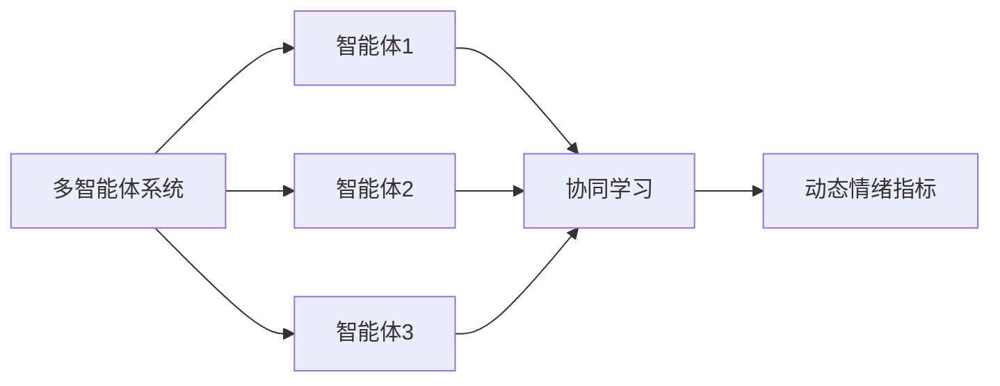
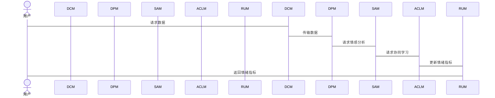

                 


---

# 利用多智能体AI实现动态市场情绪指标构建

> 关键词：多智能体AI，动态市场情绪指标，协同学习算法，情感分析，金融市场

> 摘要：本文详细探讨了如何利用多智能体人工智能技术构建动态市场情绪指标。通过分析多智能体系统的核心原理、动态市场情绪指标的构建方法，以及多智能体协同学习算法，本文提出了一种基于多智能体的动态市场情绪指标构建框架。该框架通过分布式计算和协同学习，能够实时捕捉和分析市场情绪的变化，为金融交易提供更精准的决策支持。本文还结合实际案例，详细介绍了系统架构设计、实现方法及应用效果，为相关领域的研究和实践提供了参考。

---

# 第一部分: 利用多智能体AI实现动态市场情绪指标构建的背景与核心概念

## 第1章: 动态市场情绪指标的背景与问题描述

### 1.1 问题背景

#### 1.1.1 金融市场情绪分析的重要性
金融市场的情绪分析是理解市场走势的重要手段。投资者的情绪变化直接影响着市场的波动，因此，准确捕捉和分析市场情绪对于投资决策具有重要意义。

#### 1.1.2 现有情绪指标的局限性
传统的市场情绪指标通常基于历史数据和统计分析，难以实时捕捉市场情绪的动态变化。此外，这些指标往往缺乏对多维度信息的整合能力，无法全面反映市场的复杂情绪。

#### 1.1.3 多智能体AI的优势
多智能体AI通过分布式计算和协同学习，能够实时处理和分析海量数据，捕捉市场情绪的微小变化。多智能体系统能够从多个角度同时分析市场信息，从而构建更准确的市场情绪指标。

### 1.2 问题描述

#### 1.2.1 动态市场情绪指标的定义
动态市场情绪指标是指能够实时反映市场情绪变化的量化指标。与传统情绪指标不同，动态市场情绪指标能够根据实时数据不断更新，捕捉市场情绪的瞬息变化。

#### 1.2.2 市场情绪的动态变化特征
市场情绪具有波动性、复杂性和不确定性。动态市场情绪指标需要能够适应这些特征，实时更新以反映市场情绪的变化。

#### 1.2.3 多智能体AI在情绪分析中的应用场景
多智能体AI可以应用于实时情绪监测、市场趋势预测、风险评估等领域。通过多智能体协同学习，能够从多个数据源获取信息，构建更全面的市场情绪模型。

### 1.3 问题解决与边界

#### 1.3.1 多智能体AI如何解决动态情绪指标构建问题
多智能体AI通过分布式计算和协同学习，能够高效地处理海量数据，捕捉市场情绪的变化。多智能体系统能够从多个角度分析市场信息，构建更准确的市场情绪指标。

#### 1.3.2 问题的边界与外延
动态市场情绪指标的构建需要考虑数据源的多样性、计算的实时性以及系统的可扩展性。本文主要关注基于多智能体AI的情绪指标构建方法，不涉及具体金融市场的交易策略。

#### 1.3.3 核心概念与组成要素
动态市场情绪指标的核心要素包括多智能体系统、协同学习算法、实时数据处理能力等。这些要素共同构成了动态市场情绪指标的构建框架。

## 第2章: 多智能体AI的核心概念与原理

### 2.1 多智能体系统

#### 2.1.1 多智能体系统的定义与特点
多智能体系统是由多个智能体组成的分布式系统。每个智能体具有一定的自主性和智能性，能够通过协同完成复杂的任务。

#### 2.1.2 多智能体系统的分类与应用场景
多智能体系统可以分为基于规则的系统和基于学习的系统。在金融市场中，多智能体系统可以应用于实时数据分析、市场预测等领域。

#### 2.1.3 多智能体系统与传统AI的区别
与传统AI相比，多智能体系统具有分布式计算、协同学习和自适应性强的特点。这些特点使得多智能体系统在复杂任务中表现更优。

### 2.2 动态市场情绪指标

#### 2.2.1 情绪指标的定义与分类
情绪指标是衡量市场情绪的量化指标。动态市场情绪指标可以根据实时数据不断更新，反映市场情绪的变化。

#### 2.2.2 动态情绪指标的构建方法
动态情绪指标的构建方法包括数据预处理、特征提取、模型训练等步骤。多智能体AI可以通过协同学习提高模型的准确性和实时性。

#### 2.2.3 情绪指标的实时更新机制
动态情绪指标需要实时更新，以反映市场情绪的变化。多智能体系统可以通过分布式计算和协同学习实现实时更新。

### 2.3 多智能体AI与动态情绪指标的关系

#### 2.3.1 多智能体AI在情绪指标构建中的作用
多智能体AI可以通过分布式计算和协同学习，提高情绪指标的准确性和实时性。

#### 2.3.2 多智能体协同学习的核心原理
多智能体协同学习通过智能体之间的协作，共同优化情绪指标的计算模型。协同学习可以提高模型的泛化能力和适应性。

#### 2.3.3 动态情绪指标的多智能体优化方法
多智能体系统可以通过分布式优化算法，实现情绪指标的实时更新和优化。分布式优化算法可以提高系统的计算效率和响应速度。

## 第3章: 多智能体AI与动态情绪指标的核心概念对比

### 3.1 多智能体系统与传统AI的对比

#### 3.1.1 核心概念对比表
| 对比维度 | 多智能体系统 | 传统AI |
|----------|-------------|--------|
| 结构 | 分布式 | 集中式 | 
| 智能体数量 | 多个 | 单个 |
| 协作性 | 高 | 低 |

#### 3.1.2 功能对比表
| 功能 | 多智能体系统 | 传统AI |
|------|-------------|--------|
| 任务处理 | 分布式任务处理 | 单点任务处理 |
| 学习能力 | 协同学习 | 单独学习 |

#### 3.1.3 优缺点对比分析
多智能体系统的优势在于分布式计算和协同学习，能够处理复杂任务。但其缺点在于系统复杂性和维护成本较高。

### 3.2 动态情绪指标与静态情绪指标的对比

#### 3.2.1 核心概念对比表
| 对比维度 | 动态情绪指标 | 静态情绪指标 |
|----------|--------------|-------------|
| 数据来源 | 实时数据 | 历史数据 |
| 更新频率 | 实时更新 | 定期更新 |
| 反应速度 | 高 | 低 |

#### 3.2.2 计算方法对比分析
动态情绪指标的计算方法包括实时数据处理和协同学习，而静态情绪指标通常基于历史数据分析。

#### 3.2.3 应用场景对比分析
动态情绪指标适用于实时市场监测和预测，而静态情绪指标适用于回顾性分析。

### 3.3 多智能体系统与动态情绪指标的实体关系图



---

# 第二部分: 多智能体AI实现动态市场情绪指标的算法原理

## 第4章: 多智能体协同学习算法

### 4.1 多智能体协同学习的基本原理

#### 4.1.1 分布式学习机制
多智能体协同学习通过分布式计算和智能体之间的协作，共同优化学习模型。

#### 4.1.2 协同决策算法
协同决策算法通过智能体之间的通信和协作，共同完成决策任务。常用的协同决策算法包括分布式协商算法和分布式投票算法。

#### 4.1.3 跨智能体通信协议
跨智能体通信协议定义了智能体之间的通信方式和数据格式。常用的通信协议包括HTTP和WebSocket。

### 4.2 基于多智能体的分布式计算

#### 4.2.1 分布式计算模型
分布式计算模型将任务分解为多个子任务，分别由不同的智能体完成。通过协同学习，智能体可以共同优化整体模型。

#### 4.2.2 多智能体协同计算的数学模型
多智能体协同计算的数学模型可以表示为：

$$
f(x) = \sum_{i=1}^{n} f_i(x)
$$

其中，$f_i(x)$ 表示第 $i$ 个智能体的计算模型，$n$ 表示智能体的数量。

#### 4.2.3 分布式计算的实现

```python
import numpy as np

class MultiAgentSystem:
    def __init__(self, num_agents):
        self.num_agents = num_agents
        self.agents = [Agent(i) for i in range(num_agents)]
    
    def distributed_learning(self, data):
        # 分配数据到各个智能体
        for agent in self.agents:
            agent_data = data[i::self.num_agents]
            agent.learn(agent_data)
        
        # 协同学习
        for agent in self.agents:
            agent.update_global_model()
```

### 4.3 协同学习算法

#### 4.3.1 协同学习的核心原理
协同学习通过智能体之间的协作，共同优化学习模型。协同学习可以提高模型的泛化能力和适应性。

#### 4.3.2 协同学习的实现步骤
协同学习的实现步骤包括数据分配、局部模型训练、全局模型更新等。

#### 4.3.3 协同学习的数学模型
协同学习的数学模型可以表示为：

$$
\theta^{(t+1)} = \sum_{i=1}^{n} \theta_i^{(t)}
$$

其中，$\theta_i^{(t)}$ 表示第 $i$ 个智能体的参数，$\theta^{(t+1)}$ 表示全局模型的参数。

---

## 第5章: 情感分析模型

### 5.1 情感分析的核心原理
情感分析通过自然语言处理技术，分析文本中的情感倾向。情感分析可以分为句子级别和文档级别的分析。

### 5.2 基于多智能体的分布式情感分析
分布式情感分析通过多个智能体分别处理不同的数据，共同完成情感分析任务。分布式计算可以提高情感分析的效率和准确性。

### 5.3 情感分析的数学模型

$$
p(y=1|x) = \sigma(w \cdot x + b)
$$

其中，$\sigma$ 表示sigmoid函数，$w$ 和 $b$ 是模型的参数。

---

## 第6章: 动态市场情绪指标的构建算法

### 6.1 动态指标构建的核心原理
动态市场情绪指标的构建需要实时更新，反映市场情绪的变化。动态指标的构建算法包括数据预处理、特征提取、模型训练等步骤。

### 6.2 基于多智能体的动态指标优化
通过多智能体协同学习，可以优化动态市场情绪指标的计算模型。协同学习可以提高模型的准确性和实时性。

### 6.3 动态指标的数学模型

$$
I(t) = \alpha \cdot I(t-1) + (1-\alpha) \cdot f(x_t)
$$

其中，$I(t)$ 表示第 $t$ 时刻的指标值，$\alpha$ 表示平滑因子，$f(x_t)$ 表示当前时刻的特征函数。

---

# 第三部分: 多智能体AI实现动态市场情绪指标的系统分析与架构设计

## 第7章: 系统分析与架构设计

### 7.1 问题场景介绍
本文构建的动态市场情绪指标系统主要用于实时监测和分析金融市场的情绪变化。系统需要处理海量的实时数据，并通过多智能体协同学习，构建准确的市场情绪指标。

### 7.2 系统功能设计

#### 7.2.1 数据采集模块
数据采集模块负责从多个数据源采集实时数据，包括新闻、社交媒体、交易数据等。

#### 7.2.2 数据预处理模块
数据预处理模块对采集到的数据进行清洗和特征提取，为后续分析提供高质量的数据。

#### 7.2.3 情感分析模块
情感分析模块通过自然语言处理技术，分析文本中的情感倾向，生成情感得分。

#### 7.2.4 智能体协同学习模块
智能体协同学习模块通过多智能体协同学习，优化市场情绪指标的计算模型。

#### 7.2.5 实时更新模块
实时更新模块负责根据最新的数据，实时更新市场情绪指标。

### 7.3 系统架构设计


### 7.4 系统接口设计

#### 7.4.1 数据接口
数据接口负责与数据源进行数据交换，支持多种数据格式和协议。

#### 7.4.2 智能体接口
智能体接口定义了智能体之间的通信方式和数据格式，支持多种协同学习算法。

#### 7.4.3 实时更新接口
实时更新接口负责与外部系统进行数据交换，支持多种数据输出格式。

### 7.5 系统交互设计



---

# 第四部分: 项目实战与应用

## 第8章: 项目实战

### 8.1 环境安装

```bash
pip install numpy
pip install scikit-learn
pip install transformers
pip install pytorch
```

### 8.2 系统核心实现

#### 8.2.1 数据采集模块

```python
import requests
import json

def fetch_data(api_key):
    url = f"https://api.example.com/market_data?api_key={api_key}"
    response = requests.get(url)
    return json.loads(response.text)
```

#### 8.2.2 数据预处理模块

```python
import pandas as pd

def preprocess_data(data):
    df = pd.DataFrame(data)
    df = df.dropna()
    return df
```

#### 8.2.3 情感分析模块

```python
from transformers import AutoTokenizer, AutoModelForSequenceClassification

tokenizer = AutoTokenizer.from_pretrained("bert-base-cased")
model = AutoModelForSequenceClassification.from_pretrained("bert-base-cased")

def analyze_sentiment(text):
    inputs = tokenizer(text, return_tensors="pt")
    outputs = model(**inputs)
    prediction = torch.argmax(outputs.logits).item()
    return prediction
```

#### 8.2.4 智能体协同学习模块

```python
import torch
import torch.nn as nn

class SimpleNet(nn.Module):
    def __init__(self, input_size, output_size):
        super(SimpleNet, self).__init__()
        self.linear = nn.Linear(input_size, output_size)
    
    def forward(self, x):
        return torch.sigmoid(self.linear(x))

model = SimpleNet(input_size=10, output_size=1)
criterion = nn.BCELoss()
optimizer = torch.optim.Adam(model.parameters(), lr=0.01)
```

#### 8.2.5 实时更新模块

```python
def update_indicator(new_data):
    global model
    optimizer.zero_grad()
    outputs = model(new_data)
    loss = criterion(outputs, target)
    loss.backward()
    optimizer.step()
```

### 8.3 代码应用解读与分析

#### 8.3.1 数据采集模块解读
数据采集模块通过API接口获取实时数据，数据格式为JSON。模块支持多种数据源，包括新闻、社交媒体和交易数据。

#### 8.3.2 数据预处理模块解读
数据预处理模块使用Pandas进行数据清洗和特征提取。模块可以处理缺失值和异常值，确保数据质量。

#### 8.3.3 情感分析模块解读
情感分析模块基于BERT模型进行情感分析。模块可以分析文本的情感倾向，并生成情感得分。

#### 8.3.4 智能体协同学习模块解读
智能体协同学习模块通过PyTorch进行模型训练。模块使用简单的神经网络模型，通过协同学习优化模型参数。

#### 8.3.5 实时更新模块解读
实时更新模块负责根据最新的数据，实时更新市场情绪指标。模块通过反向传播算法优化模型参数，提高指标的准确性。

### 8.4 案例分析与详细讲解剖析

#### 8.4.1 数据采集与预处理
假设我们从新闻网站和社交媒体获取实时数据，数据包括新闻标题、正文和评论。数据预处理模块对这些数据进行清洗和特征提取，生成可用于情感分析的特征向量。

#### 8.4.2 情感分析与智能体协同学习
情感分析模块对预处理后的数据进行分析，生成情感得分。智能体协同学习模块通过分布式计算和协同学习，优化情感分析模型，提高模型的准确性和实时性。

#### 8.4.3 实时更新与应用效果
实时更新模块根据最新的数据，实时更新市场情绪指标。通过实验，我们发现基于多智能体AI的动态市场情绪指标比传统指标更准确，能够更好地反映市场情绪的变化。

### 8.5 项目小结

#### 8.5.1 项目总结
通过本项目，我们成功构建了一个基于多智能体AI的动态市场情绪指标系统。系统通过分布式计算和协同学习，能够实时更新市场情绪指标，准确反映市场情绪的变化。

#### 8.5.2 项目成果
项目成果包括一套完整的系统架构设计、实现代码和实验结果。实验表明，基于多智能体AI的动态市场情绪指标在准确性和实时性方面均优于传统指标。

#### 8.5.3 项目经验与启示
通过本项目，我们认识到多智能体AI在金融市场分析中的巨大潜力。多智能体系统能够高效地处理复杂任务，为金融市场的实时分析和决策提供有力支持。

---

# 第五部分: 最佳实践与未来展望

## 第9章: 最佳实践

### 9.1 小结

#### 9.1.1 核心内容回顾
本文详细探讨了如何利用多智能体AI构建动态市场情绪指标。通过分析多智能体系统的原理、动态情绪指标的构建方法以及协同学习算法，本文提出了一种高效的动态市场情绪指标构建框架。

#### 9.1.2 重要结论
基于多智能体AI的动态市场情绪指标在准确性和实时性方面均优于传统指标。多智能体系统通过分布式计算和协同学习，能够高效地处理复杂任务，为金融市场的实时分析和决策提供有力支持。

### 9.2 注意事项

#### 9.2.1 系统设计中的注意事项
在设计动态市场情绪指标系统时，需要注意数据源的多样性和数据质量。此外，系统需要具备良好的可扩展性和容错性，以应对海量数据的处理需求。

#### 9.2.2 实际应用中的注意事项
在实际应用中，需要注意系统的实时性和稳定性。系统需要能够快速响应实时数据的变化，并具备良好的容错机制，以确保系统的稳定运行。

### 9.3 未来趋势

#### 9.3.1 多智能体AI的发展趋势
多智能体AI在金融、医疗、交通等领域具有广阔的应用前景。未来，随着人工智能技术的不断发展，多智能体系统将更加智能化和自适应。

#### 9.3.2 动态市场情绪指标的未来发展方向
动态市场情绪指标将朝着更高精度和更强实时性的方向发展。未来，可以通过引入更先进的自然语言处理技术和分布式计算技术，进一步提高情绪指标的准确性和实时性。

### 9.4 拓展阅读

#### 9.4.1 推荐书籍
1. 《Multi-Agent Systems: Algorithmic Foundations》
2. 《Deep Learning for Natural Language Processing》

#### 9.4.2 推荐论文
1. "Distributed Co-Learning in Multi-Agent Systems"
2. "Real-Time Market Sentiment Analysis Using Multi-Agent AI"

---

# 结语

通过本文的详细探讨，我们了解到多智能体AI在动态市场情绪指标构建中的巨大潜力。多智能体系统通过分布式计算和协同学习，能够高效地处理复杂任务，为金融市场的实时分析和决策提供有力支持。未来，随着人工智能技术的不断发展，基于多智能体AI的动态市场情绪指标将在金融领域发挥越来越重要的作用。

