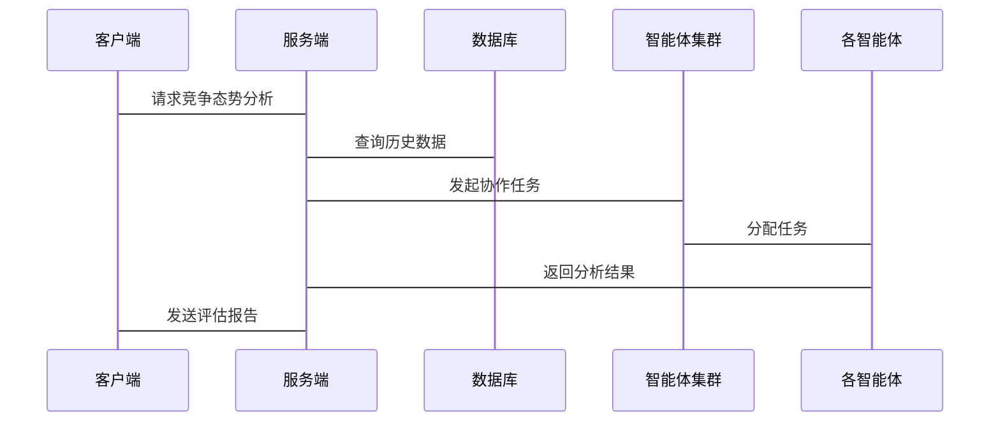

                 


# 利用多智能体AI实现动态竞争格局评估

> 关键词：多智能体AI，动态竞争格局，竞争态势分析，博弈论，系统架构设计，算法实现

> 摘要：本文系统地探讨了如何利用多智能体AI技术实现动态竞争格局的评估。通过分析多智能体AI的核心概念、算法原理、系统架构设计以及实际项目实现，本文为读者提供了从理论到实践的全面指导。文章首先介绍了动态竞争格局评估的背景和意义，然后详细阐述了多智能体AI的基本原理和其在竞争分析中的应用，接着从算法实现、系统设计、项目实战等多个角度进行了深入分析，最后总结了相关经验和未来研究方向。

---

# 第一部分: 多智能体AI与动态竞争格局评估概述

## 第1章: 多智能体AI与动态竞争格局评估概述

### 1.1 多智能体AI的定义与特点

#### 1.1.1 多智能体系统的基本概念
多智能体系统（Multi-Agent System, MAS）是由多个智能体组成的分布式系统，这些智能体能够通过交互协作完成复杂任务。每个智能体都是一个独立的实体，具备感知、决策和执行能力。

#### 1.1.2 多智能体的核心特点
- **分布式性**：多个智能体协同工作，无中心化控制。
- **主动性**：智能体能够主动感知环境并采取行动。
- **反应性**：智能体能够实时响应环境变化。
- **协作性**：智能体之间通过通信和协作完成共同目标。

#### 1.1.3 多智能体与传统AI的区别
传统的单一智能体系统（如专家系统）依赖于预定义的规则，而多智能体系统通过多个智能体的协作实现动态适应。

---

### 1.2 动态竞争格局评估的定义与背景

#### 1.2.1 竞争格局评估的基本概念
竞争格局评估是指对市场中各参与者之间的关系、竞争态势和潜在影响进行分析。动态竞争格局评估则强调在实时变化的环境中，快速捕捉和分析竞争态势。

#### 1.2.2 动态竞争格局的特点
- **实时性**：需要快速响应市场变化。
- **复杂性**：涉及多方利益和不确定性。
- **动态性**：竞争态势随时间变化而变化。

#### 1.2.3 传统竞争分析方法的局限性
传统方法通常基于静态数据分析，难以应对实时变化和复杂场景。

---

### 1.3 多智能体AI在竞争格局评估中的应用

#### 1.3.1 多智能体AI的优势
- **分布式计算**：能够处理大规模数据和复杂场景。
- **协作能力**：多个智能体可以分工协作，提高效率。
- **动态适应**：能够实时响应环境变化。

#### 1.3.2 动态竞争格局评估的需求
在市场环境中，企业需要实时了解竞争对手的动态，以便制定有效的战略。

#### 1.3.3 多智能体AI的应用场景
- **金融市场**：实时分析股票市场的竞争态势。
- **电子商务**：监控竞争对手的定价策略和市场行为。
- **军事领域**：模拟敌方行动，制定应对策略。

---

## 第2章: 多智能体系统的结构与模型

### 2.1 多智能体系统的组成

#### 2.1.1 智能体的定义与分类
智能体是一种能够感知环境、做出决策并采取行动的实体。根据功能可分为简单反应型、基于模型反应型、目标驱动型和规划驱动型智能体。

#### 2.1.2 多智能体系统的层次结构
- **物理层**：智能体与环境的交互。
- **逻辑层**：智能体的感知、决策和行动。
- **通信层**：智能体之间的信息交换。

#### 2.1.3 多智能体系统的核心组件
- **智能体**：执行具体任务的实体。
- **环境**：智能体所处的外部世界。
- **通信协议**：智能体之间的交互规则。

---

### 2.2 多智能体系统的通信与协作

#### 2.2.1 智能体之间的通信机制
智能体通过消息传递进行通信，消息内容包括动作、状态和意图。

#### 2.2.2 协作任务的分配与协调
- **任务分配**：基于智能体的能力和当前状态分配任务。
- **协调机制**：通过协商和仲裁解决冲突。

#### 2.2.3 冲突解决机制
当多个智能体争夺同一资源时，需要通过优先级或规则进行仲裁。

---

### 2.3 多智能体系统的建模与仿真

#### 2.3.1 系统建模的基本方法
- **实体建模**：定义系统的各个实体及其属性。
- **行为建模**：描述智能体的决策逻辑和动作。

#### 2.3.2 多智能体仿真的实现步骤
1. 确定仿真目标。
2. 建立系统模型。
3. 实现智能体行为。
4. 进行仿真运行和结果分析。

#### 2.3.3 常见的多智能体建模工具
- **NetLogo**：广泛用于复杂系统仿真。
- **Repast**：支持多智能体建模和仿真。

---

## 第3章: 动态竞争格局评估的算法原理

### 3.1 动态竞争格局评估的核心算法

#### 3.1.1 基于多智能体的协作算法
智能体通过协作完成竞争态势分析任务。

#### 3.1.2 动态博弈论模型
利用博弈论模型描述竞争行为，分析各方的策略选择。

#### 3.1.3 竞争态势分析的数学模型
通过数学模型量化竞争态势，例如使用博弈论中的纳什均衡概念。

---

### 3.2 多智能体协作算法的实现步骤

#### 3.2.1 算法输入与输出
输入：市场数据、竞争规则；
输出：竞争态势评估结果。

#### 3.2.2 算法的执行流程
1. 初始化智能体。
2. 智能体感知环境。
3. 智能体协作完成任务。
4. 输出评估结果。

---

### 3.3 动态竞争格局评估的数学模型

#### 3.3.1 竞争态势分析的数学公式
$$ 竞争指数 = \sum_{i=1}^{n} w_i x_i $$
其中，$w_i$是权重，$x_i$是各竞争因素的指标值。

#### 3.3.2 基于博弈论的数学模型
$$ V(i, j) = \text{max}(u_i(j), u_j(i)) $$
其中，$V(i,j)$表示智能体i和j之间的博弈价值。

---

# 第四部分: 系统分析与架构设计

## 第4章: 系统分析与架构设计

### 4.1 问题场景介绍
我们需要设计一个实时动态竞争格局评估系统，用于分析多个市场参与者的竞争行为。

---

### 4.2 系统功能设计

#### 4.2.1 领域模型设计
```mermaid
classDiagram
    class 竞争态势分析系统 {
        输入数据
        竞争态势评估
        输出报告
    }
    class 智能体1 {
        竞争行为分析
        决策制定
    }
    class 智能体2 {
        市场数据采集
        竞争态势预测
    }
    竞争态势分析系统 <-->> 智能体1
    竞争态势分析系统 <-->> 智能体2
```

---

### 4.3 系统架构设计

#### 4.3.1 系统架构图
```mermaid
architecturalDiagram
    客户端 --> 服务端
    服务端 --> 数据库
    服务端 --> 智能体集群
```

---

### 4.4 系统接口设计

#### 4.4.1 接口描述
- **API接口**：提供给客户端调用的接口，例如`get_competition_trend()`。
- **消息队列**：智能体之间的通信接口。

---

### 4.5 系统交互流程

#### 4.5.1 交互流程图


---

## 第5章: 项目实战

### 5.1 环境安装

#### 5.1.1 安装Python环境
安装Python 3.x版本，并配置好开发环境。

#### 5.1.2 安装依赖库
安装以下库：
```
pip install numpy
pip install matplotlib
pip install networkx
```

---

### 5.2 系统核心实现

#### 5.2.1 核心代码
```python
class Agent:
    def __init__(self, id):
        self.id = id
        self.data = {}
    
    def感知环境(self):
        # 获取环境数据
        pass
    
    def 协作(self, other):
        # 与另一个智能体协作
        pass

class CompetitionEvaluator:
    def __init__(self, agents):
        self.agents = agents
    
    def 评估竞争态势(self):
        # 分析竞争态势
        pass
```

---

### 5.3 代码应用解读与分析

#### 5.3.1 代码功能解读
- `Agent`类：定义单个智能体的行为。
- `CompetitionEvaluator`类：负责协调多个智能体完成竞争态势评估。

---

### 5.4 实际案例分析

#### 5.4.1 案例分析
假设我们有三个智能体，分别负责数据采集、分析和预测，最终评估市场中的竞争态势。

---

## 第6章: 总结与展望

### 6.1 总结
本文详细介绍了多智能体AI在动态竞争格局评估中的应用，从理论到实践，为读者提供了全面的指导。

### 6.2 未来研究方向
- 更高效的协作算法。
- 更精确的竞争态势预测模型。

### 6.3 最佳实践 tips
- 在实际应用中，需要根据具体场景调整算法参数。
- 确保数据质量和实时性。

---

通过以上结构，您可以系统地撰写一篇关于《利用多智能体AI实现动态竞争格局评估》的高质量技术博客文章。

