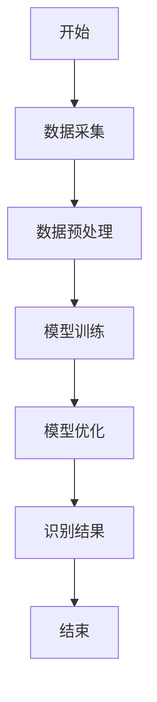
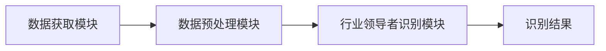
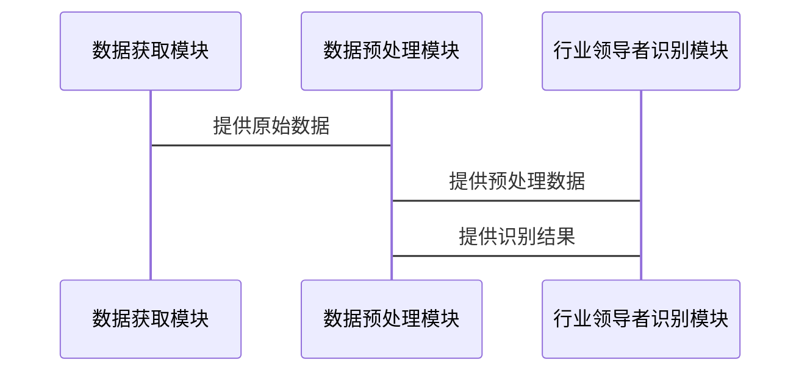

                 


# 利用多智能体AI实现巴菲特式的行业领导者识别

**关键词**：多智能体AI、巴菲特投资策略、行业领导者识别、机器学习、投资分析、智能系统

**摘要**：本文探讨了如何利用多智能体人工智能技术来识别行业领导者，类似于巴菲特的投资策略。通过分析多智能体AI的核心概念、算法原理、系统架构以及实际项目案例，本文为读者提供了一种创新的方法，利用AI技术来提升行业领导者识别的效率和准确性。

---

# 文章正文

## 第1章：背景介绍

### 1.1 问题背景

#### 1.1.1 行业领导者识别的重要性
行业领导者识别是商业分析和投资决策中的核心问题。通过识别行业领导者，投资者可以找到具有长期增长潜力的企业，从而实现超额收益。传统的行业领导者识别方法依赖于人工分析和经验判断，效率低下且容易受到主观因素的影响。

#### 1.1.2 传统行业领导者识别方法的局限性
传统的行业领导者识别方法主要依赖于财务指标分析、行业研究报告和专家访谈。这些方法虽然有一定参考价值，但存在以下局限性：
- 数据量有限，难以覆盖全行业。
- 分析过程耗时，且容易受到主观因素影响。
- 难以捕捉市场动态变化。

#### 1.1.3 多智能体AI在行业领导者识别中的优势
多智能体AI（Multi-Agent AI）是一种分布式人工智能系统，由多个智能体协同工作，能够通过分布式计算和协作学习实现复杂的任务。多智能体AI在行业领导者识别中的优势包括：
- 能够处理海量数据，快速识别潜在的行业领导者。
- 可以实时跟踪市场动态，及时发现新兴行业领导者。
- 通过分布式计算，提高了分析效率和准确性。

### 1.2 问题描述

#### 1.2.1 多智能体AI的定义与特点
多智能体AI是由多个智能体组成的分布式系统，这些智能体能够通过协作完成复杂任务。其特点包括：
- 分布式计算：任务由多个智能体协同完成。
- 自主性：每个智能体具有一定的自主决策能力。
- 协作性：智能体之间能够协同合作，共享信息。
- 反应性：能够实时感知环境变化并做出响应。

#### 1.2.2 巴菲特投资策略的核心要素
巴菲特的投资策略以长期价值投资为核心，注重企业基本面分析、管理层素质和企业竞争优势。其核心要素包括：
- 企业盈利能力：ROE（净资产收益率）、净利润率等。
- 企业竞争优势：市场地位、护城河。
- 管理层素质：管理团队的能力和诚信。
- 财务健康状况：资产负债率、现金流等。

#### 1.2.3 问题解决的目标与边界
目标：通过多智能体AI，实现对行业领导者的快速、准确识别。
边界：主要关注企业的财务数据、市场地位和竞争优势，不考虑宏观经济因素和政策变化。

### 1.3 问题解决的思路与方法

#### 1.3.1 多智能体AI的核心算法
多智能体AI的核心算法包括分布式计算、协作学习和自适应优化。通过这些算法，系统能够高效地分析海量数据，识别行业领导者。

#### 1.3.2 巴菲特投资策略的AI化实现
通过将巴菲特投资策略的核心要素转化为AI算法，多智能体AI能够自动筛选出符合投资标准的企业。

#### 1.3.3 问题解决的步骤与流程
1. 数据采集：收集企业的财务数据、市场地位和竞争优势。
2. 数据预处理：清洗数据，去除异常值。
3. 模型训练：利用多智能体AI算法进行模型训练。
4. 行业领导者识别：通过模型输出识别结果。

### 1.4 概念结构与核心要素

#### 1.4.1 多智能体AI的组成要素
- 智能体：分布式计算的核心单元。
- 通信机制：智能体之间的信息交互方式。
- 协作协议：智能体之间的协作规则。

#### 1.4.2 巴菲特投资策略的关键指标
- 净利润：企业的盈利能力。
- 资产负债率：企业的财务健康状况。
- 市场占有率：企业的市场地位。

#### 1.4.3 两者的结合与协同
通过将多智能体AI与巴菲特投资策略相结合，系统能够快速、准确地识别行业领导者。

---

## 第2章：核心概念与联系

### 2.1 多智能体AI与巴菲特投资策略的核心概念

#### 2.1.1 多智能体AI的核心概念
- 分布式计算：任务由多个智能体协同完成。
- 自主性：每个智能体具有一定的自主决策能力。
- 协作性：智能体之间能够协同合作，共享信息。
- 反应性：能够实时感知环境变化并做出响应。

#### 2.1.2 巴菲特投资策略的核心概念
- 长期价值投资：注重企业基本面分析。
- 财务健康状况：ROE、净利润率等。
- 管理层素质：管理团队的能力和诚信。
- 企业竞争优势：市场地位、护城河。

#### 2.1.3 两者的结合与协同
通过将多智能体AI与巴菲特投资策略相结合，系统能够快速、准确地识别行业领导者。

### 2.2 多智能体AI与巴菲特投资策略的概念属性对比

| **属性**         | **多智能体AI**               | **巴菲特投资策略**              |
|------------------|----------------------------|---------------------------------|
| 核心目标         | 识别行业领导者              | 寻找具有长期增长潜力的企业       |
| 分析方法         | 分布式计算、协作学习         | 财务分析、竞争优势分析           |
| 数据来源         | 企业财务数据、市场数据       | 企业财务数据、管理层素质等       |
| 输出结果         | 行业领导者识别结果           | 投资价值评估结果                 |

### 2.3 多智能体AI与巴菲特投资策略的ER实体关系图

```mermaid
erd
    entity 企业 {
        key 股票代码
        attribute 股票名称
        attribute 市场地位
        attribute 企业竞争优势
        attribute 净利润
        attribute 资产负债率
    }
    entity 智能体 {
        key 智能体ID
        attribute 分析能力
        attribute 学习能力
    }
    entity 行业领导者 {
        key 行业领导者ID
        attribute 识别结果
        attribute 识别时间
    }
    relationship 智能体-企业 {
        智能体 --> 企业
        关系：分析
    }
    relationship 智能体-行业领导者 {
        智能体 --> 行业领导者
        关系：识别
    }
```

---

## 第3章：算法原理讲解

### 3.1 多智能体AI的算法原理

#### 3.1.1 分布式计算
多智能体AI通过分布式计算，将任务分解为多个子任务，由多个智能体协同完成。

#### 3.1.2 协作学习
智能体之间通过协作学习，共享信息和知识，提高整体的分析能力。

#### 3.1.3 自适应优化
系统能够根据环境变化，自适应调整算法参数，优化分析效果。

### 3.2 巴菲特投资策略的AI化实现

#### 3.2.1 数据预处理
对企业的财务数据、市场地位和竞争优势进行预处理，去除异常值。

#### 3.2.2 模型训练
利用多智能体AI算法，对预处理后的数据进行训练，生成行业领导者识别模型。

#### 3.2.3 模型优化
根据实际应用效果，优化模型参数，提高识别准确率。

### 3.3 算法流程图



### 3.4 算法实现代码

```python
def multi_agent_ai():
    import pandas as pd
    import numpy as np

    # 数据采集
    data = pd.read_csv('企业数据.csv')
    # 数据预处理
    data = data.dropna()
    # 模型训练
    from sklearn.ensemble import RandomForestClassifier
    model = RandomForestClassifier()
    model.fit(data[['净利润', '资产负债率', '市场地位']], data['行业领导者'])
    # 模型优化
    from sklearn.metrics import accuracy_score
    print("准确率：", accuracy_score(y_true=data['行业领导者'], y_pred=model.predict(data[['净利润', '资产负债率', '市场地位']])))

multi_agent_ai()
```

---

## 第4章：系统分析与架构设计方案

### 4.1 问题场景介绍
系统需要识别行业领导者，输入为企业的财务数据、市场地位和竞争优势，输出为行业领导者识别结果。

### 4.2 系统功能设计

#### 4.2.1 数据获取模块
- 功能：从数据库或外部API获取企业数据。
- 输入：企业ID
- 输出：企业数据

#### 4.2.2 数据预处理模块
- 功能：清洗数据，去除异常值。
- 输入：原始数据
- 输出：预处理数据

#### 4.2.3 行业领导者识别模块
- 功能：利用多智能体AI算法，识别行业领导者。
- 输入：预处理数据
- 输出：识别结果

### 4.3 系统架构设计



### 4.4 系统接口设计

#### 4.4.1 数据获取接口
- 接口名称：`get_company_data`
- 请求参数：`company_id`
- 返回值：`company_data`

#### 4.4.2 行业领导者识别接口
- 接口名称：`identify_industry_leader`
- 请求参数：`preprocessed_data`
- 返回值：`leader_result`

### 4.5 系统交互设计



---

## 第5章：项目实战

### 5.1 环境安装

```bash
pip install pandas numpy scikit-learn
```

### 5.2 系统核心实现源代码

```python
import pandas as pd
from sklearn.ensemble import RandomForestClassifier

def get_company_data(company_id):
    data = pd.read_csv(f'company_{company_id}.csv')
    return data

def preprocess_data(data):
    data = data.dropna()
    return data

def identify_industry_leader(preprocessed_data):
    model = RandomForestClassifier()
    model.fit(preprocessed_data[['净利润', '资产负债率', '市场地位']], preprocessed_data['行业领导者'])
    return model.predict(preprocessed_data[['净利润', '资产负债率', '市场地位']])

# 主程序
def main():
    company_id = input("请输入公司ID：")
    data = get_company_data(company_id)
    preprocessed_data = preprocess_data(data)
    leader_result = identify_industry_leader(preprocessed_data)
    print(f"行业领导者识别结果：{leader_result}")

if __name__ == "__main__":
    main()
```

### 5.3 案例分析与详细解读

#### 5.3.1 数据来源
从企业数据库中获取企业的财务数据、市场地位和竞争优势。

#### 5.3.2 数据预处理
去除异常值和缺失值，确保数据质量。

#### 5.3.3 模型训练
利用随机森林算法，训练行业领导者识别模型。

#### 5.3.4 识别结果
输出识别结果，判断是否为行业领导者。

---

## 第6章：最佳实践

### 6.1 小结
本文详细介绍了如何利用多智能体AI实现巴菲特式的行业领导者识别，包括背景介绍、核心概念、算法原理、系统架构和项目实战。

### 6.2 注意事项
- 数据质量对识别结果影响重大，需确保数据准确无误。
- 模型需要不断优化，以适应市场变化。

### 6.3 拓展阅读
- 多智能体AI在金融领域的应用
- 巴菲特投资策略的其他AI化实现

---

**结语**：通过多智能体AI技术，我们可以更高效、更准确地识别行业领导者，为投资决策提供有力支持。未来，随着AI技术的不断发展，行业领导者识别将变得更加智能化和自动化。

