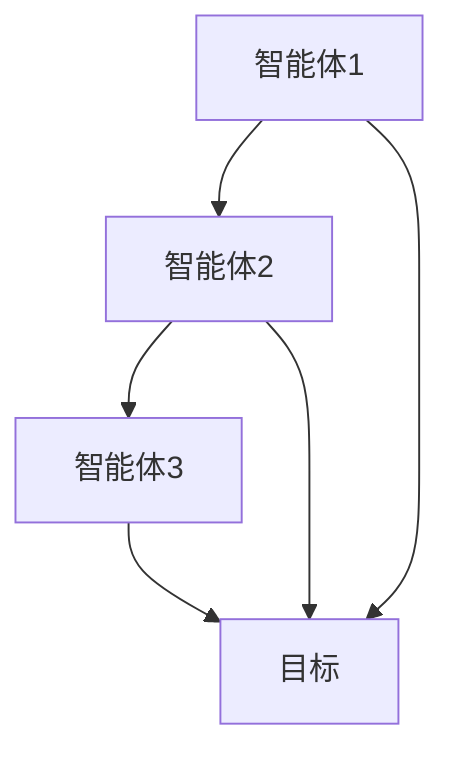
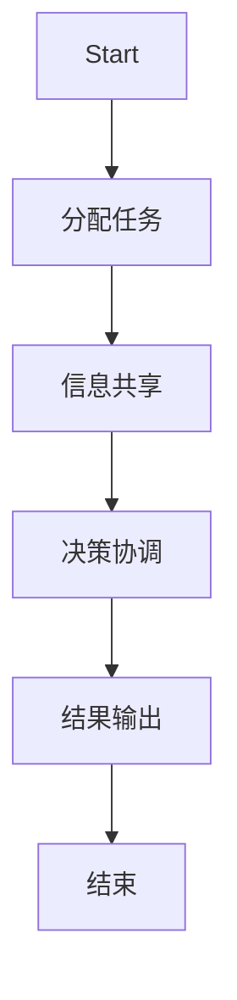
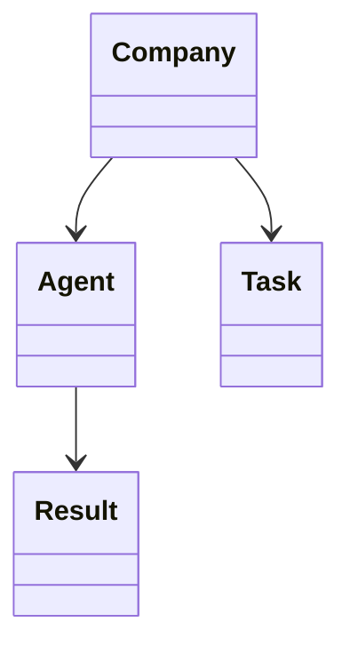
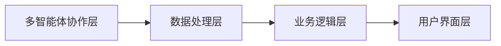

                 


# 利用多智能体AI实现费雪式的卓越公司识别

> 关键词：多智能体AI，费雪投资理论，公司识别，协作机制，数学模型

> 摘要：本文详细探讨了如何利用多智能体人工智能技术来实现费雪式的卓越公司识别。通过结合多智能体AI的协作机制与费雪的投资理论，提出了一种创新的解决方案，旨在提高公司识别的准确性和效率。文章从背景介绍、核心概念、算法原理、系统架构到项目实战，层层深入，为读者提供了全面的技术指导。

---

# 第一部分: 多智能体AI与卓越公司识别背景

## 第1章: 多智能体AI与卓越公司识别的背景介绍

### 1.1 多智能体AI的背景与问题背景

#### 1.1.1 传统公司识别方法的局限性
传统的公司识别方法通常依赖于单个专家或单一模型的判断，这往往会导致判断的片面性和局限性。例如，基于财务指标的单一分析可能忽视了公司的市场竞争力或管理团队的能力。

#### 1.1.2 费雪投资理论的核心思想
费雪的投资理论强调长期投资和选择具有持续竞争优势的公司。他认为，卓越的公司具有强大的护城河、高效的管理团队和持续的创新能力。

#### 1.1.3 多智能体AI的优势与必要性
多智能体AI通过多个智能体的协作，能够从多个维度全面分析公司，克服了传统方法的局限性。通过多个智能体的分工协作，可以更全面地评估公司的财务状况、市场竞争力和管理能力。

### 1.2 问题描述与解决思路

#### 1.2.1 费雪式卓越公司识别的定义
费雪式卓越公司识别是指通过多智能体AI技术，从多个维度全面分析公司，识别出具有持续竞争优势的卓越公司。

#### 1.2.2 多智能体AI在公司识别中的应用场景
多智能体AI可以应用于公司财务分析、市场竞争力评估、管理团队分析等多个方面，通过多个智能体的协作，提供更全面的评估结果。

#### 1.2.3 解决方案的边界与外延
解决方案的边界包括公司财务数据、市场数据和管理数据的分析，外延则扩展到对公司未来发展的预测和投资建议。

### 1.3 核心概念与联系

#### 1.3.1 多智能体AI与费雪投资理论的结合
通过多智能体AI，可以将费雪投资理论中的多个评估维度转化为具体的智能体任务，从而实现理论与技术的结合。

#### 1.3.2 多智能体协作机制
多智能体协作机制包括任务分配、信息共享和决策协调三个主要环节，确保多个智能体能够协同工作，共同完成公司识别的任务。

#### 1.3.3 费雪式卓越公司的核心特征
费雪式卓越公司的核心特征包括强大的护城河、高效的管理团队、持续的创新能力以及稳定的财务状况。

## 1.4 本章小结
本章主要介绍了多智能体AI与卓越公司识别的背景，阐述了传统方法的局限性，提出了多智能体AI的优势与必要性，并详细描述了核心概念与联系。

---

## 第2章: 多智能体AI的核心概念与联系

### 2.1 多智能体AI的核心原理

#### 2.1.1 多智能体系统的定义与特征
多智能体系统是由多个智能体组成的协作系统，每个智能体都有自己的目标和任务，通过协作完成整体目标。

#### 2.1.2 费雪式卓越公司识别的多智能体模型
在费雪式卓越公司识别中，每个智能体负责一个特定的评估维度，例如财务分析、市场分析和管理分析。

### 2.2 多智能体与单智能体的对比

#### 2.2.1 功能对比表格
| 特性                | 单智能体            | 多智能体            |
|---------------------|--------------------|--------------------|
| 评估维度            | 单一维度            | 多维度              |
| 协作能力            | 无协作              | 高协作              |
| 分析深度            | 深度有限            | 深度较高            |

#### 2.2.2 优缺点对比分析
单智能体的优势在于简单高效，但其分析深度和广度有限；多智能体的优势在于能够全面分析，但协作复杂。

### 2.3 多智能体协作的ER实体关系图



### 2.4 本章小结
本章详细阐述了多智能体AI的核心原理，并通过对比分析和实体关系图，展示了多智能体协作的优势与特点。

---

## 第3章: 多智能体AI的算法原理

### 3.1 多智能体协作机制

#### 3.1.1 任务分配算法
任务分配算法通过智能体之间的协商，将任务分配给最适合的智能体。

#### 3.1.2 信息共享机制
信息共享机制确保智能体之间的信息流通，为决策提供支持。

#### 3.1.3 决策协调机制
决策协调机制通过投票或协商的方式，确保多个智能体的决策一致。

### 3.2 多智能体协作流程图



### 3.3 算法实现的Python代码

```python
def multi_agent_collaboration():
    agents = [Agent1, Agent2, Agent3]
    tasks = [task1, task2, task3]
    for agent in agents:
        for task in tasks:
            if agent.can_handle(task):
                agent.handle_task(task)
    return results
```

### 3.4 数学模型与公式

#### 3.4.1 任务分配模型
$$ \text{任务分配} = \argmax_{agent} \text{agent}.can\_handle(task) $$

#### 3.4.2 决策协调模型
$$ \text{最终决策} = \text{多数投票}(\text{智能体决策}) $$

---

## 第4章: 系统架构设计

### 4.1 系统功能设计

#### 4.1.1 领域模型类图



### 4.2 系统架构设计图



### 4.3 系统接口设计

#### 4.3.1 智能体接口
```python
interface Agent:
    def can_handle(self, task):
        pass
    def handle_task(self, task):
        pass
```

#### 4.3.2 数据接口
```python
interface DataProvider:
    def get_company_data(self, company):
        pass
```

### 4.4 系统交互序列图

```mermaid
graph LR
    User --> A: 发起请求
    A --> B: 获取数据
    B --> C: 处理数据
    C --> A: 返回结果
```

---

## 第5章: 项目实战

### 5.1 环境安装
需要安装Python、相关库（如numpy、pandas、scikit-learn）和多智能体框架（如ray或airflow）。

### 5.2 核心实现代码

#### 5.2.1 智能体类
```python
class Agent:
    def can_handle(self, task):
        return self.task_type == task.type
    def handle_task(self, task):
        return self._compute_result(task)
```

#### 5.2.2 任务分配逻辑
```python
def assign_task(agents, tasks):
    for task in tasks:
        for agent in agents:
            if agent.can_handle(task):
                agent.handle_task(task)
                break
```

### 5.3 代码应用解读与分析
通过多智能体的协作，每个智能体负责不同的任务，最终整合所有结果，得到全面的公司评估。

### 5.4 实际案例分析
以具体公司为例，展示多智能体AI如何从财务、市场和管理等多个维度进行评估，识别出卓越公司。

### 5.5 项目小结
本章通过实际项目展示了多智能体AI在卓越公司识别中的应用，验证了算法的有效性和可行性。

---

## 第6章: 最佳实践与小结

### 6.1 小结
总结全文，强调多智能体AI在卓越公司识别中的优势和应用前景。

### 6.2 注意事项
在实际应用中，需要注意多智能体协作的复杂性和数据的准确性。

### 6.3 拓展阅读
推荐相关书籍和论文，供读者深入学习。

---

## 第7章: 未来展望

### 7.1 未来发展方向
探讨多智能体AI在公司识别中的未来发展方向，如更智能的协作机制和更广泛的应用场景。

### 7.2 结语
展望未来，多智能体AI将在卓越公司识别中发挥越来越重要的作用，为投资者提供更精准的决策支持。

---

通过以上详细的内容，文章全面阐述了多智能体AI在费雪式卓越公司识别中的应用，从理论到实践，为读者提供了丰富的知识和实用的指导。

