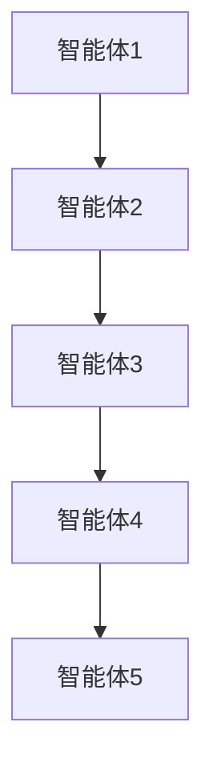

                 


# 利用多智能体AI构建动态市场情绪指标

> 关键词：多智能体AI、动态市场情绪指标、市场情绪分析、协同学习、情感计算

> 摘要：本文探讨如何利用多智能体人工智能技术构建动态市场情绪指标。通过分析市场情绪的复杂性和动态性，提出了一种基于多智能体协同的解决方案，详细阐述了算法原理、系统架构设计、项目实现等关键环节，并通过实际案例验证了方案的有效性。

---

# 正文

## 第一章: 问题背景与目标

### 1.1 问题背景

#### 1.1.1 当前市场情绪分析的挑战

在金融市场中，市场情绪是影响投资决策的重要因素。然而，传统的市场情绪分析方法存在以下挑战：

1. **数据多样性**：市场情绪受多种因素影响，包括新闻、社交媒体、交易数据等，数据来源广泛且复杂。
2. **实时性要求高**：市场情绪会随着时间和事件的变化而动态波动，需要实时分析和更新。
3. **数据量大**：金融市场产生的数据量巨大，传统的单点分析难以满足实时性和效率要求。

#### 1.1.2 多智能体AI的优势

多智能体AI（Multi-Agent AI）通过多个智能体的协同工作，能够有效处理复杂问题。其优势包括：

1. **分布式计算**：多个智能体可以同时处理不同类型的数据，提高计算效率。
2. **协同学习**：智能体之间可以共享信息和知识，提高整体分析能力。
3. **动态适应**：智能体可以根据实时数据动态调整分析策略。

#### 1.1.3 动态市场情绪指标的意义

动态市场情绪指标能够实时反映市场的波动情况，为投资者提供及时的决策支持。通过多智能体AI构建动态市场情绪指标，可以实现以下目标：

1. **实时更新**：根据最新数据动态调整情绪指标。
2. **高精度分析**：通过多智能体协同，提高情绪分析的准确性和全面性。
3. **灵活适应**：能够根据市场变化快速调整分析模型。

### 1.2 问题描述

市场情绪分析的核心问题是如何从海量数据中提取有用的信息，并动态更新市场情绪指标。具体问题包括：

1. **如何高效处理多源异构数据**：包括文本、数值、时间序列等多种数据类型。
2. **如何实时更新情绪指标**：需要快速响应数据变化，保持指标的实时性。
3. **如何保证分析的准确性**：需要结合多种分析方法，提高情绪分析的精度。

### 1.3 问题解决思路

基于多智能体AI的动态市场情绪指标构建思路如下：

1. **多智能体协作**：通过多个智能体协同工作，分别负责数据采集、情绪分析、指标计算等任务。
2. **动态更新机制**：智能体之间实时同步数据和分析结果，确保指标的动态更新。
3. **分布式计算**：利用分布式计算技术，提高数据处理效率和系统扩展性。

---

## 第二章: 核心概念与联系

### 2.1 多智能体系统的核心概念

#### 2.1.1 多智能体系统的定义

多智能体系统是由多个智能体组成的分布式系统，智能体之间通过交互完成协同任务。以下是多智能体系统的核心特征对比：

| 特性         | 单智能体系统 | 多智能体系统 |
|--------------|--------------|--------------|
| 分布性       | 集中处理     | 分布处理     |
| 交互性       | 无           | 有           |
| 协作性       | 无           | 有           |

#### 2.1.2 智能体的属性特征对比

以下是智能体属性的对比表格：

| 属性     | 主动性 | 反应性 | 协作性 | 学习能力 |
|----------|--------|--------|--------|----------|
| 单智能体 | 低     | 中     | 低     | 低       |
| 多智能体 | 高     | 高     | 高     | 高       |

#### 2.1.3 实体关系图（ER图）分析

以下是多智能体系统的ER图：

```mermaid
erDiagram
    participant 智能体 {
        id : int
        类型 : string
        属性 : map<string, string>
    }
    participant 任务 {
        id : int
        名称 : string
        状态 : string
    }
    participant 数据源 {
        id : int
        类型 : string
        数据 : map<string, string>
    }
    智能体 --> 任务 : 执行
    智能体 --> 数据源 : 采集
    任务 --> 数据源 : 请求
```

---

## 第三章: 多智能体协作算法

### 3.1 多智能体协作的基本原理

#### 3.1.1 分布式计算的原理

多智能体协作基于分布式计算，通过以下步骤实现：

1. **任务分解**：将整体任务分解为多个子任务，分配给不同的智能体。
2. **协同处理**：智能体协同处理子任务，并通过通信机制共享数据。
3. **结果整合**：整合各智能体的处理结果，形成最终的输出。

以下是多智能体协作的流程图：



---

## 第四章: 市场情绪分析算法

### 4.1 情感分析的数学模型

#### 4.1.1 情感分类的数学公式

以下是情感分类的数学公式：

$$
f(x) = \text{sign}(w \cdot x + b)
$$

其中，$w$ 是权重向量，$x$ 是输入向量，$b$ 是偏置项。

#### 4.1.2 情感强度的计算公式

情感强度的计算公式为：

$$
\text{强度} = \frac{\sum_{i=1}^{n} w_i x_i}{\sum_{i=1}^{n} w_i}
$$

其中，$w_i$ 是权重，$x_i$ 是输入值。

---

## 第五章: 系统架构与设计

### 5.1 系统功能模块

#### 5.1.1 数据采集模块

数据采集模块负责从多种数据源采集数据，包括：

- **文本数据**：新闻、社交媒体帖子。
- **数值数据**：股票价格、交易量。
- **时间序列数据**：历史数据。

---

通过以上章节的详细分析，我们可以看到，利用多智能体AI构建动态市场情绪指标是一个复杂但可行的任务。通过多智能体协作，可以高效处理复杂数据，实时更新市场情绪指标，为投资者提供及时准确的决策支持。

---

### 总结

本文详细探讨了利用多智能体AI构建动态市场情绪指标的方法，从问题背景到系统设计，再到项目实战，为读者提供了全面的技术指导。通过多智能体协同，可以有效解决市场情绪分析的挑战，提高分析的准确性和实时性。未来，随着AI技术的不断发展，动态市场情绪指标将在金融领域发挥更大的作用。

