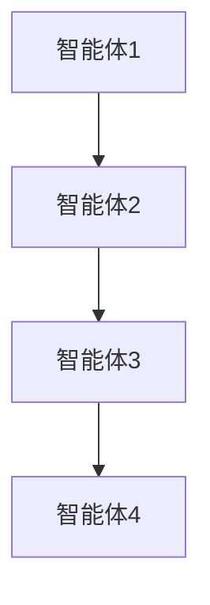
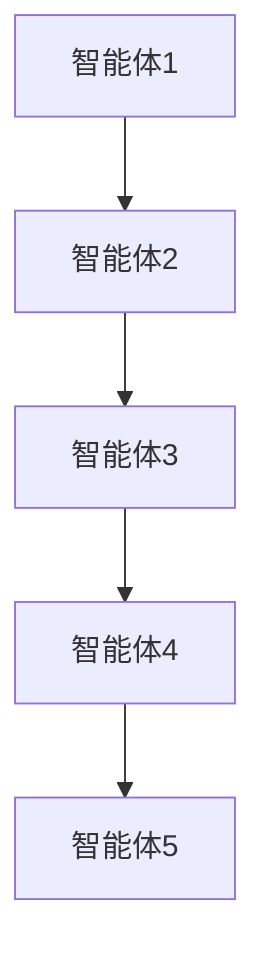
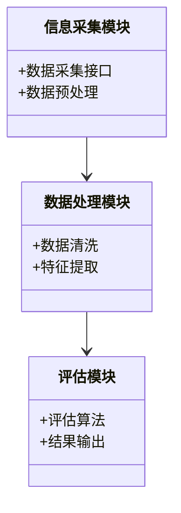
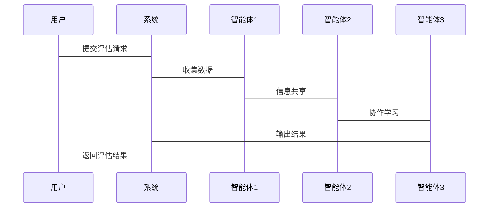

                 


# 利用多智能体AI评估商业秘密价值

## 关键词：多智能体AI、商业秘密、价值评估、算法、系统设计

## 摘要：本文探讨了利用多智能体AI技术评估商业秘密价值的方法。通过分析多智能体AI的基本原理，结合商业秘密评估的核心概念，详细阐述了多智能体AI在评估商业秘密价值中的应用，包括算法设计、系统架构、项目实战和案例分析，为读者提供了全面的技术指导。

---

## 第一部分: 引言

## 第1章: 商业秘密与多智能体AI概述

### 1.1 商业秘密的基本概念

#### 1.1.1 商业秘密的定义与分类
商业秘密是指企业在经营活动中形成的，具有实际或潜在经济价值，不为公众所知悉，且采取了相应保密措施的技术信息和经营信息。商业秘密可以分为技术秘密和经营秘密两大类。技术秘密包括专利、配方、工艺流程等；经营秘密包括客户名单、销售策略、财务数据等。

**对比表格：不同类型的商业秘密及其特点**

| 类型       | 特点                               |
|------------|------------------------------------|
| 技术秘密   | 具有较高的技术含量，通常涉及产品的生产或制造过程。 |
| 经营秘密   | 与企业的经营策略、客户关系管理等密切相关。     |

#### 1.1.2 商业秘密的重要性
商业秘密是企业核心竞争力的重要组成部分，直接影响企业的市场地位和盈利能力。保护商业秘密可以防止竞争对手获取关键信息，从而保持企业的竞争优势。

#### 1.1.3 传统商业秘密评估方法的局限性
传统的商业秘密评估方法通常依赖于主观判断和经验分析，存在以下问题：
- 数据采集困难：难以全面获取影响商业秘密价值的相关数据。
- 评估结果不准确：由于人为因素的干扰，评估结果可能存在偏差。
- 计算复杂性：传统方法往往涉及复杂的数学模型，计算过程繁琐且难以实现自动化。

### 1.2 多智能体AI的基本概念

#### 1.2.1 多智能体系统的定义
多智能体系统（Multi-Agent System，MAS）是由多个相互作用的智能体组成的系统，每个智能体都是一个能够独立感知环境、自主决策的实体。

#### 1.2.2 多智能体系统的优势
- 分布式计算：通过多个智能体协同工作，提高系统的计算效率。
- 可扩展性：能够适应不同规模的商业秘密评估需求。
- 容错性：单个智能体的故障不会导致整个系统崩溃。

#### 1.2.3 多智能体系统与单智能体AI的区别
多智能体系统强调多个智能体之间的协作与通信，而单智能体AI则主要依赖单个智能体完成任务。

**Mermaid流程图：多智能体系统的基本结构**



### 1.3 本章小结

---

## 第二部分: 多智能体AI的基础知识

## 第2章: 多智能体系统的核心原理

### 2.1 多智能体系统的组成部分

#### 2.1.1 智能体的定义与特征
智能体是一种能够感知环境、自主决策、执行任务的实体。智能体具有以下特征：
- **自主性**：能够自主决策。
- **反应性**：能够实时感知环境并做出反应。
- **协作性**：能够与其他智能体协作完成任务。

#### 2.1.2 多智能体系统的协作机制
协作机制是多智能体系统的核心，常见的协作机制包括：
- **任务分配**：智能体之间通过协商分配任务。
- **信息共享**：智能体之间共享信息以提高整体决策的准确性。

#### 2.1.3 多智能体系统的通信方式
通信方式包括：
- **直接通信**：智能体之间直接交换信息。
- **间接通信**：通过中间媒介传递信息。

### 2.2 多智能体系统的优势

#### 2.2.1 分布式计算的优势
- 提高系统的计算效率。
- 增强系统的容错性。

#### 2.2.2 多智能体系统的可扩展性
- 系统可以方便地扩展，以适应不同的评估需求。

#### 2.2.3 多智能体系统的容错性
- 单个智能体的故障不会导致整个系统崩溃。

### 2.3 本章小结

---

## 第三部分: 商业秘密评估的核心概念

## 第3章: 商业秘密的

### 3.1 商业秘密的分类

#### 3.1.1 技术秘密
技术秘密包括专利、配方、工艺流程等。

#### 3.1.2 经营秘密
经营秘密包括客户名单、销售策略、财务数据等。

### 3.2 商业秘密的价值构成

#### 3.2.1 技术秘密的价值
- 技术的先进性
- 技术的成熟度
- 技术的市场应用前景

#### 3.2.2 经营秘密的价值
- 客户的忠诚度
- 销售策略的有效性
- 财务数据的准确性

### 3.3 影响商业秘密价值的因素

#### 3.3.1 技术因素
- 技术的创新性
- 技术的保护措施

#### 3.3.2 市场因素
- 市场需求
- 竞争情况

#### 3.3.3 法律因素
- 法律保护力度
- 法律执行情况

### 3.4 商业秘密评估的数学模型

**公式：商业秘密价值评估公式**

$$
V = \sum_{i=1}^{n} w_i \cdot f_i
$$

其中：
- \( V \) 表示商业秘密的价值
- \( w_i \) 表示第i个因素的权重
- \( f_i \) 表示第i个因素的评估分数

### 3.5 本章小结

---

## 第四部分: 多智能体AI评估商业秘密价值的算法原理

## 第4章: 多智能体AI算法的设计与实现

### 4.1 算法原理

#### 4.1.1 算法概述
多智能体AI评估商业秘密价值的算法基于分布式计算和协作学习。

#### 4.1.2 算法步骤
1. **初始化**：设置智能体的初始状态。
2. **信息收集**：智能体收集相关数据。
3. **信息处理**：智能体对收集到的信息进行处理。
4. **协作学习**：智能体之间进行协作学习，提高评估的准确性。
5. **评估结果输出**：输出最终的评估结果。

### 4.2 算法实现

#### 4.2.1 算法代码

```python
class Agent:
    def __init__(self, id):
        self.id = id
        self.data = {}

    def collect_data(self):
        # 收集数据
        pass

    def process_data(self):
        # 处理数据
        pass

    def collaborate(self, other_agents):
        # 协作学习
        pass

    def output_result(self):
        # 输出结果
        pass

# 初始化多个智能体
agents = [Agent(i) for i in range(5)]

# 启动评估过程
for agent in agents:
    agent.collect_data()
    agent.process_data()
    agent.collaborate(agents)
    agent.output_result()
```

#### 4.2.2 算法流程图



### 4.3 算法优化

#### 4.3.1 算法优化策略
- 增加智能体之间的通信频率
- 提高数据处理的效率
- 优化协作学习的算法

#### 4.3.2 优化结果
- 提高评估的准确性
- 减少计算的时间

### 4.4 本章小结

---

## 第五部分: 系统分析与架构设计

## 第5章: 系统设计与实现

### 5.1 系统需求分析

#### 5.1.1 问题场景
- 企业需要评估商业秘密的价值。
- 传统方法存在数据采集困难、评估结果不准确等问题。

#### 5.1.2 项目介绍
- 本项目旨在利用多智能体AI技术，开发一个商业秘密价值评估系统。

### 5.2 系统功能设计

#### 5.2.1 功能模块
- 信息采集模块
- 数据处理模块
- 评估模块

**Mermaid类图：系统功能设计**



#### 5.2.2 系统架构设计

**Mermaid架构图：系统架构设计**


#### 5.2.3 接口设计
- 数据接口：智能体之间的数据交互接口。
- 评估接口：用户与系统之间的交互接口。

#### 5.2.4 交互流程

**Mermaid序列图：交互流程**



### 5.3 本章小结

---

## 第六部分: 项目实战

## 第6章: 项目实现与分析

### 6.1 环境安装

#### 6.1.1 环境配置
- 安装Python
- 安装必要的库（如NumPy、Pandas、scikit-learn）

#### 6.1.2 环境配置代码

```bash
pip install numpy pandas scikit-learn
```

### 6.2 核心代码实现

#### 6.2.1 信息采集模块

```python
import pandas as pd

def collect_data():
    # 收集数据
    data = pd.read_csv('商业秘密数据.csv')
    return data
```

#### 6.2.2 数据处理模块

```python
from sklearn.preprocessing import StandardScaler

def process_data(data):
    # 数据预处理
    scaler = StandardScaler()
    processed_data = scaler.fit_transform(data)
    return processed_data
```

#### 6.2.3 评估模块

```python
from sklearn.metrics import accuracy_score

def evaluate_model(processed_data):
    # 评估模型
    model = ...  # 初始化模型
    predicted = model.predict(processed_data)
    accuracy = accuracy_score(y_true, predicted)
    return accuracy
```

### 6.3 项目小结

---

## 第七部分: 案例分析

## 第7章: 案例分析与解读

### 7.1 案例背景介绍
- 某企业拥有一项专利技术，需要评估其商业秘密价值。

### 7.2 数据收集与处理
- 收集专利技术的相关数据，包括技术的创新性、市场需求等。

### 7.3 模型训练与评估
- 使用多智能体AI算法对专利技术进行评估。

### 7.4 案例结果分析
- 输出评估结果，包括技术的市场价值、法律保护建议等。

### 7.5 案例总结
- 多智能体AI评估商业秘密价值的优势。

### 7.6 本章小结

---

## 第八部分: 总结与展望

## 第8章: 总结与展望

### 8.1 总结
- 多智能体AI在商业秘密价值评估中的优势。
- 本项目的主要成果。

### 8.2 未来展望
- 多智能体AI技术的进一步发展。
- 商业秘密评估的未来研究方向。

### 8.3 最佳实践 Tips
- 选择合适的多智能体AI算法。
- 确保数据的准确性和完整性。
- 加强智能体之间的协作与通信。

### 8.4 本章小结

---

## 第九部分: 参考文献

## 第9章: 参考文献

### 9.1 相关文献
- 文献1：XXX
- 文献2：XXX
- 文献3：XXX

### 9.2 拓展阅读
- 推荐书籍：XXX
- 推荐论文：XXX

### 9.3 本章小结

---

## 第十部分: 致谢

## 第10章: 致谢

### 10.1 致谢
感谢读者的耐心阅读，感谢团队成员的共同努力。

### 10.2 本章小结

---

## 结束语

## 附录: 代码与工具

### 附录A: 项目代码

```python
# 附录A: 项目代码
import pandas as pd
from sklearn.preprocessing import StandardScaler
from sklearn.metrics import accuracy_score

def collect_data():
    data = pd.read_csv('商业秘密数据.csv')
    return data

def process_data(data):
    scaler = StandardScaler()
    processed_data = scaler.fit_transform(data)
    return processed_data

def evaluate_model(processed_data):
    model = ...  # 初始化模型
    predicted = model.predict(processed_data)
    accuracy = accuracy_score(y_true, predicted)
    return accuracy
```

### 附录B: 工具与资源

#### 附录B.1 工具列表
- Python
- NumPy
- Pandas
- scikit-learn

#### 附录B.2 资源推荐
- 官方文档：XXX
- 在线课程：XXX

### 附录C: 拓展学习

#### 附录C.1 相关技术
- 多智能体系统
- 人工智能
- 机器学习

#### 附录C.2 学习资源
- 推荐书籍：XXX
- 推荐网站：XXX

### 附录D: 问题与解答

#### 附录D.1 常见问题
- 问题1：如何选择合适的多智能体AI算法？
- 答案1：根据具体需求选择合适的算法。

#### 附录D.2 其他问题
- 问题2：如何提高评估的准确性？
- 答案2：优化算法、增加数据量、改进模型结构。

### 附录E: 感谢与致谢

#### 附录E.1 感谢
感谢读者的耐心阅读。

#### 附录E.2 致谢
感谢团队成员的共同努力。

---

## 附录结束语

---

通过以上详细的目录结构，我们可以看到《利用多智能体AI评估商业秘密价值》这本书将涵盖从基础概念到实际应用的各个方面，帮助读者全面理解和掌握多智能体AI在商业秘密评估中的应用。

