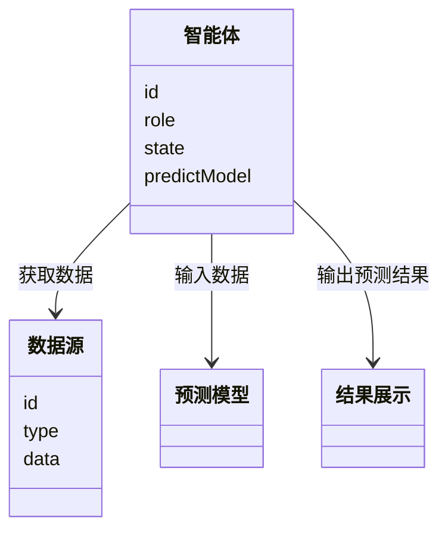
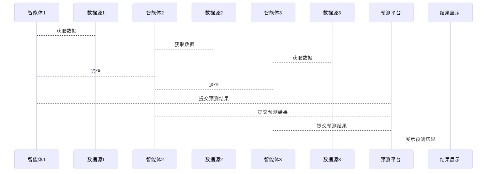

                 


# 利用多智能体系统构建全球宏观经济预测模型

## 关键词：
多智能体系统、宏观经济预测、机器学习、协同算法、系统架构设计

## 摘要：
本文系统地探讨了如何利用多智能体系统构建全球宏观经济预测模型。通过分析多智能体系统的核心概念与宏观经济预测的需求，本文提出了一种基于多智能体协同的预测模型构建方法。文中详细介绍了多智能体系统的原理、宏观经济预测的关键要素，以及如何通过协同算法和机器学习模型实现对全球经济指标的预测。同时，本文还提供了系统的架构设计、项目实战案例以及模型实现的具体步骤，为读者提供了一套完整的解决方案。

---

# 第一部分: 多智能体系统与宏观经济预测概述

## 第1章: 多智能体系统与宏观经济预测概述

### 1.1 多智能体系统的定义与特点

#### 1.1.1 多智能体系统的定义
多智能体系统（Multi-Agent System, MAS）是由多个智能体（Agent）组成的分布式系统，这些智能体通过协作和通信完成特定任务。每个智能体都是一个独立的实体，具有感知环境、决策和行动的能力。

#### 1.1.2 多智能体系统的核心特点
- **分布式性**：智能体分布在不同的节点上，独立运行。
- **协作性**：智能体之间通过通信和协调完成共同目标。
- **反应性**：智能体能够实时感知环境并做出响应。
- **自主性**：智能体在没有外部干预的情况下自主决策。

#### 1.1.3 多智能体系统与传统经济模型的对比
| 对比维度 | 多智能体系统 | 传统经济模型 |
|----------|--------------|---------------|
| 结构     | 分布式       | 集中式       |
| 协作     | 强调协同      | 强调整体性    |
| 灵活性   | 高           | 中            |

### 1.2 全球宏观经济预测的背景与挑战

#### 1.2.1 宏观经济预测的定义与重要性
宏观经济预测是对整体经济运行状态的预测，包括GDP增长率、通货膨胀率、失业率等指标。准确的宏观经济预测对政策制定、投资决策具有重要意义。

#### 1.2.2 全球化背景下宏观经济预测的复杂性
全球化导致经济变量之间的相互依赖性增强，单一事件可能引发全球连锁反应，增加了预测的难度。

#### 1.2.3 传统宏观经济预测模型的局限性
- 数据维度单一
- 模型假设过于简化
- 难以捕捉非线性关系

### 1.3 多智能体系统在宏观经济预测中的应用前景

#### 1.3.1 多智能体系统的潜在应用领域
- 货币政策模拟
- 财政政策预测
- 全球供应链分析

#### 1.3.2 多智能体系统在宏观经济预测中的优势
- 能够处理海量异构数据
- 模拟复杂的经济互动关系
- 实现实时动态预测

#### 1.3.3 多智能体系统应用的挑战与机遇
- 智能体之间的通信效率问题
- 数据隐私与安全问题
- 计算资源消耗问题

## 1.4 本章小结
本章介绍了多智能体系统的定义和特点，并分析了宏观经济预测的背景与挑战。同时，探讨了多智能体系统在宏观经济预测中的应用前景及其面临的挑战。

---

## 第2章: 多智能体系统的核心概念与联系

### 2.1 多智能体系统的原理与机制

#### 2.1.1 多智能体系统的协同机制
- **分布式计算**：任务分解到多个智能体。
- **通信协议**：定义智能体之间的交互规则。
- **协调算法**：确保智能体协同工作。

#### 2.1.2 多智能体系统的通信协议
- **消息传递**：智能体通过消息传递信息。
- **中间件**：提供通信中间层。

#### 2.1.3 多智能体系统的自适应能力
- **自适应算法**：智能体能够根据环境变化调整行为。
- **学习机制**：智能体通过经验改进预测模型。

### 2.2 宏观经济预测的核心要素

#### 2.2.1 宏观经济指标的定义与分类
- **主要指标**：GDP、通货膨胀率、失业率。
- **次要指标**：PMI、消费者信心指数。

#### 2.2.2 宏观经济预测模型的构建要素
- 数据来源：政府统计、市场调研。
- 数据处理：清洗、特征提取。
- 模型选择：线性回归、随机森林。

#### 2.2.3 宏观经济数据的获取与处理
- 数据清洗：处理缺失值、异常值。
- 特征工程：提取有意义的特征。
- 数据标准化：统一数据尺度。

### 2.3 多智能体系统与宏观经济预测的结合

#### 2.3.1 多智能体系统在宏观经济预测中的角色
- 数据采集：智能体收集异构数据。
- 协同预测：智能体协作完成预测任务。
- 实时反馈：智能体根据反馈调整预测模型。

#### 2.3.2 多智能体系统与宏观经济数据的关系
- 数据异构性：不同来源的数据格式和粒度不同。
- 数据依赖性：宏观经济指标之间存在相互影响。
- 数据动态性：经济变量随时间变化。

#### 2.3.3 多智能体系统在宏观经济预测中的优势
- 多源数据处理能力：能够整合多种数据源。
- 高度并行计算：提高预测效率。
- 动态适应性：能够实时更新预测模型。

## 2.4 本章小结
本章深入探讨了多智能体系统的核心概念及其与宏观经济预测的关系，分析了多智能体系统在宏观经济预测中的优势和挑战。

---

## 第3章: 多智能体系统与宏观经济预测的算法原理

### 3.1 多智能体系统的协同算法

#### 3.1.1 分布式协同算法
- **任务分配**：将预测任务分解到多个智能体。
- **分布式计算**：每个智能体处理部分数据。
- **结果汇总**：将各智能体的预测结果整合。

#### 3.1.2 基于博弈论的协同算法
- **纳什均衡**：确保智能体的决策一致。
- **策略调整**：根据反馈调整智能体策略。

#### 3.1.3 基于强化学习的协同算法
- **状态空间**：智能体感知环境状态。
- **动作选择**：智能体根据状态选择动作。
- **奖励机制**：根据预测结果调整奖励。

### 3.2 宏观经济预测的机器学习算法

#### 3.2.1 线性回归模型
- **模型形式**：$y = \beta_0 + \beta_1 x + \epsilon$
- **优点**：简单易懂，计算效率高。
- **缺点**：难以处理非线性关系。

#### 3.2.2 支持向量机（SVM）
- **核心思想**：在高维空间中寻找最优超平面。
- **数学模型**：
  $$ \text{目标函数：} \min \frac{1}{2}\|\omega\|^2 + C \sum_{i=1}^n \xi_i $$
  $$ \text{约束条件：} y_i (\omega \cdot x_i + b) \geq 1 - \xi_i $$
- **优点**：能够处理非线性数据。
- **缺点**：计算复杂度较高。

#### 3.2.3 随机森林与梯度提升树
- **随机森林**：通过随机采样构建多棵决策树，取平均值。
- **梯度提升树**：通过梯度下降优化模型。

### 3.3 多智能体系统的预测模型构建

#### 3.3.1 系统架构设计
- **数据采集层**：智能体收集数据。
- **预测层**：智能体协同完成预测。
- **结果汇总层**：整合各智能体的预测结果。

#### 3.3.2 算法实现步骤
1. 数据预处理：清洗、特征提取。
2. 模型选择：选择合适的机器学习算法。
3. 智能体协作：通过通信协议协同预测。
4. 结果整合：将各智能体的预测结果汇总。

## 3.4 本章小结
本章详细介绍了多智能体系统的协同算法及其在宏观经济预测中的应用，探讨了不同机器学习算法的优缺点及其在多智能体系统中的实现。

---

## 第4章: 多智能体系统与宏观经济预测的系统分析与架构设计

### 4.1 系统分析

#### 4.1.1 项目背景
- **目标**：构建全球宏观经济预测模型。
- **范围**：覆盖主要经济体的宏观经济指标。
- **用户需求**：政策制定者、投资者。

#### 4.1.2 项目介绍
- **项目目标**：构建一个基于多智能体系统的宏观经济预测平台。
- **项目范围**：包括数据采集、模型构建、预测展示。

### 4.2 系统功能设计

#### 4.2.1 领域模型设计


#### 4.2.2 系统架构设计


### 4.3 系统接口设计

#### 4.3.1 智能体间通信接口
- **接口定义**：智能体之间的通信协议。
- **数据格式**：JSON格式数据。
- **通信方式**：通过中间件进行通信。

#### 4.3.2 数据源接口
- **接口定义**：数据采集接口。
- **数据格式**：结构化数据。
- **访问方式**：API调用。

### 4.4 系统交互设计

#### 4.4.1 预测流程


## 4.5 本章小结
本章分析了系统的架构设计和交互流程，为后续的系统实现提供了基础。

---

## 第5章: 多智能体系统与宏观经济预测的项目实战

### 5.1 环境安装与配置

#### 5.1.1 安装依赖
- Python 3.8+
- NumPy
- Scikit-learn
- Flask

#### 5.1.2 环境配置
- 创建虚拟环境。
- 安装依赖包。

### 5.2 系统核心实现

#### 5.2.1 智能体类实现
```python
class Agent:
    def __init__(self, id, role):
        self.id = id
        self.role = role
        self.data = None
```

#### 5.2.2 数据采集模块实现
```python
class DataSource:
    def __init__(self, source_id):
        self.source_id = source_id
        self.data = None

    def get_data(self):
        # 数据获取逻辑
        pass
```

#### 5.2.3 预测模型实现
```python
from sklearn.ensemble import RandomForestRegressor

class Predictor:
    def __init__(self):
        self.model = RandomForestRegressor()

    def train(self, X, y):
        self.model.fit(X, y)

    def predict(self, X):
        return self.model.predict(X)
```

### 5.3 代码应用解读与分析

#### 5.3.1 智能体协作实现
```python
from agent import Agent
from data_source import DataSource

# 初始化智能体
agent1 = Agent(1, 'économist')
agent2 = Agent(2, 'data_analist')

# 初始化数据源
data_source1 = DataSource(1)
data_source2 = DataSource(2)

# 数据采集
agent1.data = data_source1.get_data()
agent2.data = data_source2.get_data()

# 数据处理
# （省略具体实现）
```

#### 5.3.2 预测结果展示
```python
from predictor import Predictor

# 初始化预测器
predictor = Predictor()

# 训练模型
X_train = [...]  # 特征数据
y_train = [...]  # 标签数据
predictor.train(X_train, y_train)

# 预测结果
X_test = [...]  # 测试数据
predictions = predictor.predict(X_test)
print("预测结果:", predictions)
```

### 5.4 实际案例分析

#### 5.4.1 数据准备
- 数据来源：政府统计、市场调研。
- 数据清洗：处理缺失值、异常值。
- 特征提取：提取有意义的特征。

#### 5.4.2 模型训练
- 训练数据：历史宏观经济数据。
- 模型选择：随机森林回归模型。

#### 5.4.3 预测结果分析
- 预测指标：GDP增长率、通货膨胀率。
- 结果展示：可视化预测结果。

### 5.5 项目小结
本章通过实际案例展示了如何利用多智能体系统构建宏观经济预测模型，详细讲解了系统的实现过程和预测结果。

---

## 第6章: 总结与展望

### 6.1 全文总结
本文系统地探讨了如何利用多智能体系统构建全球宏观经济预测模型，分析了多智能体系统的核心概念、算法原理及其在宏观经济预测中的应用。通过实际案例展示了系统的实现过程和预测结果。

### 6.2 未来展望
- **算法优化**：进一步优化多智能体协同算法。
- **数据源扩展**：引入更多数据源，提高预测精度。
- **系统扩展**：扩展系统功能，支持更多宏观经济指标。

### 6.3 最佳实践 Tips
- 数据清洗和特征工程是关键。
- 智能体协作算法的选择影响系统性能。
- 系统架构设计要充分考虑可扩展性和可维护性。

### 6.4 注意事项
- 数据隐私和安全问题需高度重视。
- 系统性能优化需综合考虑计算资源。
- 模型的可解释性需在实际应用中验证。

### 6.5 拓展阅读
- 《Multi-Agent Systems: Complexity, Decentralization, and Adaptation》
- 《Econometric Forecasting and Multivariate Density Estimation》

## 6.6 本章小结
本文总结了全文内容，并展望了未来的发展方向，为读者提供了进一步研究的方向和建议。

---

# 结束语

通过本文的详细讲解，读者可以系统地了解如何利用多智能体系统构建全球宏观经济预测模型。从理论到实践，本文提供了完整的解决方案，帮助读者在实际应用中更好地理解和应用这些技术。希望本文能够为宏观经济预测领域的发展提供有价值的参考。

