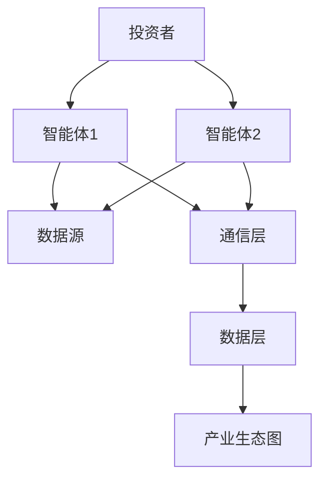
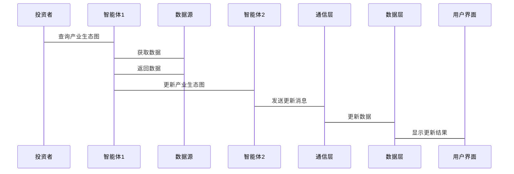

                 


# 利用多智能体系统构建动态产业生态图：全面把握投资环境

> **关键词**：多智能体系统，动态产业生态图，投资环境，算法原理，系统架构

> **摘要**：本文通过分析多智能体系统的原理，探讨如何构建动态产业生态图，以全面把握投资环境。文章从背景介绍、核心概念、算法原理、系统架构、项目实战和最佳实践等方面展开，详细讲解了利用多智能体系统构建动态产业生态图的方法和应用。

---

## 第一部分：背景介绍

### 第1章：多智能体系统与动态产业生态图概述

#### 1.1 多智能体系统的概念与特点

- **1.1.1 多智能体系统的定义**  
  多智能体系统（Multi-Agent System, MAS）是由多个智能体（Agent）组成的分布式系统，这些智能体能够通过协作完成复杂的任务。

- **1.1.2 多智能体系统的特性**  
  - 分布式：智能体分布在网络中，各自处理部分任务。
  - 协作性：智能体之间通过通信和协作完成共同目标。
  - 动态性：系统能够适应环境变化，实时调整策略。

- **1.1.3 多智能体系统的应用场景**  
  - 金融投资：实时分析市场动态，辅助投资决策。
  - 物流管理：优化货物运输路径。
  - 智能城市：协调交通、能源等系统。

#### 1.2 动态产业生态图的构建背景

- **1.2.1 产业生态图的定义**  
  产业生态图展示了产业之间的关系、资源流动和价值传递。

- **1.2.2 动态产业生态图的必要性**  
  - 产业关系复杂，需要动态调整。
  - 投资者需要实时了解产业动态，做出明智决策。

- **1.2.3 投资环境分析的需求**  
  - 投资者需要了解产业趋势、竞争格局和潜在风险。
  - 动态分析能够帮助投资者捕捉市场机会。

#### 1.3 问题背景与问题描述

- **1.3.1 当前投资环境分析的挑战**  
  - 数据量大，信息分散。
  - 产业关系复杂，难以全面把握。

- **1.3.2 传统方法的局限性**  
  - 静态分析难以捕捉动态变化。
  - 单一视角无法全面评估投资风险。

- **1.3.3 多智能体系统的优势**  
  - 分布式计算能力强。
  - 能够实时更新产业生态图。

#### 1.4 问题解决与边界外延

- **1.4.1 多智能体系统如何解决投资环境问题**  
  - 通过分布式计算和协作，实时更新产业生态图。
  - 提供多维度的数据分析，帮助投资者做出决策。

- **1.4.2 系统的边界与适用范围**  
  - 边界：仅分析与投资相关的产业和市场。
  - 适用范围：适用于需要动态分析的复杂投资环境。

- **1.4.3 系统的外延与扩展性**  
  - 可扩展至更多产业和市场。
  - 可与其他系统集成，提供更全面的分析。

#### 1.5 核心要素与概念结构

- **1.5.1 产业生态图的核心要素**  
  - 产业：不同行业及其之间的关系。
  - 企业：企业的竞争地位和市场影响力。
  - 资源：资源的流动和分配。

- **1.5.2 多智能体系统的组成结构**  
  - 智能体：负责数据收集、分析和决策。
  - 通信层：智能体之间的通信和协作。
  - 数据层：存储和管理产业数据。

- **1.5.3 系统与投资环境的关系**  
  - 系统动态更新产业生态图，帮助投资者了解市场变化。
  - 通过多维度分析，提供投资建议。

---

## 第二部分：核心概念与联系

### 第2章：多智能体系统的原理与机制

#### 2.1 多智能体系统的原理

- **2.1.1 分布式计算与协作**  
  智能体分布在网络中，通过协作完成任务。

- **2.1.2 智能体之间的通信机制**  
  - 使用消息传递机制，智能体之间实时通信。
  - 通信协议：定义消息格式和传输方式。

- **2.1.3 系统的动态自适应性**  
  - 系统能够实时调整策略，适应环境变化。
  - 自适应算法：动态优化系统性能。

#### 2.2 实体关系与系统架构

- **2.2.1 实体关系对比表**  

| 实体 | 属性 | 关系 |
|------|------|-----|
| 产业 | 行业代码，行业名称 | 竞争关系，上下游关系 |
| 企业 | 企业ID，企业名称 | 投资关系，竞争关系 |
| 资源 | 资源ID，资源类型 | 流动关系，分配关系 |

- **2.2.2 ER图展示系统实体关系**  

```mermaid
erd
    entity 产业 {
        属性: 行业代码，行业名称
    }
    entity 企业 {
        属性: 企业ID，企业名称
    }
    entity 资源 {
        属性: 资源ID，资源类型
    }
    产业 <-- 关系: 竞争关系 --> 企业
    企业 <-- 关系: 投资关系 --> 产业
    资源 <-- 关系: 流动关系 --> 企业
```

- **2.2.3 Mermaid流程图展示系统架构**  



---

## 第三部分：算法原理讲解

### 第3章：构建动态产业生态图的算法

#### 3.1 算法概述

- 算法目标：实时更新产业生态图，捕捉市场动态。
- 算法步骤：数据收集、分析、建模、更新。

#### 3.2 数据收集与预处理

- 数据来源：企业财报、市场报告、新闻资讯。
- 数据清洗：去除噪声，标准化数据。

#### 3.3 图论与网络分析

- 使用图论模型构建产业生态图。
- 网络分析：识别关键节点和关系。

#### 3.4 数学模型与公式

- 竞争强度公式：  
  $$ \text{竞争强度} = \frac{\text{市场份额}_i}{\sum \text{市场份额}_j} $$

- 投资回报率公式：  
  $$ \text{投资回报率} = \frac{\text{净利润}}{\text{总投资}} $$

#### 3.5 Python代码实现

```python
import networkx as nx

def build_industry_graph():
    G = nx.DiGraph()
    G.add_nodes_from(['产业1', '产业2', '企业1', '企业2'])
    G.add_edges_from([('产业1', '企业1'), ('产业2', '企业2'), ('企业1', '企业2')])
    return G

graph = build_industry_graph()
print(graph.nodes())
print(graph.edges())
```

---

## 第四部分：系统分析与架构设计

### 第4章：系统架构设计

#### 4.1 问题场景介绍

- 投资者需要实时了解产业动态。
- 系统需要处理大量数据，实时更新。

#### 4.2 系统功能设计

- 领域模型：定义产业、企业、资源之间的关系。
- 用例分析：投资者查询产业生态图。

#### 4.3 系统架构设计

- 分层架构：数据层、业务逻辑层、用户界面层。
- 通信层：智能体之间通过消息队列通信。

#### 4.4 接口设计

- RESTful API：提供数据查询和更新接口。
- WebSocket：实时更新产业生态图。

#### 4.5 交互序列图



---

## 第五部分：项目实战

### 第5章：项目实战

#### 5.1 环境安装

- 安装Python和相关库：networkx, matplotlib。
- 安装Jupyter Notebook进行数据分析。

#### 5.2 核心代码实现

```python
import networkx as nx
import matplotlib.pyplot as plt

def visualize_graph(G):
    nx.draw(G, node_colors=['red', 'blue', 'green', 'yellow'], node_shapes='circle')
    plt.show()

graph = build_industry_graph()
visualize_graph(graph)
```

#### 5.3 案例分析

- 案例：分析科技产业的竞争格局。
- 实施步骤：数据收集、建模、分析。
- 结果展示：可视化产业生态图。

#### 5.4 项目小结

- 成功构建动态产业生态图。
- 系统能够实时更新，辅助投资决策。

---

## 第六部分：最佳实践

### 第6章：最佳实践

#### 6.1 小结

- 多智能体系统能够有效构建动态产业生态图。
- 系统设计需要考虑分布式计算和实时更新。

#### 6.2 注意事项

- 数据隐私和安全问题需注意。
- 系统需要定期维护和更新。

#### 6.3 拓展阅读

- 推荐阅读《多智能体系统与分布式计算》。
- 参考文献：相关学术论文和书籍。

---

## 结语

通过多智能体系统构建动态产业生态图，投资者可以全面把握投资环境，做出明智的决策。本文详细讲解了系统的背景、原理、架构和实现，为实际应用提供了指导。希望读者能够通过本文，掌握这一技术，并在实际中取得成功。

