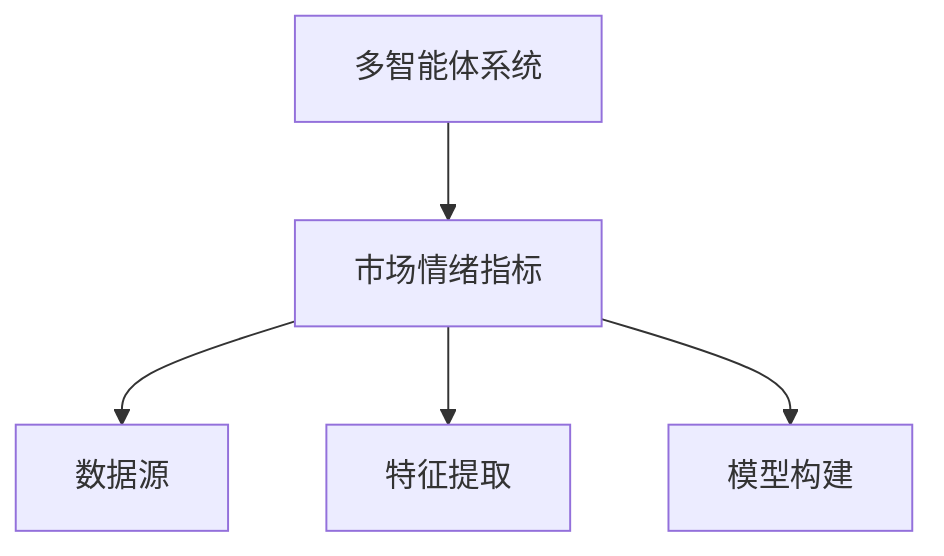
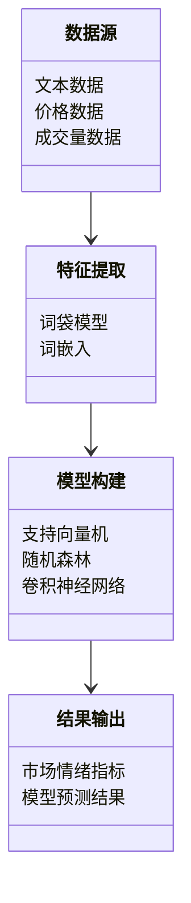
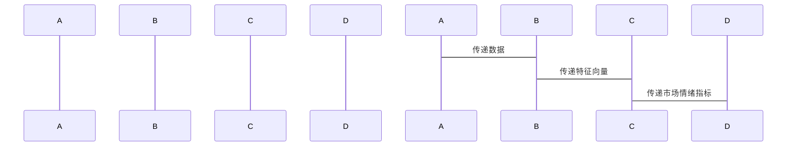

                 


# 利用多智能体系统构建动态市场情绪指标：把握投资时机

## 关键词：多智能体系统、市场情绪指标、动态市场情绪、投资时机、情感分析、算法原理、系统架构

## 摘要：  
本文详细探讨了利用多智能体系统构建动态市场情绪指标的方法，旨在帮助投资者更好地把握市场动向和投资时机。文章从多智能体系统的原理出发，分析了市场情绪指标的核心概念及其动态特性，结合具体算法和系统架构设计，提出了构建动态市场情绪指标的解决方案，并通过实际案例展示了其在投资决策中的应用价值。

---

# 第一部分: 多智能体系统与市场情绪指标概述

## 第1章: 多智能体系统与市场情绪指标的背景与意义

### 1.1 多智能体系统的基本概念

#### 1.1.1 多智能体系统的定义
多智能体系统（Multi-Agent System, MAS）是由多个智能体（Agent）组成的分布式系统，每个智能体都是具有自主性、反应性和协作性的实体，能够通过通信和协作完成复杂任务。多智能体系统的典型特征包括分布式性、协作性、智能性和动态性。

#### 1.1.2 多智能体系统的特征
- **自主性**：智能体能够独立决策和行动。
- **反应性**：智能体能够感知环境并实时响应。
- **协作性**：多个智能体之间可以通过通信和协作完成共同目标。
- **动态性**：系统中的环境和任务可能会随时间变化。

#### 1.1.3 多智能体系统的应用场景
多智能体系统广泛应用于分布式计算、机器人协作、交通控制、金融交易等领域。在金融领域，多智能体系统可以用于市场监控、风险评估和投资决策。

### 1.2 市场情绪指标的基本概念

#### 1.2.1 市场情绪的定义
市场情绪（Market Sentiment）是指市场参与者（如投资者、交易员）对市场走势的总体看法和情绪状态。市场情绪可以分为乐观、中性和悲观三种状态。

#### 1.2.2 市场情绪指标的分类
市场情绪指标可以分为以下几类：
- **基于价格和成交量的指标**：如相对强弱指数（RSI）、移动平均收敛散度（MACD）等。
- **基于新闻和事件的指标**：如新闻情感分析、事件驱动指标。
- **基于社交媒体的指标**：如Twitter情感分析、Reddit社区情绪分析。

#### 1.2.3 市场情绪指标的意义
市场情绪指标能够帮助投资者判断市场的整体情绪状态，预测市场走势，并做出相应的投资决策。特别是在金融市场的波动性较大的情况下，市场情绪指标具有重要的参考价值。

### 1.3 动态市场情绪指标的重要性

#### 1.3.1 动态市场情绪指标的特点
动态市场情绪指标是指能够实时反映市场情绪变化的指标。与传统的静态市场情绪指标相比，动态市场情绪指标具有以下特点：
- **实时性**：能够实时更新市场情绪状态。
- **动态性**：能够捕捉市场情绪的短期波动。
- **准确性**：通过多源数据和多智能体协作提高情绪分析的准确性。

#### 1.3.2 动态市场情绪指标的应用场景
动态市场情绪指标可以应用于以下几个方面：
- **高频交易**：通过实时市场情绪分析，高频交易员可以快速做出交易决策。
- **风险控制**：通过动态市场情绪分析，投资者可以更好地进行风险管理和投资组合优化。
- **市场预测**：通过动态市场情绪分析，投资者可以预测市场的短期走势。

#### 1.3.3 动态市场情绪指标的挑战与机遇
动态市场情绪指标的构建和应用面临以下挑战：
- **数据实时性**：需要实时获取多源数据，对系统的实时性和响应速度提出较高要求。
- **数据多样性**：市场情绪数据来源多样，包括文本、价格、成交量等，需要综合分析。
- **模型复杂性**：动态市场情绪指标的构建需要结合多种算法和模型，模型的复杂性和计算成本较高。

然而，这些挑战也带来了机遇，通过多智能体系统的协作和分布式计算，可以有效解决这些问题。

## 1.4 本章小结
本章介绍了多智能体系统的基本概念和市场情绪指标的核心概念，重点分析了动态市场情绪指标的重要性和应用价值。通过对比多智能体系统和市场情绪指标的特征，为后续章节的算法和系统设计奠定了基础。

---

## 第2章: 多智能体系统与市场情绪指标的核心概念

### 2.1 多智能体系统的原理

#### 2.1.1 多智能体系统的组成
多智能体系统由以下几个主要部分组成：
- **智能体（Agent）**：具有自主性和智能性的个体，能够独立完成特定任务。
- **环境（Environment）**：智能体所处的外部环境，包括其他智能体和静态环境。
- **通信机制（Communication Mechanism）**：智能体之间进行信息交换的方式，如消息传递、共享数据库等。
- **协作机制（Collaboration Mechanism）**：智能体之间通过协作完成共同目标的方式，如任务分配、协同决策等。

#### 2.1.2 多智能体系统的通信机制
多智能体系统的通信机制可以通过以下几种方式实现：
- **直接通信**：智能体之间通过消息传递直接交换信息。
- **间接通信**：智能体通过共享数据库或中间件间接交换信息。
- **发布-订阅模型**：智能体通过发布事件或订阅事件的方式进行信息交换。

#### 2.1.3 多智能体系统的协作机制
多智能体系统的协作机制可以通过以下几种方式实现：
- **基于任务分配的协作**：智能体根据任务需求进行任务分配和协作。
- **基于协商的协作**：智能体通过协商达成一致的行动方案。
- **基于规则的协作**：智能体根据预定义的规则进行协作。

### 2.2 市场情绪分析的核心原理

#### 2.2.1 市场情绪分析的数据来源
市场情绪分析的数据来源包括：
- **文本数据**：如新闻文章、社交媒体帖子、论坛讨论等。
- **价格数据**：如股票价格、指数价格等。
- **成交量数据**：如交易量、订单量等。
- **事件数据**：如公司公告、政策变化等。

#### 2.2.2 市场情绪分析的特征提取
市场情绪分析的特征提取包括以下几个步骤：
- **数据清洗**：去除噪声数据，如停用词、特殊符号等。
- **数据转换**：将文本数据转换为数值特征，如词袋模型、词嵌入等。
- **特征选择**：通过统计分析或机器学习方法选择重要的特征。

#### 2.2.3 市场情绪分析的模型构建
市场情绪分析的模型构建可以采用以下几种方法：
- **基于机器学习的模型**：如支持向量机（SVM）、随机森林（Random Forest）等。
- **基于深度学习的模型**：如卷积神经网络（CNN）、循环神经网络（RNN）等。
- **基于规则的模型**：如情感词典、关键词匹配等。

### 2.3 多智能体系统与市场情绪指标的结合

#### 2.3.1 多智能体系统在市场情绪分析中的作用
多智能体系统可以用于市场情绪分析的以下几个方面：
- **数据采集**：通过多个智能体分别采集不同数据源的数据。
- **数据处理**：通过多个智能体协作完成数据清洗、特征提取和特征选择。
- **模型构建**：通过多个智能体分别构建不同的模型，并通过协作完成模型融合。

#### 2.3.2 多智能体系统与市场情绪指标的关系
多智能体系统与市场情绪指标的关系可以分为以下几个方面：
- **数据来源的多样性**：多智能体系统可以同时采集文本、价格、成交量等多种数据源，提高市场情绪分析的全面性。
- **模型的协作性**：通过多智能体系统的协作，可以同时构建多个不同的模型，并通过模型融合提高市场情绪分析的准确性。
- **结果的动态性**：通过多智能体系统的实时协作，可以实现市场情绪指标的实时更新和动态调整。

#### 2.3.3 多智能体系统在动态市场情绪指标中的应用
多智能体系统在动态市场情绪指标中的应用包括以下几个方面：
- **实时数据采集**：通过多个智能体实时采集市场数据，如社交媒体情绪、新闻事件等。
- **实时数据处理**：通过多个智能体协作完成数据的实时清洗、特征提取和特征选择。
- **实时模型更新**：通过多个智能体协作完成模型的实时训练和更新，确保市场情绪指标的实时性和准确性。

### 2.4 本章小结
本章详细介绍了多智能体系统的原理和市场情绪分析的核心原理，并分析了多智能体系统在市场情绪指标中的作用和应用。通过对比分析，为后续章节的算法设计和系统实现奠定了理论基础。

---

## 第3章: 多智能体系统与市场情绪指标的核心概念对比与联系

### 3.1 多智能体系统与市场情绪分析的对比

#### 3.1.1 多智能体系统的属性特征
| 属性 | 特征 |
|------|------|
| 自主性 | 智能体能够独立决策和行动 |
| 反应性 | 智能体能够实时感知环境并响应 |
| 协作性 | 多个智能体可以通过协作完成共同目标 |
| 动态性 | 系统中的环境和任务可能会随时间变化 |

#### 3.1.2 市场情绪分析的属性特征
| 属性 | 特征 |
|------|------|
| 数据来源 | 文本、价格、成交量、事件等 |
| 分析目标 | 市场情绪状态的判断和预测 |
| 方法 | 机器学习、深度学习、自然语言处理等 |

#### 3.1.3 两者特征的对比分析
- **自主性**：多智能体系统的智能体具有自主性，而市场情绪分析模型通常需要依赖外部数据和算法。
- **反应性**：多智能体系统具有较强的实时反应能力，而市场情绪分析模型通常需要离线处理或实时处理，取决于具体实现。
- **协作性**：多智能体系统通过协作完成任务，而市场情绪分析模型通常需要多个模型协作或融合。
- **动态性**：多智能体系统具有较强的动态适应能力，而市场情绪分析模型需要根据数据动态更新。

### 3.2 多智能体系统与市场情绪分析的ER实体关系图



### 3.3 本章小结
本章通过对比分析多智能体系统和市场情绪分析的核心概念，揭示了两者之间的联系和区别。通过ER实体关系图展示了多智能体系统在市场情绪指标构建中的作用，为后续章节的算法设计和系统实现提供了清晰的框架。

---

## 第4章: 动态市场情绪指标的算法原理

### 4.1 动态市场情绪指标的构建流程

#### 4.1.1 数据预处理
数据预处理包括以下几个步骤：
1. **数据清洗**：去除噪声数据，如停用词、特殊符号等。
2. **数据转换**：将文本数据转换为数值特征，如词袋模型、词嵌入等。
3. **特征选择**：通过统计分析或机器学习方法选择重要的特征。

#### 4.1.2 特征提取
特征提取是将原始数据转换为适合模型输入的特征向量。常用的特征提取方法包括：
- **词袋模型（Bag of Words）**：将文本数据转换为词袋向量。
- **词嵌入（Word Embedding）**：如Word2Vec、GloVe等。
- **情感分析特征**：如情感强度、情感倾向等。

#### 4.1.3 模型训练
模型训练是通过机器学习或深度学习算法对特征向量进行训练，得到市场情绪指标。常用的模型包括：
- **支持向量机（SVM）**：用于分类任务。
- **随机森林（Random Forest）**：用于分类和回归任务。
- **卷积神经网络（CNN）**：用于文本分类任务。
- **循环神经网络（RNN）**：用于序列数据的分类和预测任务。

#### 4.1.4 模型评估
模型评估是通过测试数据对模型的性能进行评估，常用的评估指标包括准确率、召回率、F1分数等。

### 4.2 多智能体系统在动态市场情绪指标中的算法实现

#### 4.2.1 多智能体系统的协作流程
1. **数据采集**：多个智能体分别从不同的数据源采集数据，如文本数据、价格数据、成交量数据等。
2. **数据处理**：多个智能体协作完成数据的清洗、转换和特征提取。
3. **模型训练**：多个智能体分别构建不同的模型，并通过协作完成模型融合。
4. **结果输出**：通过多个智能体协作，输出最终的市场情绪指标。

#### 4.2.2 多智能体系统的通信协议
多智能体系统的通信协议需要考虑以下几个方面：
- **消息格式**：定义消息的结构和内容。
- **通信频率**：定义智能体之间通信的频率和时间。
- **通信安全**：确保智能体之间的通信安全，防止数据泄露和篡改。

#### 4.2.3 多智能体系统的任务分配
多智能体系统的任务分配可以通过以下几种方式实现：
- **基于角色的任务分配**：根据智能体的角色分配任务。
- **基于能力的任务分配**：根据智能体的能力分配任务。
- **基于协商的任务分配**：智能体通过协商达成一致的任务分配方案。

#### 4.2.4 多智能体系统的协作机制
多智能体系统的协作机制可以通过以下几种方式实现：
- **基于规则的协作**：智能体根据预定义的规则进行协作。
- **基于协商的协作**：智能体通过协商达成一致的协作方案。
- **基于市场的协作**：智能体通过市场机制进行协作，如拍卖、定价等。

#### 4.2.5 多智能体系统的模型融合
多智能体系统的模型融合可以通过以下几种方式实现：
- **投票融合**：多个智能体分别构建模型，通过投票方式决定最终的市场情绪指标。
- **加权融合**：根据智能体的性能或权重对模型结果进行加权融合。
- **集成融合**：将多个模型的结果集成，形成最终的市场情绪指标。

### 4.3 动态市场情绪指标的数学模型

#### 4.3.1 基于机器学习的市场情绪指标模型
假设我们有多个特征向量$X = \{x_1, x_2, ..., x_n\}$，每个特征向量表示一条市场的数据。我们可以使用支持向量机（SVM）模型对市场情绪指标进行分类，模型的数学表达式为：
$$
y = \text{sign}(w \cdot x + b)
$$
其中，$w$是权重向量，$b$是偏置项，$y$是预测的市场情绪类别。

#### 4.3.2 基于深度学习的市场情绪指标模型
我们可以使用卷积神经网络（CNN）对文本数据进行情感分类。CNN的模型结构包括卷积层、池化层和全连接层。模型的输入是词嵌入向量，输出是市场情绪类别。

### 4.4 本章小结
本章详细介绍了动态市场情绪指标的构建流程和多智能体系统的算法实现，重点分析了多智能体系统在市场情绪指标中的协作机制和模型融合方法。通过数学模型的描述，为后续章节的系统设计和项目实现提供了理论依据。

---

## 第5章: 多智能体系统与市场情绪指标的系统架构设计

### 5.1 系统架构设计概述

#### 5.1.1 系统功能需求
系统功能需求包括：
- **数据采集**：采集多源数据，如文本数据、价格数据、成交量数据等。
- **数据处理**：完成数据清洗、转换和特征提取。
- **模型构建**：构建多个市场情绪指标模型，并通过协作完成模型融合。
- **结果输出**：输出最终的市场情绪指标。

#### 5.1.2 系统性能需求
系统性能需求包括：
- **实时性**：系统能够实时更新市场情绪指标。
- **准确性**：系统能够准确反映市场情绪状态。
- **可扩展性**：系统能够支持大规模数据和多智能体的协作。

### 5.2 系统功能设计

#### 5.2.1 领域模型设计
领域模型设计包括以下几个部分：
- **数据源**：包括文本数据、价格数据、成交量数据等。
- **特征提取**：包括词袋模型、词嵌入等。
- **模型构建**：包括支持向量机、随机森林、卷积神经网络等。
- **结果输出**：包括市场情绪指标、模型预测结果等。



#### 5.2.2 系统架构设计
系统架构设计包括以下几个部分：
- **数据采集层**：负责采集多源数据。
- **数据处理层**：负责数据的清洗、转换和特征提取。
- **模型构建层**：负责构建多个市场情绪指标模型。
- **结果输出层**：负责输出最终的市场情绪指标。


#### 5.2.3 系统接口设计
系统接口设计包括以下几个部分：
- **数据接口**：用于数据的输入和输出。
- **模型接口**：用于模型的训练和预测。
- **结果接口**：用于结果的展示和输出。

#### 5.2.4 系统交互流程
系统交互流程包括以下几个步骤：
1. 数据采集：通过数据接口采集多源数据。
2. 数据处理：通过数据处理层完成数据的清洗、转换和特征提取。
3. 模型构建：通过模型构建层构建多个市场情绪指标模型。
4. 结果输出：通过结果输出层输出最终的市场情绪指标。

### 5.3 系统交互流程图



### 5.4 本章小结
本章详细介绍了系统的架构设计和交互流程，为后续章节的项目实现提供了清晰的框架。

---

## 第6章: 项目实战——基于多智能体系统的动态市场情绪指标实现

### 6.1 项目概述

#### 6.1.1 项目背景
本项目旨在利用多智能体系统构建动态市场情绪指标，帮助投资者实时把握市场动向和投资时机。

#### 6.1.2 项目目标
项目的具体目标包括：
- 实现多智能体系统的数据采集和数据处理功能。
- 实现多智能体系统的模型构建和模型融合功能。
- 实现动态市场情绪指标的实时更新和动态调整。

### 6.2 项目实现步骤

#### 6.2.1 环境安装
项目实现需要以下环境：
- **Python**：编程语言。
- **TensorFlow** 或 **Keras**：深度学习框架。
- **NLTK** 或 **spaCy**：自然语言处理库。
- **Scikit-learn**：机器学习库。
- **Flask** 或 **Django**：Web框架（可选）。

#### 6.2.2 核心代码实现

##### 数据采集模块
```python
import requests
from bs4 import BeautifulSoup

def get_text_data(url):
    response = requests.get(url)
    soup = BeautifulSoup(response.text, 'html.parser')
    text = soup.get_text()
    return text
```

##### 特征提取模块
```python
from sklearn.feature_extraction.text import TfidfVectorizer

vectorizer = TfidfVectorizer()
features = vectorizer.fit_transform(text_data)
```

##### 模型构建模块
```python
from sklearn.svm import SVC
from sklearn.ensemble import RandomForestClassifier
from keras.models import Sequential
from keras.layers import Dense, LSTM

# 支持向量机模型
svm_model = SVC()

# 随机森林模型
rf_model = RandomForestClassifier()

# 长短期记忆网络模型
model = Sequential()
model.add(LSTM(64, input_shape=(None, 1)))
model.add(Dense(1, activation='sigmoid'))
model.compile(loss='binary_crossentropy', optimizer='adam', metrics=['accuracy'])
```

##### 模型融合模块
```python
import numpy as np

def ensemble_predict(models, test_data):
    predictions = []
    for model in models:
        pred = model.predict(test_data)
        predictions.append(pred)
    # 简单投票融合
    final_pred = np.mean(predictions, axis=0)
    return final_pred
```

##### 动态更新模块
```python
import time

while True:
    # 更新数据
    new_data = get_new_data()
    # 更新特征
    new_features = preprocess(new_data)
    # 更新模型
    for model in models:
        model.fit(new_features, labels)
    # 输出结果
    print("市场情绪指标：", get_market_sentiment())
    time.sleep(60)
```

#### 6.2.3 代码解读与分析
- **数据采集模块**：通过网络请求获取文本数据，使用BeautifulSoup提取文本内容。
- **特征提取模块**：使用TfidfVectorizer提取文本特征，生成特征向量。
- **模型构建模块**：分别构建支持向量机、随机森林和长短期记忆网络模型。
- **模型融合模块**：通过投票融合的方法，将多个模型的预测结果融合，得到最终的市场情绪指标。
- **动态更新模块**：实现模型的动态更新，确保市场情绪指标的实时性和准确性。

### 6.3 项目实战案例分析

#### 6.3.1 数据来源
假设我们从以下几个数据源采集数据：
- **Twitter API**：获取实时推文数据。
- **Reddit API**：获取实时帖子数据。
- **Yahoo Finance API**：获取实时股票价格和成交量数据。

#### 6.3.2 数据处理与特征提取
对采集到的数据进行清洗和特征提取，生成适合模型输入的特征向量。例如，使用TfidfVectorizer提取文本特征，生成词袋模型。

#### 6.3.3 模型训练与评估
分别对支持向量机、随机森林和长短期记忆网络模型进行训练，并评估模型的性能。例如，使用准确率、召回率和F1分数评估模型的分类性能。

#### 6.3.4 模型融合与结果输出
通过投票融合的方法，将多个模型的预测结果融合，得到最终的市场情绪指标。例如，市场情绪指标可以分为乐观、中性和悲观三种状态。

### 6.4 项目总结与经验教训

#### 6.4.1 项目总结
通过本项目的实现，我们成功构建了一个基于多智能体系统的动态市场情绪指标，能够实时反映市场情绪状态，并为投资者提供投资决策的参考。

#### 6.4.2 经验教训
- **数据实时性**：多智能体系统的实时性和响应速度对数据的实时性提出了较高要求。
- **模型复杂性**：多智能体系统的协作和模型融合增加了系统的复杂性和计算成本。
- **数据多样性**：多源数据的采集和处理增加了系统的复杂性和开发难度。

---

## 第7章: 总结与展望

### 7.1 总结
本文详细探讨了利用多智能体系统构建动态市场情绪指标的方法，分析了多智能体系统和市场情绪指标的核心概念，提出了构建动态市场情绪指标的解决方案，并通过实际案例展示了其在投资决策中的应用价值。

### 7.2 展望
未来的研究可以进一步探索以下方向：
- **多智能体系统的优化**：通过优化多智能体系统的通信机制和协作机制，提高系统的实时性和准确性。
- **深度学习模型的改进**：通过改进深度学习模型的结构和算法，提高市场情绪分析的准确性和实时性。
- **多源数据的融合**：通过融合更多的数据源，如社交媒体数据、新闻数据、宏观经济数据等，提高市场情绪分析的全面性和准确性。

### 7.3 最佳实践 Tips
- 在实际应用中，可以根据具体需求选择合适的多智能体系统和市场情绪分析模型。
- 在数据采集和处理过程中，需要注意数据的多样性和实时性，确保系统的准确性和响应速度。
- 在模型构建和融合过程中，可以通过实验和评估选择最优的模型和融合方法。

### 7.4 本章小结
本文总结了构建动态市场情绪指标的主要内容和研究成果，并展望了未来的研究方向和应用前景。通过本文的探讨，我们可以更好地理解多智能体系统在市场情绪分析中的作用，并为实际应用提供有价值的参考。

---

# 结语

通过本文的探讨，我们深入分析了利用多智能体系统构建动态市场情绪指标的方法和实现过程。从理论分析到实际应用，本文为投资者和开发者提供了全面的指导和参考。希望本文能够帮助读者更好地理解多智能体系统和市场情绪指标的核心概念，并为未来的相关研究和应用提供有价值的参考。

