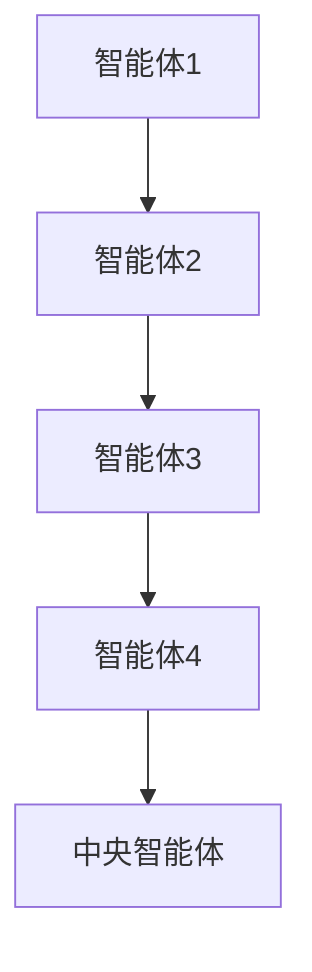
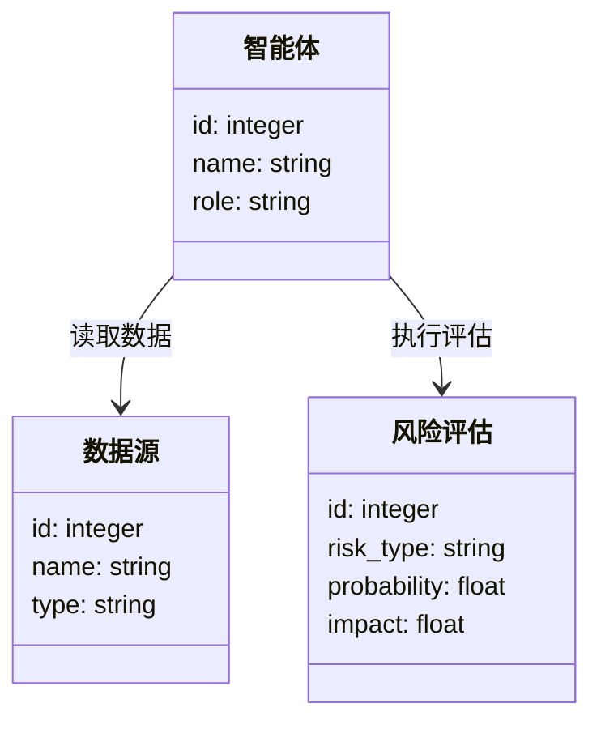
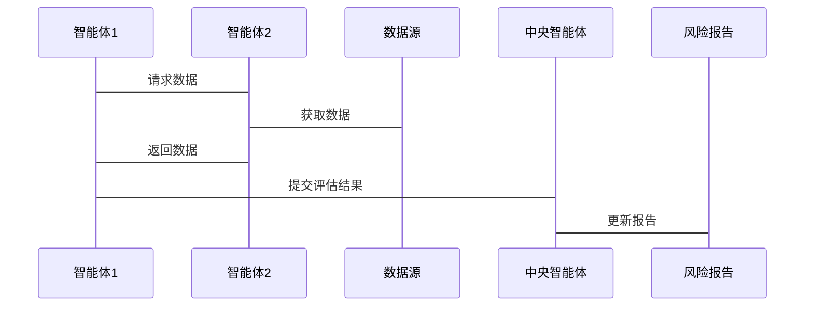

                 


# 利用多智能体系统构建动态的公司治理风险评估模型

## 关键词：多智能体系统，公司治理，风险评估，动态模型，分布式计算

## 摘要：  
本文探讨如何利用多智能体系统构建动态的公司治理风险评估模型，通过分析多智能体系统的核心原理、算法实现、系统架构以及实际应用，展示了如何利用分布式计算和智能体协作来提升公司治理风险评估的动态性和准确性。文章结合理论与实践，详细阐述了从问题背景到系统实现的全过程，为公司治理领域的风险管理提供了新的思路和技术方案。

---

# 第一部分: 背景介绍

## 第1章: 多智能体系统与公司治理风险评估的背景

### 1.1 问题背景

#### 1.1.1 公司治理中的风险问题
公司治理是企业管理的核心，涉及股东、董事会、管理层和利益相关者之间的权利、责任和利益分配。然而，公司治理中存在多种风险，如合规风险、财务风险、声誉风险和操作风险等。这些风险可能对公司稳定性、可持续发展甚至社会经济造成重大影响。

#### 1.1.2 多智能体系统的优势
多智能体系统（MAS）通过多个智能体的协作，能够实现复杂的任务。每个智能体具有自主性、反应性和社会性，能够实时感知环境、做出决策并与其他智能体协同工作。MAS的优势在于其分布式计算能力、适应性和灵活性，适用于复杂动态环境下的问题求解。

#### 1.1.3 动态风险评估的必要性
传统的风险评估方法通常基于静态模型，难以应对公司治理中动态变化的环境。例如，市场波动、政策变化、内部人员变动等因素都会影响风险的分布和严重程度。动态风险评估模型能够实时更新评估结果，帮助公司及时应对潜在风险。

### 1.2 问题描述

#### 1.2.1 公司治理中的主要风险类型
公司治理中的风险可以分为以下几类：
- **合规风险**：公司行为是否符合法律法规和行业规范。
- **财务风险**：公司财务状况的稳定性，包括资产负债表、现金流等。
- **声誉风险**：公司声誉可能因负面事件而受损。
- **操作风险**：公司内部操作过程中可能产生的失误或损失。
- **战略风险**：公司战略决策的正确性和可行性。

#### 1.2.2 风险评估的传统方法及其局限性
传统风险评估方法通常采用静态模型，例如基于历史数据分析和专家经验的定性或定量评估。这些方法难以捕捉动态变化中的风险因素，且缺乏实时更新的能力，导致评估结果可能滞后或不准确。

#### 1.2.3 动态风险评估的需求
为了应对公司治理中的动态风险，需要构建一个能够实时更新、动态调整的评估模型。动态风险评估不仅能够及时反映风险的变化，还能为管理层提供实时的决策支持。

### 1.3 解决方案

#### 1.3.1 多智能体系统的应用前景
多智能体系统在公司治理中的应用前景广阔，尤其是在动态风险评估方面。智能体可以分别负责不同的风险类型，实时监控相关数据并进行评估，然后将结果汇总到中央系统。

#### 1.3.2 动态风险评估模型的设计思路
动态风险评估模型需要具备以下特点：
- **实时性**：能够实时更新评估结果。
- **动态性**：能够根据环境变化调整评估参数。
- **分布式计算**：利用多智能体的分布式计算能力，提高评估效率。
- **协作性**：智能体之间能够协作，共享信息和资源。

#### 1.3.3 多智能体系统与动态风险评估的结合
多智能体系统与动态风险评估的结合可以通过以下方式实现：
- 每个智能体负责监控和评估一种特定风险。
- 智能体之间通过通信协议共享信息，协同完成综合风险评估。
- 中央智能体负责整合各智能体的评估结果，生成最终的动态风险报告。

### 1.4 边界与外延

#### 1.4.1 系统的边界
动态风险评估模型的边界包括：
- 公司内部数据：如财务数据、业务数据等。
- 外部数据：如市场数据、政策数据等。
- 智能体之间的交互：通过特定接口进行信息共享和协作。

#### 1.4.2 系统的外延
动态风险评估模型的外延包括：
- 与其他系统的集成，如ERP系统、CRM系统等。
- 与其他风险评估工具的结合，如信用评估模型、市场风险模型等。
- 与决策支持系统的整合，为管理层提供实时的决策支持。

#### 1.4.3 核心要素组成
动态风险评估模型的核心要素包括：
- 数据采集模块：负责采集公司内部和外部的相关数据。
- 智能体模块：负责对特定风险进行评估和报告。
- 中央评估模块：负责整合各智能体的评估结果，生成综合风险评估报告。

---

## 第2章: 多智能体系统的核心概念与联系

### 2.1 核心概念原理
多智能体系统的核心概念包括：
- **智能体**：具有自主性、反应性和社会性的实体，能够感知环境并采取行动。
- **协作与通信**：智能体之间通过通信协议共享信息，协同完成任务。
- **分布式计算**：利用分布式计算技术，提高系统的并行处理能力。

### 2.2 概念属性特征对比

| 概念      | 特征                         |
|-----------|------------------------------|
| 智能体     | 自主性、反应性、社会性         |
| 分布式计算 | 并行性、资源共享、任务分配     |
| 动态风险评估 | 实时性、动态性、适应性       |

### 2.3 ER实体关系图架构

```mermaid
erd
actor: 智能体
action: 风险评估
data: 数据源
rules: 评估规则
report: 风险报告
actor --> action: 执行评估
action --> data: 读取数据
action --> rules: 应用规则
action --> report: 生成报告
```

---

## 第3章: 公司治理风险评估模型的构建

### 3.1 模型的设计原则
- **实时性**：能够实时更新评估结果。
- **动态性**：能够根据环境变化调整评估参数。
- **分布式计算**：利用多智能体的分布式计算能力，提高评估效率。
- **协作性**：智能体之间能够协作，共享信息和资源。

### 3.2 模型的实现步骤

#### 3.2.1 数据采集
- 从公司内部系统和外部数据源采集相关数据，如财务数据、市场数据等。

#### 3.2.2 数据预处理
- 对采集的数据进行清洗、转换和标准化，确保数据的准确性和一致性。

#### 3.2.3 风险评估
- 每个智能体根据自己的规则对特定风险进行评估，生成评估结果。

#### 3.2.4 结果整合
- 中央智能体整合各智能体的评估结果，生成综合风险评估报告。

---

## 第4章: 算法原理与实现

### 4.1 分布式计算算法



#### 4.1.1 分布式计算的实现
- 使用分布式计算技术，如MapReduce，将任务分配给多个智能体进行处理。

#### 4.1.2 协作与通信机制
- 智能体之间通过通信协议进行信息共享和协作，如使用消息队列或 RPC。

### 4.2 风险评估算法

#### 4.2.1 贝叶斯网络
- 使用贝叶斯网络对风险进行概率评估。

#### 4.2.2 模糊综合评价法
- 使用模糊综合评价法对风险进行综合评估。

---

## 第5章: 系统分析与架构设计

### 5.1 项目背景
- 本项目旨在利用多智能体系统构建动态的公司治理风险评估模型，帮助公司及时发现和应对潜在风险。

### 5.2 系统功能设计

#### 5.2.1 领域模型
- 使用Mermaid类图描述系统中的实体和它们之间的关系。



### 5.3 系统架构设计

#### 5.3.1 总体架构


#### 5.3.2 接口设计
- 定义智能体之间的接口，如RESTful API。

#### 5.3.3 交互序列图



---

## 第6章: 项目实战

### 6.1 环境安装
- 安装Python、Django框架、Docker等工具。

### 6.2 核心代码实现

#### 6.2.1 智能体类

```python
class Agent:
    def __init__(self, id, role):
        self.id = id
        self.role = role
        self.data = None

    def collect_data(self, data_source):
        self.data = data_source.get_data()

    def assess_risk(self):
        # 具体评估逻辑
        pass
```

#### 6.2.2 中央智能体

```python
class CentralAgent:
    def __init__(self):
        self.agents = []
        self.reports = []

    def add_agent(self, agent):
        self.agents.append(agent)

    def aggregate_results(self):
        # 整合各智能体的评估结果
        pass
```

### 6.3 代码解读与分析
- 展示核心代码的实现细节，如智能体的数据收集、风险评估和结果整合过程。

### 6.4 案例分析
- 通过具体案例分析，展示如何利用多智能体系统进行动态风险评估。

### 6.5 项目小结
- 总结项目实现的关键点和经验教训。

---

## 第7章: 最佳实践与总结

### 7.1 小结
- 总结本文的主要内容和研究成果。

### 7.2 注意事项
- 提醒读者在实际应用中需要注意的事项，如数据隐私、系统安全等。

### 7.3 拓展阅读
- 建议读者进一步阅读相关领域的书籍和论文，如分布式计算、多智能体系统等。

---

## 附录: 参考文献
- 列出本文参考的文献和资料。

---

通过以上步骤，我们可以构建一个基于多智能体系统的动态公司治理风险评估模型，为公司治理提供实时、动态的风险评估支持。

