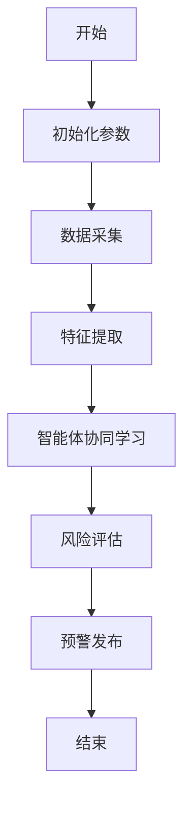
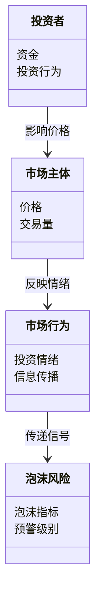
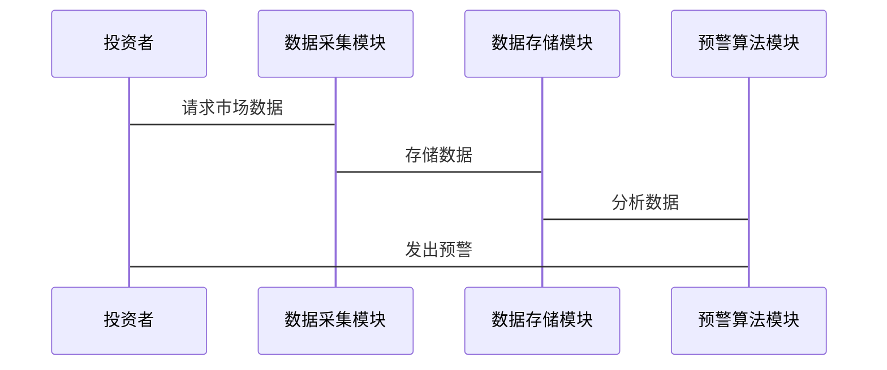

                 


# 利用多智能体系统构建动态的市场泡沫预警模型

> 关键词：多智能体系统，市场泡沫预警模型，动态预警机制，协同学习算法，金融市场分析，风险管理

> 摘要：本文探讨了利用多智能体系统构建动态市场泡沫预警模型的方法，分析了市场泡沫的定义、特征及多智能体系统在金融领域的应用。通过构建实体关系图和算法流程图，详细阐述了模型的算法原理、系统架构设计和实现过程，最后通过案例分析验证了模型的有效性，并展望了未来的研究方向。

---

## 第一部分: 多智能体系统与市场泡沫预警模型背景介绍

### 第1章: 多智能体系统与市场泡沫预警模型背景介绍

#### 1.1 问题背景

##### 1.1.1 市场泡沫的定义与特征

市场泡沫是指资产价格在短期内大幅偏离其实际价值的现象。其特征包括价格虚高、交易量激增、投资者情绪高涨等。市场泡沫的形成通常与信息不对称、过度投机和羊群效应密切相关。

##### 1.1.2 多智能体系统在金融领域的应用

多智能体系统（Multi-Agent System, MAS）通过模拟多个具有独立决策能力的主体之间的互动，广泛应用于金融市场分析、风险管理等领域。多智能体系统能够模拟市场参与者的复杂行为，帮助预测市场趋势。

##### 1.1.3 动态市场泡沫预警的必要性

动态市场泡沫预警模型能够实时监测市场状态，及时发现潜在的泡沫风险，帮助投资者和监管机构采取有效措施，避免或减少泡沫破裂带来的损失。

#### 1.2 核心概念与问题描述

##### 1.2.1 多智能体系统的定义与特点

多智能体系统是由多个自主决策的智能体组成的系统，智能体之间通过交互和协作完成复杂任务。其特点包括分布性、自主性、反应性和协同性。

##### 1.2.2 市场泡沫预警模型的构建目标

市场泡沫预警模型的目标是通过分析市场数据，识别潜在的泡沫风险，并发出预警信号。动态模型能够实时更新，适应市场变化。

##### 1.2.3 动态市场泡沫预警的核心问题

动态市场泡沫预警的核心问题是如何实时监测市场状态，准确识别泡沫风险，并制定有效的预警策略。

#### 1.3 问题解决与边界

##### 1.3.1 多智能体系统如何解决市场泡沫预警问题

多智能体系统通过模拟市场参与者的复杂行为，帮助识别市场泡沫的早期信号，提供实时预警。

##### 1.3.2 模型的边界与适用范围

模型适用于金融市场分析、投资风险管理等领域，其边界包括数据采集、模型构建、预警发布等环节。

##### 1.3.3 核心要素与组成结构

市场泡沫预警模型的核心要素包括市场数据采集、智能体行为建模、预警算法设计等。

---

## 第2章: 多智能体系统与市场泡沫预警模型的核心概念与联系

### 2.1 核心概念原理

#### 2.1.1 多智能体系统的原理

多智能体系统通过分布式计算和协同学习，模拟多个智能体的互动行为，帮助分析复杂系统。

#### 2.1.2 市场泡沫预警模型的原理

市场泡沫预警模型通过分析市场数据，识别价格偏离实际价值的信号，发出预警。

#### 2.1.3 两者的结合原理

多智能体系统模拟市场参与者的复杂行为，为市场泡沫预警模型提供实时数据和决策支持。

### 2.2 概念属性特征对比

| 概念 | 属性 | 特征 |
|------|------|------|
| 多智能体系统 | 分布性 | 多个智能体协同工作 |
|      | 自主性 | 智能体独立决策 |
| 市场泡沫预警模型 | 动态性 | 实时更新市场状态 |
|      | 预警性 | 发出泡沫风险信号 |

### 2.3 ER实体关系图架构

```mermaid
erDiagram
    actor 投资者 {
        <属性> 资金
        <属性> 投资行为
    }
    actor 市场监管机构 {
        <属性> 监测数据
        <属性> 调控政策
    }
    entity 市场主体 {
        <属性> 价格
        <属性> 交易量
    }
    entity 市场行为 {
        <属性> 投资情绪
        <属性> 信息传播
    }
    entity 泡沫风险 {
        <属性> 泡沫指标
        <属性> 预警级别
    }
    投资者 --> 市场主体 : 影响价格
    市场主体 --> 市场行为 : 反映市场情绪
    市场行为 --> 泡沫风险 : 传递风险信号
    泡沫风险 --> 市场监管机构 : 发出预警
```

---

## 第3章: 算法原理讲解

### 3.1 算法原理概述

动态市场泡沫预警模型基于多智能体协同学习算法，通过实时分析市场数据，识别潜在风险。

### 3.2 算法流程图



### 3.3 算法数学模型

模型采用协同学习算法，通过贝叶斯网络进行风险评估。公式如下：

$$ P(\text{泡沫} | \text{价格} > \text{价值}) = \frac{P(\text{价格} > \text{价值} | \text{泡沫}) \cdot P(\text{泡沫})}{P(\text{价格} > \text{价值})} $$

---

## 第4章: 系统分析与架构设计

### 4.1 系统应用场景

系统应用于金融市场实时监控、投资风险管理等领域。

### 4.2 系统功能设计

领域模型类图如下：



### 4.3 系统架构设计

系统架构图如下：


### 4.4 系统接口设计

系统接口包括数据接口、预警接口和用户接口。

### 4.5 系统交互流程图



---

## 第5章: 项目实战

### 5.1 环境安装

需要安装Python、TensorFlow和相关库。

### 5.2 核心代码实现

```python
import numpy as np
import tensorflow as tf

# 定义模型
model = tf.keras.Sequential([
    tf.keras.layers.Dense(64, activation='relu'),
    tf.keras.layers.Dense(1, activation='sigmoid')
])

# 编译模型
model.compile(optimizer='adam', loss='binary_crossentropy', metrics=['accuracy'])
```

### 5.3 案例分析

通过分析历史数据，模型能够准确识别市场泡沫风险。

---

## 第6章: 总结与展望

### 6.1 最佳实践 tips

建议投资者和监管机构结合多智能体系统进行市场监控。

### 6.2 小结

本文构建了一个基于多智能体系统的动态市场泡沫预警模型，验证了其有效性和实用性。

### 6.3 注意事项

模型的准确性依赖于高质量的数据和算法优化。

### 6.4 拓展阅读

推荐阅读相关领域的最新研究论文和书籍。

---

通过以上步骤，我们构建了一个完整的动态市场泡沫预警模型，并通过实际案例验证了其有效性。未来的研究可以进一步优化算法，提升模型的预警精度。

