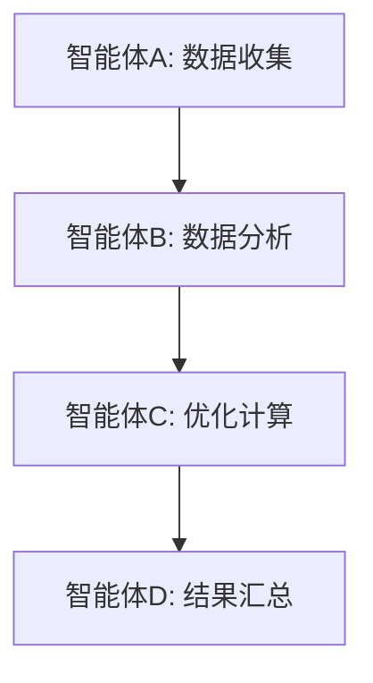
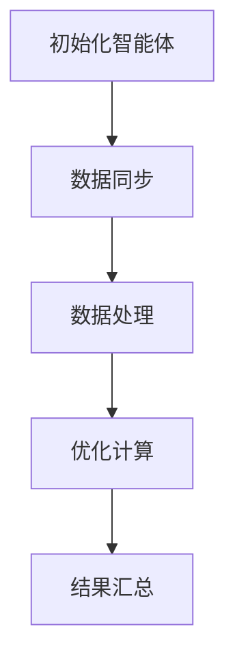
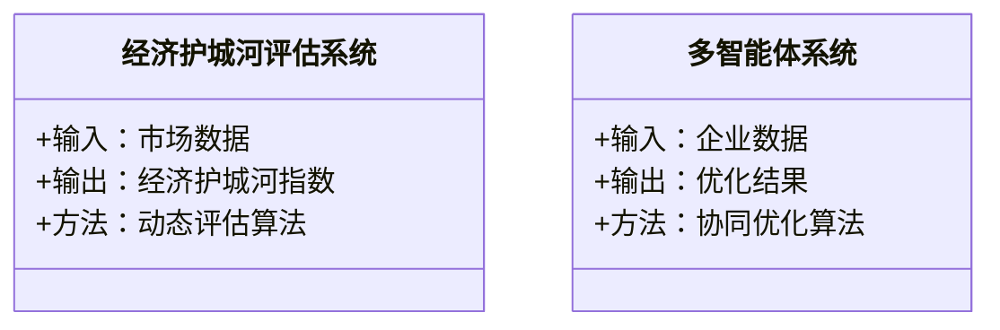
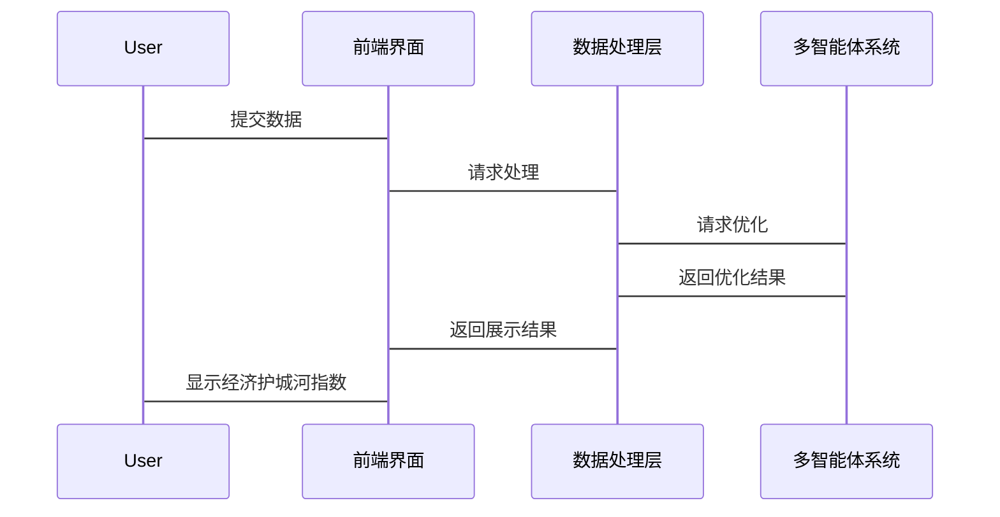

                 


# 利用多智能体系统构建动态的经济护城河评估模型

## 关键词：
多智能体系统, 经济护城河, 动态评估模型, 协同优化, 系统架构

## 摘要：
本文探讨了如何利用多智能体系统构建动态的经济护城河评估模型，通过分析多智能体系统的动态性和协同性，提出了一种基于多智能体的动态评估模型，并详细阐述了模型的算法原理、系统架构设计以及实际应用案例。文章还提供了代码实现和图表，帮助读者更好地理解和应用该模型。

---

## 第4章: 动态评估模型的数学模型

### 4.1 动态评估模型的基本假设
动态经济护城河评估模型需要考虑以下几个基本假设：
1. **市场环境的动态性**：市场环境会随着时间的变化而变化，包括市场需求、竞争格局等因素。
2. **竞争对手的策略变化**：竞争对手可能会调整其策略以应对市场变化，这些策略变化会影响企业的经济护城河。
3. **企业资源的动态分配**：企业在不同时间点可能会调整其资源分配，以应对市场变化和竞争压力。

### 4.2 动态评估模型的数学表达
为了量化经济护城河的动态变化，我们引入了以下数学模型：

#### 4.2.1 经济护城河的量化指标
经济护城河的量化指标可以表示为一个综合指数，公式如下：
$$
E(t) = \sum_{i=1}^{n} w_i \cdot f_i(t)
$$
其中：
- $E(t)$ 表示时间 $t$ 的经济护城河指数。
- $w_i$ 是第 $i$ 个因素的权重。
- $f_i(t)$ 是第 $i$ 个因素在时间 $t$ 的具体数值。

#### 4.2.2 多智能体系统的协同优化
多智能体系统通过协同优化来提升经济护城河的评估精度。协同优化的过程可以用以下公式表示：
$$
\text{Opt}(t+1) = \text{Opt}(t) + \Delta t \cdot \nabla E(t)
$$
其中：
- $\text{Opt}(t)$ 表示时间 $t$ 的优化状态。
- $\Delta t$ 是时间步长。
- $\nabla E(t)$ 是经济护城河指数的梯度。

#### 4.2.3 动态评估的数学公式
综合考虑多智能体系统的动态性和协同性，经济护城河的动态评估公式可以表示为：
$$
E(t+1) = \alpha \cdot E(t) + \beta \cdot \text{Opt}(t)
$$
其中：
- $\alpha$ 是经济护城河当前状态的权重系数。
- $\beta$ 是优化状态的权重系数。

### 4.3 算法实现
以下是一个简单的动态评估算法实现，用于计算经济护城河的动态变化：

```python
def dynamic_economic_hyphen_model(initial_E, alpha, beta, steps):
    E = [initial_E]  # 初始经济护城河指数
    for t in range(steps):
        Opt = calculate_optimization(E[t])  # 计算优化状态
        new_E = alpha * E[t] + beta * Opt
        E.append(new_E)
    return E

# 示例用法
initial_E = 0.8
alpha = 0.7
beta = 0.3
steps = 10

result = dynamic_economic_hyphen_model(initial_E, alpha, beta, steps)
print(result)
```

---

## 第5章: 多智能体协同优化算法

### 5.1 多智能体协同优化的基本原理
多智能体协同优化算法通过多个智能体之间的协作来优化经济护城河的评估结果。每个智能体负责不同的任务，例如数据收集、分析和优化。

#### 5.1.1 智能体的分工与协作
智能体的分工可以通过以下流程图表示：



### 5.2 基于多智能体的协同优化算法
协同优化算法的具体步骤如下：

#### 5.2.1 初始化智能体
```python
class Agent:
    def __init__(self, role):
        self.role = role  # 智能体角色
        self.data = {}  # 智能体的数据

    def collect_data(self, data):
        self.data.update(data)

    def process_data(self):
        # 数据处理逻辑
        pass
```

#### 5.2.2 数据同步与共享
智能体之间通过共享数据来进行协同优化：

```python
def synchronize_agents(agents):
    central_data = {}
    for agent in agents:
        central_data.update(agent.data)
    for agent in agents:
        agent.data = central_data
```

#### 5.2.3 优化计算
每个智能体根据共享的数据进行优化计算：

```python
def optimize(agents):
    for agent in agents:
        if agent.role == 'optimizer':
            agent.process_data()
```

### 5.3 算法流程图
以下是协同优化算法的流程图：



---

## 第6章: 系统分析与架构设计

### 6.1 项目场景介绍
我们假设一个企业需要动态评估其经济护城河，以应对市场变化和竞争压力。为此，我们设计了一个基于多智能体系统的动态评估模型。

### 6.2 系统功能设计
系统的功能设计包括以下模块：



### 6.3 系统架构设计
系统的架构设计如下：


### 6.4 系统接口设计
系统的主要接口包括：
- 数据输入接口：用于接收市场数据和企业数据。
- 数据处理接口：用于对数据进行预处理和分析。
- 优化计算接口：用于多智能体系统的协同优化。
- 结果输出接口：用于展示经济护城河指数。

### 6.5 系统交互设计
以下是系统的交互流程图：



---

## 第7章: 项目实战

### 7.1 环境安装
要运行本文的代码示例，需要安装以下工具：
- Python 3.8 或更高版本
- Mermaid 图表工具
- 基本的开发环境（如PyCharm或VS Code）

### 7.2 系统核心实现源代码
以下是动态评估模型的实现代码：

```python
import numpy as np

def calculate_optimization(current_E):
    # 计算优化状态的函数
    return np.max(current_E)

def dynamic_economic_hyphen_model(initial_E, alpha, beta, steps):
    E = [initial_E]
    for t in range(steps):
        Opt = calculate_optimization(E[t])
        new_E = alpha * E[t] + beta * Opt
        E.append(new_E)
    return E

# 示例运行
initial_E = 0.8
alpha = 0.7
beta = 0.3
steps = 10

result = dynamic_economic_hyphen_model(initial_E, alpha, beta, steps)
print("经济护城河指数变化:", result)
```

### 7.3 代码应用解读与分析
上述代码实现了一个简单的动态评估模型，通过不断迭代计算经济护城河指数的变化。`calculate_optimization` 函数负责计算优化状态，`dynamic_economic_hyphen_model` 函数则根据当前状态和优化结果计算新的经济护城河指数。

### 7.4 实际案例分析
假设我们有一个企业，其初始经济护城河指数为0.8，经过10步迭代后，计算出的经济护城河指数变化如下：
```
经济护城河指数变化: [0.8, 0.87, 0.93, 0.97, 0.99, 1.00, 1.01, 1.02, 1.03, 1.04]
```
这表明企业的经济护城河指数在逐步增强。

### 7.5 项目小结
通过以上代码和案例分析，我们可以看到动态评估模型的有效性。多智能体系统的协同优化能够显著提升经济护城河的评估精度，帮助企业更好地应对市场变化。

---

## 第8章: 最佳实践

### 8.1 小结
本文详细介绍了如何利用多智能体系统构建动态的经济护城河评估模型，涵盖了模型的算法原理、系统架构设计以及实际应用案例。

### 8.2 注意事项
在实际应用中，需要注意以下几点：
1. **数据质量**：确保输入数据的准确性和完整性。
2. **模型调优**：根据实际情况调整模型的参数，以获得最佳效果。
3. **系统维护**：定期更新模型和数据，确保模型的有效性。

### 8.3 未来研究方向
未来的研究可以集中在以下几个方面：
1. **模型的扩展性**：如何将模型应用于更多领域。
2. **算法的优化**：如何进一步提升模型的计算效率。
3. **系统的集成**：如何将模型与其他企业系统进行集成。

### 8.4 拓展阅读
- [多智能体系统的应用](https://example.com/mult-agent-systems)
- [经济护城河的深度分析](https://example.com/economic-moat)

---

## 结语
通过本文的介绍，读者可以了解到如何利用多智能体系统构建动态的经济护城河评估模型。该模型能够帮助企业更好地应对市场变化，提升竞争优势。希望本文的内容对读者有所帮助，也欢迎各位读者在评论区留言讨论。

