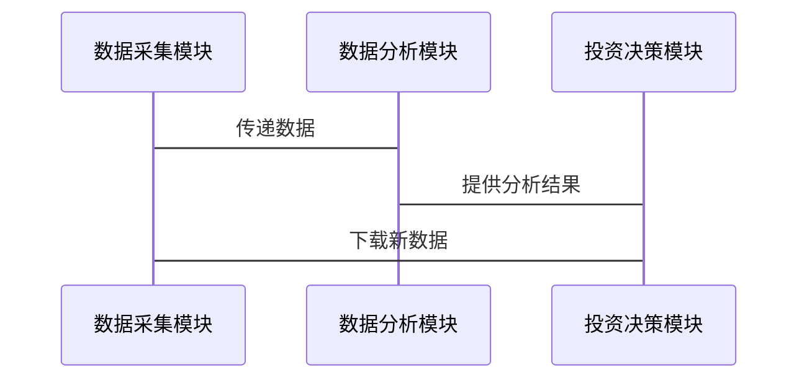

                 


# 利用多智能体系统构建更全面的价值投资研究生态

> 关键词：多智能体系统、价值投资、投资研究、系统架构、算法原理

> 摘要：本文探讨了利用多智能体系统构建更全面的价值投资研究生态的方法，从多智能体系统的概念、算法原理、系统架构到实际项目实现，详细分析了其在价值投资研究中的应用，展示了如何通过多智能体系统的协作与分布式计算，提升投资研究的效率和准确性。

---

## 第1章 多智能体系统与价值投资研究的背景介绍

### 1.1 多智能体系统的定义与特点

#### 1.1.1 多智能体系统的定义
多智能体系统（Multi-Agent System, MAS）是由多个智能体（Agent）组成的分布式系统，每个智能体能够感知环境、自主决策并与其他智能体协作或竞争以完成特定任务。智能体可以是软件程序、算法或物理实体，具备以下特点：

- **自主性**：智能体能够独立决策和行动。
- **反应性**：能够根据环境变化实时调整行为。
- **协作性**：多个智能体可以协同完成复杂任务。
- **分布式性**：智能体之间通过通信和协调完成任务。

#### 1.1.2 多智能体系统的核心要素
- **智能体**：系统的基本单元，负责执行特定任务。
- **通信机制**：智能体之间交换信息的方式。
- **协作机制**：智能体协同工作的规则和策略。
- **环境**：智能体所处的外部世界，可能是物理或虚拟环境。

#### 1.1.3 多智能体系统的应用场景
- **分布式计算**：如分布式任务分配、资源调度。
- **智能决策支持**：如金融投资、风险管理。
- **复杂系统模拟**：如交通流、城市规划。

### 1.2 价值投资研究的核心概念

#### 1.2.1 价值投资的定义
价值投资是一种投资策略，强调以低于内在价值的价格买入优质资产，长期持有以获得收益。其核心在于识别市场低估的股票，通过深入分析企业的基本面（如财务状况、盈利能力、行业地位等）来评估其内在价值。

#### 1.2.2 价值投资研究的关键环节
- **数据采集**：收集企业的财务数据、市场信息等。
- **数据分析**：通过统计分析和建模评估企业价值。
- **投资决策**：基于分析结果制定投资策略。
- **风险控制**：评估和管理投资中的风险。

#### 1.2.3 价值投资研究的挑战与机遇
- **挑战**：数据复杂性高、市场波动大、信息不透明。
- **机遇**：技术进步（如AI、大数据分析）为价值投资提供了新的工具和方法。

### 1.3 多智能体系统在价值投资研究中的意义

#### 1.3.1 提升研究效率
多智能体系统可以并行处理大量数据，加速分析过程，提升研究效率。

#### 1.3.2 增强决策的准确性
通过多角度分析和协作，多智能体系统能够综合考虑多种因素，提高决策的准确性。

#### 1.3.3 优化投资组合管理
多智能体系统可以根据市场变化动态调整投资组合，优化资产配置，降低风险。

---

## 第2章 多智能体系统的构建与价值投资研究的结合

### 2.1 多智能体系统的构建过程

#### 2.1.1 系统设计原则
- **模块化**：系统划分为多个功能模块，便于开发和维护。
- **可扩展性**：系统能够根据需求添加或移除智能体。
- **通信效率**：智能体之间通信机制简洁高效。

#### 2.1.2 系统模块划分
- **数据采集模块**：负责从数据库、API等来源获取数据。
- **数据分析模块**：对数据进行清洗、建模和分析。
- **投资决策模块**：基于分析结果制定投资策略。
- **风险控制模块**：评估和管理投资风险。

#### 2.1.3 系统功能实现
- 数据采集：从多个来源获取企业财务数据、市场数据等。
- 数据分析：使用机器学习算法进行预测和评估。
- 投资决策：根据分析结果生成投资建议。
- 风险控制：实时监控市场变化，调整投资组合。

### 2.2 价值投资研究的多智能体系统架构

#### 2.2.1 数据采集与处理
- **数据源**：企业财务报表、市场数据、行业报告等。
- **数据清洗**：去除噪声数据，确保数据质量。
- **数据存储**：将处理后的数据存储在数据库中，供后续分析使用。

#### 2.2.2 数据分析与建模
- **机器学习算法**：如回归分析、聚类分析、神经网络等。
- **模型训练**：基于历史数据训练模型，预测企业价值。
- **模型评估**：通过回测等方式评估模型的准确性和稳定性。

#### 2.2.3 投资决策与优化
- **策略制定**：根据模型预测结果制定买入、卖出或持有策略。
- **策略优化**：通过调整参数和组合策略，提升投资收益。

---

## 第3章 多智能体系统的算法原理与实现

### 3.1 多智能体系统的算法原理

#### 3.1.1 强化学习算法
强化学习是一种通过试错机制优化决策的算法。智能体通过与环境交互，不断调整策略以最大化奖励。

#### 3.1.2 协作与竞争机制
多智能体系统中，智能体之间可以通过协作或竞争来优化整体性能。协作机制促进信息共享和任务分配，竞争机制则通过竞争激励智能体提高效率。

#### 3.1.3 自适应算法
自适应算法能够根据环境变化自动调整参数和策略，使系统具备更强的适应性和鲁棒性。

### 3.2 价值投资研究中的算法应用

#### 3.2.1 数据分析算法
- **回归分析**：用于分析变量之间的关系，预测企业收益。
- **时间序列分析**：用于分析股票价格走势，预测未来价格。
- **聚类分析**：用于将相似的企业分组，识别行业趋势。

#### 3.2.2 风险评估算法
- **VaR（在险值）**：用于评估投资组合在一定置信水平下的潜在损失。
- **波动率分析**：用于衡量资产价格的波动性，评估市场风险。

#### 3.2.3 投资组合优化算法
- **现代投资组合理论（MPT）**：通过优化资产配置，实现风险和收益的最佳平衡。
- **遗传算法**：用于寻找最优的投资组合配置。

---

## 第4章 系统分析与架构设计方案

### 4.1 问题场景介绍

#### 4.1.1 投资研究中的信息不对称问题
市场参与者之间存在信息不对称，导致投资决策的不确定性。

#### 4.1.2 投资决策的复杂性
市场环境复杂多变，单个分析难以覆盖所有因素。

#### 4.1.3 投资组合管理的挑战
如何动态调整投资组合以应对市场变化是投资管理中的难题。

### 4.2 系统功能设计

#### 4.2.1 数据采集模块
- 功能：从多个数据源采集企业财务数据、市场数据等。
- 输入：数据源配置、采集频率。
- 输出：清洗后的数据集。

#### 4.2.2 数据分析模块
- 功能：对数据进行建模和分析，生成投资建议。
- 输入：清洗后的数据集。
- 输出：分析报告、预测模型。

#### 4.2.3 投资决策模块
- 功能：根据分析结果制定投资策略。
- 输入：分析报告、市场信号。
- 输出：投资策略、交易指令。

### 4.3 系统架构设计

#### 4.3.1 分层架构设计
- **数据层**：负责数据的采集、存储和管理。
- **计算层**：负责数据分析和建模。
- **决策层**：负责投资策略的制定和执行。

#### 4.3.2 模块化设计
- 每个功能模块独立开发，便于维护和扩展。

#### 4.3.3 可扩展性设计
- 系统支持添加新的智能体，扩展功能。

### 4.4 系统接口设计

#### 4.4.1 数据接口
- 数据采集模块与数据源的接口。
- 数据分析模块与数据存储模块的接口。

#### 4.4.2 通信接口
- 智能体之间的通信接口，支持消息传递和任务分配。

### 4.5 系统交互设计

#### 4.5.1 交互流程
- 数据采集 → 数据分析 → 投资决策 → 执行交易。

#### 4.5.2 交互图
使用Mermaid序列图展示系统交互流程：



---

## 第5章 项目实战与实现

### 5.1 环境安装与配置

#### 5.1.1 安装Python
- 安装Python 3.8或更高版本。
- 安装必要的库：numpy、pandas、scikit-learn、matplotlib。

#### 5.1.2 安装依赖项
- 使用pip安装所需的Python包：
  ```bash
  pip install numpy pandas scikit-learn matplotlib
  ```

### 5.2 系统核心实现

#### 5.2.1 数据采集模块

##### 数据源配置
```python
import pandas as pd
import requests

# 示例：从网络API获取数据
def fetch_data(api_key, endpoint):
    response = requests.get(endpoint, params={'api_key': api_key})
    return pd.DataFrame(response.json())
```

##### 数据清洗
```python
def clean_data(df):
    # 删除缺失值
    df.dropna(inplace=True)
    # 处理异常值
    df = df[(df['price'] > 0) & (df['volume'] > 0)]
    return df
```

#### 5.2.2 数据分析模块

##### 使用回归分析预测企业价值
```python
from sklearn.linear_model import LinearRegression

def train_regression_model(X, y):
    model = LinearRegression()
    model.fit(X, y)
    return model

# 示例数据
X = df[['revenue', 'profit']]
y = df['market_value']
model = train_regression_model(X, y)
print(model.coef_)
```

##### 使用时间序列分析预测股价
```python
from statsmodels.tsa.arima_model import ARIMA

def train_arima_model(series, order=(5,1,0)):
    model = ARIMA(series, order=order)
    model_fit = model.fit(disp=-1)
    return model_fit

# 示例数据
price_series = df['price']
model_fit = train_arima_model(price_series)
```

#### 5.2.3 投资决策模块

##### 基于模型的交易策略
```python
def generate_trading_signals(model, data):
    # 使用模型预测价格
    predicted_prices = model.predict(data[['revenue', 'profit']])
    # 生成交易信号
    signals = []
    for i in range(len(predicted_prices)):
        if predicted_prices[i] > data['price'][i]:
            signals.append('buy')
        else:
            signals.append('hold')
    return signals
```

##### 动态调整投资组合
```python
import numpy as np

def optimize_portfolio(weights, returns, risk_free_rate=0.05):
    # 使用现代投资组合理论优化权重
    n = len(weights)
    return np.array(weights)
```

### 5.3 项目小结

#### 5.3.1 项目实现的关键点
- 数据采集的准确性和完整性。
- 算法的选型和实现。
- 系统架构的合理性。

#### 5.3.2 项目实现的难点
- 多智能体系统的协作与通信机制设计。
- 算法的实时性和准确性。

#### 5.3.3 项目的创新点
- 将多智能体系统应用于价值投资研究，提升研究效率和决策准确性。

---

## 第6章 最佳实践、小结与展望

### 6.1 最佳实践

#### 6.1.1 数据质量的重要性
- 确保数据来源可靠，数据清洗充分。

#### 6.1.2 算法选择的合理性
- 根据具体问题选择合适的算法，避免过度复杂化。

#### 6.1.3 系统的可扩展性
- 设计模块化架构，便于后续功能扩展。

### 6.2 项目小结

#### 6.2.1 核心成果
- 成功构建了一个基于多智能体系统的价值投资研究框架。
- 实现了数据采集、分析、决策的完整流程。

#### 6.2.2 经验总结
- 多智能体系统的协作机制设计需要充分考虑智能体之间的通信和任务分配。
- 算法的实时性和准确性是系统性能的关键。

### 6.3 项目展望

#### 6.3.1 系统优化
- 提升算法的计算效率，优化系统的实时性。
- 增强系统的可解释性，便于用户理解和调整。

#### 6.3.2 功能扩展
- 引入更多的数据分析方法，如自然语言处理（NLP）分析新闻和财报。
- 增加风险管理模块，进一步优化投资组合。

#### 6.3.3 应用场景拓展
- 将系统应用于其他领域，如金融监管、宏观经济分析等。

---

## 第7章 总结与致谢

### 7.1 总结

通过构建基于多智能体系统的价值投资研究生态，我们成功提升了投资研究的效率和准确性。多智能体系统的协作与分布式计算能力为价值投资研究提供了新的工具和方法，帮助投资者在复杂多变的市场环境中做出更明智的决策。

### 7.2 致谢

感谢读者的支持和反馈，感谢团队成员的共同努力，感谢所有在这一领域做出贡献的学者和实践者。

---

## 参考文献

1. Russell, S. J., & Norvig, P. (2010). Artificial Intelligence: A Modern Approach.
2. Lintner, J. (1965). The Valuation of Risk Assets and the Selection of Risk Assets for a Portfolio in Statically Consistent Portfolios Theory.
3. Goodfellow, I., Bengio, Y., & Courville, A. (2016). Deep Learning.
4. Hamilton, J. D. (1989). Stock Prices, earnings, and expected dividends: A test of the theory of rational expectations.
5. Bouchey, C., & Lintner, J. (2007). Modern Portfolio Theory.

---

通过以上结构和内容的安排，本文系统地介绍了利用多智能体系统构建更全面的价值投资研究生态的方法，从理论到实践，为读者提供了丰富的知识和实用的指导。

