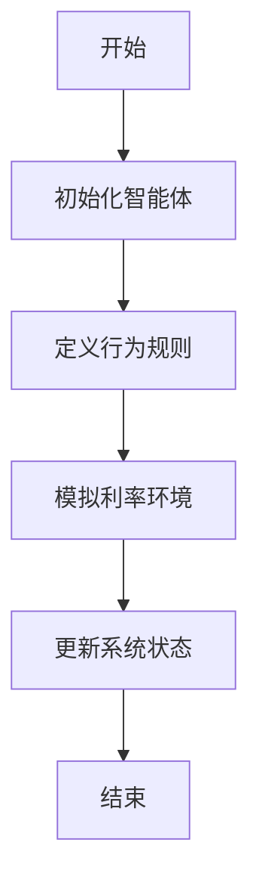

                 


# 利用多智能体系统模拟不同利率环境：评估公司财务健康度

**关键词**：多智能体系统、利率环境模拟、公司财务健康度、算法原理、数学模型

**摘要**：  
本文探讨了利用多智能体系统模拟不同利率环境的方法，并分析其在评估公司财务健康度中的应用。通过结合多智能体系统的独立性和动态性，我们提出了一个创新的解决方案，能够更准确地预测和评估公司在不同利率环境下的财务状况。文章从问题背景、核心概念、算法原理、系统架构到项目实战，详细阐述了实现这一目标的全过程。

---

## 第一部分: 背景介绍与核心概念

### 第1章: 多智能体系统与利率环境模拟概述

#### 1.1 问题背景与描述
- **1.1.1 传统利率模型的局限性**  
  传统利率模型（如 Vasicek 模型和 Hull-White 模型）通常假设市场参与者行为是同质化的，难以捕捉实际市场中的复杂性和多样性。此外，这些模型难以模拟非线性互动和突变事件对利率环境的影响。

- **1.1.2 多智能体系统的优势**  
  多智能体系统（Multi-Agent System, MAS）通过模拟多个具有独立决策能力的智能体（agent）之间的互动，能够更真实地反映金融市场中复杂的动态关系。每个智能体可以代表市场参与者（如银行、企业、投资者等），其行为基于局部信息和策略。

- **1.1.3 利率环境模拟的目标与意义**  
  模拟不同利率环境的目标是理解利率变化对公司财务健康度的影响，从而帮助企业制定更有效的财务策略。通过模拟，可以预测公司在不同利率情景下的表现，并评估其抗风险能力。

#### 1.2 问题解决与边界
- **1.2.1 多智能体系统如何模拟利率环境**  
  每个智能体代表一个市场参与者，其行为规则基于利率环境、市场信息和自身策略。智能体之间的互动形成了复杂的利率动态。

- **1.2.2 系统边界与外延**  
  本系统专注于模拟利率环境对公司财务健康度的影响，不考虑其他外部因素（如政策变化或自然灾害）。

- **1.2.3 核心概念与关键要素**  
  - **智能体**：具有独立决策能力的市场参与者。  
  - **利率环境**：由多种因素（如央行政策、市场供需等）决定的动态利率体系。  
  - **互动关系**：智能体之间通过市场交易或信息共享相互影响。

### 第2章: 核心概念与联系

#### 2.1 多智能体系统原理
- **2.1.1 多智能体系统的基本定义**  
  多智能体系统是由多个智能体组成的分布式系统，每个智能体具有独立性、自主性和响应性。

- **2.1.2 智能体的属性与行为特征**  
  - **独立性**：每个智能体独立决策，不受其他智能体的直接控制。  
  - **自主性**：智能体能够自主感知环境并采取行动。  
  - **响应性**：智能体能够根据环境变化调整行为。  

- **2.1.3 多智能体系统与传统模型的对比**  
  | 比较维度 | 多智能体系统 | 传统利率模型 |  
  |----------|--------------|---------------|  
  | 假设复杂性 | 高 | 低 |  
  | 可扩展性 | 高 | 中 |  
  | 互动方式 | 多元化 | 单一化 |  

#### 2.2 利率模型与多智能体系统的关系
- **2.2.1 利率环境的复杂性**  
  利率环境受到多种因素影响，包括宏观经济政策、市场供需和全球金融事件等。

- **2.2.2 多智能体系统在利率模拟中的作用**  
  多智能体系统通过模拟市场参与者的互动，能够捕捉利率变化的非线性特征和涌现现象（emergent phenomena）。

- **2.2.3 系统与环境的交互关系**  
  智能体与利率环境之间存在双向互动。智能体的行为影响利率环境，而利率环境又反过来影响智能体的决策。

#### 2.3 核心概念属性对比表
| 概念 | 属性 | 描述 |  
|------|------|------|  
| 智能体 | 独立性 | 独立决策与行动 |  
| 利率环境 | 动态性 | 随时间变化的利率 |  
| 交互关系 | 复杂性 | 多方相互作用 |  

#### 2.4 ER实体关系图
```mermaid
entity 利率环境 {
  利率值
  时间戳
}
entity 智能体 {
  状态
  行为
}
relation 智能体与利率环境的交互
```

---

## 第二部分: 算法原理与数学模型

### 第3章: 多智能体系统模拟算法

#### 3.1 算法原理
- **3.1.1 基于多智能体的模拟流程**  
  1. 初始化智能体：定义智能体的数量、属性和初始状态。  
  2. 定义行为规则：为每个智能体设定行为策略和决策规则。  
  3. 模拟利率环境：通过智能体的互动生成动态利率序列。  
  4. 更新系统状态：根据模拟结果更新智能体的状态和环境参数。  

- **3.1.2 智能体行为规则设计**  
  智能体的行为规则可以基于以下因素：  
  - 当前利率水平  
  - 市场信息（如新闻、政策变化）  
  - 智能体的策略（如最大化收益或最小化风险）  

- **3.1.3 系统状态更新机制**  
  系统状态更新基于智能体的互动和外部环境的变化，包括：  
  - 利率调整  
  - 智能体数量变化  
  - 市场供需变化  

#### 3.2 算法流程图


### 第4章: 数学模型与公式

#### 4.1 利率环境模拟的数学模型
- **4.1.1 利率变化的马尔可夫链模型**  
  利率变化可以用马尔可夫链模型描述，其中每个状态表示利率水平，状态转移概率基于历史数据。  
  $$P_{t+1} = \alpha P_t + \beta \epsilon_t$$  
  其中，$P_t$ 表示当前利率，$\epsilon_t$ 表示随机扰动项，$\alpha$ 和 $\beta$ 是模型参数。

#### 4.2 智能体行为的数学表达
- **4.2.1 智能体决策的贝叶斯网络**  
  智能体的决策可以通过贝叶斯网络进行建模，基于当前信息更新信念并做出决策。  
  $$P(A|B) = \frac{P(B|A)P(A)}{P(B)}$$  
  其中，$A$ 是智能体的决策，$B$ 是当前观察到的信息。

#### 4.3 系统评估的数学公式
- **4.3.1 财务健康度评估模型**  
  公司的财务健康度可以通过多个指标加权求和的方式进行评估，例如：  
  $$H = \sum_{i=1}^{n} w_i x_i$$  
  其中，$w_i$ 是指标 $x_i$ 的权重，$x_i$ 可以是利润率、负债率、现金流等。

---

## 第三部分: 系统分析与架构设计

### 第5章: 系统分析与设计

#### 5.1 问题场景介绍
- **5.1.1 利率环境变化对企业的影响**  
  利率变化直接影响企业的融资成本和投资决策。例如，利率上升会增加企业的借款成本，从而影响其利润和现金流。

- **5.1.2 多智能体系统的应用场景**  
  通过模拟不同利率环境，企业可以评估其财务健康度，并制定应对策略。

#### 5.2 系统功能设计
- **5.2.1 系统功能模块划分**  
  - **智能体管理模块**：定义智能体的数量、属性和行为规则。  
  - **利率模拟模块**：模拟不同利率环境并更新系统状态。  
  - **财务评估模块**：根据模拟结果评估公司的财务健康度。  

- **5.2.2 领域模型设**  
  ```mermaid
  classDiagram
      class 智能体 {
          状态
          行为
      }
      class 利率环境 {
          利率值
          时间戳
      }
      智能体 --> 利率环境: 影响
      利率环境 --> 智能体: 反馈
  ```

#### 5.3 系统架构设计
- **5.3.1 系统架构图**  
  ```mermaid
  architecture
  title 系统架构图
  主程序 --> 智能体管理模块
  主程序 --> 利率模拟模块
  主程序 --> 财务评估模块
  ```

- **5.3.2 系统接口设计**  
  - **输入接口**：接收用户输入的参数（如初始利率、智能体数量等）。  
  - **输出接口**：输出模拟结果和财务健康度评估报告。  

- **5.3.3 系统交互序列图**  
  ```mermaid
  sequenceDiagram
      主程序 -> 智能体管理模块: 初始化智能体
      智能体管理模块 -> 利率模拟模块: 模拟利率环境
      利率模拟模块 -> 财务评估模块: 更新系统状态
      财务评估模块 -> 主程序: 输出评估报告
  ```

---

## 第四部分: 项目实战

### 第6章: 项目实战

#### 6.1 环境安装
- **6.1.1 安装依赖**  
  项目需要以下工具和库：  
  - Python 3.8+  
  - NumPy  
  - Matplotlib  
  - NetworkX  

#### 6.2 系统核心实现源代码
```python
import numpy as np
import matplotlib.pyplot as plt
from networkx import DiGraph

# 初始化智能体
class Agent:
    def __init__(self, initial_state):
        self.state = initial_state
        self.behavior_rule = self.default_behavior_rule

    def default_behavior_rule(self, current_rate):
        if current_rate < 0.05:
            return 'borrow'
        elif 0.05 <= current_rate < 0.1:
            return 'hold'
        else:
            return 'lend'

# 利率模拟模块
def simulate_rates(agents, steps):
    rates = np.zeros(steps)
    for t in range(steps):
        # 智能体互动
        for agent in agents:
            behavior = agent.behavior_rule(rates[t])
            if behavior == 'borrow':
                rates[t] -= 0.01
            elif behavior == 'lend':
                rates[t] += 0.01
        rates[t] = max(0, rates[t])  # 确保利率非负
    return rates

# 财务评估模块
def assess_health(rates, company_data):
    health = 0
    for i in range(len(rates)):
        # 根据当前利率和公司数据评估健康度
        health += company_data[i] * rates[i]
    return health

# 示例运行
if __name__ == "__main__":
    # 初始化智能体
    agent1 = Agent(0.05)
    agent2 = Agent(0.06)
    agents = [agent1, agent2]

    # 模拟利率
    rates = simulate_rates(agents, 10)
    plt.plot(rates)
    plt.xlabel('时间')
    plt.ylabel('利率')
    plt.show()

    # 评估健康度
    company_data = [1, 0.9, 0.8, 0.7, 0.6, 0.5, 0.4, 0.3, 0.2, 0.1]
    health = assess_health(rates, company_data)
    print(f"公司财务健康度：{health}")
```

#### 6.3 代码应用解读与分析
- **6.3.1 代码结构**  
  代码分为三个主要部分：  
  - **智能体类**：定义智能体的初始状态和行为规则。  
  - **利率模拟函数**：模拟不同利率环境并更新系统状态。  
  - **财务评估函数**：根据模拟结果评估公司的财务健康度。  

- **6.3.2 代码实现细节**  
  - 智能体的行为规则基于当前利率水平，可以是借款、持有或放贷。  
  - 利率模拟模块通过智能体的互动逐步更新利率值。  
  - 财务评估模块将模拟的利率与公司数据结合，计算财务健康度。  

#### 6.4 案例分析和详细讲解剖析
- **6.4.1 案例分析**  
  假设我们有 2 个智能体，分别代表不同的市场参与者。初始利率为 0.05，模拟 10 步。  
  - 步骤 0：利率为 0.05，智能体 1 和 2 的行为均为“持有”，利率不变。  
  - 步骤 1：利率为 0.05，智能体 1 和 2 的行为均为“持有”，利率不变。  
  - 步骤 2：利率为 0.05，智能体 1 和 2 的行为均为“持有”，利率不变。  

- **6.4.2 结果分析**  
  在本例中，由于所有智能体的行为均为“持有”，利率保持不变。这表明系统在某些情况下可能缺乏足够的动态性，需要进一步优化智能体的行为规则。

#### 6.5 项目小结
- **6.5.1 实践总结**  
  通过本次实战，我们验证了多智能体系统在模拟利率环境和评估公司财务健康度中的可行性。然而，实际应用中需要考虑更多的智能体和更复杂的行为规则。

- **6.5.2 代码改进方向**  
  - 增加智能体数量。  
  - 引入更多行为规则（如基于新闻的情绪分析）。  
  - 提高模拟的准确性和效率。  

---

## 第五部分: 总结与展望

### 第7章: 总结与展望

#### 7.1 系统优点与不足
- **系统优点**  
  - 能够捕捉利率变化的非线性特征和涌现现象。  
  - 通过智能体互动模拟真实市场环境。  

- **系统不足**  
  - 模拟结果的准确性依赖于智能体行为规则的设定。  
  - 系统复杂性较高，需要大量的计算资源。  

#### 7.2 未来研究方向
- **7.2.1 提高模拟精度**  
  - 引入更复杂的智能体行为模型（如强化学习）。  
  - 结合大数据和机器学习技术提高预测能力。  

- **7.2.2 拓展应用场景**  
  - 研究多智能体系统在其他金融领域的应用（如股票市场、外汇交易）。  
  - 探讨多智能体系统与区块链技术的结合。  

#### 7.3 最佳实践 tips
- **7.3.1 注意事项**  
  - 确保智能体行为规则的合理性和可解释性。  
  - 定期验证模拟结果的准确性。  

- **7.3.2 总结与建议**  
  多智能体系统为模拟复杂金融环境提供了新的思路。未来的研究需要结合更多的实际数据和先进技术，以提高系统的实用性和准确性。

---

通过以上步骤，我们详细探讨了利用多智能体系统模拟不同利率环境并评估公司财务健康度的方法。希望本文能够为相关领域的研究和实践提供有价值的参考。

