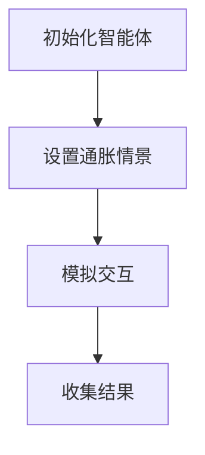
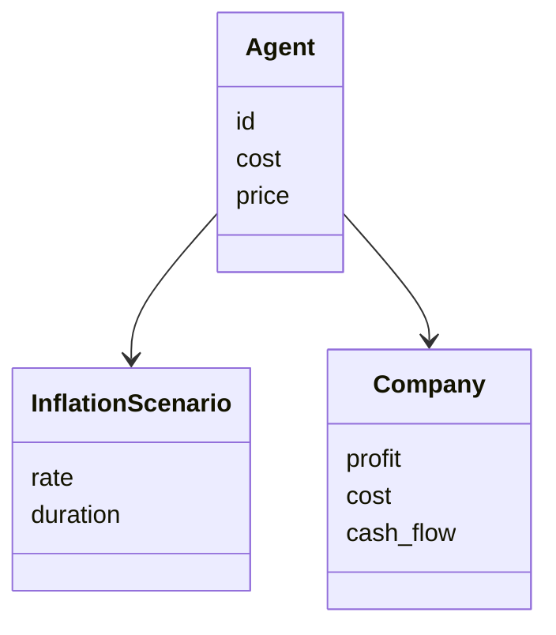

                 


# 利用多智能体系统模拟不同通胀情景：评估公司抗通胀能力

## 关键词：多智能体系统、通胀情景、抗通胀能力、经济模拟、系统架构

## 摘要：  
本文探讨了如何利用多智能体系统（MAS）模拟不同通胀情景，评估公司抗通胀能力。通过分析通胀对公司财务和运营的影响，结合MAS的建模优势，提出了一种基于多智能体的通胀情景模拟方法。文章从背景介绍、核心概念、算法原理、系统架构、项目实战到总结，详细阐述了如何构建和应用该系统，以帮助企业制定有效的抗通胀策略。

---

## 第一部分：背景介绍

### 第1章：背景介绍

#### 1.1 多智能体系统与通胀情景模拟
##### 1.1.1 多智能体系统的定义与特点
多智能体系统（Multi-Agent System，MAS）由多个智能体（Agent）组成，这些智能体能够自主决策、协作或竞争以实现目标。MAS的特点包括分布性、主动性、反应性和社会性。

##### 1.1.2 通胀对公司抗通胀能力的影响
通胀会导致货币贬值、成本上升，进而影响公司的利润和现金流。通过模拟不同通胀情景，公司可以提前制定应对策略，如调整价格、优化供应链等。

##### 1.1.3 问题背景与研究意义
随着全球经济的不确定性增加，通胀波动对企业的影响日益显著。传统的单一模型难以捕捉复杂经济环境中的动态变化，而MAS能够模拟多个主体的交互，提供更贴近现实的分析。

#### 1.2 公司抗通胀能力评估的核心概念
##### 1.2.1 抗通胀能力的定义
抗通胀能力是指公司在不同通胀水平和持续时间下的盈利能力、成本控制和现金流稳定性。

##### 1.2.2 多智能体系统在抗通胀评估中的作用
MAS可以模拟公司内部和外部多个主体（如供应商、客户、市场）的交互，帮助评估公司在不同通胀情景下的表现。

##### 1.2.3 通胀情景模拟的边界与外延
通胀情景模拟需要考虑的因素包括通胀率、通胀持续时间、货币政策、市场反应等。其外延包括供应链、定价策略、财务规划等多个方面。

---

## 第二部分：核心概念与联系

### 第2章：多智能体系统与通胀情景模拟的核心概念

#### 2.1 多智能体系统的原理
##### 2.1.1 多智能体系统的组成要素
- **智能体（Agent）**：具有自主性、反应性、主动性和社会性的实体。
- **环境（Environment）**：智能体交互的背景，包括经济市场、消费者等。
- **通信机制**：智能体之间交换信息的方式，如消息传递、共享数据库等。

##### 2.1.2 多智能体系统的通信机制
智能体通过消息传递、协商或共享状态进行通信，实现协作或竞争。

##### 2.1.3 多智能体系统的协同与竞争关系
智能体之间可以协同完成任务，也可以在资源争夺中竞争。

#### 2.2 通胀情景模拟的核心要素
##### 2.2.1 通胀的经济指标
- 通胀率（CPI、PPI）
- 货币政策（利率、货币供应）

##### 2.2.2 通胀情景的分类与特征
- 温和通胀：3%-5%，对企业影响较小。
- 严重通胀：超过5%，可能导致成本上升、利润下降。
- 超通胀：两位数通胀率，经济不稳定。

##### 2.2.3 公司抗通胀能力的评估指标
- 利润率
- 成本控制能力
- 现金流稳定性

#### 2.3 多智能体系统与通胀情景模拟的关系
##### 2.3.1 多智能体系统在通胀情景模拟中的优势
- 能够模拟多个主体的交互，捕捉复杂经济环境中的动态变化。
- 通过参数调整，可以快速测试不同情景下的公司表现。

##### 2.3.2 多智能体系统与传统经济模型的对比
传统模型通常假设市场均衡，而MAS可以模拟非均衡状态下的市场动态。

##### 2.3.3 多智能体系统的可扩展性与适应性
MAS可以根据需要扩展规模，适应不同的经济情景。

#### 2.4 本章小结
本章介绍了多智能体系统的原理和通胀情景模拟的核心要素，分析了MAS在评估公司抗通胀能力中的优势。

---

## 第三部分：算法原理讲解

### 第3章：基于多智能体系统的通胀情景模拟算法

#### 3.1 算法概述
##### 3.1.1 算法的目标与基本流程
目标：模拟不同通胀情景下公司的表现。
基本流程：
1. 初始化智能体及其参数。
2. 设置通胀情景。
3. 模拟智能体交互。
4. 收集结果并分析。

##### 3.1.2 算法的输入与输出
输入：
- 智能体参数（如成本、价格、库存）。
- 通胀情景参数（如通胀率、持续时间）。
输出：
- 公司在不同情景下的利润、成本、现金流。

##### 3.1.3 算法的复杂度分析
复杂度与智能体数量和交互频率相关，通常为O(n)，其中n是智能体数量。

#### 3.2 算法实现细节
##### 3.2.1 多智能体系统的初始化
```python
class Agent:
    def __init__(self, id, cost, price):
        self.id = id
        self.cost = cost
        self.price = price
```

##### 3.2.2 通胀情景模拟的流程


##### 3.2.3 算法的数学模型和公式
公司利润公式：
$$ \text{利润} = \text{收入} - \text{成本} $$
收入与通胀的关系：
$$ \text{收入} = \text{价格} \times \text{销量} $$
成本与通胀的关系：
$$ \text{成本} = \text{原始成本} \times (1 + \text{通胀率}) $$

---

## 第四部分：系统分析与架构设计

### 第4章：系统分析与架构设计方案

#### 4.1 问题场景介绍
公司需要在不同通胀情景下评估其抗通胀能力，包括供应链、定价策略和财务规划。

#### 4.2 系统功能设计
##### 4.2.1 领域模型


##### 4.2.2 系统架构


##### 4.2.3 系统接口设计
- API接口：`POST /simulate` 接收智能体和通胀情景参数。
- 数据接口：`GET /results` 获取公司表现数据。

#### 4.3 系统交互设计
##### 4.3.1 序列图
```mermaid
sequenceDiagram
    Frontend -> Backend: 发送模拟请求
    Backend -> Database: 查询历史数据
    Backend -> Agent: 初始化智能体
    Agent -> Agent: 交互并更新状态
    Backend -> Database: 更新结果
    Frontend <- Backend: 返回结果
```

---

## 第五部分：项目实战

### 第5章：项目实战

#### 5.1 环境安装
安装Python和必要的库（如numpy、matplotlib）。

#### 5.2 系统核心实现源代码
```python
import numpy as np

class Agent:
    def __init__(self, id, cost, price):
        self.id = id
        self.cost = cost
        self.price = price

def simulate_inflation_agents(agents, inflation_rate, duration):
    results = []
    for _ in range(duration):
        for agent in agents:
            agent.cost *= (1 + inflation_rate)
            agent.price *= (1 + inflation_rate)
        results.append([agent.price for agent in agents])
    return results

# 示例
agents = [Agent(1, 100, 200), Agent(2, 150, 250)]
inflation_rate = 0.05
duration = 5

results = simulate_inflation_agents(agents, inflation_rate, duration)
print(results)
```

#### 5.3 代码应用解读与分析
代码实现了一个简单的多智能体模拟，展示了如何调整成本和价格以应对通胀。

#### 5.4 实际案例分析
假设通胀率为5%，持续5年，公司如何调整策略以保持利润。

#### 5.5 项目小结
通过项目实战，读者可以掌握如何将MAS应用于实际的通胀情景模拟。

---

## 第六部分：总结与展望

### 第6章：总结与展望

#### 6.1 最佳实践 tips
- 确保数据的准确性和实时性。
- 定期更新模型参数以反映最新经济情况。

#### 6.2 小结
本文详细介绍了利用多智能体系统模拟通胀情景的方法，为企业评估抗通胀能力提供了新的思路。

#### 6.3 注意事项
- 模型的复杂度可能会影响性能，需进行优化。
- 数据的获取和处理可能面临挑战。

#### 6.4 拓展阅读
- 推荐阅读相关领域的书籍，如《Multi-Agent Systems》和《Economic Simulation with MAS》。

---

## 关键词：多智能体系统、通胀情景、抗通胀能力、经济模拟、系统架构

## 摘要：  
本文探讨了如何利用多智能体系统模拟不同通胀情景，评估公司抗通胀能力。通过分析通胀对公司的影响，结合MAS的建模优势，提出了一种基于多智能体的通胀情景模拟方法。文章从背景介绍到项目实战，详细阐述了如何构建和应用该系统，为企业制定抗通胀策略提供支持。

