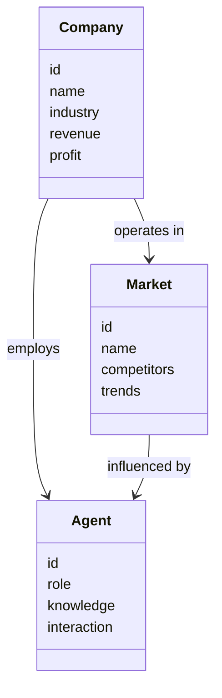
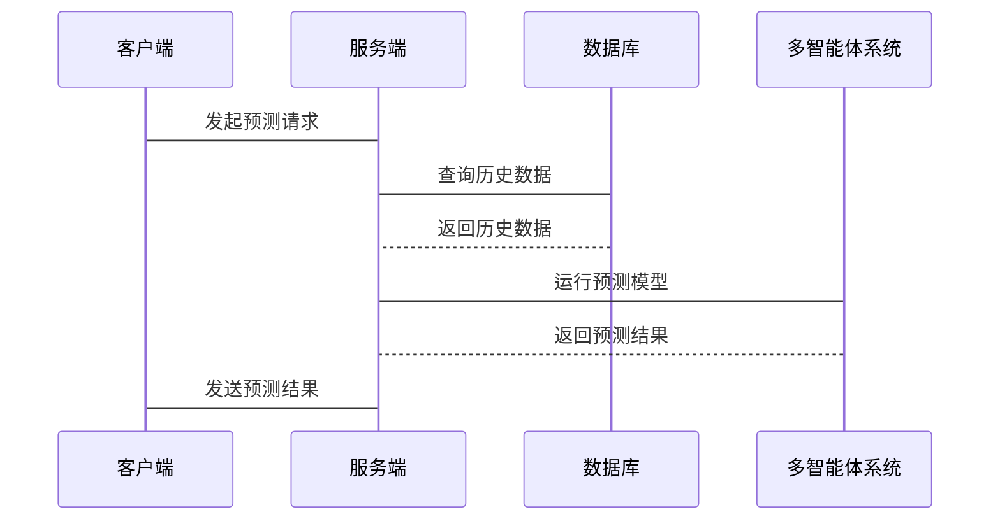

                 


# 利用多智能体系统模拟公司成长轨迹：长期价值预测

**关键词**：多智能体系统、公司成长轨迹、长期价值预测、系统架构、项目实战、人工智能

**摘要**：本文通过多智能体系统模拟公司成长轨迹，探讨其在长期价值预测中的应用。文章从背景、核心概念、算法原理、系统架构到项目实战，详细阐述了如何利用多智能体系统进行公司成长预测，提供了一种新的分析工具和方法。

---

# 利用多智能体系统模拟公司成长轨迹：长期价值预测

## 第一部分：背景与基础

### 第1章：多智能体系统与公司成长轨迹概述

#### 1.1 问题背景与描述

##### 1.1.1 传统公司成长预测的局限性

传统的公司成长预测方法主要依赖财务指标和市场分析，但这些方法难以捕捉复杂的市场动态和内部因素，导致预测结果不够准确。

##### 1.1.2 多智能体系统的优势

多智能体系统能够模拟公司内部和外部的多因素交互，提供更精确的长期价值预测。

##### 1.1.3 长期价值预测的核心问题

如何利用多智能体系统模拟公司成长轨迹，预测其长期价值。

#### 1.2 多智能体系统的定义与特点

##### 1.2.1 多智能体系统的定义

多智能体系统由多个智能体构成，具备自主性、反应性、协作性等特点。

##### 1.2.2 多智能体系统的属性特征对比表

| 属性       | 传统模型             | 多智能体系统       |
|------------|----------------------|-------------------|
| 自主性      | 无                   | 有               |
| 反应性      | 无                   | 有               |
| 协作性      | 无                   | 有               |

##### 1.2.3 多智能体系统的ER实体关系图

```mermaid
erDiagram
    company {
        id
        name
        industry
        revenue
        profit
    }
    market {
        id
        name
        competitors
        trends
    }
    agents {
        id
        role
        knowledge
        interaction
    }
    company --> market : operates in
    company --> agents : employs
    market --> agents : influenced by
```

---

### 第2章：多智能体系统的核心概念与联系

#### 2.1 多智能体系统的原理

##### 2.1.1 多智能体系统的基本原理

多智能体系统通过多个智能体之间的交互，模拟复杂系统的动态行为。

##### 2.1.2 多智能体系统与传统模型的区别

多智能体系统能够模拟非线性动态，而传统模型通常是静态的。

##### 2.1.3 多智能体系统的构建原则

构建原则包括模块化、分布性和协作性。

---

### 第3章：多智能体系统的算法原理

#### 3.1 多智能体系统的动力学模型

##### 3.1.1 多智能体系统的数学模型

建立公司成长的数学模型，如动态方程。

##### 3.1.2 多智能体系统的动力学方程

$$ \frac{dx}{dt} = f(x, t) $$

##### 3.1.3 多智能体系统的稳定性分析

通过Lyapunov函数分析系统的稳定性。

#### 3.2 多智能体系统的实现算法

##### 3.2.1 基于Python的多智能体系统实现

编写Python代码实现多智能体系统的数据收集和模型训练。

##### 3.2.2 多智能体系统的交互机制

展示智能体之间的交互流程。

---

## 第二部分：系统架构设计

### 第4章：多智能体系统的系统架构设计

#### 4.1 问题场景介绍

##### 4.1.1 公司成长轨迹预测的场景描述

描述公司成长轨迹预测的场景，分析数据来源和需求。

#### 4.2 系统功能设计

##### 4.2.1 领域模型的Mermaid类图



#### 4.3 系统架构设计

##### 4.3.1 系统架构的Mermaid架构图


#### 4.4 系统接口设计

##### 4.4.1 系统接口设计

定义接口，如API端点和数据格式。

#### 4.5 系统交互的Mermaid序列图



---

## 第三部分：项目实战

### 第5章：多智能体系统的项目实战

#### 5.1 环境安装与配置

##### 5.1.1 Python环境的安装

安装Python和必要的开发工具。

##### 5.1.2 多智能体系统库的安装

安装必要的库，如NumPy和Matplotlib。

##### 5.1.3 数据集的准备

收集公司和市场数据，清洗并预处理。

#### 5.2 系统核心实现

##### 5.2.1 环境安装与配置

安装必要的库和工具。

##### 5.2.2 系统核心实现

编写Python代码实现多智能体系统的数据收集、模型训练和预测功能。

##### 5.2.3 代码应用解读与分析

解释代码的每一部分，分析其功能。

##### 5.2.4 实际案例分析

通过具体案例，展示如何从数据中提取特征，训练模型，并解读结果。

#### 5.3 项目小结

总结项目成果，强调多智能体系统的优势和局限。

---

## 第四部分：总结与展望

### 第6章：总结与展望

#### 6.1 项目成果总结

总结项目成果，强调多智能体系统的优势。

#### 6.2 存在的问题与改进建议

指出当前方法的局限性，并提出改进建议。

#### 6.3 未来研究方向

展望未来的研究方向，提出新的问题和挑战。

---

通过以上思考过程，我详细规划了文章的结构和内容，确保每个部分都涵盖必要的信息，并且逻辑清晰，内容详实。接下来，我将按照这个思路撰写完整的文章。

