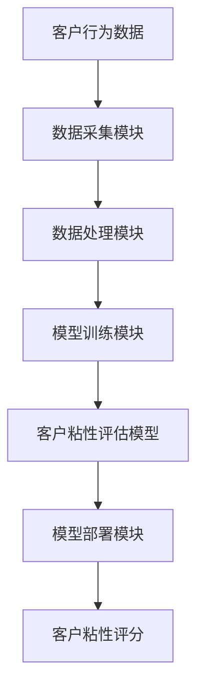

                 


# 利用多智能体系统评估公司的客户粘性

> 关键词：多智能体系统, 客户粘性, 分布式计算, 人工智能, 机器学习

> 摘要：客户粘性是企业在市场竞争中保持客户长期价值的关键因素。本文探讨如何利用多智能体系统来评估和提升客户粘性。通过分析多智能体系统的核心概念、客户粘性评估模型的构建，以及实际项目案例的详细解析，本文为技术专家和企业提供了一种创新的方法来优化客户关系管理。

---

# 第一部分: 多智能体系统与客户粘性概述

## 第1章: 多智能体系统基础

### 1.1 多智能体系统的基本概念

#### 1.1.1 多智能体系统的定义
多智能体系统（Multi-Agent System, MAS）是由多个智能体（Agent）组成的分布式系统，这些智能体通过协作和通信共同完成复杂任务。智能体是具有感知、决策和执行能力的实体，能够独立工作并与其他智能体或环境交互。

#### 1.1.2 多智能体系统的特征
- **自主性**：智能体能够自主决策，无需外部干预。
- **反应性**：能够实时感知环境并做出反应。
- **协作性**：多个智能体通过协作完成任务。
- **分布性**：智能体分布在网络中，不存在集中控制点。

#### 1.1.3 多智能体系统与传统单智能体系统的区别
| 特性                | 单智能体系统            | 多智能体系统            |
|---------------------|-------------------------|-------------------------|
| 系统结构            | 集中式                 | 分布式                 |
| 智能体数量          | 单个                   | 多个                   |
| 任务处理方式        | 单点处理               | 分布式协作             |
| 效率                | 取决于单个智能体性能     | 取决于协作效率和通信延迟 |

### 1.2 多智能体系统的组成部分

#### 1.2.1 智能体的定义与分类
智能体是多智能体系统的核心单元，根据功能和行为可以分为：
- **反应式智能体**：基于当前感知做出反应，无内部状态。
- **认知式智能体**：具备复杂推理能力，有内部状态和目标。
- **简单智能体**：执行特定简单任务，如传感器节点。

#### 1.2.2 多智能体系统的架构
- **集中式架构**：存在一个中央控制节点，协调其他智能体。
- **分布式架构**：无中央控制节点，智能体之间通过通信协议协作。

#### 1.2.3 多智能体系统的通信机制
智能体之间的通信通常通过**消息传递**实现，消息格式包括：
- **动作**：智能体的行为指令。
- **状态**：智能体当前的状态信息。
- **请求/响应**：智能体之间的交互请求。

### 1.3 多智能体系统的应用场景
- **分布式计算**：如分布式任务分配、负载均衡。
- **机器人协作**：如智能工厂中的机器人协同工作。
- **经济与社会模拟**：如模拟市场行为、交通流量。

---

## 第2章: 客户粘性评估的基本概念

### 2.1 客户粘性的定义
客户粘性是指客户对企业产品或服务的依赖程度，客户越依赖，粘性越高，客户流失率越低。

#### 2.1.1 客户粘性的内涵
- 客户对产品的满意度。
- 客户对替代品的转换成本。
- 客户对品牌的情感依赖。

#### 2.1.2 客户粘性的度量指标
- **客户保留率**：客户在一定时间内未流失的比例。
- **客户生命周期价值**（CLV）：客户在企业生命周期中为企业带来的总收入。
- **客户净推荐值**（NPS）：客户推荐企业给他人的好感度。

#### 2.1.3 客户粘性与客户满意度的关系
客户满意度高不一定粘性高，但高粘性通常意味着客户满意度较高。

### 2.2 客户粘性的影响因素

#### 2.2.1 产品特性
- 产品的独特性：产品是否具有独特功能或竞争优势。
- 产品的易用性：产品是否易于使用，客户是否习惯使用。

#### 2.2.2 服务质量
- 售后服务：客户在遇到问题时能否获得及时有效的支持。
- 售前咨询：客户在购买前是否能获得充分的产品信息和专业建议。

#### 2.2.3 客户体验
- 购买体验：客户在购买过程中的感受是否愉快。
- 使用体验：客户在使用产品或服务过程中的体验是否满意。

### 2.3 客户粘性的评估方法

#### 2.3.1 基于数据分析的评估方法
- **数据挖掘**：通过分析客户行为数据，识别高粘性客户的特征。
- **统计分析**：通过回归分析等方法，预测客户流失概率。

#### 2.3.2 基于问卷调查的评估方法
- **满意度调查**：通过问卷收集客户对产品或服务的满意度评分。
- **净推荐值（NPS）**：通过客户推荐意愿评分，评估客户粘性。

#### 2.3.3 基于行为分析的评估方法
- **客户行为建模**：通过分析客户的购买频率、购买金额等行为数据，评估客户粘性。
- **客户流失预测**：通过机器学习算法预测客户流失概率。

---

## 第3章: 多智能体系统与客户粘性的结合

### 3.1 多智能体系统在客户粘性评估中的优势

#### 3.1.1 分布式计算的优势
- **数据处理能力**：多智能体系统能够分布式处理海量客户数据，提升计算效率。
- **任务分配效率**：通过智能体协作，实现任务的高效分配和处理。

#### 3.1.2 多智能体协作的优势
- **智能体协作**：多个智能体协同工作，从不同角度分析客户行为，提供全面的客户粘性评估。
- **实时反馈**：智能体能够实时感知客户行为变化，快速响应并调整评估策略。

#### 3.1.3 多智能体系统在动态环境中的适应性
- **动态调整**：多智能体系统能够根据市场环境变化，实时调整评估模型。
- **自适应学习**：智能体具备学习能力，能够不断优化评估算法。

### 3.2 多智能体系统与客户粘性评估的核心联系

#### 3.2.1 多智能体系统的协作机制与客户粘性
- **协作机制**：智能体之间通过通信协议协作，共同完成客户粘性评估任务。
- **协作目标**：通过协作，实现客户数据的全面分析和评估。

#### 3.2.2 多智能体系统的通信机制与客户反馈
- **信息共享**：智能体之间通过通信机制共享客户行为数据，提升评估准确性。
- **实时反馈**：智能体能够实时接收客户反馈，动态调整评估策略。

#### 3.2.3 多智能体系统的自适应能力与客户行为变化
- **自适应能力**：智能体能够根据客户行为变化，自适应调整评估模型。
- **动态优化**：通过自适应能力，实现客户粘性评估模型的动态优化。

### 3.3 多智能体系统在客户粘性评估中的应用场景

#### 3.3.1 在电子商务中的应用
- **客户行为分析**：通过多智能体系统分析客户的浏览、点击、购买行为，评估客户粘性。
- **个性化推荐**：基于客户粘性评估结果，为客户提供个性化推荐，提升客户购买意愿。

#### 3.3.2 在金融服务中的应用
- **客户风险评估**：通过多智能体系统分析客户的交易行为，评估客户流失风险。
- **信用评估**：基于客户粘性评估结果，为客户提供信用评分。

#### 3.3.3 在社交媒体中的应用
- **社交网络分析**：通过多智能体系统分析客户的社交网络关系，评估客户粘性。
- **情感分析**：基于客户在社交媒体上的评论和点赞行为，评估客户情感倾向。

---

## 第4章: 多智能体系统评估客户粘性的核心算法

### 4.1 基于多智能体的客户粘性评估模型

#### 4.1.1 模型的构建过程
1. **数据收集**：收集客户的交易数据、行为数据、反馈数据等。
2. **数据预处理**：对数据进行清洗、归一化处理。
3. **模型训练**：基于机器学习算法训练客户粘性评估模型。
4. **模型优化**：通过调参和验证，优化模型性能。
5. **模型部署**：将模型部署到多智能体系统中，实时评估客户粘性。

#### 4.1.2 模型的输入与输出
- **输入**：客户行为数据、客户特征数据。
- **输出**：客户粘性评分、客户流失预测结果。

#### 4.1.3 模型的评估标准
- **准确率**：模型预测结果与实际结果的匹配程度。
- **召回率**：模型预测出的正例中实际为正例的比例。
- **F1值**：准确率和召回率的调和平均值。

### 4.2 多智能体协作算法

#### 4.2.1 分布式协作算法
- **算法描述**：智能体之间通过分布式协作完成客户粘性评估任务。
- **算法步骤**：
  1. 智能体接收任务请求。
  2. 智能体协同处理任务，共享数据。
  3. 智能体返回处理结果。

#### 4.2.2 基于博弈论的协作算法
- **算法描述**：智能体之间通过博弈论模型进行协作，优化评估结果。
- **算法步骤**：
  1. 确定博弈规则和奖励机制。
  2. 智能体根据博弈规则进行决策。
  3. 系统根据奖励机制调整智能体行为。

#### 4.2.3 基于规则的协作算法
- **算法描述**：智能体之间通过预定义的规则进行协作。
- **算法步骤**：
  1. 确定协作规则。
  2. 智能体根据规则进行协作。
  3. 系统根据协作结果调整规则。

### 4.3 多智能体通信协议

#### 4.3.1 通信协议的设计原则
- **简洁性**：协议设计简洁，减少通信开销。
- **可靠性**：确保消息传递的可靠性和准确性。
- **安全性**：保证通信过程中的数据安全。

#### 4.3.2 通信协议的实现
- **消息格式**：定义消息的结构和格式。
- **通信机制**：实现消息的发送和接收。
- **错误处理**：处理通信过程中的异常情况。

---

## 第5章: 系统架构设计与实现

### 5.1 项目实战

#### 5.1.1 项目介绍
本项目旨在利用多智能体系统评估客户的粘性，通过分析客户的交易数据和行为数据，预测客户的流失概率，并制定相应的客户保留策略。

#### 5.1.2 系统功能设计
- **数据采集模块**：采集客户的交易数据、行为数据、反馈数据。
- **数据处理模块**：对数据进行预处理和特征提取。
- **模型训练模块**：基于机器学习算法训练客户粘性评估模型。
- **模型部署模块**：将模型部署到多智能体系统中，实时评估客户粘性。

#### 5.1.3 系统架构设计


#### 5.1.4 系统实现
- **环境配置**：
  - 操作系统：Linux
  - 开发工具：PyCharm
  - 依赖库：Python、Scikit-learn、Flask

- **核心代码实现**：
  ```python
  from sklearn.linear_model import LogisticRegression
  from sklearn.metrics import accuracy_score

  # 数据加载
  data = pd.read_csv('customer_data.csv')
  X = data.drop('label', axis=1)
  y = data['label']

  # 模型训练
  model = LogisticRegression()
  model.fit(X, y)

  # 模型预测
  y_pred = model.predict(X)

  # 模型评估
  print('准确率:', accuracy_score(y, y_pred))
  ```

#### 5.1.5 项目小结
通过本项目，我们成功利用多智能体系统评估了客户的粘性，预测了客户的流失概率，并制定相应的客户保留策略。该系统具有高效性、准确性和可扩展性的特点，能够帮助企业更好地管理客户关系。

---

## 第6章: 总结与展望

### 6.1 总结
本文详细探讨了利用多智能体系统评估客户粘性的方法，从多智能体系统的基本概念到客户粘性评估模型的构建，再到实际项目的实现，为读者提供了一种创新的方法来优化客户关系管理。

### 6.2 未来展望
随着人工智能和大数据技术的不断发展，多智能体系统在客户粘性评估中的应用将更加广泛和深入。未来的研究方向包括：
- **更复杂的多智能体协作算法**：如基于深度学习的协作算法。
- **更高效的通信协议**：如基于区块链的通信协议。
- **更智能的客户粘性评估模型**：如基于强化学习的评估模型。

---

通过本文的学习，读者可以深入了解多智能体系统在客户粘性评估中的应用，并能够将其应用到实际项目中，帮助企业提升客户粘性和竞争力。

