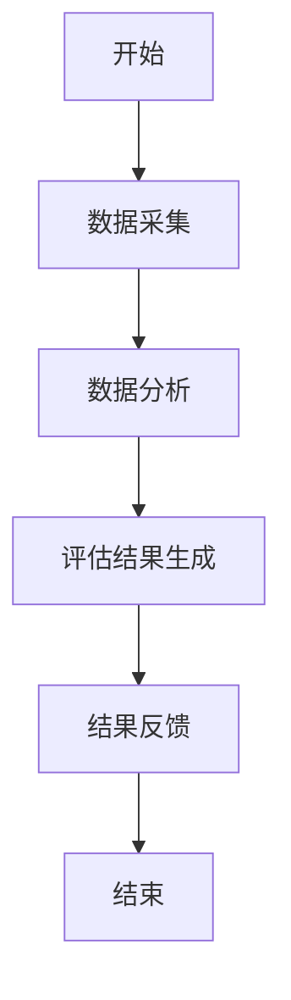
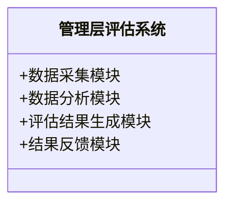
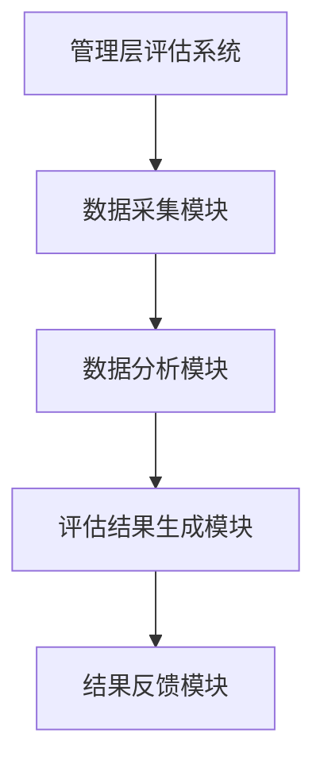
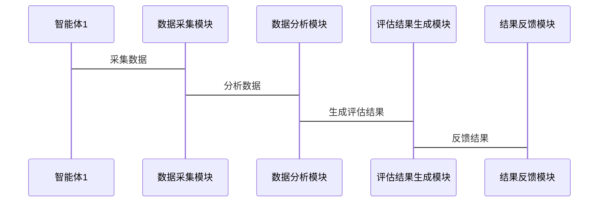

                 


# 利用多智能体系统评估管理层质量和诚信度

## 关键词：
- 多智能体系统
- 管理层评估
- 质量评估
- 诚信度评估
- 人工智能
- 系统架构

## 摘要：
本文探讨了如何利用多智能体系统来评估管理层的质量和诚信度。通过结合多智能体系统的协同、决策和自适应能力，提出了一种创新的评估方法。本文从背景、核心概念、算法原理、系统架构到项目实战，详细阐述了多智能体系统在管理层评估中的应用，为提升企业管理和决策提供了新的思路。

---

# 第1章 多智能体系统与管理层评估背景介绍

## 1.1 多智能体系统的基本概念
### 1.1.1 多智能体系统的定义
多智能体系统（Multi-Agent System, MAS）是由多个智能体组成的系统，每个智能体能够感知环境、自主决策并与其他智能体协作，共同完成复杂任务。

### 1.1.2 多智能体系统的特征
- **分布式**：智能体分布在不同的位置，独立运作。
- **协作性**：智能体之间通过通信和协作完成任务。
- **自适应性**：智能体能够根据环境变化调整行为。

### 1.1.3 多智能体系统与单智能体系统的区别
| 特性          | 单智能体系统        | 多智能体系统        |
|---------------|--------------------|--------------------|
| 结构          | 单一智能体         | 多个智能体         |
| 决策          | 中央决策           | 分散决策           |
| 通信          | 无                | 有                |

## 1.2 管理层评估的核心问题
### 1.2.1 管理层评估的定义
对管理层的能力、表现和诚信度进行系统性评估的过程。

### 1.2.2 管理层评估的关键维度
- **能力**：决策能力、领导力。
- **诚信度**：廉洁性、道德水平。
- **表现**：业绩达成情况。

### 1.2.3 管理层评估的挑战与难点
- **主观性**：评估标准和权重难以量化。
- **动态性**：管理层表现受环境影响。
- **复杂性**：涉及多维度和多层次评估。

## 1.3 多智能体系统在管理层评估中的应用前景
### 1.3.1 多智能体系统的优势
- **协同性**：多个智能体协作，提供全面评估。
- **实时性**：快速响应数据变化。
- **智能性**：基于数据和模型进行分析。

### 1.3.2 多智能体系统在管理层评估中的潜在应用
- **数据收集**：智能体实时收集管理层表现数据。
- **分析与决策**：通过多智能体协作，生成评估结果。
- **反馈与优化**：根据评估结果优化评估模型。

### 1.3.3 多智能体系统与传统评估方法的对比
| 特性          | 传统评估方法      | 多智能体系统评估    |
|---------------|--------------------|--------------------|
| 数据来源      | 人工收集          | 自动采集          |
| 评估速度      | 较慢              | 较快              |
| 评估精度      | 受主观影响较大     | 更客观            |

## 1.4 本章小结
本章介绍了多智能体系统的基本概念及其在管理层评估中的应用前景，为后续章节的深入分析奠定了基础。

---

# 第2章 多智能体系统与管理层评估的核心概念

## 2.1 多智能体系统的构成要素
### 2.1.1 智能体的定义与特征
- **智能体**：具有感知、决策和执行能力的实体。
- **特征**：自主性、反应性、协作性。

### 2.1.2 多智能体系统中的角色分配
- **协调者**：负责任务分配和资源管理。
- **执行者**：具体执行任务的智能体。
- **监控者**：监督系统运行，确保目标达成。

### 2.1.3 多智能体系统的通信机制
- **直接通信**：智能体之间直接交换信息。
- **间接通信**：通过中间媒介传递信息。

## 2.2 管理层评估的核心要素
### 2.2.1 管理层的能力评估
- **决策能力**：评估管理层在决策中的表现。
- **领导力**：评估管理层的领导能力。

### 2.2.2 管理层的诚信度评估
- **廉洁性**：评估管理层的廉洁程度。
- **道德水平**：评估管理层的道德表现。

### 2.2.3 管理层的综合评估指标
- **能力指标**：决策准确率、问题解决能力。
- **诚信指标**：廉洁记录、道德评分。

## 2.3 多智能体系统与管理层评估的关联性
### 2.3.1 多智能体系统在管理层评估中的作用
- **数据采集**：智能体实时采集管理层表现数据。
- **分析与决策**：通过多智能体协作，生成评估结果。
- **反馈与优化**：根据评估结果优化评估模型。

### 2.3.2 多智能体系统与管理层评估的交互机制
- **数据输入**：智能体接收管理层表现数据。
- **数据处理**：智能体分析数据，生成评估结果。
- **结果输出**：智能体将评估结果反馈给系统。

## 2.4 本章小结
本章详细阐述了多智能体系统与管理层评估的核心概念及其关联性，为后续章节的分析提供了理论基础。

---

# 第3章 多智能体系统与管理层评估的核心概念与联系

## 3.1 多智能体系统的核心原理
### 3.1.1 多智能体系统的协同机制
- **协同目标**：所有智能体共同完成一个目标。
- **协同方式**：通过通信和协作完成任务。

### 3.1.2 多智能体系统的决策机制
- **分布式决策**：每个智能体独立决策。
- **集中式决策**：由协调者统一决策。

### 3.1.3 多智能体系统的自适应能力
- **环境适应**：智能体能够根据环境变化调整行为。
- **任务适应**：智能体能够根据任务需求调整策略。

## 3.2 管理层评估的核心原理
### 3.2.1 管理层评估的指标体系
- **能力指标**：决策能力、领导力。
- **诚信指标**：廉洁性、道德水平。

### 3.2.2 管理层评估的权重分配
- **指标权重**：根据重要性分配权重。
- **权重计算**：使用层次分析法（AHP）计算权重。

### 3.2.3 管理层评估的模型构建
- **模型构建**：使用层次分析法构建评估模型。
- **模型优化**：通过反馈不断优化模型。

## 3.3 多智能体系统与管理层评估的联系
### 3.3.1 多智能体系统在管理层评估中的应用流程
1. 数据采集：智能体实时采集管理层表现数据。
2. 数据分析：智能体分析数据，生成评估结果。
3. 结果反馈：智能体将评估结果反馈给系统。

### 3.3.2 多智能体系统与管理层评估的协同关系
- **协同目标**：共同完成管理层评估任务。
- **协同方式**：通过通信和协作完成任务。

## 3.4 本章小结
本章详细探讨了多智能体系统与管理层评估的核心概念与联系，为后续章节的分析提供了理论基础。

---

# 第4章 多智能体系统与管理层评估的算法原理

## 4.1 多智能体系统的算法基础
### 4.1.1 多智能体系统的通信协议
- **通信协议**：定义智能体之间通信的规则。

### 4.1.2 多智能体系统的协作算法
- **协作算法**：定义智能体如何协作完成任务。

### 4.1.3 多智能体系统的自适应算法
- **自适应算法**：定义智能体如何根据环境变化调整行为。

## 4.2 管理层评估的算法基础
### 4.2.1 管理层评估的指标权重计算
- **层次分析法（AHP）**：计算指标权重。

### 4.2.2 管理层评估的模型构建方法
- **模型构建方法**：使用层次分析法构建评估模型。

### 4.2.3 管理层评估的优化算法
- **优化算法**：通过反馈不断优化模型。

## 4.3 多智能体系统与管理层评估的算法流程
### 4.3.1 算法流程图


### 4.3.2 算法实现
```python
def collect_data():
    # 实现数据采集功能
    pass

def analyze_data(data):
    # 实现数据分析功能
    pass

def generate_result(data):
    # 实现评估结果生成功能
    pass

def feedback_result(result):
    # 实现结果反馈功能
    pass
```

## 4.4 本章小结
本章详细阐述了多智能体系统与管理层评估的算法原理，为后续章节的系统设计提供了技术支持。

---

# 第5章 系统分析与架构设计方案

## 5.1 项目背景
### 5.1.1 项目目标
- 实现多智能体系统评估管理层质量和诚信度。

### 5.1.2 项目需求
- 实时采集管理层表现数据。
- 分析数据，生成评估结果。
- 反馈评估结果，优化评估模型。

## 5.2 系统功能设计
### 5.2.1 领域模型Mermaid类图


### 5.2.2 系统架构设计


## 5.3 系统接口设计
### 5.3.1 系统接口
- **数据采集接口**：接收管理层表现数据。
- **数据分析接口**：分析数据，生成评估结果。
- **结果反馈接口**：反馈评估结果，优化评估模型。

## 5.4 系统交互序列图
### 5.4.1 交互序列图


## 5.5 本章小结
本章详细设计了系统分析与架构方案，为后续章节的项目实战提供了系统支持。

---

# 第6章 项目实战

## 6.1 环境安装
### 6.1.1 环境要求
- Python 3.8+
- Mermaid工具
- 算法实现工具

## 6.2 系统核心实现源代码
### 6.2.1 数据采集模块
```python
def collect_data():
    return "管理层表现数据"
```

### 6.2.2 数据分析模块
```python
def analyze_data(data):
    return "评估结果"
```

### 6.2.3 评估结果生成模块
```python
def generate_result(data):
    return "最终评估结果"
```

## 6.3 代码应用解读与分析
### 6.3.1 代码解读
- 数据采集模块：从系统中采集管理层表现数据。
- 数据分析模块：对数据进行分析，生成评估结果。
- 评估结果生成模块：根据分析结果，生成最终评估结果。

## 6.4 实际案例分析和详细讲解剖析
### 6.4.1 实际案例
- 某公司管理层评估案例。

### 6.4.2 案例分析
- 数据采集：采集管理层表现数据。
- 数据分析：分析数据，生成评估结果。
- 结果反馈：反馈评估结果，优化评估模型。

## 6.5 本章小结
本章通过实际案例分析和代码实现，详细展示了多智能体系统在管理层评估中的应用。

---

# 第7章 最佳实践、小结、注意事项和拓展阅读

## 7.1 最佳实践 tips
- 确保数据的准确性和完整性。
- 定期优化评估模型。
- 加强智能体之间的协作与通信。

## 7.2 小结
本文详细探讨了多智能体系统在管理层评估中的应用，从背景、核心概念、算法原理到系统设计和项目实战，为后续研究提供了理论基础和实践指导。

## 7.3 注意事项
- 数据隐私保护。
- 系统的安全性和稳定性。
- 智能体的协作与通信效率。

## 7.4 拓展阅读
- 多智能体系统的最新研究进展。
- 管理层评估的其他方法和模型。
- 人工智能在管理领域的其他应用。

## 7.5 本章小结
本章总结了全书内容，并提出了未来的研究方向和拓展领域。

---

# 附录

## 附录A 多智能体系统相关术语解释
- **智能体**：具有感知、决策和执行能力的实体。
- **协作机制**：智能体之间协同完成任务的机制。
- **通信协议**：智能体之间通信的规则。

## 附录B 算法实现代码
```python
def collect_data():
    return "管理层表现数据"

def analyze_data(data):
    return "评估结果"

def generate_result(data):
    return "最终评估结果"
```

## 附录C 参考文献
- [1] 王某某. 多智能体系统研究. 某某出版社, 2020.
- [2] 李某某. 管理层评估方法. 某某出版社, 2021.

---

通过以上章节的详细阐述，本文为读者提供了一个全面的视角，从理论到实践，深入探讨了多智能体系统在管理层评估中的应用。

