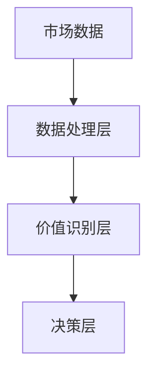
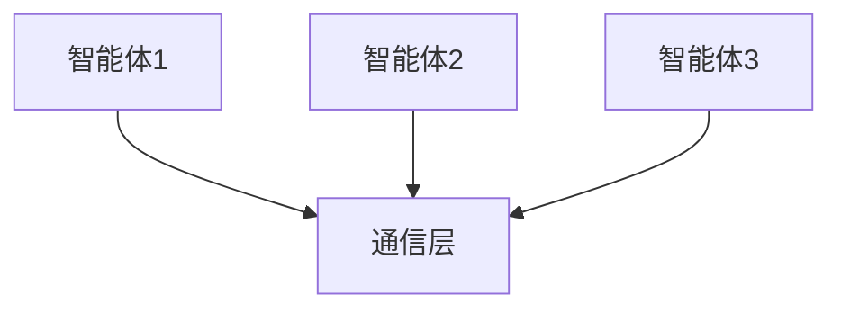
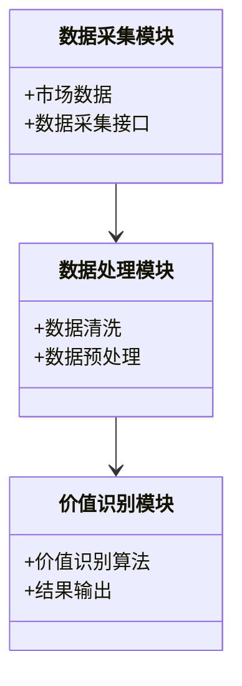
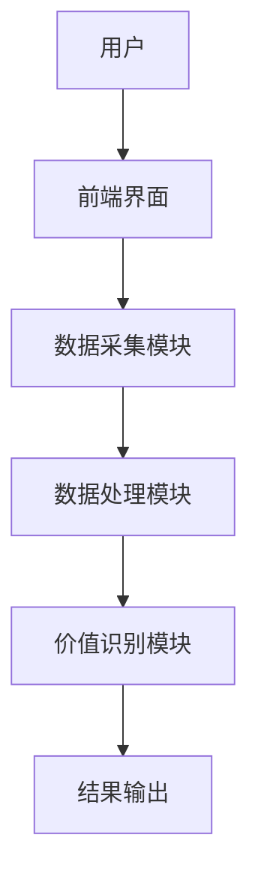

                 


# 利用多智能体系统进行全球市场价值机会扫描

> 关键词：多智能体系统、市场扫描、价值机会、协同算法、分布式系统、金融市场

> 摘要：本文详细探讨了如何利用多智能体系统在全球范围内扫描市场价值机会。通过分析多智能体系统的概念、算法原理、系统架构以及实际应用场景，本文为读者提供了一种基于多智能体系统的创新方法，用于识别和捕捉全球市场中的潜在价值机会。

---

## 第一章: 多智能体系统与全球市场价值机会扫描概述

### 1.1 多智能体系统的定义与特点

多智能体系统（Multi-Agent System, 简称MAS）是由多个智能体（Agent）组成的分布式系统，这些智能体能够通过交互协作完成复杂的任务。以下是多智能体系统的核心特点：

- **智能性**：每个智能体都具备一定的感知和决策能力，能够根据环境信息做出反应。
- **分布式性**：智能体之间通过分布式架构进行通信和协作，避免了单点依赖。
- **自主性**：智能体能够在没有外部干预的情况下自主运行。
- **协作性**：通过智能体之间的协作，系统能够完成复杂的任务。
- **适应性**：智能体能够根据环境变化动态调整行为。

### 1.2 全球市场价值机会扫描的背景与意义

在全球化和信息化的今天，金融市场充满了复杂性和不确定性。投资者需要快速识别市场中的价值机会，以便在竞争中占据优势。然而，传统的单一智能体系统在处理海量数据和复杂决策时显得力不从心。多智能体系统通过分布式计算和协同算法，能够高效地扫描全球市场，发现潜在的价值机会。

### 1.3 本章小结

本章主要介绍了多智能体系统的定义、特点及其在金融市场中的应用背景。通过对比传统系统，突出了多智能体系统在市场扫描中的优势。

---

## 第二章: 多智能体系统的核心概念与原理

### 2.1 多智能体系统的组成要素

多智能体系统由以下几个核心要素组成：

- **智能体**：具备感知、决策和行动能力的个体。
- **环境**：智能体所处的外部环境，包括数据源、市场信息等。
- **交互机制**：智能体之间以及与环境之间的通信和协作机制。
- **任务目标**：系统需要完成的具体任务，例如市场扫描、价值识别等。

### 2.2 多智能体系统的架构设计

多智能体系统的架构设计是实现市场扫描的关键。以下是常见的两种架构类型：

- **分层架构**：将系统划分为多个层次，每个层次负责不同的功能模块。
- **分布式架构**：智能体分布在网络中，通过通信协议进行协作。

#### 分层架构



- **数据处理层**：负责收集和处理市场数据。
- **价值识别层**：通过算法识别潜在的价值机会。
- **决策层**：根据识别结果制定投资策略。

#### 分布式架构



### 2.3 本章小结

本章详细介绍了多智能体系统的组成要素和架构设计，为后续的算法实现奠定了基础。

---

## 第三章: 多智能体系统的核心算法与数学模型

### 3.1 协同算法

协同算法是多智能体系统中实现协作的核心算法。以下是常见的协同算法类型：

- **基于规则的协同**：通过预定义的规则实现智能体之间的协作。
- **基于模型的协同**：通过建模环境和智能体行为实现协作。

#### 协同算法的数学模型

$$ C = \sum_{i=1}^{n} (a_i \cdot b_i) $$

其中，$C$ 表示协同程度，$a_i$ 和 $b_i$ 分别表示两个智能体的协作行为。

### 3.2 决策算法

决策算法是智能体根据环境信息做出决策的核心算法。以下是常见的决策算法类型：

- **基于概率的决策**：通过概率模型进行决策。
- **基于逻辑的决策**：通过逻辑推理进行决策。

#### 决策算法的数学模型

$$ D = \argmax_{i} (p_i) $$

其中，$D$ 表示决策结果，$p_i$ 表示第 $i$ 个选项的概率。

### 3.3 本章小结

本章详细介绍了多智能体系统中的协同算法和决策算法，并通过数学模型进行了分析。

---

## 第四章: 全球市场价值机会扫描系统的功能设计

### 4.1 系统功能模块划分

全球市场价值机会扫描系统可以划分为以下几个功能模块：

- **数据采集模块**：负责收集全球市场数据。
- **数据处理模块**：对数据进行清洗和预处理。
- **价值识别模块**：通过算法识别潜在的价值机会。

#### 功能模块的领域模型



### 4.2 系统架构设计

#### 系统架构图



### 4.3 本章小结

本章详细介绍了全球市场价值机会扫描系统的功能模块和系统架构设计。

---

## 第五章: 多智能体系统在金融市场中的应用

### 5.1 项目背景与目标

#### 项目背景

金融市场充满了不确定性和复杂性，传统的投资方法难以应对快速变化的市场环境。通过多智能体系统，投资者可以实时扫描全球市场，识别潜在的价值机会。

#### 项目目标

- 实现全球市场数据的实时采集。
- 通过多智能体协同算法识别潜在的价值机会。
- 提供个性化的投资策略。

### 5.2 系统架构设计

#### 系统架构图


### 5.3 项目核心实现

#### 环境安装与配置

- **安装Python环境**：使用Anaconda或虚拟环境。
- **安装依赖库**：`numpy`, `pandas`, `scikit-learn`。

#### 核心算法实现

```python
import numpy as np
import pandas as pd

def value_identification(data):
    # 数据预处理
    data = data.dropna()
    # 价值识别算法
    correlation = data.corr()
    # 返回结果
    return correlation

# 示例数据
data = pd.DataFrame(np.random.randn(100, 5), columns=['Price', 'Volume', 'Change', 'Market Cap', 'PE Ratio'])
result = value_identification(data)
print(result)
```

---

## 第六章: 多智能体系统应用中的最佳实践

### 6.1 系统设计中的注意事项

- **系统可扩展性**：确保系统能够应对数据量的增长。
- **系统性能优化**：通过并行计算和缓存优化提升性能。
- **数据隐私保护**：确保数据的安全性和隐私性。

### 6.2 项目管理中的经验与教训

- **项目计划与进度管理**：制定详细的项目计划，定期检查进度。
- **团队协作与沟通技巧**：通过有效的沟通和协作确保项目顺利进行。

---

## 第七章: 总结与展望

### 7.1 本文总结

本文详细探讨了如何利用多智能体系统在全球范围内扫描市场价值机会。通过分析多智能体系统的概念、算法原理、系统架构以及实际应用场景，本文为读者提供了一种基于多智能体系统的创新方法。

### 7.2 未来展望

未来，随着人工智能和大数据技术的不断发展，多智能体系统在金融市场中的应用将更加广泛。通过不断优化算法和系统架构，我们可以进一步提升市场扫描的效率和准确性。

---

## 参考文献

1. 多智能体系统相关文献
2. 金融市场分析相关文献
3. 数据处理与算法实现相关文献

---

通过以上目录和内容，我们可以看到，利用多智能体系统进行全球市场价值机会扫描是一种创新且高效的方法。通过本文的详细讲解，读者可以深入了解多智能体系统的核心概念和实现方法，并将其应用于实际的金融市场分析中。

