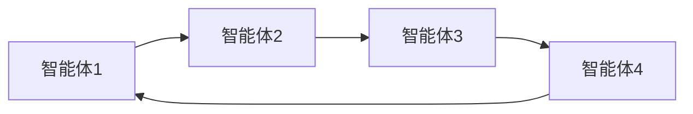
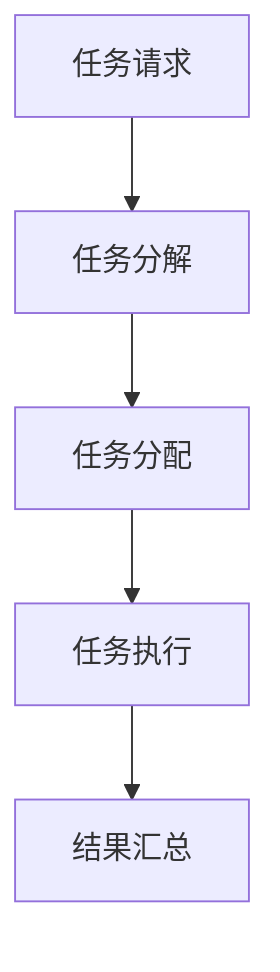
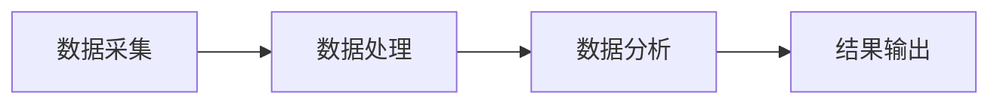
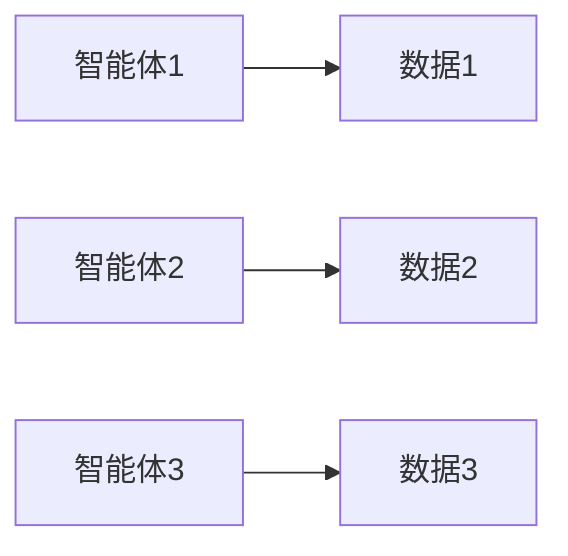
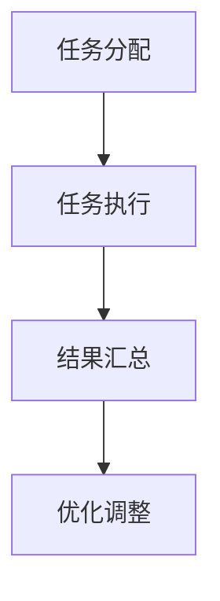
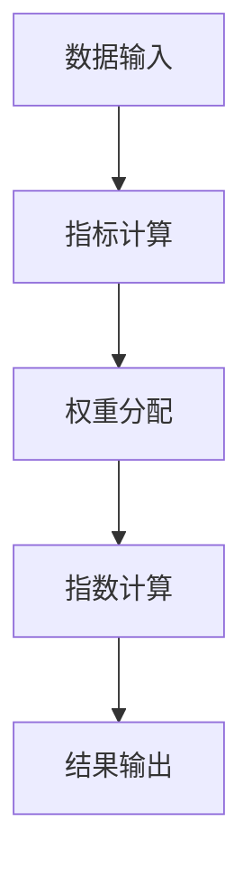
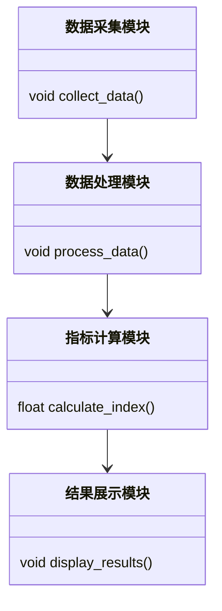
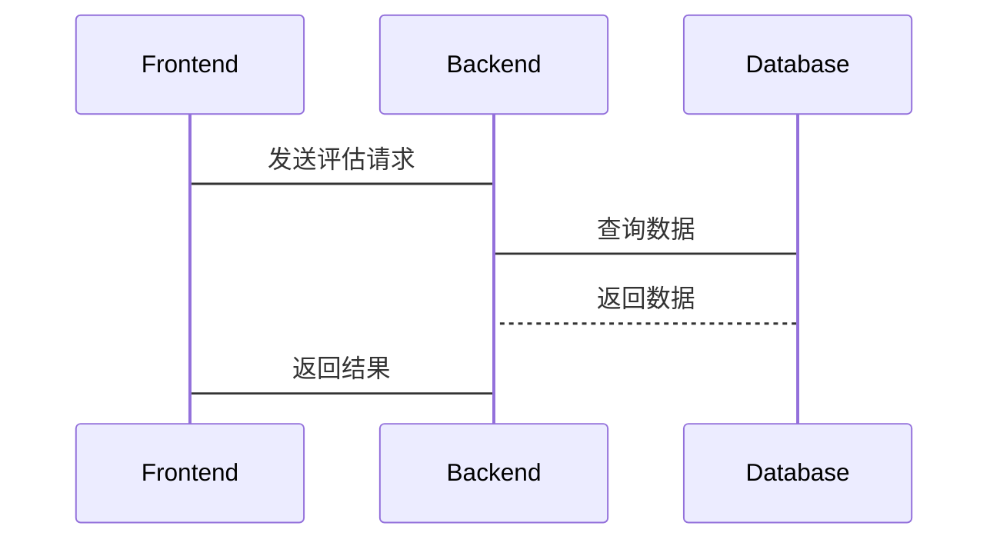
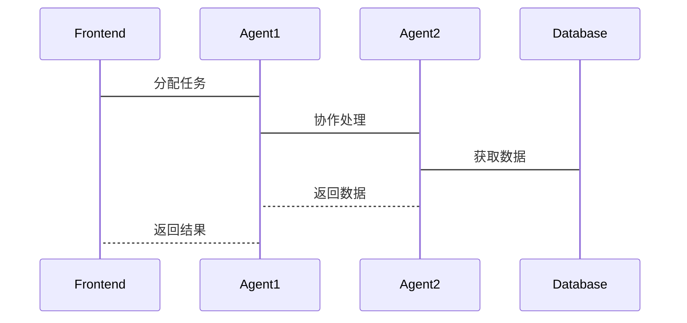

                 


# 利用多智能体系统进行全面的公司创新指数评估

> 关键词：多智能体系统，创新指数评估，分布式协同，系统架构，算法原理，项目实战

> 摘要：本文详细探讨了利用多智能体系统进行全面公司创新指数评估的方法。首先介绍了多智能体系统的基本概念和创新指数评估的重要性，接着分析了多智能体系统与创新指数评估的核心联系。然后从算法原理、系统架构设计、项目实战等多方面展开，详细讲解了如何通过多智能体系统实现创新指数的分布式协同评估。本文内容涵盖理论与实践，旨在为读者提供全面的指导。

---

# 第一部分: 多智能体系统与创新指数评估背景介绍

## 第1章: 多智能体系统与创新指数评估概述

### 1.1 多智能体系统的基本概念

#### 1.1.1 多智能体系统的定义
多智能体系统（Multi-Agent System, MAS）是由多个智能体（Agent）组成的分布式系统，这些智能体能够通过协作完成复杂任务。智能体是具有感知环境、自主决策和行动能力的实体。

#### 1.1.2 多智能体系统的核心特点
| 特性 | 描述 |
|------|------|
| 分布式 | 智能体独立运行，通过通信协作完成任务 |
| 协作性 | 智能体之间通过交互协同完成共同目标 |
| 反应性 | 能够实时感知环境变化并做出反应 |
| 自主性 | 每个智能体都有一定的决策自主性 |

#### 1.1.3 多智能体系统与传统单智能体系统的区别
| 对比维度 | 单智能体系统 | 多智能体系统 |
|----------|------------|--------------|
| 系统结构 | 集中式 | 分布式 |
| 决策方式 | 单点决策 | 分布式决策 |
| 可扩展性 | 有限 | 高 |

### 1.2 创新指数评估的背景与意义

#### 1.2.1 创新能力在企业中的重要性
创新是企业持续发展的核心动力，创新能力强的公司更能适应市场变化。

#### 1.2.2 创新指数评估的必要性
通过量化创新能力，企业可以识别自身优势和改进方向。

#### 1.2.3 多智能体系统在创新指数评估中的优势
多智能体系统能够高效处理海量数据，提供实时反馈。

---

## 第2章: 多智能体系统与创新指数评估的核心概念

### 2.1 多智能体系统的原理

#### 2.1.1 多智能体系统的组成要素
- **智能体**：独立决策的个体。
- **环境**：智能体感知和交互的空间。
- **通信机制**：智能体之间的交互方式。
- **任务分配**：智能体协同完成任务的方式。

#### 2.1.2 多智能体系统中的通信与协作机制


#### 2.1.3 多智能体系统中的任务分配与协调


### 2.2 创新指数评估的指标体系

#### 2.2.1 创新能力的评估维度
- 技术创新
- 产品创新
- 市场创新
- 管理创新

#### 2.2.2 创新指数的计算方法
$$创新指数 = \sum_{i=1}^{n} (权重_i \times 指标_i)$$

#### 2.2.3 创新指数评估的标准化流程
1. 数据采集
2. 数据清洗
3. 指标计算
4. 综合评估

---

## 第3章: 多智能体系统与创新指数评估的关联性分析

### 3.1 多智能体系统在创新指数评估中的应用场景

#### 3.1.1 多智能体系统如何支持创新数据的采集与分析


#### 3.1.2 多智能体系统如何优化创新指数的计算过程
通过分布式计算提高效率。

#### 3.1.3 多智能体系统如何提升创新评估的实时性与准确性
实时更新数据，动态调整评估结果。

### 3.2 多智能体系统与创新指数评估的核心联系

#### 3.2.1 多智能体系统如何实现创新数据的分布式处理


#### 3.2.2 多智能体系统如何支持创新评估的动态调整
根据反馈实时更新评估结果。

#### 3.2.3 多智能体系统如何促进创新评估的协同优化
通过协作实现资源优化配置。

---

# 第二部分: 多智能体系统与创新指数评估的算法原理

## 第4章: 多智能体系统的核心算法

### 4.1 分布式协同算法

#### 4.1.1 分布式协同算法的基本原理


#### 4.1.2 分布式协同算法的实现步骤
1. 初始化任务分配
2. 执行任务
3. 汇总结果
4. 反馈优化

#### 4.1.3 分布式协同算法的应用案例
```python
def distribute_task(tasks):
    agents = [Agent1, Agent2, Agent3]
    for agent in agents:
        agent.receive_task(tasks)
    return [agent.complete_task() for agent in agents]
```

### 4.2 多智能体协作算法

#### 4.2.1 多智能体协作算法的定义
通过智能体之间的协作完成复杂任务。

#### 4.2.2 多智能体协作算法的核心步骤
1. 通信协商
2. 任务分配
3. 协作执行
4. 结果整合

#### 4.2.3 多智能体协作算法的优化策略
- 负载均衡
- 并行处理
- 错误恢复

---

## 第5章: 创新指数评估的算法实现

### 5.1 创新指数评估的数学模型

#### 5.1.1 创新指数的计算公式
$$创新指数 = \sum_{i=1}^{n} (w_i \times x_i)$$
其中，$w_i$ 是指标权重，$x_i$ 是指标得分。

#### 5.1.2 创新指数评估的权重分配方法
- 等权重分配
- 层次分析法（AHP）
- 主观赋权法

#### 5.1.3 创新指数评估的动态调整机制
根据实时数据更新权重和指标。

### 5.2 创新指数评估的算法实现

#### 5.2.1 创新指数评估的算法流程图


#### 5.2.2 创新指数评估的核心代码实现
```python
def calculate_innovation_index(data, weights):
    return sum(w * d for w, d in zip(weights, data))
```

---

## 第6章: 系统分析与架构设计方案

### 6.1 问题场景介绍

#### 6.1.1 问题场景
公司需要对多个部门的创新能力进行全面评估，但数据分散、计算复杂。

### 6.1.2 项目介绍
开发一个基于多智能体系统的创新指数评估平台。

### 6.2 系统功能设计

#### 6.2.1 系统功能模块
- 数据采集模块
- 数据处理模块
- 指标计算模块
- 结果展示模块

#### 6.2.2 系统功能设计的领域模型


### 6.3 系统架构设计

#### 6.3.1 系统架构设计的分层架构


#### 6.3.2 系统架构设计的接口设计


### 6.4 系统交互流程

#### 6.4.1 系统交互的流程图


---

## 第7章: 项目实战

### 7.1 环境安装

#### 7.1.1 环境要求
- Python 3.8+
- 多智能体框架（如强化学习库）
- 数据处理库（如Pandas）

### 7.1.2 环境安装步骤
1. 安装Python
2. 安装必要的库
3. 配置开发环境

### 7.2 系统核心实现

#### 7.2.1 系统核心代码实现
```python
import numpy as np
from agents import Agent

class InnovationIndexEvaluator:
    def __init__(self, agents):
        self.agents = agents

    def evaluate(self, data):
        results = [agent.evaluate(data) for agent in self.agents]
        return np.mean(results)
```

#### 7.2.2 代码功能解读
- `InnovationIndexEvaluator` 类管理多个智能体。
- `evaluate` 方法调用每个智能体的评估结果并计算平均值。

### 7.3 项目实战案例分析

#### 7.3.1 实际案例分析
评估一家科技公司的创新指数，数据包括研发投入、专利数量等。

#### 7.3.2 详细分析过程
1. 数据采集
2. 数据处理
3. 指标计算
4. 结果展示

#### 7.3.3 结果解读
输出创新指数，并提供改进建议。

### 7.4 项目小结

#### 7.4.1 成果总结
成功实现了一个基于多智能体系统的创新指数评估平台。

#### 7.4.2 经验总结
- 系统设计要注重模块化
- 数据质量影响评估结果
- 系统维护需定期更新算法

---

## 第8章: 最佳实践

### 8.1 最佳实践 tips

#### 8.1.1 数据质量的重要性
确保数据准确性和完整性。

#### 8.1.2 系统维护的注意事项
定期更新算法和优化性能。

#### 8.1.3 未来研究的方向
探索更多智能体协作算法。

### 8.2 项目小结

#### 8.2.1 项目总结
通过多智能体系统实现创新指数评估，提高了效率和准确性。

#### 8.2.2 经验与教训
- 智能体协作需要良好的通信机制
- 系统设计要充分考虑扩展性

### 8.3 未来展望

#### 8.3.1 创新指数评估的未来发展
随着AI技术进步，评估将更加智能化和动态化。

#### 8.3.2 多智能体系统的应用前景
在更多领域实现高效协同。

---

# 第三部分: 结语

## 第9章: 结语

### 9.1 结语
通过本文的介绍，读者可以全面了解如何利用多智能体系统进行公司创新指数评估。从理论到实践，我们详细探讨了系统的各个方面，希望对读者有所启发。

### 9.2 拓展阅读
建议进一步阅读多智能体系统和创新评估相关的文献。

### 9.3 致谢
感谢读者的支持和关注。

---

# 附录

## 附录A: 常见问题解答

### 1. 多智能体系统与传统单智能体系统的区别？
答：多智能体系统是分布式协作的，而传统系统是集中式的。

### 2. 如何确保系统的数据安全？
答：采用数据加密和访问控制技术。

### 3. 系统的性能如何优化？
答：通过负载均衡和并行计算提高效率。

---

## 附录B: 参考文献

1. 多智能体系统相关书籍
2. 创新指数评估相关文献
3. 相关技术标准和规范

---

## 附录C: 代码仓库

### 1. 代码仓库地址
https://github.com/yourusername/multi-agent-innovation-index

### 2. 代码使用说明
如何克隆仓库、安装依赖、运行代码等。

---

## 附录D: 联系方式

### 1. 联系方式
作者邮箱：author@example.com

### 2. 读者反馈
欢迎读者提出问题和建议。

---

# 结束语

感谢您的阅读！希望本文能为您提供有价值的信息和启发。

