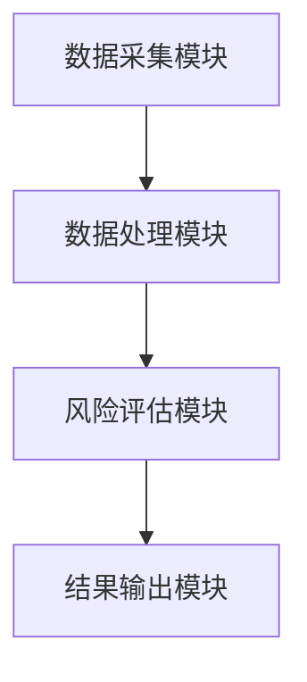
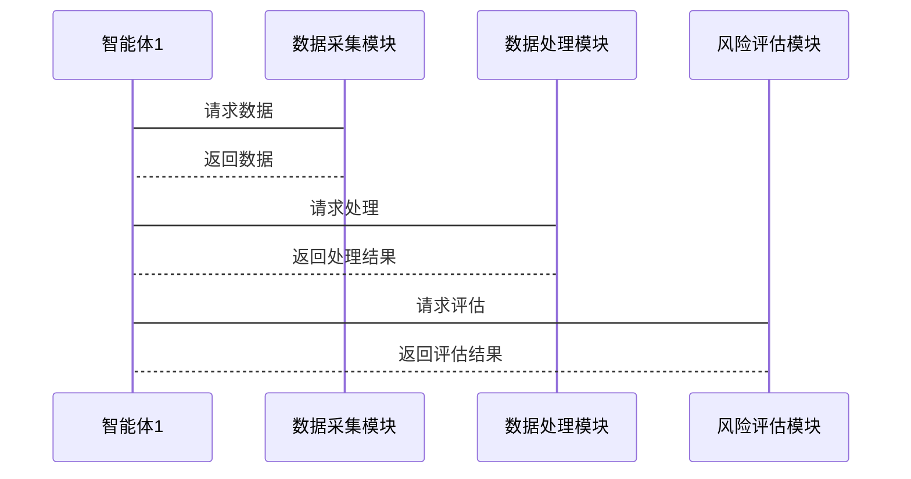

                 


# 利用多智能体系统进行全面的公司声誉风险分析

## 关键词：多智能体系统, 声誉风险分析, 协同机制, 算法实现, 系统架构

## 摘要

在当今竞争激烈的商业环境中，公司声誉是企业的生命线。然而，传统声誉风险管理方法往往难以应对复杂多变的市场环境。本文探讨如何利用多智能体系统进行全面的公司声誉风险分析。通过分析多智能体系统的协同机制、算法实现和系统架构，我们展示了如何构建高效的风险评估系统，从而帮助企业更好地管理声誉风险。

---

## 第1章: 公司声誉风险分析的背景与挑战

### 1.1 公司声誉的定义与重要性

#### 1.1.1 公司声誉的定义
公司声誉是企业在市场中获得的信任和认可，影响着客户、投资者和合作伙伴的行为。

#### 1.1.2 公司声誉的重要性
- 好的声誉带来更多的商业机会和客户信任。
- 坏的声誉可能导致客户流失和财务损失。

#### 1.1.3 声誉风险的来源与影响
声誉风险来源于负面新闻、产品质量问题等，可能引发信任危机，影响企业生存。

### 1.2 传统声誉风险管理的局限性

#### 1.2.1 传统声誉风险管理方法
依赖人工分析，效率低，难以应对海量信息。

#### 1.2.2 传统方法的局限性
- 数据处理能力有限。
- 分析结果不够精准。

#### 1.2.3 多智能体系统的优势
- 分布式计算，提高效率。
- 协同工作，增强分析能力。

### 1.3 本章小结

---

## 第2章: 多智能体系统的概念与特点

### 2.1 多智能体系统的基本定义

#### 2.1.1 多智能体系统的定义
由多个智能体组成的系统，能够协同完成复杂任务。

#### 2.1.2 多智能体系统的组成部分
- 智能体：具备感知和决策能力。
- 通信机制：实现智能体间信息共享。

#### 2.1.3 多智能体系统的分类
- 基于任务的多智能体系统。
- 基于行为的多智能体系统。

### 2.2 多智能体系统的特征

#### 2.2.1 分布式计算
任务分解，分布式处理。

#### 2.2.2 协作性
智能体协同工作，提高效率。

#### 2.2.3 自适应性
系统能够适应环境变化。

### 2.3 多智能体系统与传统系统的对比

#### 2.3.1 传统系统的特点
集中式处理，效率较低。

#### 2.3.2 多智能体系统的特点
分布式计算，协作性强。

#### 2.3.3 对比分析
多智能体系统在效率和适应性方面具有明显优势。

### 2.4 本章小结

---

## 第3章: 公司声誉风险分析的理论基础

### 3.1 声誉风险分析的定义

#### 3.1.1 声誉风险的定义
企业声誉可能带来的财务和声誉损失。

#### 3.1.2 声誉风险的分类
- 产品风险。
- 服务风险。

### 3.2 声誉风险分析的理论框架

#### 3.2.1 声誉风险分析的流程
数据收集、分析、评估。

#### 3.2.2 声誉风险分析的关键因素
- 市场反馈。
- 产品质量。

### 3.3 多智能体系统在声誉风险分析中的应用

#### 3.3.1 多智能体系统的优势
- 分布式计算。
- 协作能力强。

#### 3.3.2 多智能体系统的适用场景
- 复杂环境。
- 大规模数据处理。

#### 3.3.3 多智能体系统的实现步骤
数据收集、分析、评估、反馈。

### 3.4 本章小结

---

## 第4章: 多智能体系统的协同机制

### 4.1 多智能体系统的协同任务分配

#### 4.1.1 协同任务分配的定义
智能体之间分配任务的过程。

#### 4.1.2 协同任务分配的算法
基于优先级的任务分配算法。

### 4.2 多智能体系统的信息共享机制

#### 4.2.1 信息共享的定义
智能体之间交换信息的过程。

#### 4.2.2 信息共享的方式
- 共享数据库。
- 直接通信。

### 4.3 多智能体系统的协作策略

#### 4.3.1 协作策略的定义
智能体协同工作的策略。

#### 4.3.2 协作策略的类型
- 合作型策略。
- 竞争型策略。

### 4.4 本章小结

---

## 第5章: 基于多智能体系统的声誉风险分析算法

### 5.1 多智能体协同算法的原理

#### 5.1.1 算法的基本原理
通过智能体协作完成任务。

#### 5.1.2 算法的实现步骤
数据采集、分析、评估、反馈。

### 5.2 多智能体协同算法的数学模型

#### 5.2.1 协同任务分配的数学模型
$$ P(i) = \frac{w_i}{\sum_{j} w_j} $$
其中，\( P(i) \) 是智能体i的任务分配概率，\( w_i \) 是智能体i的权重。

#### 5.2.2 协作策略的数学模型
$$ S = \sum_{i=1}^{n} s_i $$
其中，\( S \) 是总策略得分，\( s_i \) 是每个智能体的策略得分。

### 5.3 多智能体协同算法的实现步骤

#### 5.3.1 数据采集
通过网络爬虫采集相关数据。

#### 5.3.2 数据分析
使用自然语言处理技术分析数据。

#### 5.3.3 任务分配
基于优先级分配任务。

### 5.4 本章小结

---

## 第6章: 系统架构设计

### 6.1 系统功能设计

#### 6.1.1 数据采集模块
负责采集声誉相关数据。

#### 6.1.2 数据处理模块
对数据进行清洗和预处理。

#### 6.1.3 风险评估模块
基于多智能体系统评估风险。

### 6.2 系统架构设计

#### 6.2.1 系统架构图


### 6.3 系统接口设计

#### 6.3.1 接口描述
- 数据采集接口。
- 风险评估接口。

### 6.4 系统交互流程

#### 6.4.1 交互流程图


### 6.5 本章小结

---

## 第7章: 项目实战

### 7.1 环境安装

#### 7.1.1 环境要求
- Python 3.8+
- 依赖库安装：numpy, pandas, requests.

### 7.2 系统核心实现

#### 7.2.1 数据采集模块实现
```python
import requests

def fetch_data(url):
    response = requests.get(url)
    return response.text
```

#### 7.2.2 数据处理模块实现
```python
import pandas as pd

def process_data(data):
    df = pd.DataFrame(data)
    return df
```

#### 7.2.3 风险评估模块实现
```python
def assess_risk(data):
    # 简单评估逻辑
    return "High" if data['score'].mean() < 0.5 else "Low"
```

### 7.3 案例分析

#### 7.3.1 案例背景
某公司面临负面新闻，需要快速评估声誉风险。

#### 7.3.2 实施步骤
1. 数据采集：收集相关新闻。
2. 数据处理：清洗数据。
3. 风险评估：评估风险等级。

### 7.4 项目小结

---

## 第8章: 最佳实践与总结

### 8.1 本章小结

### 8.2 注意事项
- 数据安全。
- 算法优化。

### 8.3 拓展阅读
推荐相关书籍和论文。

### 8.4 本章小结

---

## 致谢

感谢读者的耐心阅读，希望本文能为公司声誉风险分析提供新的思路和方法。

--- 

**附录**：完整代码示例和详细算法实现。

