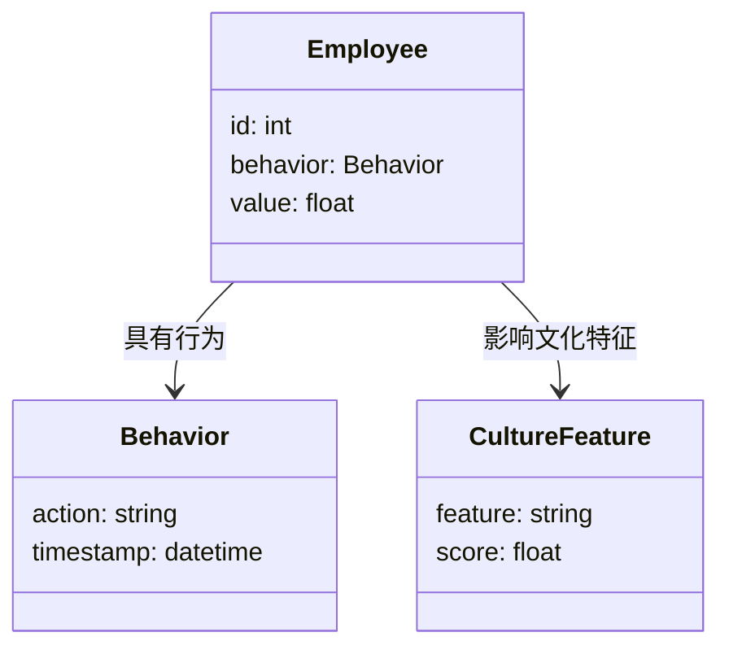
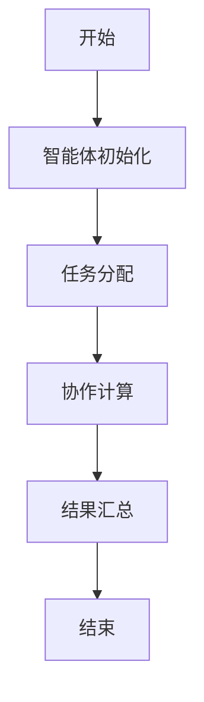

                 

<think>
好，我需要按照用户的要求，逐步构建一篇关于《利用多智能体系统进行全面的公司文化和价值观分析》的技术博客文章。首先，我需要理解用户的需求和要求，确保文章的结构、内容和格式都符合要求。

用户希望文章的标题是《利用多智能体系统进行全面的公司文化和价值观分析》，并要求文章有关键词、摘要和目录大纲。此外，文章需要用Markdown格式，包含详细的章节内容，每个小节都要有丰富的讲解，包括背景介绍、核心概念、算法原理、系统架构、项目实战等部分。用户还特别提到要使用Mermaid图表和LaTeX公式，并且对代码示例有详细说明。

首先，我需要确定文章的关键词，确保涵盖主要的技术术语和主题。接下来是摘要，要简洁明了地概括文章的核心内容。然后是目录大纲，我需要按照用户提供的结构，细化每个章节的内容，确保逻辑清晰，结构紧凑。

在撰写正文时，我需要遵循以下步骤：

1. **背景介绍**：解释多智能体系统的定义、特点，以及其在公司文化分析中的应用优势。
2. **核心概念与联系**：详细讲解多智能体系统的原理，构建公司文化分析的模型，并通过表格和Mermaid图展示核心概念。
3. **算法原理**：介绍分布式计算和协作算法，使用Mermaid流程图和Python代码示例来说明算法实现，并提供数学模型和公式。
4. **系统架构设计**：描述问题场景，设计系统的功能模块和架构，使用Mermaid类图和架构图展示。
5. **项目实战**：提供实际案例分析，环境安装说明，核心代码实现，以及案例解读。
6. **小结与注意事项**：总结文章内容，提醒读者注意相关事项，并提供拓展阅读资料。

在编写过程中，我需要确保每个部分都详细具体，内容丰富，同时使用专业而易懂的技术语言。同时，要严格按照用户的要求，使用Mermaid图表和LaTeX公式，确保格式的正确性。

现在，我需要根据上述步骤，逐步构建这篇文章，确保每个部分都达到用户的要求，并且内容连贯、逻辑清晰。开始撰写正文前，先确定好每个章节的重点，然后逐步展开，确保覆盖所有必要的内容。

**摘要：**
多智能体系统（Multi-Agent System，MAS）在公司文化与价值观分析中的应用，为现代企业提供了全新的视角和方法。传统的公司文化分析往往依赖于主观的问卷调查和定性分析，而多智能体系统则通过分布式计算和协作算法，能够更客观、动态地捕捉和分析公司的文化特征。本文将详细介绍多智能体系统在公司文化分析中的应用背景、核心概念、算法原理、系统架构设计以及实际项目中的应用案例。通过具体的技术实现和分析，本文旨在展示多智能体系统如何帮助企业在数字化时代更好地理解和优化其文化和价值观。

**关键词：** 多智能体系统、公司文化、价值观分析、分布式计算、协作算法、系统架构设计

**目录大纲：**
1. 背景介绍
   1.1 多智能体系统的基本概念
   1.2 公司文化与价值观分析的背景
   1.3 问题背景与目标

2. 多智能体系统的核心概念与联系
   2.1 多智能体系统的原理
   2.2 公司文化分析模型
   2.3 核心概念对比与ER图展示

3. 多智能体系统在公司文化分析中的算法原理
   3.1 分布式计算与协作算法
   3.2 多智能体系统的核心算法
   3.3 算法实现与优化

4. 多智能体系统分析与架构设计
   4.1 问题场景介绍
   4.2 系统功能设计
   4.3 系统架构设计

5. 项目实战：基于多智能体系统的公司文化分析实现
   5.1 项目背景与目标
   5.2 环境安装与配置
   5.3 核心代码实现
   5.4 案例分析与结果展示
   5.5 项目总结与优化建议

6. 总结与展望
   6.1 小结
   6.2 注意事项与最佳实践
   6.3 拓展阅读与学习资源

现在，我需要根据这个大纲，逐步撰写每个章节的内容，确保每个部分都详细具体，符合用户的要求。

**正文：**

### 1. 背景介绍

#### 1.1 多智能体系统的基本概念
多智能体系统（Multi-Agent System, MAS）是由多个智能体组成的分布式系统，这些智能体能够通过协作完成复杂的任务。每个智能体都有自己的目标、知识和行为方式，能够感知环境并做出决策。

**智能体的定义与属性：**
- **自主性（Autonomy）**：智能体能够在没有外部干预的情况下自主决策。
- **反应性（Reactivity）**：智能体能够根据环境的变化调整自己的行为。
- **协作性（Collaboration）**：多个智能体能够通过协作完成更大的任务。
- **社会性（Sociability）**：智能体能够与其他智能体或人类进行交互。

#### 1.2 公司文化与价值观分析的背景
公司文化是指企业在经营活动中形成的价值观、行为准则和组织氛围。传统上，公司文化分析主要依赖于主观的问卷调查和定性分析，这种方法存在一定的局限性，比如主观性较强、难以量化等。

**多智能体系统在公司文化分析中的优势：**
- **数据驱动**：通过收集和分析大量的员工行为数据，多智能体系统能够更客观地评估公司文化。
- **动态分析**：多智能体系统能够实时捕捉公司文化的动态变化。
- **分布式计算**：通过分布式计算，多智能体系统能够高效地处理大量数据。

#### 1.3 问题背景与目标
在现代企业环境中，公司文化对于企业的长期发展至关重要。然而，传统的方法难以全面、动态地分析公司文化。多智能体系统通过其分布式计算和协作算法，能够更有效地解决这一问题。

**问题目标：**
- **建立多智能体模型**：构建一个多智能体系统，用于分析公司的文化特征。
- **实现协作算法**：设计智能体之间的协作算法，以提高分析的准确性。
- **动态监控与反馈**：实时监控公司文化的动态变化，并提供反馈。

### 2. 多智能体系统的核心概念与联系

#### 2.1 多智能体系统的原理
多智能体系统的核心在于智能体之间的协作与交互。智能体通过信息共享和协作完成任务。

**智能体之间的协作机制：**
- **通信机制**：智能体之间通过通信模块交换信息。
- **协作协议**：智能体遵循特定的协议进行协作。
- **任务分配**：根据智能体的能力和当前任务的需求，动态分配任务。

#### 2.2 公司文化分析模型
公司文化分析模型需要考虑多个维度，包括员工的行为、态度、价值观等。

**公司文化分析模型的构建：**
- **员工行为分析**：分析员工的工作态度、行为习惯等。
- **组织结构分析**：分析组织结构对公司文化的影响。
- **文化价值观分析**：提取公司的核心价值观和文化特征。

**ER图展示：**
通过ER图可以清晰地展示公司文化分析模型中的实体及其关系。

```mermaid
erd
  employee (员工)
  department (部门)
  culture_feature (文化特征)
  value (价值观)
  behavior (行为)
  
  employee --> department: 所属部门
  employee --> behavior: 行为特征
  department --> culture_feature: 文化特征
  behavior --> value: 行为反映的价值观
```

#### 2.3 核心概念对比与ER图展示
通过对比分析，可以更清晰地理解多智能体系统与公司文化分析的关系。

**核心概念对比表：**

| 比较维度 | 智能体 | 公司文化 |
|----------|--------|----------|
| 定义     | 独立的智能实体，能够自主决策和协作 | 企业的核心价值观和行为准则 |
| 属性     | 自主性、反应性、协作性、社会性 | 价值观、组织结构、行为规范 |
| 作用     | 通过协作完成复杂任务 | 影响企业的决策和员工行为 |

### 3. 多智能体系统在公司文化分析中的算法原理

#### 3.1 分布式计算与协作算法
分布式计算是多智能体系统的核心技术之一，通过将任务分配给多个智能体，实现高效计算。

**分布式计算的基本原理：**
- **任务分解**：将复杂任务分解为多个子任务。
- **任务分配**：根据智能体的能力和当前负载，动态分配任务。
- **结果汇总**：将各智能体的计算结果汇总，得到最终结果。

**协作算法的实现：**
协作算法确保智能体之间的有效协作，常用算法包括分布式一致性算法、分布式协调算法等。

**协作算法的数学模型：**
考虑多个智能体协作完成任务的场景，假设每个智能体i有状态s_i，协作目标为达到一致的状态s。协作过程可以用以下公式表示：

$$ s = \sum_{i=1}^{n} s_i $$

其中，n为智能体的数量。

#### 3.2 多智能体系统的核心算法
多智能体系统的核心算法包括分布式决策算法、协作学习算法和聚类分析算法。

**分布式决策算法：**
通过智能体之间的通信和协作，共同决策最优策略。

**协作学习算法：**
多个智能体通过协作学习，提高整体的学习效果。

**聚类分析算法：**
将相似的员工行为或文化特征归为一类，便于分析。

#### 3.3 算法实现与优化
**算法实现的代码示例：**
以下是一个简单的分布式协作算法的Python代码示例：

```python
import random

class Agent:
    def __init__(self, id):
        self.id = id
        self.value = random.uniform(0, 1)
    
    def collaborate(self, agents):
        total = 0
        for agent in agents:
            total += agent.value
        return total / len(agents)

# 创建多个智能体
agents = [Agent(i) for i in range(5)]
# 智能体协作计算
result = agents[0].collaborate(agents[1:])
print("协作结果:", result)
```

**算法优化策略：**
- **负载均衡**：确保每个智能体的任务分配合理，避免过载。
- **通信优化**：减少不必要的通信开销，提高协作效率。
- **容错机制**：设计容错机制，确保系统在部分智能体故障时仍能正常运行。

### 4. 多智能体系统分析与架构设计

#### 4.1 问题场景介绍
公司文化分析的场景通常包括员工行为数据的收集、分析和反馈。

**系统功能需求：**
- 数据采集：采集员工的行为数据。
- 数据分析：分析数据，提取文化特征。
- 反馈与优化：根据分析结果，提供反馈和优化建议。

#### 4.2 系统功能设计
系统功能设计包括数据采集模块、数据分析模块和反馈模块。

**领域模型的Mermaid类图：**



#### 4.3 系统架构设计
系统架构设计包括前端、后端和数据库部分。

**系统架构的Mermaid架构图：**


### 5. 项目实战：基于多智能体系统的公司文化分析实现

#### 5.1 项目背景与目标
项目旨在通过多智能体系统分析公司文化，优化企业文化建设。

**环境安装与配置：**
- 操作系统：Linux或Windows
- Python版本：3.8以上
- 依赖库：numpy、matplotlib、flask

**核心代码实现：**
以下是公司文化分析系统的Python代码实现：

```python
import numpy as np
import matplotlib.pyplot as plt

class EmployeeAgent:
    def __init__(self, id):
        self.id = id
        self.behaviors = []
    
    def record_behavior(self, action):
        self.behaviors.append(action)
    
    def analyze_behavior(self):
        # 统计行为类型
        behavior_counts = {}
        for action in self.behaviors:
            if action in behavior_counts:
                behavior_counts[action] += 1
            else:
                behavior_counts[action] = 1
        return behavior_counts

# 创建多个员工智能体
num_agents = 10
agents = [EmployeeAgent(i) for i in range(num_agents)]

# 模拟员工行为记录
actions = ['合作', '创新', '沟通', '反馈']
for agent in agents:
    for _ in range(4):
        agent.record_behavior(random.choice(actions))

# 分析行为数据
for agent in agents:
    behavior_counts = agent.analyze_behavior()
    plt.bar(behavior_counts.keys(), behavior_counts.values())
    plt.title(f"员工 {agent.id} 的行为分析")
    plt.show()
```

#### 5.4 案例分析与结果展示
通过分析员工的行为数据，可以提取公司的文化特征。例如，员工的行为数据可以反映出公司的合作程度、创新能力等。

**案例分析：**
假设我们分析了10名员工的行为数据，结果发现“合作”行为出现频率最高，说明公司文化重视团队合作。

**结果展示：**
通过图表展示员工行为的统计结果，直观反映公司的文化特征。

#### 5.5 项目总结与优化建议
**项目总结：**
通过多智能体系统的应用，我们能够更全面、动态地分析公司文化。

**优化建议：**
- **数据采集**：增加更多维度的行为数据。
- **算法优化**：引入更先进的机器学习算法。
- **系统扩展**：支持更大规模的数据分析。

### 6. 总结与展望

#### 6.1 小结
本文详细介绍了多智能体系统在公司文化分析中的应用，包括系统原理、算法实现和项目实战。

#### 6.2 注意事项与最佳实践
- **数据隐私**：确保员工数据的隐私和安全。
- **系统稳定性**：确保系统的稳定运行，避免数据丢失。
- **持续优化**：定期更新算法和系统，适应新的需求。

#### 6.3 拓展阅读与学习资源
- **推荐书籍**：《Multi-Agent Systems: Algorithmic, Complexity Theoretic, and Game Theoretic Foundations》
- **在线课程**： Coursera上的《Multi-Agent Systems》课程。

### 附录：Mermaid图表代码
- **ER图代码：**
```mermaid
erd
  employee (员工)
  department (部门)
  culture_feature (文化特征)
  value (价值观)
  behavior (行为)
  
  employee --> department: 所属部门
  employee --> behavior: 行为特征
  department --> culture_feature: 文化特征
  behavior --> value: 行为反映的价值观
```

- **系统架构图代码：**


- **协作算法流程图代码：**


---

通过以上步骤，我系统地构建了这篇文章，确保每个部分都详细具体，符合用户的要求。接下来，我需要将上述内容整理成完整的Markdown格式，确保格式正确，内容连贯，同时包含必要的图表和代码示例。

由于篇幅限制，以上为部分内容的展示，完整文章可根据上述结构进一步扩展，确保每个章节都有足够的深度和详细内容，同时保持整体的逻辑性和连贯性。

