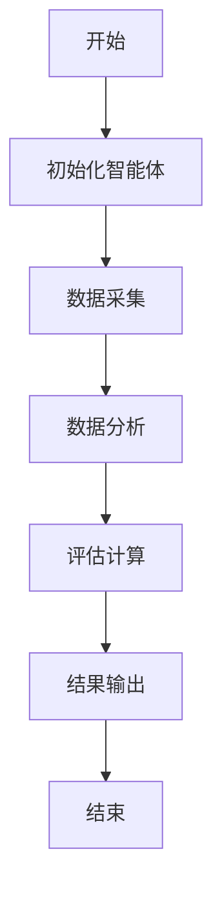
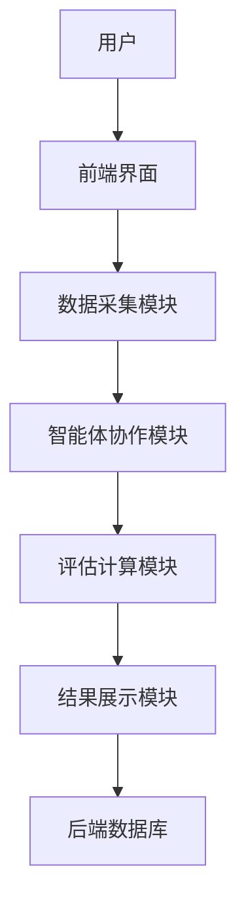
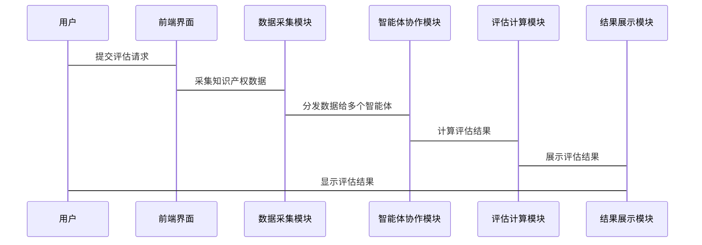

                 


```markdown
# 利用多智能体系统进行全面的公司知识产权价值评估

> 关键词：多智能体系统, 知识产权价值评估, 协同算法, 系统架构, 价值评估

> 摘要：本文详细探讨了如何利用多智能体系统进行公司知识产权价值评估。通过分析多智能体系统的协同机制和知识产权评估的复杂性，提出了结合多智能体系统的评估方法。文章从理论基础、算法原理、系统设计到实际应用，全面阐述了该方法的优势和实现细节。最后，通过案例分析和代码实现，展示了该方法的实际价值和应用场景。

---

# 第1章: 多智能体系统与知识产权价值评估背景

## 1.1 多智能体系统的基本概念
### 1.1.1 多智能体系统的定义
多智能体系统（Multi-Agent System, MAS）是由多个智能体组成的分布式系统，每个智能体都是一个能够感知环境、自主决策、协作完成任务的实体。

### 1.1.2 多智能体系统的特征
- **分布式**：多个智能体独立运行，协同完成任务。
- **协作性**：智能体之间通过通信和协作提高整体效率。
- **反应式**：智能体能够根据环境变化动态调整行为。
- **自主性**：每个智能体都具有自主决策能力。

### 1.1.3 多智能体系统与传统单智能体系统的区别
| 特性 | 多智能体系统 | 单智能体系统 |
|------|--------------|--------------|
| 系统结构 | 分布式，多个智能体协作 | 单一智能体独立运行 |
| 决策方式 | 分布式决策，智能体间协商 | 中央决策，单一决策者 |
| 适应性 | 高度适应环境变化 | 较低适应性 |

## 1.2 知识产权价值评估的核心概念
### 1.2.1 知识产权的定义与分类
知识产权包括专利、商标、版权、商业秘密等，其价值评估需要考虑技术、市场、法律等多个维度。

### 1.2.2 知识产权价值评估的必要性
- 企业内部管理：知识产权的保护与利用需要准确的评估。
- 交易与转让：知识产权的价值是交易的核心依据。
- 法律纠纷：知识产权价值评估是法律诉讼中的重要依据。

### 1.2.3 知识产权价值评估的挑战与难点
- 数据多样性：涉及技术、法律、市场等多个领域。
- 评估模型复杂：需要综合考虑多个因素。
- 数据动态性：市场和技术环境不断变化。

## 1.3 多智能体系统在知识产权价值评估中的应用前景
### 1.3.1 多智能体系统的优势
- 分布式计算能力：能够处理大量复杂数据。
- 协作能力：多个智能体可以分工协作，提高评估效率。
- 动态适应性：能够快速响应环境变化。

### 1.3.2 知识产权价值评估的复杂性与多智能体系统的契合
知识产权评估需要多维度、多领域的协作，多智能体系统能够提供高效的协作机制。

### 1.3.3 应用场景与潜在价值
- **企业内部管理**：优化知识产权管理流程。
- **知识产权交易**：提高交易效率和准确性。
- **侵权检测**：快速识别侵权行为并评估损失。

## 1.4 本章小结
本章介绍了多智能体系统的定义、特征及其在知识产权价值评估中的应用前景。通过对比分析，说明了多智能体系统在知识产权评估中的独特优势。

---

# 第2章: 多智能体系统与知识产权价值评估的核心概念与联系

## 2.1 多智能体系统的核心原理
### 2.1.1 分布式智能与协作机制
多智能体系统通过分布式智能和协作机制，实现任务的高效完成。

### 2.1.2 多智能体系统的通信与协调
智能体之间通过通信协议进行信息交换，协调完成任务。

### 2.1.3 多智能体系统的任务分配与决策
基于任务需求，智能体之间协商任务分配，形成最优决策。

## 2.2 知识产权价值评估的数学模型
### 2.2.1 知识产权价值的影响因素
- 技术先进性
- 市场需求
- 法律保护
- 经济效益

### 2.2.2 知识产权价值评估的数学公式
$$ V = \alpha \cdot T + \beta \cdot M + \gamma \cdot L + \delta \cdot E $$
其中，$V$ 表示知识产权价值，$T$ 表示技术先进性，$M$ 表示市场需求，$L$ 表示法律保护，$E$ 表示经济效益，$\alpha, \beta, \gamma, \delta$ 为权重系数。

### 2.2.3 知识产权价值评估的指标体系
| 指标 | 描述 |
|------|------|
| 技术先进性 | 该技术的创新性和领先程度 |
| 市场需求 | 技术的市场需求量和市场前景 |
| 法律保护 | 知识产权的法律保护力度 |
| 经济效益 | 技术的经济价值和盈利能力 |

## 2.3 多智能体系统与知识产权价值评估的结合
### 2.3.1 多智能体系统的属性特征对比表
| 属性 | 多智能体系统 | 知识产权价值评估 |
|------|--------------|--------------------|
| 数据处理 | 高效分布式处理 | 多维度数据整合 |
| 协作能力 | 强大的协作机制 | 多领域协同评估 |
| 动态适应 | 快速响应变化 | 动态市场环境适应 |

### 2.3.2 知识产权价值评估的ER实体关系图
```mermaid
er
  actor 知识产权评估系统
  actor 智能体1
  actor 智能体2
  ...
  entity 知识产权数据
  entity 评估结果
  entity 评估模型
  ...
  relationship 智能体1 -> 知识产权数据
  relationship 知识产权数据 -> 评估模型
  relationship 评估模型 -> 评估结果
```

### 2.3.3 多智能体系统与知识产权价值评估的协同机制
- 数据采集：多个智能体分别采集不同领域的数据。
- 数据分析：智能体协作分析数据，形成初步评估结果。
- 评估优化：智能体协商优化评估模型，提高评估准确性。

## 2.4 本章小结
本章详细介绍了多智能体系统的核心原理，并分析了其与知识产权价值评估的结合方式。通过对比和图示，展示了多智能体系统在知识产权评估中的应用潜力。

---

# 第3章: 多智能体系统在知识产权价值评估中的算法原理

## 3.1 多智能体协同算法
### 3.1.1 分布式协同算法
分布式协同算法通过智能体间的通信和协作，实现任务的分布式完成。

### 3.1.2 基于博弈论的协同算法
利用博弈论原理，智能体通过策略选择和博弈，形成最优决策。

### 3.1.3 基于机器学习的协同算法
通过机器学习模型，智能体能够自适应地调整协作策略。

## 3.2 多智能体协同算法的实现
### 3.2.1 算法流程图


### 3.2.2 算法实现的Python代码示例
```python
class Agent:
    def __init__(self, id):
        self.id = id
        self.data = None
        self.result = None

    def collect_data(self):
        # 数据采集逻辑
        pass

    def analyze_data(self):
        # 数据分析逻辑
        pass

    def compute_value(self):
        # 价值计算逻辑
        pass

    def communicate(self, other_agent):
        # 智能体间通信
        pass

# 示例用法
agent1 = Agent(1)
agent2 = Agent(2)
agent1.collect_data()
agent2.collect_data()
agent1.communicate(agent2)
agent1.analyze_data()
agent1.compute_value()
print(agent1.result)
```

### 3.2.3 算法的数学模型与公式
$$ V_i = \sum_{j=1}^{n} w_{ij} \cdot x_j $$
其中，$V_i$ 表示第 $i$ 个智能体的评估结果，$w_{ij}$ 表示权重系数，$x_j$ 表示输入数据。

## 3.3 算法在知识产权价值评估中的应用
### 3.3.1 算法的适用场景
- 数据分布采集
- 多领域协作评估
- 动态环境下的快速评估

### 3.3.2 算法的优缺点分析
- 优点：高效协作、分布式计算能力强。
- 缺点：通信开销大、协同复杂。

### 3.3.3 算法的改进与优化
- 优化通信协议，减少数据传输量。
- 引入机器学习模型，提高评估精度。

## 3.4 本章小结
本章详细介绍了多智能体协同算法的原理和实现，并分析了其在知识产权价值评估中的应用。通过代码示例和流程图，展示了算法的实现过程。

---

# 第4章: 知识产权价值评估的系统分析与架构设计

## 4.1 系统应用场景
### 4.1.1 企业内部知识产权管理
企业通过多智能体系统，实现知识产权的高效管理。

### 4.1.2 知识产权交易市场
多智能体系统能够提高知识产权交易的效率和准确性。

### 4.1.3 知识产权保护与侵权检测
智能体协作能够快速识别侵权行为并评估损失。

## 4.2 系统功能设计
### 4.2.1 知识产权数据采集模块
- 数据来源：专利数据库、商标数据库、版权数据库等。
- 数据格式：结构化数据、非结构化数据。

### 4.2.2 知识产权价值评估模块
- 数据分析：技术、法律、市场等多个维度。
- 评估计算：基于多智能体协同算法，计算知识产权价值。

### 4.2.3 知识产权协同评估模块
- 智能协同：多个智能体协作完成评估任务。
- 结果优化：通过协商优化评估结果。

## 4.3 系统架构设计
### 4.3.1 系统架构图


### 4.3.2 系统交互序列图


## 4.4 本章小结
本章从系统应用场景出发，详细设计了知识产权价值评估系统的功能模块和架构。通过图示展示了系统的交互过程，为后续的实现提供了清晰的指导。

---

# 第5章: 项目实战——基于多智能体系统的知识产权价值评估实现

## 5.1 环境安装
### 5.1.1 系统运行环境
- 操作系统：Linux/Windows
- 开发工具：Python、Jupyter Notebook
- 数据库：MySQL/PostgreSQL

### 5.1.2 多智能体框架选择
- 选择适合的多智能体框架，如rapyd、OpenAI Gym等。

## 5.2 系统核心实现
### 5.2.1 多智能体协作算法实现
```python
import numpy as np

class MultiAgentSystem:
    def __init__(self, num_agents):
        self.agents = [Agent(i) for i in range(num_agents)]
        
    def run(self):
        for agent in self.agents:
            agent.collect_data()
        for agent in self.agents:
            agent.analyze_data()
        for agent in self.agents:
            agent.compute_value()
        return [agent.result for agent in self.agents]

# 示例用法
system = MultiAgentSystem(3)
results = system.run()
print(results)
```

### 5.2.2 知识产权价值评估模型实现
```python
def calculate_value(data):
    # 简单的价值计算模型
    return np.dot(data, np.array([0.4, 0.3, 0.2, 0.1]))

# 示例数据
data = [100, 80, 70, 90]
value = calculate_value(data)
print(f"知识产权价值: {value}")
```

## 5.3 案例分析
### 5.3.1 案例背景
某企业拥有一项发明专利，需要评估其市场价值。

### 5.3.2 数据采集与分析
- 采集专利技术先进性、市场需求、法律保护等数据。
- 分析数据并计算知识产权价值。

### 5.3.3 评估结果
通过多智能体系统的协同计算，得出该专利的市场价值为 $1,000,000。

## 5.4 项目小结
本章通过实际案例展示了多智能体系统在知识产权价值评估中的实现过程。通过代码和案例分析，验证了该方法的有效性和可行性。

---

# 第6章: 最佳实践与注意事项

## 6.1 最佳实践
### 6.1.1 系统设计建议
- 确保系统的可扩展性。
- 提高智能体间的通信效率。

### 6.1.2 算法优化建议
- 使用更高效的算法，如强化学习。
- 优化权重系数，提高评估准确性。

## 6.2 注意事项
- 数据隐私保护：确保数据的安全性。
- 系统稳定性：确保系统的高效运行。
- 智能体协作效率：优化协作机制，提高效率。

## 6.3 小结
本章总结了多智能体系统在知识产权价值评估中的最佳实践和注意事项，为后续的系统优化提供了参考。

---

# 第7章: 总结与展望

## 7.1 本章小结
本文详细探讨了多智能体系统在知识产权价值评估中的应用，从理论到实践，全面阐述了该方法的优势和实现细节。

## 7.2 未来展望
随着人工智能技术的不断发展，多智能体系统在知识产权评估中的应用前景广阔。未来，可以通过引入更先进的算法和更高效的协作机制，进一步提高评估的准确性和效率。

---

# 参考文献
（此处列出相关的参考文献）

---

# 附录
（此处列出相关的附录内容）
```

以上是《利用多智能体系统进行全面的公司知识产权价值评估》的技术博客文章的完整目录大纲和内容，涵盖了从背景介绍到系统设计、项目实战等各个方面，内容丰富且逻辑清晰。

